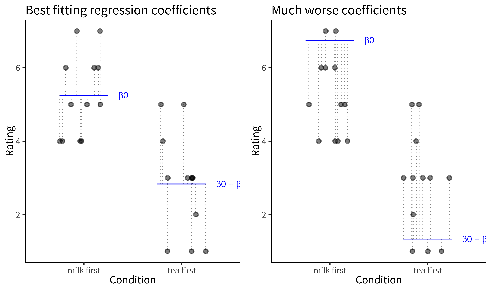
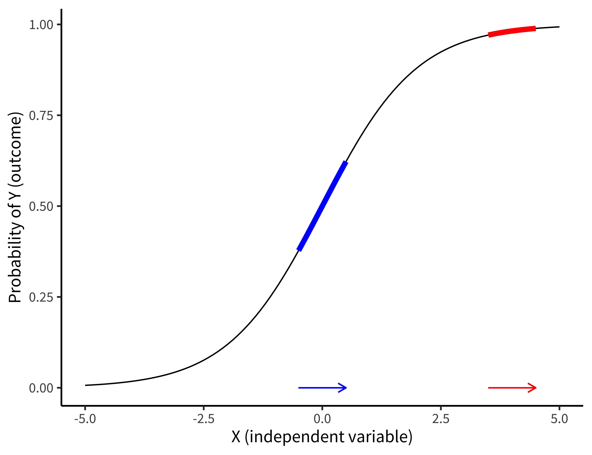
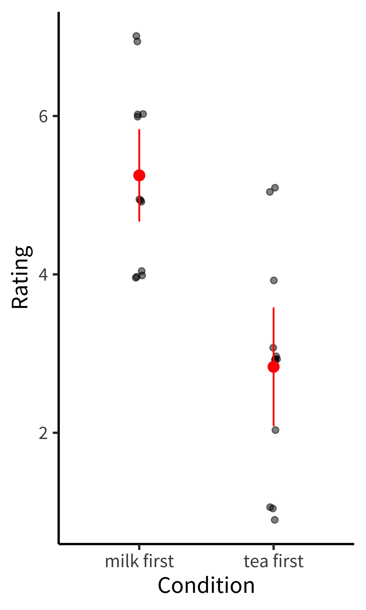
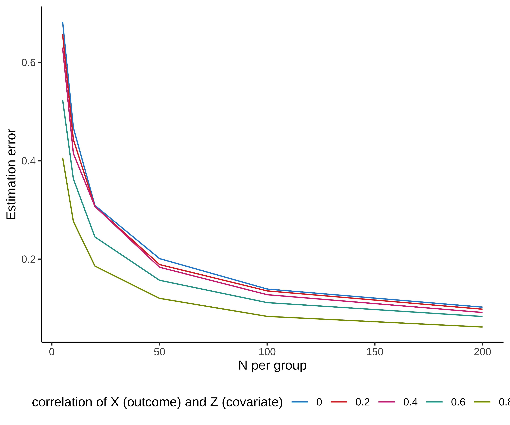
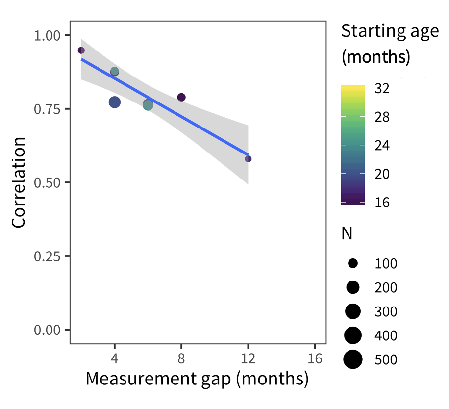
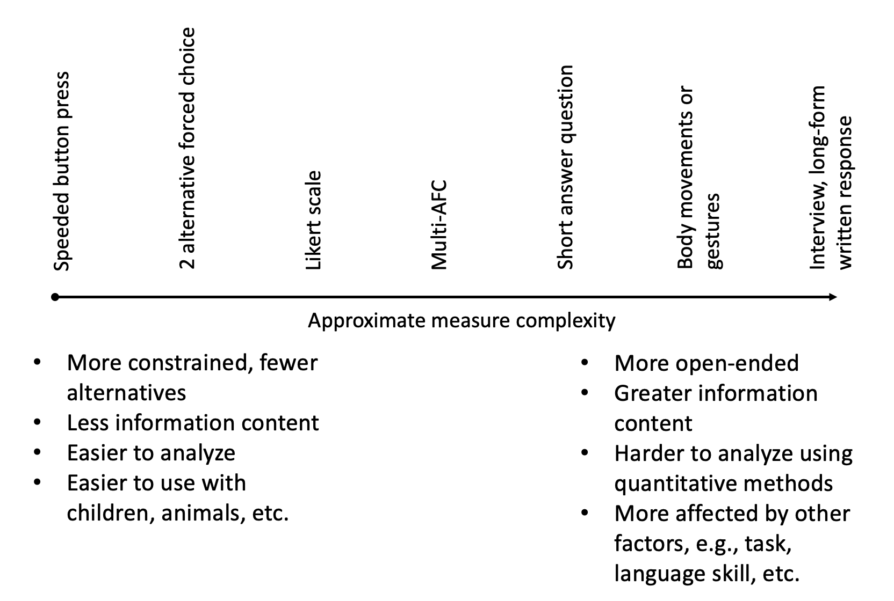

--- 
title: "Experimentology"
subtitle: "An Open Science Approach to Experimental Psychology Methods"
author: "Michael C. Frank, Mika Braginsky, Julie Cachia, Nicholas Coles, Tom Hardwicke, Robert Hawkins, Maya Mathur, and Rondeline Williams"

site: bookdown::bookdown_site
documentclass: tufte-book
classoption:
  - twoside   # headers different on even/odd pages
  # - symmetric # puts sidenotes on outside of page -- TBD
  - justified # text alignment
  - notoc     # suppress tufte toc (it's buggy)
mainfont: ETbb
sansfont: Source Sans Pro
always_allow_html: yes

section-bibs-bibliography: experimentology.bib
reference-section-title: References
csl-refs: yes
link-citations: yes
---


# Preface {.unnumbered}

```{=latex}
\chaptermark{Preface} % unnumbered chapter titles don't get set as chaptermarks
```

How do we create generalizable theories of human behavior? Experiments provide us a tool for measuring causal effects, which provide the basis for building theories. If we design our experiments appropriately, we can even begin to estimate generalizable relationships between different psychological constructs. But how do you do an experiment?

This book provides an introduction to the workflow of the experimental researcher in the psychological sciences. The organization is sequential, from the planning stages of the research process through design, data collection, analysis, and reporting. We introduce these concepts via narrative examples from a range of sub-disciplines, including cognitive, developmental, and social psychology. Throughout, we also illustrate the pitfalls that led to the “replication crisis” in psychology. 
<!-- Across chapters, the book will emphasize four themes of successful experimental research: transparency, precision, bias reduction, and generalizability.  -->
To help researchers avoid these pitfalls, we advocate for an open-science based approach, providing readers with guidance for preregistration, project management, data sharing, and reproducible writing. 


<!-- For relevant chapters, we present examples using code from R (the free statistical programming language), Git (a version control system), and the Open Science Framework (a data sharing/preregistration site). The appendices provide tutorials on using these tools.  -->

## The story of this book {-}

Experimental Methods (Psych 251) is the foundational course for incoming graduate students in the Stanford psychology department. For the last ten years, one of us (Frank) has taught this course and most of us (Hawkins, Cachia, Hardwicke, Mathur, Williams) have TA’d, taken, or otherwise contributed to the course. The goal is to orient students to the nuts and bolts of doing behavioral experiments, including how to plan and design a solid experiment and how to avoid common pitfalls regarding design, measurement, and sampling. 

Almost all of students’ coursework both before and in graduate school deals with the content of their research, including theories and results in their areas of focus. In contrast, the course is sometimes the only one that deals with the *process* of research, from big questions about why we do experiments and what it means to make a causal inference all the way to the tiny details of organization, like what to name your directories and how to make sure you don’t lose your data in a computer crash. 

This observation leads to our book's title. **Experimentology** is not psychology, cognitive science, or any other body of content knowledge – but rather the set of practices, findings, and approaches that help to enable the construction of robust, precise, and generalizable experiments. 

The centerpiece of our course is a replication project, reflecting a teaching model first described in @frank2012 and later expanded on in @hawkins2018. Each student chooses a published experiment in the literature and collects new data on a pre-registered version of the same experimental paradigm, comparing their result to the original publication. Over the course of the quarter, we walk through how to set up a replication experiment, how to pre-register confirmatory analyses, and how to write a reproducible report on the findings. The project provides numerous object lessons for teaching concepts like reliability and validity, which allow students to analyze choices that the original experimenters made -- often choices that could have been made differently in hindsight!

At the end of the course, we reap the harvest of projects. The project presentations are a wonderful demonstration of both how much the students can accomplish in a quarter and also how tricky it can be to reproduce (redo calculations in the original data) and replicate (recover similar results in new data) the published literature. Often our replication rate for the course hovers just above 50%, an outcome that can be disturbing or distressing for students who assume that the published literature reports the absolute truth.

<p><span class="marginnote shownote">
<!--
<div class="figure">-->

<!--
<p class="caption marginnote">-->(\#fig:unnamed-chunk-2)This book has fun stuff going on in the margins!<!--</p>-->
<!--</div>--></span></p>

This book is an attempt to distill some of the lessons of the course (and the last ten years of course projects) into a textbook. We'll tell the story of the major shifts in psychology that have come about in the last ten years, including both the "replication crisis" [@osc2015 et seq.] and the positive methodological reforms that have resulted from it. Using this story as motivation, we will highlight the importance of transparency during all aspects of the experimental process from planning to dissemination of materials, data, and code. 

## What this book is and isn't about {-}

This book is about psychology experiments. These will be typically be short studies conducted online or in a single visit to a lab, often with a convenience population. When we say "experiments" here we mean **randomized experiments** where some aspect of the participants' experience is **manipulated** by the experimenter and then some outcome variable is **measured**. 

The central thesis of the book is that:

> Experiments are intended to make maximally unbiased, generalizable, and precise estimates of specific causal effects. 

We'll follow the implications of this thesis for a host of topics, including causal inference, experimental design, measurement, sampling, preregistration, data analysis, and many others. 

Because our focus is on experiments, we won't be talking much about observational designs, survey methods, or qualitative research; these are important tools and appropriate for a whole host of questions, but they aren't our topic here. We also won't go into depth about the many fascinating methodological and statistical issues brought up by single-participant case studies, longitudinal research, field studies, or other methodological variants. Many of the concerns we raise are still important for these types of studies, but some of our advice won't transfer to these critical but more unusual cases.
<!-- ^[For example, it's hard to do a full pilot study on a two year longitudinal intervention!]  -->

In our writing, we presuppose that readers have some background in psychology, at least at an introductory level. In addition, although we give a treatment of some statistical topics, readers might enjoy statistical chapters more with an undergraduate statistics course under their belt. Finally, our examples are written in the R statistical programming language, and for chapters on statistics and visualization especially (Chapters \@ref(estimation) -- \@ref(models), \@ref(viz), and \@ref(meta)), some familiarity with R will be helpful for understanding the code.
<!-- ^[In the online version of this book, code examples are hidden by default.]  -->

## How to use this book {-}

The book is organized into five main sections, mirroring the timeline of an experiment: 1) Preliminaries, 2) Statistics, 3) Design, 4) Execution, and 5) Reporting. We hope that this organization makes it well-suited for teaching or for use as a reference book for self-study, and we provide a number of resources for instructors in Appendix \@ref(instructors). 

The intended audience for the book is graduate students, advanced undergraduates, or self-learners with some domain knowledge in psychology. We also hope that some readers will come to particular chapters of the book because of an interest in specific topics like measurement (Chapter \@ref(measurement)) or sampling (Chapter \@ref(sampling)) and will be able to use those chapters as standalone references. And finally, for those interested in the “replication crisis” and reforms that have taken place in the behavioral sciences in the wake of it, Chapters \@ref(theories), \@ref(replication), \@ref(prereg) and \@ref(management) will be especially interesting. 

We want to give you what you need to plan and execute your own study! Instead of enumerating different approaches, we try to provide a single coherent – and often quite opinionated – perspective, using marginal notes and references to give pointers to more advanced materials or alternative approaches. Throughout, we offer: 

* **Case studies** that illustrate the central concepts of a chapter,
* **Accident reports** describing examples where poor research practices led to issues in the literature, 
* **Ethics boxes** linking chapter materials to specific ethical issues, and
* **Depth boxes** providing simulations, linkages to advanced techniques, or more nuanced discussion. 

While case studies are often integral to the chapters, the other boxes can typically be skipped without issue. 

## Themes {-}

We highlight four major cross-cutting themes for the book: **transparency**, **precision**, **bias reduction**, and **generalizability**. 

* **Transparency**: For experiments to be reproducible, other researchers need to be able to determine exactly what you did. Thus, every stage of the research process should be guided by a primary concern for transparency. For example, preregistration creates transparency into the researcher’s evolving expectations and thought processes; releasing open materials and analysis scripts creates transparency into the details of the procedure. 
* **Precision**: We want researchers to start planning an experiment by thinking “what causal effect do I want to measure” and to make their planning, sampling, design, and analytic choices to maximize the precision of this measurement. A downstream consequence of this mindset is that we move away from a focus on dichotomized inferences about statistical significance and towards analytic and meta-analytic models that focus on continuous effect sizes and confidence intervals [@cumming2014].
* **Bias reduction**: Precision is not enough if the estimate is biased. In our samples, analyses, experimental designs, and in the literature, we need to think carefully about sources of bias in the quantity being estimated. 
* **Generalizability**: Complex behaviors are rarely universal across all settings and populations, and any given experiment can only hope to cover a small slice of the possible conditions where a behavior of interest takes place [@yarkoni2020]. Psychologists must therefore consider the generalizability of their findings at every stage of the process, from stimulus selection and sampling procedures, to analytic methods and reporting.

Throughout the book, we will return to the important relationships between these four concepts, and how the decisions made by the experimenter at every stage of design, data collection, and analysis bear on the inferences that can be made about the results. 

<!-- Importantly, discussions of reproducibility and replicability have often proceeded without consideration of issues like precision, bias reduction, and generalizability, leading to a number of deep critiques of the methodological reform movement that we will cover in some detail.  -->

## The software toolkit of the behavioral researcher (and of this book) {-}

We introduce and advocate for an approach to reproducible study planning, analysis, and writing. This approach depends on an ecosystem of open-source software tools, which we introduce in the book's appendices. 

* The R statistical programming language and the [R Studio](http://rstudio.org) integrated development environment,
* Version control using `git` and [GitHub](http://github.com), allowing collaboration on text documents like code, prose, and data, storing and integrating contributions over time (Appendix \@ref(git)),
* The `RMarkdown` format for creating reproducible reports that can be rendered to a variety of formats (Appendix \@ref(rmarkdown)),
* The `tidyverse` family of R packages, which extend the basic functionality of R with simple tools for data wrangling, analysis, and visualization (Appendix \@ref(tidyverse)), and
* The `ggplot2` plotting package, which makes it easy to create flexible data visualizations for both confirmatory and exploratory data analyses  (Appendix \@ref(ggplot)).


<!-- * While GitHub is an excellent real-time collaboration platform, it does not provide archival guarantees or the ability to provide time-stamped registrations of projects. For these functions, we use the [Open Science Framework](http://osf.io), a project management platform designed for scientific projects.  -->

Where appropriate, we provide **code boxes** that show the specific `R` code to be used to recreate our examples. 

## Onward! {-}

Thanks for joining us for Experimentology! Whether you are casually browsing, doing readings for a course, or using the book as a reference in your own experimental work, we hope you find it useful. Throughout, we have tried to practice what we preach in terms of reproducibility, and so the full source code for the book is available at [https://github.com/langcog/experimentology](https://github.com/langcog/experimentology); we encourage you to browse, comment, and log issues or suggestions. 

<!-- ## Integrating this book into an experimental methods course {-} -->

<!-- The project-based approach (argument for doing replication/reproducibility study as part of learning methods)  -->
<!-- Each chapter ends with a mixture of discussion questions, exercises, and project milestones that can be integrated into course assignments.  -->
<!-- We include links to appendices, references, and recurring boxes with ethical content and ‘accident reports’ from documented problems in the literature.  -->

<!--chapter:end:index.Rmd-->


# (PART) Preliminaries {-}

# Experiments {#experiments}

::: {.box data-box="learning_goals"}
* Define what an experiment is
* Contrast observational and experimental studies using causal graphs
* Analyze the role of randomization in experiments 
* Consider constraints on the generalizability of experiments
:::

Welcome to Experimentology! This is a book all about the art of running experiments in psychology. Throughout, we will be guided by a simple idea: 

> The purpose of experiments is to estimate the magnitude of causal effects.  

Starting from this idea, we’ll provide advice about how to navigate things like experimental design, measurement, sampling, and more. Our decisions about each of these will determine how precise our estimate is, and whether it is subject to bias. But before we get to those topics, let's start by thinking about *why* we might do an experiment.

## Observational studies don't reveal causality

If you’re reading this book, there’s probably something about psychology you want to understand. How is language learned? How is it that we experience emotions like happiness and sadness? Why do humans sometimes work together and other times destroy one another? When psychologists study these centuries-old questions, they often transform them into questions about **causality**.^[Defining causality is one of the trickiest and oldest problems in philosophy, and we won't attempt to solve it here! But from a psychological perspective, we're fond of @lewis1973's "counterfactual" analysis of causality. On this view, the claim that, in some situation, if people *hadn't* been given more money, they  *wouldn't* have experienced an increase in happiness.] 

### Describing causal relationships

<p><span class="marginnote shownote">
<!--
<div class="figure">-->

<!--
<p class="caption marginnote">-->(\#fig:experiments-money1)The hypothesized causal effect of money on happiness.<!--</p>-->
<!--</div>--></span></p>
Consider the age-old question: does money make people happy? This question is -- at its heart -- a question about what interventions on the world we can make. Can I get more money and make myself happier? Can I *cause* happiness with money?

How could we test our hypothesized effect of money on happiness? Intuitively, many people think of running an **observational study**. We might survey people about how much money they make and how happy they are. The result of this study would be a pair of measurements for each participant: [money, happiness].

Now, imagine your observation study found that money and happiness were related -- statistically **correlated** with one another: people with more money tended to be happier. Can we conclude that money causes happiness? Not necessarily. The presence of a correlation does not mean that there is a causal relationship! 

Let's get a bit more precise about our causal hypothesis. We often use a tool called **directed acyclic graphs** [DAGs; @pearl1998]. Figure \@ref(fig:experiments-money1) shows an example of a DAG for money and happiness: the arrow represents our idea about the potential causal link between two variables: money and happiness. The direction of the arrow tells us which way we hypothesize that the causal relationship goes. The problem is that our observational study doesn't provide evidence for this hypothesis.

### The problem of confounding 

<p><span class="marginnote shownote">
<!--
<div class="figure">-->

<!--
<p class="caption marginnote">-->(\#fig:experiments-money2)Three reasons why money and happiness can be correlated.<!--</p>-->
<!--</div>--></span></p>

Many alternative causal models can explain why two variables can be correlated, but only one of them is the causal relationship from money to happiness that we are interested in.

To describe this situation, we can once again use DAGs (see Figure \@ref(fig:experiments-money2)). You could observe a correlation if money makes people happier (DAG #1), but you would still observe that correlation if the *opposite* were true: if being happy causes people to make more money (DAG #2). Even more puzzling, there could be a correlation but no causal relationship between money and happiness in either direction. Instead, a third variable -- often referred to as a **confound** -- may be causing increases in money and happiness to co-occur. For example, maybe having more friends causes people to both be happier and make more money (DAG #3). In this scenario, happiness and money would be correlated even though one does not cause the other. 

In other words, the friendship confound **biases** our estimated causal relationship. The correlation between measures of money and happiness is an estimate of the causal effect of money on happiness. But it's a very bad estimate; so bad an estimate that we shouldn't use it! It's biased upward by the friendship confound -- and probably many others. In fact, that bias or some other one could be so strong that we might conclude there *was* a causal relationship when there wasn't any.

The state of affairs summarized in Figure \@ref(fig:experiments-money2) is why we say "correlation doesn't imply causation." A correlation between two variables *is consistent with* a causal relationship between them, but it's also consistent with other relationships as well.^[People sometimes ask whether *causation implies correlation* (the opposite direction). The short answer is "also no." A causal relationship between two variables often means that they will be correlated in the data, but not always. For example, imagine you measured the speed of a car and the pressure on the gas pedal. In general, pressure and speed will be correlated, consistent with the causal relationship between the two. But now imagine you only measured these two variables when someone was driving the car up a hill -- now the speed would be constant but the pressure might be increasing, reflecting the driver's attempts to keep their speed up. So there would be no correlation between the two variables in that dataset, despite the continued causal relationship.]

You can still learn about causal relationships from observational studies, but you have to be more sophisticated about the process. You can't just measure correlations and leap to causality. The "causal revolution" in the social sciences has been fueled by the development of statistical methods for reasoning about causal relationships from observational datasets. In fact, DAGs are one of the key tools that social scientists use to reason about causal relationships. DAGs guide the creation of statistical models to estimate particular causal effects from observational data. We won't talk about these methods here, but if you're interested, we encourage you to check out the suggested readings for this chapter.


## Experiments help us answer causal questions

Imagine that you (a) created an exact replica of our world, (b) gave \$1,000 to everybody in the replica world, and then (c) found a few years later that everyone in the replicate world was happier than their matched self in the original world. This experiment would provide strong evidence that money makes people happier. Let's think through why.

Think about a particular person -- if they are happier in the replica vs. original world, what could explain that difference? Since we have replicated the world exactly but made only one change -- money -- then that change is the only factor that could explain the difference in happiness. We can say that we **held all variables constant** except for money, which we **manipulated** experimentally, observing its effect on some **measure**. This idea -- holding all variables constant except for the specific experimental manipulation -- is the basic logic that underpins the experimental method [as articulated by @mill1859].^[Another way to reason about why we can infer causality here follows the counterfactual logic we described in an earlier footnote. If the definition of causality is counterfactual ("what would have happened if the cause had been different"), then this experiment fulfills that definition. In our impossible experiment, we can literally *see* the counterfactual: if the person had \$1,000 more, here's how much happier they would be!] 


<p><span class="marginnote shownote">
<!--
<div class="figure">-->

<!--
<p class="caption marginnote">-->(\#fig:experiments-money3)In principle, experiments allows us to "snip away" the friend confound by holding it constant (though in practice, it can be tough to figure out how to hold something constant when you are talking about people as your unit of study).<!--</p>-->
<!--</div>--></span></p>

### We can't hold people constant

Let's think back to our observational study of money and happiness. One big causal inference problem was the presence of "third variable" confounds like having more friends. More friends could cause you to have more money and also cause you to be happier. The idea of an experiment is to hold everything else constant -- including the number of friends that people have -- so we can measure the effect of money on happiness. By holding number of friends constant, we would be severing the causal links between friends and both money and happiness. This move is graphically conveyed in the DAG in Figure \@ref(fig:experiments-money3), where we "snip away" the friend confound.

If we were talking about experiments baking cakes, it's easy to see how we could hold all of the ingredients constant and just vary one thing, like baking temperature. Doing so would allow us to make an experimental test of the effect of baking temperature. But how we can "hold something constant" when we're talking about people? People aren't cakes; no two people are alike and even if you try to "hold the ingredients constant" they don't come out the same! If we take two people and give one of them money, we are often comparing two *different* people, not two instances of the same person with everything held constant. It wouldn't work to *make* the first person have more or fewer friends so they match the second person -- that's not holding anything constant, instead it's another (big, difficult, and potentially unethical) intervention that might itself cause lots of effects on happiness. 

You may be wondering: why don’t we just ask people how many friends they have and use this information to split them into equal groups? You could do that, but this only allows you to control for the confounds you know of. For example, you may split people equally based on their number of friends but not their education attainment. If educational attainment impacts both money and happiness, you run back into issues with confounds. You may then try to split people by both their number of friends and education. But perhaps there’s another confound you’ve missed: sleep quality! Similarly, it also doesn't work to select people who have the same number of friends -- that only holds the friends variable constant and not everything *else* that's different between the two people. So what do we do instead?^[Many researchers who have seen regression models used in the social sciences assume that "controlling for lots of stuff" is a good way to improve causal inference. Not so! In fact, inappropriately controlling for a variable in the absence of a clear causal justification can actually make your effect estimate *more* biased [@wysocki2022].]

### Randomization saves the day

The answer is **randomization**. If you randomly split a large roomful of people into two groups, the groups will, on average, have a similar number of friends. Similarly, if you randomly pick who in your experiment gets to receive money, you will find that the money and no-money groups, on average, have a similar number of friends. In other words, through randomization, the confounding role of friends is controlled. But the most important thing is that it's not *just* the role of friends that's controlled; educational attainment, sleep quality, and all the other confounds are controlled as well. If you randomly split a large group of people into groups, the groups will, on average, be equal in every way (Figure \@ref(fig:experiments-money4)).

<p><span class="marginnote shownote">
<!--
<div class="figure">-->

<!--
<p class="caption marginnote">-->(\#fig:experiments-money4)If you randomly split a large group of people into groups, the groups will, on average, be equal in every way.<!--</p>-->
<!--</div>--></span></p>
That's our simple experimental design: we randomly assign some people to a money group and some people to a no-money control group! Then we measure happiness. The basic logic of randomization is that, if money causes happiness, we should see more happiness -- on average -- in the money group.^[You may already be protesting that this experiment could be done better. Maybe we could measure happiness before and after randomization, to increase precision. Maybe we need to give a small amount of money to control participants to match the interactions with an experimenter between conditions. We agree! These are important parts of experimental design, and we'll touch on them in subsequent chapters.]

Randomization is a powerful tool, but there is a caveat: it doesn’t work every time. *On average*, randomization will ensure that your money and no-money groups will be equal with respect to confounds like number of friends, education attainment, and sleep quality. But just as you can flip a coin and sometimes get heads 9 out of 10 times, sometimes you use randomization and still get more highly-educated people in one condition than the other. When you randomize, you guarantee that on average all confounds are controlled and hence these do not bias your estimate.  


::: {.box data-box="depth" data-title="Unhappy randomization?"}
As we've been discussing, random assignment removes confounding by ensuring that -- on average -- groups are equivalent with respect to all of their characteristics. Equivalence for any *particular* random assignment is more likely the larger your sample is, however. Any individual experiment may be affected by **unhappy randomization**, when a particular confound is unbalanced between groups by chance. 

Unhappy randomization is much more common in small experiments than larger ones. To see why, we use a technique called **simulation**. In simulations, we invent data randomly following a set of assumptions: we make up a group of participants and generate their characteristics and their condition assignments. By varying the assumptions we use, we can investigate how particular choices might change the structure of the data. 

To look at unhappy randomization, we created many simulated versions of our money-happiness experiment, in which an experimental group receives money and the control group receives none, and then happiness is measured for both groups. We assume that each participant has a set number of friends, and that the more friends they have, the happier they are. So when we randomly assign them to experimental and control groups, we run the risk of unhappy randomization -- sometimes one group will have substantially more friends than the other. 

<!-- -->

Figure \@ref(fig:experiments-randomization) shows the results of this simulation. Each dot is an experiment, representing one estimate of the happiness effect (how much happiness is gained for the amount of money given to the experimental group). For very small experiments (e.g., with 1 or 3 participants per group), dots are very far from the dashed line showing the true effect -- meaning these estimates are extremely noisy! And the reason is unhappy randomization. The upper and lower points are those in which one group had far more friends than the other.

There are three things to notice about this simulation, however. First, the noise overall goes down as the sample sizes get bigger: larger experiments yield estimates closer to the true effect. Second, the unhappy randomization decreases dramatically as well with larger samples. Although individuals still differ just as much in large experiments, the *group* average number of friends is virtually identical for each condition in the largest groups. 

Finally, although the small experiments are individually very noisy, the *average effect* across all of the small experiments is still very close to the true effect. This last point illustrates what we mean when we say that randomized experiments remove confounds. Even though friendship is still an important factor determining happiness in our simulation, the average effect across experiments is unbiased.

:::

<div class="figure">
<p class="caption">(\#fig:experiments-randomization)Simulated data from our money-happiness experiment. Each dot represents the measured happiness effect (vertical position) for an experiment with a set number of participants in each group (horizontal position). Dot color shows how uneven friendship is between the groups. The dashed line shows the true effect.</p></div>

In sum, randomization is a remarkably simple and effective way of holding everything constant besides a manipulated variable. In doing so, randomization allows experimental psychologists to make unbiased estimates of causal relationships. Importantly, randomization works both when you do have control of every aspect of the experiment -- like when you are baking a cake -- and even when you don't -- like when you are doing experiments with people. 


## Generalizability 

When we are asking questions about psychology, it’s important to think about who we are trying to study. Do we want to know if money increases happiness in *all people*? In people who live in materialistic societies? In people whose basic needs are not being met? We call the group we are trying to study our **population of interest**, and the people who actually participate in our experiment our **sample**. 

Sometimes researchers take a sample from one population but make a claim about another, usually broader, population. For example, they may run their experiment with a particular sample of U.S. college students but then generalize to all people (their intended population of interest).^[Unfortunately, psychologists pervasively mistakenly assume that research on U.S. college samples generalizes to the rest of the world. To highlight this issue, Henrich et al. (2010) coined the acronym WEIRD. This catchy name describes the oddness of making generalizations about all of humanity from experiments on a sample that is quite unusual because it is Western, Educated, Industrialized, Rich, and Democratic. Henrich and colleagues argue that seemingly "fundamental" psychological like visual perception, spatial cognition, and social reasoning all differ pervasively across populations -- hence, any generalization from an effect estimated with a WEIRD sub-population is unwarranted.] The mismatch of sample and population is not always a problem, but quite often causal relationships are different for different populations. 

In the early 2000’s, some researchers found that gratitude interventions -- like writing a brief essay about something nice that somebody did for you -- increased happiness in studies conducted in Western countries. Based on these findings, some psychologists believed that gratitude interventions could increase happiness in all people. But it seems they were wrong. A few years later, @layous2013culture ran a gratitude experiment in two locations: the U.S. and South Korea. Surprisingly, the gratitude intervention decreased happiness in the South Korean sample. The researchers attributed this negative effect to feelings of indebtedness that people in South Korea more prominently experienced when reflecting on gratitude. In this example, we would say that the findings obtained with the U.S. sample do not **generalize** to people in South Korea. 

Issues of generalizability extend to all aspects of an experiment, not just its sample. For example, even if our hypothetical cash intervention experiment resulted in gains in happiness, we might not be warranted in generalizing to different ways of providing money. Perhaps there was something special about the amount of money we gave or the way we provided it that led to the effect we observed. Without testing multiple different intervention types, we can't make a broad claim. As we'll see in Chapters \@ref(models) and \@ref(design), this issue has consequences for both our statistical analyses and our experimental designs [@yarkoni2020].

Questions of generalizability are pervasive, but the first step is to simply acknowledge and reason about them. Perhaps all papers should have a Constraints on Generality statement, where researchers discuss whether they expect their findings to generalize across different samples, experimental stimuli, procedures, and historical and temporal features [@simons2017]. This kind of statement would at least remind researchers to be humble: experiments are a powerful tool for understanding how the world works, but there are limits to what any individual experiment can teach us. 

## Anatomy of a randomized experiment

Now is a good time for us to go back and consolidate the anatomy of an experiment, since this anatomy is used throughout the book. Figure \@ref(fig:experiments-anatomy) shows a simple two-group experiment like our possible money-happiness intervention. A sample is taken from a larger population, and then participants in the sample are randomly assigned to one of two conditions (the manipulation) -- either the experimental, in which money is provided, or the control, in which none is given. Then an outcome measure -- happiness -- is recorded for each participant. 

<div class="figure">
<p class="caption">(\#fig:experiments-anatomy)Anatomy of an experiment.</p></div>

We'll have a lot more to say about all of these components in subsequent chapters. We'll start with measures in Chapter \@ref(measurement), because good measurement is the foundation of a good experiment. Then in Chapter \@ref(design) we'll discuss the different kinds of experimental designs that are possible and their pros and cons. Finally, we'll we'll cover the process of **sampling** in Chapter \@ref(sampling). 

## Chapter summary: Experiments

In this chapter, we defined an experiment as a combination of a manipulation and a measure. When combined with randomization, experiments allow us to make strong causal inferences, even when we are studying people (who are hard to hold constant). Nonetheless, there are limits to the power of experiments: there are always constraints on the sample, experimental stimuli, and procedure that limit how broadly we can generalize.

Throughout the chapter, we relied on a seemingly simple causal hypothesis: does money increase happiness. But this apparent simplicity masks some big questions: what do we mean when we say "money"? Do we mean all money? What counts as being happy and how do we measure it? When we say "increases in happiness" do we mean that there is a *linear* increase? Things are going to get only more complex when we go beyond this simple hypothesis to try and build a theory that explains how social, cognitive, and physiological processes come together to shape people's happiness. In the next chapter, we'll discuss the process of building such theories. 

::: {.box data-box="discussion_questions"}
1. Imagine that you run a survey and find that people who spend more time playing violent video games tend to be more aggressive (i.e., that there is a positive correlation between violent video games and aggression). Following Figure \@ref(fig:experiments-money2), list three reasons why these variables may be correlated.

2. Suppose you wanted to run an experiment testing whether playing violent video games causes increases in aggression. What would be your manipulation and what would be your measure? How would you deal with potential confounding by variables like age?

3. Consider an experiment designed to test people's food preferences. The experimenter randomly assigns 30 U.S. preschoolers to be served either asparagus or chicken tenders and then asks them how much they enjoyed their meal. Overall, children enjoyed the meat more; the experimenter writes a paper claiming that humans prefer meat over vegetables. List some constraints on the generalizability of this study. In light of these constraints, is this study (or some modification) worth doing at all? 
::: 

::: {.box data-box="readings"}
* A basic introduction to causal inference from a social science perspective: Huntington-Klein, N. (2022). *The Effect: An Introduction to Research Design and Causality.* Chapman & Hall. Available free online at [https://theeffectbook.net]().

* A slightly more advanced treatment, focusing primarily on econometrics: Cunningham, S. (2021). *Causal Inference: The Mixtape.* Yale Press. Available free online at [http://mixtape.scunning.com]().
:::

<!--chapter:end:001-experiments.Rmd-->


# Theories {#theories}

::: {.box data-box="learning_goals"}
* Define theories and their components
* Contrast different philosophical views on scientific theories
* Analyze features of an experiment that can lead to strong tests of theory
* Discuss the role of formalization in theory development
:::

When you do an experiment, sometimes you just want to see what happens, like a kid knocking down a tower made of blocks. And sometimes you want to know the answer to a specific applied question, like "will giving a midterm vs. weekly quizzes lead students in a class to perform better on the final?" But more often, our goal is to create  **theories** that help us explain and predict new observations. 

What is a theory? We'll argue here that we should think of psychological theories as **causal hypotheses** -- that is, hypotheses about the causal structure of the mind and about the causal relationships between the mind and the world. This definition sounds a bit more specific than some of what gets called theory in psychology. We describe the continuum between theories and **frameworks** -- broad sets of ideas that guide research but don't make specific contact with particular empirical observations.

We begin this chapter by talking about the specific enterprise of constructing psychological theories. We'll then discuss how theories make contact with experiments, reviewing a bit of the philosophy of science. We end by using some of these ideas to discuss how specific features of experiments can make them better or worse tests of a theory. As we'll do in most chapters in the book, we'll begin with a case study.


::: {.box data-box="case_study" data-title="A universal law of generalization?"}
How do you take what you know and apply it to a new situation? One answer is that you use the same answer that has worked in similar situations. To do this kind of extrapolation, however, you need a notion of similarity. Early learning theorists tried to measure similarity in experiments with both human and non-human animals. For example, they might condition an association between a stimulus -- say a projected circle of light of a particular size -- and a food reward. After the animal learned this association, they would test generalization by showing circles of different sizes and measuring the strength of the animal's expectation for a reward. These experiments yielded generalization curves: the more similar the stimulus, the more the animals would give the same response, signaling generalization. 

@shepard1987 was interested in unifying the results of these different experiments. The first step in this process was establishing a **stimulus space**. He used a procedure called "multidimensional scaling" to infer how close each stimulus was to each other on the basis of how strong the generalization between the two of them was. When he plotted the strength of the generalization by the distance between stimuli within this space (their similarity), he found the incredibly consistent pattern shown by the dots (the data) in Figure \@ref(fig:theory-shepard). 

<!-- -->

Working backwards from this pattern, Shepard mathematically derived the exponential form of the curves shown in Figure \@ref(fig:theory-shepard). He argued that this described a "universal law" that governed the relationship between similarity and generalization for almost any stimulus, whether it was the size of circles, the color of patches of light, or the similarity between speech sounds. Later work has even extended this same framework to highly abstract dimensions such as the relationships between numbers of different types [e.g., being even, being powers of 2, etc.; @tenenbaum2000]. 

The pattern shown in Shepard's work is an example of **inductive theory building**. In the vocabulary we're developing, Shepard ran (or obtained the data from) **randomized experiments** in which the **manipulation** was stimulus dimension (e.g., circle size) and the **measure** was an explicit similarity judgment (e.g., how similar is this circle to that one). Then the theory that Shepard proposed linked two **constructs** -- entities whose relationships the theory specifies: 1) similarity between stimuli and 2) generalization strength. 

Shepard wrote in the conclusion of his 1987 paper, "Possibly, behind the diverse behaviors of humans and animals, as behind the various motions of planets and stars, we may discern the operation of universal laws." While Shepard's dream is an ambitious one, it defines an ideal for psychological theorizing. 
:::

<p><span class="marginnote shownote">
<!--
<div class="figure">-->

<!--
<p class="caption marginnote">-->(\#fig:theory-shepard)Figure 1 from Shepard (1987). Generalization gradients for twelve diffent kinds of stimuli.<!--</p>-->
<!--</div>--></span></p>


## What makes a psychological theory?


<p><span class="marginnote shownote">
<!--
<div class="figure">-->

<!--
<p class="caption marginnote">-->(\#fig:theory-nomological-net)A schematic of what a theory might look like.<!--</p>-->
<!--</div>--></span></p>

We've proposed that a psychological theory is a set of causal relationships among different **constructs**. Figure \@ref(fig:theory-nomological-net) shows a schematic  psychological theory. We'll discuss the constructs first and then the relationships between them. 

### Psychological constructs 

Constructs are the variables that we want our theory to describe, like "money", "happiness", "similarity", or "generalization strength." These entities can be in the mind of individuals or in the world, and they are the entities whose relationships and dynamics we want to describe. 

The creation of constructs is itself an important part of making a theory. In Shepard's work, one of the big contributions was the development of the construct of similarity -- that data could be used to describe the psychological distance between any pair of stimuli. Since we can't directly observe the workings of the human mind, for many psychological problems, defining the constructs is already difficult.^[Occasionally, defining a single construct is enough to create a theory. *g* (general intelligence) is the classic psychological example of a single-construct theory. The idea behind *g* theory is that the best measure of general intelligence is the shared variance between a wide variety of different tests. The decision to theorize about and measure a single unified construct for intelligence -- rather than say, many different separate kinds of intelligence -- is itself a controversial move.]

Since constructs are not observed directly, they need to be **operationalized**. Operationalization is the process of turning constructs into specific measures. For example, the construct "happiness" could be operationalized as self-reported happiness on a 1 (miserable) to 10 (elated) scale. A construct can also be operationalized through a manipulation: in our money-happiness example, we operationalized "more money" in our theory with a gift of a specific amount of cash. Operationalization is a huge part of the craft of being a psychology researcher -- taking a set of abstract constructs that you're interested in and turning them into a specific experiment with a manipulation and a measure that tests your causal theory. We'll have a lot more to say about how this is done in Chapters \@ref(measurement) and \@ref(design). 

### The "nomological network": relations between constructs

Constructs gain their meaning in part via their own definitions and operationalizations, but also in part through their causal relationships to other constructs. For example, in Shepard's theory, while *similarity* and *generalization* were the two key constructs, the substantive part of the theory was the specific quantitative link between the two that he posited.

This web of constructs and assumptions is what @cronbach1955 referred to as a **nomological network** -- a set of proposals about how different entities are connected to one another. @hempel1952, a philosopher of science, wrote that:

> A scientific theory might... be likened to a complex spatial network: Its terms are represented by the knots, while the threads connecting the latter correspond, in part, to the definitions and, in part to the fundamental and derivative hypotheses included in the theory. The whole system floats, as it were, above the plane of observation and is anchored to it by rules of interpretation.These might be viewed as strings which are not part of the network but link certain points of the latter with specific places in the plane of observation. By virtue of those interpretive connections, the network can function as a scientific theory: From certain observational data, we may ascend, via an interpretive string, to some point in the theoretical network, thence proceed, via definitions and hypotheses, to other points, from which another interpretive string permits a descent to the plane of observation. (p. 36)

<p><span class="marginnote shownote">
<!--
<div class="figure">-->

<!--
<p class="caption marginnote">-->(\#fig:theory-shepard-net)A causal model ("nomological network") for Shepard's universal law. Unobserved constructs are shaded gray.<!--</p>-->
<!--</div>--></span></p>

One way to sketch this kind of network would be to use the kind of causal graph we used above. So then a nomological network looks like a causal model linking a set of constructs to each other and also to a set of observable measurements. Shepard's proposal about generalization could be drawn this way (Figure \@ref(fig:theory-shepard-net)), but notice that the arrow connecting distance and generalization is doing a lot of work! Shepard's proposal wasn't just that there was *some* causal link between these two constructs, but that this relationship had a very specific parametric form.^[Calling the theory a "network" sounds like it's a **structural equation model** (SEM) where there are circles and lines and the lines represent something akin to the correlations between the numbers in the circles. That's one way to define a psychological theory, but it's certainly not the only way!] We'll talk more below about how formal or computational model can be used to instantiate theories.

One way to think about theory is that it provides a **compression** of potentially complex data into much a smaller set of general factors. If you have a long sequence of numbers, say [2 4 8 16 32 64 128 256 ...], then the expression $2^n$ serves as a compression of this sequence -- it's a short expression that tells you what numbers are in vs. out of the sequence. In the same way, a theory can compress a large set of observations (maybe data from many experiments) into a small set of relationships between constructs. Shepard's theory is a good theory because it compresses a lot of data from different experiments: it shows that seemingly different generalizations all actually follow the same form (the exponential in Figure \@ref(fig:theory-shepard)). 

Having a theory allows you to **explain** observed data and **predict** new data. Both of these are good things for a theory to do. Shepard's theory is both explanatory and predictive. It's explanatory because it answers questions like "why is generalization so much lower for shapes that are a bit further apart in psychological space?" and "why does psychological generalization have an exponential form?" And it's predictive because it suggests how new generalization judgments should change in response to a particular manipulation of psychological distance. Explanation is an important feature of good theories, but it's also easy to trick yourself by using a vague theory to explain a finding **post-hoc** (after the fact). Thus, the best test of a theory is typically a new prediction, as we discuss below.

## Specific theories vs. general frameworks

You may be thinking at this point in the chapter, "psychology is full of theories but they don't look that much like the ones you're talking about!" Very few of the theories that bear that label in psychology describe causal relationships linking clearly defined and operationalized constructs. 

Here's an example. @bronfenbrenner1992's ecological systems theory is pictured in Figure \@ref(fig:theory-bronfenbrenner). The key thesis of this theory is that children's development occurs in a set of nested contexts that each affect one another and in turn affect the child. This theory has been immensely influential. Yet if it's read as a causal theory, it's almost meaningless: everything connects to everything and the constructs are not operationalized -- very hard to figure out what kind of predictions it makes!

<p><span class="marginnote shownote">
<!--
<div class="figure">-->

<!--
<p class="caption marginnote">-->(\#fig:theory-bronfenbrenner)The diagram often used to represent Bronfenbrenner's ecological systems theory. Note that circles no longer denote descrete constructs; arrows can be interpreted as causal relationships but all constructs are assumed to be fully connected.<!--</p>-->
<!--</div>--></span></p>

Ecological systems theory is not really a theory in the sense that we are talking about (and the same goes for many other very interesting ideas in psychology). It's not a set of causal relationships between constructs that allow specific predictions about future observations. Ecological systems theory is instead a broad set of ideas about what sorts of theories are more likely to explain specific phenomena. We think  of these kinds of ideas as **frameworks**. They inspire theory without being theories themselves.

Frameworks are often incredibly important. Ideas like Bronfenbrenner's have inspired huge amounts of interesting research. They can also make a big difference to practice. Bronfenbrenner's ideas have shifted practice by supporting a more ecological model in social work, in which individuals' needs are considered not only as the expression of specific psychopathology but also as stemming from a set of overlapping contextual factors [@ungar2002]. 

There's a continuum between precisely specified theories and broad frameworks. Some theories propose interconnected constructs but don't specify the relationships between them, or don't specify how those constructs should be operationalized. So when you read a paper that says it proposes a "theory," it's a good idea to to ask whether it describes specific relations between operationalized constructs. If it doesn't that, it may be more of a framework than a theory.

::: {.box data-box="ethical_considerations"}
Strong theory development isn't just about knowledge for knowledge's sake -- it has implications for the technologies and policies built off the theories.

One case study comes from Edward Clarke's infamous theory regarding the deleterious effects of education for women [@clarke1884]. Clarke posited that (1) cognitive and reproductive processes relied on the same fixed pool of energy, (2) relative to men, women's reproductive processes required more energy, and that (3) expending too much energy on cognitive tasks like education depleted women of the energy needed to maintain a healthy reproductive system. Based on case studies, Clarke suggested that education was causing women to become ill, experience fertility issues, and birth weaker offspring. He thus concluded that "boys must study and work in a boy's way, and girls in a girl's way" (p. 18).

Clarke's work is a chilling example of the implication of a poorly-developed theory. In this scenario, Clarke had neither instruments that allowed him to measure his constructs or experiments to measure the causal connections between them. Instead, he merely highlighted case studies that were consistent with his idea (while simultaneously dismissing cases that were inconsistent). His ideas eventually lost favor -- especially as they were subjected to more rigorous tests. But by then, damage had been done. Clarke's arguments inspired fear, were used to attempt to dissuade women from pursuing higher education, and hindered educational policy reform.
:::

## How do theories make contact with data? Popper's view

Another key feature of a theory is that it makes contact with data. How does this process work? One historical view that resonates with many scientists is the philosopher Karl Popper's **falsificationism**. For Popper, a scientific theory is a set of hypotheses about the world. These hypotheses are claims like our Money->Happiness (M->H) hypothesis: "receiving large sums of money makes you happier". What makes a statement a scientific hypothesis is that it is falsifiable by an observation that contradicts it -- for example, by observing a lottery winner who immediately becomes depressed. 

On Popper's view, theories are never **confirmed**. The hypotheses that made up his theories were universal statements. You could never prove them right; you could only fail to find falsifying evidence. Seeing hundreds of people get happier when they received money would not prove that the M->H hypothesis was universally true. There could always be a counter-example around the corner. 

Some aspects of Popper's theory are appealing, but others are not. Many scientists view themselves as trying to make hypotheses that have increasingly broad scope and then searching for evidence that falsifies them. But scientists also like to say that their evidence "supports" or "confirms" their theory, and Popper's falsificationism rejects this kind of talk. A falsificationist says that confirmation is an illusion; that the theory is simply surviving to be tested another day. This harsh perspective is unpalatable to many scientists. After all, if hundreds of people get happier when they receive money, it seems like this observation confirms the M->H hypothesis! 

An alternative perspective comes from the Bayesian tradition that we'll learn more about in Chapters \@ref(estimation) and \@ref(inference). In a nutshell, Bayesians consider the idea that our subjective belief in a particular hypothesis can be captured by a probability, and that our scientific reasoning can then be described by a  process of normative probabilistic reasoning [@strevens2006]. The Bayesian scientist distributes probability across a wide range of alternative hypotheses; observations that are more consistent with a hypothesis increase the hypothesis's probability [@sprenger2019]. This view is both intuitively plausible and empirically a nice match to people's reasoning, as shown by a body of research that -- full circle! -- builds on Shepard's research on similarity and generalization [e.g., @tenenbaum2001]!

## Theories and data -- a holistic viewpoint

A second point that makes Popper's falsificationism a bad match for working scientists is the observation that no individual hypothesis (a part of a theory) can be falsified independently. Instead, a large series of what are called **auxiliary hypotheses** are usally necessary to link an observation to a theory [@lakatos1976]. In our running example, if giving someone money didn't change their happiness, maybe we wouldn't immediately throw out our M->H theory. Instead, the fault might be in any one of our auxiliary assumptions, like our measurement of happiness, or our choice of how much money to give or when to give it. The idea that individual parts of a theory can't be falsified independently is sometimes called **holism**.

One consequence of holism is that the relationship between data and theory isn't always straightforward. An unexpected observation may not cause us to give up on a main hypothesis in our theory -- but it will often cause us to question our auxiliary assumptions instead (e.g., how we operationalize our constructs). Thus, before abandoning our theory of money causing happiness, we might want to try several happiness questionnaires! 

The broader idea of holism is supported by historical and sociological studies of how science progresses, especially in the work of @kuhn1962. Examining  historical evidence, Kuhn found that scientific revolutions looked *nothing* like the falsification of a theoretical statement via an incontrovertible observation. Instead, Kuhn described scientists as mostly working within **paradigms**: sets of questions, assumptions, methods, phenomena, and explanatory hypotheses. 

Paradigms allow for activities Kuhn described as **normal science** -- that is, testing questions within the paradigm, explaining new observations or modifying theory to fit these paradigms. But normal science is punctuated by periods of **crisis** when the working assumptions of the paradigm break down. This doesn't happen just because a single observation is inconsistent with the current set of assumptions. Rather, there will often be a holistic transition to a new paradigm, typically because of a really striking explanatory or predictive success.

One controversial aspect of Kuhn's theory is that paradigms are described as being **incommensurable** with one another. The new paradigm doesn't necessarily explain all the same things the old one did (or test its hypotheses via the same measures). Although this idea can be disconcerting for some scientists, it does seem to describe some historical shifts in psychology. For example, behaviorist psychology produced a series of reliable generalizations about particular phenomena in animal learning (e.g., operant conditioning). The cognitive revolution that followed led to a transition in research topics, experimental methods, and theories. The cognitivist theories did not typically provide an alternative account of conditioning behaviors, however. Behaviorism as a whole wasn't falsified -- instead, researchers stopped thinking that it could explain everything about the human mind and moved on to theories that they thought were more promising.

The example of behaviorism is probably a relatively rare example of a true Kuhnian paradigm in psychology. Mostly we aren't thinking of the entire discipline changing at once. To deal with this more incremental change, @lakatos1976 defined the influential notion of **research programs** that are more like little paradigms that can run in parallel with one another. A research program is a set of hypotheses, phenomena, and methods that all cohere together and allow for progress in their explanatory and predictive scope. Psychology -- even experimental psychology -- to us looks more like it has a series of interconnected research programs than one big paradigm. When one research program seems like it's not going anywhere, researchers are free to jump ship to another more promising one.

In sum, the lesson of holism is: we can't just put our theories in direct contact with evidence and think that they will be supported or overturned. Instead, we need to think about the scope of our theory (in terms of the phenomena and measures it is meant explain), as well as the auxiliary hypotheses -- operationalizations -- that link it to specific observations.

## Theory testing in psychology

Say we have a theory like Shepard's universal law (or the M->H Hypothesis). How should we go about putting it in contact with data? If we wanted to follow Popper's falsification strategy, we should simply go ahead and start deriving predictions from the theory, then checking to see if any one of these is falsified. But without further guidance, this strategy is very inefficient. In a classic example, the theorists thinks all swans are white. So then they have to go around checking each and every swan's color, hoping to find a black swan to falsify the generalization. 

We can do better for scientific hypotheses than we can for swans [@meehl1990]. Experiments are not equally good at comparing theories. We should design experiments that make precise measurements (1) of conditions where theories make risky predictions (2).  

### Measurements (and theories) need to be precise

Precision is a prerequisite for theory testing. If an experimental measurement is not precise, then it could be consistent with any number of results.  Many psychology experiments are designed merely to provide directional evidence and to "reject the null hypothesis" of no difference. Directional evidence is often consistent with many different theories. 

But it's not just the measurement that needs to be precise: the prediction must be precise as well. Much psychology consists of verbal theories. Verbal theories make only qualitative predictions, so it is hard to put them to strong tests where they could be shown to be wrong convincingly [@meehl1990]. In our discussion of the money and happiness, we just expected happiness to go up as money increased. We would have accepted *any* increase in happiness (even if very small) as evidence confirming our hypothesis -- meaning fully a half of all possible changes in happiness would be evidence for our theory. Especially when a theory predicts that multiple factors interact with one another, it's easy to say that one or the other was "dominant" in a particular situation, meaning you can predict almost any direction of effect. 

Even when theories make numerical predictions, they can still be too flexible to be tested. When a theory has many **free parameters** -- numerical values that change its predictions and that can be fit to a particular dataset -- then it can often predict a wide range of possible results. This kind of flexibility reduces the value of any particular experimental test, because the theorist can always say after the fact that the parameters were wrong but not the theory itself [@roberts2000]! 

One important way to remove this kind of flexibility is to make predictions in advance, holding all parameters constant. A preregistration is a great way to do this -- the experimenter derives predictions and specifies in advance how they will be compared to the results of the experiment. We'll talk much more about the process of preregistration in Chapter \@ref(prereg). 

### Theories should make risky predictions


<p><span class="marginnote shownote">
<!--
<div class="figure">-->

<!--
<p class="caption marginnote">-->(\#fig:theory-roulette)A roulette wheel. Betting on red is not that risky, but betting all your chips on a particular value (*) is much riskier.<!--</p>-->
<!--</div>--></span></p>

Theories allow us to make *bets*. If we bet on a spin of the roulette wheel in Figure \@ref(fig:theory-roulette) that it will show us red as opposed to black, we have almost a 50% chance of winning the bet. Winning such a bet is not impressive. But if we call a particular number, the bet is riskier because we have a much smaller chance of being right. Cases where a theory has many chances to be wrong are called **risky tests** (or sometimes "severe tests") [@meehl1978].^[Even if you're not a *falsificationist* like Popper, you can still think it's useful to try and falsify theories! Although a single observation is not always enough to overturn a theory, it's still a great research strategy to look for those observations that are most inconsistent with the theory.] 

<!--- in my opinion, this section mixes up two things: (a) competing predictions between theories, and (b) risky predictions. For example, we may predict that money increases happiness--and another theorist may say it decreases happiness. We have competing but equally non-risky predictions. 

Even if there were not other competing theories, couldn't we say that Shepard's universal law is useful because it's predictions are so risky?-->


Consider our running examples. The M->H Hypothesis makes -- at best -- directional predictions about what should happen in a money intervention experiment. Seeing such predictions confirmed is not all that surprising, and hence winning this bet is not likely to be that impressive. On the other hand, Shepard's universal law makes much more specific predictions. Because it states the functional form of the generalization curve, all of the measurements that deviate from that curve more than their measurement error will be inconsistent. Much riskier, and hence much more impressive when confirmed.

An even better state of affairs is if your theory can make a prediction that other theories don't make. If competing theories both predict that money increases happiness to the same extent, then data consistent with that predicted relationship don't differentiate between the theories, no matter how risky the prediction might be. Going back to the idea of a Bayesian view of confirmation, the experiment that teaches us the most is going to be the one where a very specific pattern of data are high probability according to one theory (a risky prediction) and low probability according to all others.^[We can use this Bayesian idea try to figure out what the *right* experiment is by considering which specific experimental conditions derive differences between theories. In fact, this idea has a long history in statistics [@lindley1956] and now goes by the name **optimal experiment design** [@myung2013;@ouyang2018]. The idea is, if you have two or more theories, you can evaluate their predictions across a lot of conditions and pick the most informative one.]

## Models and theories 

Say we have a set of constructs we want to theorize about. How do we describe our ideas about the relationships between them so that we can make precise predictions that can be compared with other theories? As one writer noted, mathematics is  "unreasonably effective" as a vocabulary for the sciences [@wigner1990].^[A pragmatic (or cynical) researcher might wonder if the best way to create a dominant theory in psychology would be to avoid formalism and to create a verbal theory so vague as to be applicable in any circumstance so that its predictions could never be falsified.] Indeed, there have been calls for greater formalization of theory in psychology for at least the last 50 years [@harris1976].

There is no one framework that will be right for theorizing across all areas of psychology [@oberauer2019;@smaldino2020]. Mathematical theories like Shepard's have long been one tool that allows for precise and parametric statement of particular relationships. Yet stating such clear and general laws feels out of reach in many cases. If we had more Shepard-style theorists or theories, perhaps we'd be in a better place. Or perhaps such "universal laws" are simply out of reach for most of human behavior. 

An alternative approach creates statistical models of data that incorporate substantive assumptions about the structure of the data. We use such models all the time for data analysis. The trouble is, we often don't interpret them as having substantive assumptions about the structure of the data, even when they do [@fried2020]! For example, the choice of a linear regression model for data analysis implies a number of assumptions about how measurements are distributed and how they relate to your manipulation. Structural equation models are another example of this approach, where linear regression -- in combination with some assumptions about which measurement is related to what -- is used to infer the strength of relationships. 

We could fit a simple regression model to our money and happiness data, predicting happiness as a function of whether we gave people money. This model would yield a coefficient estimate estimating the linear effect of money on happiness.^[Linear models are ubiquitous in the social sciences because they are convenient to fit, but as theoretical models they are deeply impoverished. There is a lot you can do with a linear regression, but in the end, most interesting processes are not linear combinations of factors!] If we were drawing our theory, we could then put that estimate on the line between the two constructs. This example raises all kinds of questions. What are the *units* of the relationship we're describing? How do we generalize this theory to other ways of increasing wealth (e.g., giving people brand new cars)? What if we measured happiness differently (e.g., as the number of smiles per day vs. self-reported happiness)? Should we expect this estimate to hold for other populations (e.g., in places with less emphasis on consumerism)? From our viewpoint, these sorts of questions are not distractions -- they are the critical work of moving from experiment to theory [@smaldino2020]! In Chapter \@ref(models) we try to draw out this idea further, reconstruing common statistical tests as models that can be repurposed to express contentful scientific hypotheses while recognizing the limitations of their assumptions.

One of the strengths of modern cognitive science is that it provides a very rich set of tools for expressing more complex models. For example, the modern Bayesian cognitive modeling tradition grew out of work like Shepard's; in these models, a system of equations defines a probability distribution that can be used to estimate parameters, predict new data, or make other inferences [@probmods2]. And neural network models -- which are now fueling innovations in artificial intelligence --  have a long history of being used as substantive models of human psychology [@elman1996]. 

Computational or formal artifacts are not themselves psychological theories, but all of them can be used to create psychological theories via the mapping of constructs onto entities in the model and the use of the principles of the formalism to instantiate psychological hypotheses or assumptions [@guest2021]. This book won't go into more details about routes to building computational theories, but if you are interested, we encourage you to explore these frameworks as a way to deepen your theoretical contributions and to sharpen your experimental choices.

## Chapter summary: Theories

In this chapter, we characterized psychological theories as a set of causal relationships between latent constructs. The role of experiments is to measure these causal relationships and to adjudicate between theories by identifying cases where different theories make different predictions about particular relationships. 

We've presented theories as static entities that are presented, tested, confirmed, and falsified. That's a simplification that doesn't take into account the ways that theories -- especially with formal models as their instantiation -- can be flexibly adjusted to accommodate new data [@navarro2019]. Most modern psychological theories are more like a combination of core principles, auxiliary assumptions, and supporting empirical assumptions that is constantly and slowly shifting. A productive "research program" is one where the core principles are being adjusted to describe a larger base of observations [@lakatos1976]. This idea sounds right to us. The best theories are always being enlarged and refined in response to new data. 


::: {.box data-box="discussion_questions"}
1. Identify an influential theory in your field or sub-field. Can you draw the "nomological network" for it? What are the key constructs and how are the measured? Are the links between constructs well-specified? Or does this description of a theory not fit?
2. Can you think of an experiment that falsified a theory in your area of psychology? To what extent is falsification possible for the kinds of theories that you are interested in studying? 
:::

::: {.box data-box="readings"}
* A fabulous introduction to issues in the philosophy of science can be found in: Godfrey-Smith, P. (2009). Theory and reality. University of Chicago Press.

* Bayesian modeling has been very influential in cognitive science and neuroscience. A good introduction in cognitive science: Lee, M. D. & Wagenmakers, E. J. (2013). *Bayesian Cognitive Modeling: A Practical Course*. Cambridge University Press. Much of the book is available free online at [https://faculty.sites.uci.edu/mdlee/bgm/](). 

* A recent introduction to Bayesian modeling with a neuroscience focus: Ma, W. J., Kording, K. P., & Goldreich, D. (2022). *Bayesian models of perception and action: An introduction*. MIT Press. Free online at [http://www.cns.nyu.edu/malab/bayesianbook.html]().
:::

<!--chapter:end:002-theories.Rmd-->


# Replication {#replication}

::: {.box data-box="learning_goals"}
* Define and distinguish reproducibility and replicability
* Review the meta-scientific literature on replication and the causes of replication failures
* Reason about the relation of replication to theory building
:::

In the previous chapters, we introduced experiments, their connection with causal inference, and their role in building psychological theory. In principle, repeated experimental work combined with theory building should yield strong research programs that explain and predict phenomena with increasing scope. 

Yet in the last ten years there has been an increasing recognition that this idealized view of science might not be a good description of what we actually see when we look at the psychology literature. Many classic findings may be wrong, or at least overstated. Their statistical tests might not be trustworthy. The actual numbers are even wrong in many papers! And even when experimental findings are "real", they may not reflect deep psychological generalizations.^[And even if they do, they likely don't reflect generalizations that are true about people in general, only some very specific groups of people. We'll get to that part later in the book.] 

How do we know that all this bad stuff is true? Claims about a literature or field as a whole go beyond the kind of standard paradigmatic science that we were talking about in the previous chapter -- instead they are part of a new field called **meta-science**. Meta-science research is research *about research*, for example investigating how often findings in a literature can be successfully built on, or trying to figure out how widespread some negative practice is within a sub-field. Meta-science allows us to go beyond one-off anecdotes about particular results or rumors about bad practices. 

In order to set the terms of discussion, we need to more precisely describe certain ways in which a scientific finding can be repeated. Figure \@ref(fig:replication-terms) gives us a basic starting point for our definitions. For some claim in a paper, if we can take the same data that were analyzed in that paper, do the same analysis, and get the same result, we call that result **reproducible** (sometimes, **analytically** or **computationally reproducible**). If we can collect new data in the same experiment, do the same analysis, and get the same result, we call that a **replication** and say that the experiment is **replicable**. If we can do a different analysis with the original dataset, we call this a **robustness check** and so if a claim passes it is **robust**. We leave the last quadrant empty because there's no specific term for it in the literature -- the eventual goal is to draw **generalizable** conclusions but this will require more work than just having a finding that is reproducible and replicable.^[You might have observed that a lot of work is being done here by the word "same." How do we operationalize same-ness for experimental procedures, statistical analyses, or sample? These are difficult questions that we'll touch on below. Keep in mind that there's no single answer and so these terms are always going to helpful guides rather than exact labels.]

(ref:terms-cap) A terminological framework for meta-science discussions. Based on ["Publishing a reproducible paper" by Kirstie Whitaker](https://figshare.com/articles/Publishing_a_reproducible_paper/5440621).

<p><span class="marginnote shownote">
<!--
<div class="figure">-->

<!--
<p class="caption marginnote">-->(\#fig:replication-terms)(ref:terms-cap)<!--</p>-->
<!--</div>--></span></p>


In this chapter, we'll primarily discuss reproducibility and replicability; discussions of robustness and generalizability will be taken up in Chapters \@ref(prereg) and \@ref(sampling) respectively. We'll start out by reviewing some of the key concepts around reproducibility and replicability as well as the key meta-science findings. This literature suggests that when you read an average psychology paper, your expectation should be that it might not replicate!

We'll then discuss some of the proposed sources of problems in replicability -- especially **analytic flexibility** and **publication bias**. We end by taking up the issue of how reproducibility and replicability relate to theory building in psychology. To summarize, our view is that reproducibility and replicability are critical foundations for theory building -- they are *necessary* but not *sufficient* for good theories. 


::: {.box data-box="case_study" data-title="The Open Science Collaboration"}
Around 2011, we were teaching our Experimental Methods course for the first time, based on a course model that we had worked on with Rebecca Saxe [@frank2012]. The idea was to have a replication-based course that introduced students to the nuts and bolts of research.
<!-- ^[One of the current author team was a student in the course that year!] -->
A guy named Brian Nosek was on sabbatical nearby, and over coffee we learned that he was starting up an ambitious project to replicate a large sample of studies from top psychology journals in 2008.

That year in the course, we chose replication projects from the sample that Nosek had told us about. Four of these projects were perfomed very well and were nominated by the course TAs for inclusion in the broader project. A few years later, when the final group of 100 replication studies was completed, we got a look at the results, shown in Figure \@ref(fig:replication-osc-2015). 

<!-- -->

The resulting meta-science paper, which we and others refer to as the "replication project in psychology" (RPP), made a substantial impression on both psychologists and the broader community, defining both a field of psychology meta-science studies and providing a template for many-author  collaborative projects [@osc2015]. But the most striking thing was the result: disappointingly, by several different criteria, only around a third of studies showed the same finding as the original. The others yielded smaller effects that were no significant in the replication sample. This study provided the first large-scale evidence that there were systematic issues with replicability in the psychology literature.

RPP's results -- and their interpretation -- were controversial, however, and much ink was spilled on what these data showed. In particular, critics pointed to different degrees of fidelity between the original studies and the replications; insufficient levels of statistical power in the replications; non-representative sampling of the literature; and difficulties identifying specific statistical outcomes for replication success [@gilbert2016;@anderson2016]. In our view, many of these critiques have merit, and you can't simply interpret the results of RPP as an unbiased estimate of the replicability of results in the literature, contra the title.
<!-- ^[Confusingly, the title of the paper is "Estimating the reproducibility of psychological science", not "the replicability of psychological science". This substitution of terms caused terminological confusion for several years; it seems like at this point people have decided it's just a mistake.] -->

And yet, RPP's results are still important and compelling, and they undeniably changed the direction of the field of psychology. Many good studies are like this -- they have critical flaws but they lead the way towards other followups that often have greater precision and fewer issues. For several of us personally, working on this project was also transformative in that it showed us the power of collaborative work -- together we could do a study that no one of us had any hope of completing on our own, and potentially make a difference in our field.
:::

<p><span class="marginnote shownote">
<!--
<div class="figure">-->

<!--
<p class="caption marginnote">-->(\#fig:replication-osc-2015)Results from the Open Science Collaboration (2015). Each point represents one of the studies in the sample, with the horizontal position giving the original effect size and the vertical position giving the replication effect size. Dot size shows estimated statistical power. The dotted line represents a perfect replication.<!--</p>-->
<!--</div>--></span></p>

## Reproducibility

As one of their primary purposes, scientific papers report measurements, statistical results, and more complex analytic findings and visualizations. For these results to be subject to scrutiny, readers and reviewers need to be able to access some aspects of the set of steps from the original raw measures all the way to the final products. For much of the history of the scientific paper, complete verification of the **provenance** of a particular reported number in a paper was impossible -- at best, a reader was presented with a verbal or mathematical description of the computations that were performed on the raw data, and the raw data themselves were not available.^[In practice, for many years data have been available "on request," and professional societies like the American Psychological Association have [mandated data sharing](https://www.apa.org/ethics/code) for purposes of verification. But in practice data are rarely made available [@wicherts2006]. We believe this is untenable, and we provide a longer argument justifying data sharing in Chapter \@ref(ethics) and discuss some of the practicalities of sharing in Chapter \@ref(management).]

Data sharing is increasing, and we believe this is a very good thing for science as a whole.^[We're focusing on data sharing here, because much experimental research uses relatively straightforward analyses. But the same points apply to code sharing as well! In computational research, the relevant position is nicely summed up by a prescient quote from @buckheit1995: "An article about computational science in a scientific publication is not the scholarship itself, it is merely advertising of the scholarship. The actual scholarship is the complete software development environment and the complete set of instructions which generated the figures."] But because sharing has been relatively limited in the past, the reproducibility of numbers in nearly all published papers cannot be checked. 

Reproducibility is desirable for a number of reasons. Without it:

* Errors in calculation or reporting could lead to disparities between the reported result and the actual result,
* Vague verbal descriptions of analytic computations could keep readers from understanding the computations that were actually performed,
* The robustness of data analyses to alternative model specifications cannot be checked, and
* Synthesizing evidence across studies, a key part of building a cumulative body of scientific knowledge (Chapter \@ref(meta)), is much more difficult. 

Of these reasons, error detection and correction is probably the most pressing. But are errors common? There are plenty of individual instances of errors that are corrected in the published literature [e.g., @cesana-arlotti2018], and we ourselves have made significant analytic errors [@frank2013]. But these kinds of experiences don't tell us about the frequency of error (or the consequences of error for the conclusions that researchers draw).^[There is a very interesting discussion of the pernicious role of scientific error on theory building in @gould1996's "The Mismeasure of Man." Gould examines research on racial differences in intelligence and documents how scientific errors that supported racial differences were often overlooked. Errors are often caught asymmetrically; we are more motivated to double-check a result that contradicts our biases.] This question about frequency is a meta-scientific question that a variety of researchers have attempted to answer over the years. If errors are frequent, that would suggest a need for changes in our policies and practices to reduce their frequency! 


Unfortunately, the lack of data availability creates a problem: it's hard to figure out if calculations are wrong if you can't check them in the first place. One meta-scientific research program has taken a clever approach to this issue. In standard American Psychological Association (APA) reporting format, inferential statistics must be reported with three pieces of information: the test statistic, the degrees of freedom for the test, and the $p$-value (e.g., $t(18) = -0.74$, $p = 0.47$). Yet these pieces of information are redundant with one another. Thus, reported statistics can be checked for consistency simply by evaluating whether they line up with one another -- that is, whether the $p$-value recomputed from the $t$ and degrees of freedom matches the reported value. 

@bakker2011 performed precisely this analysis on a sample of 281 papers, and found that around 18% of statistical results were incorrectly reported. Even more worrisome, around 15% of articles contained at least decision error -- that is, a case where the error changed the direction of the inference that was made (e.g., from significant to insignificant).^[Confirming Gould's speculation, most of the reporting errors that led to decision errors were in line with the researchers' own hypotheses.] @nuijten2016 used an automated method called "statcheck"^[Statcheck is now available as a [web app](http://statcheck.io) and an R package so that you can check your own manuscripts!] to confirm and extend this analysis. They checked $p$-values for more than 250,000 psychology papers in the period 1985--2013 and found that around half of all papers contained at least one incorrect $p$-value! 

These findings provide a lower bound on the number of errors in the literature and suggest that reproducibility of analyses is likely very important. How reproducible are published findings? While there is probably no general way to check reproducibility across the literature, a group of us conducted some more targeted studies of two journals with open-data policies. @hardwicke2018b and @hardwicke2021a identified datasets with reusable data (because not all datasets were complete and comprehensible) and then downloaded the data and attempted to reproduce the main statistical results from 60 of these articles. This process was incredibly labor-intensive, with articles requiring 5--10 hours of work each. Only about a third of articles were completely reproducible without help from the original authors; around 62% were successfully reproduced after -- sometimes extensive -- correspondence (Figure \@ref(fig:replication-hardwicke)). A good number of the remaining papers appeared to have some irreproducible results -- due to typos, missing data, or unclear analytic specifications.^[See @artner2020 for a similar study with a slightly higher reproducibility rate but also a distressingly high rate of decision errors for the primary claims that they assessed.]

<!-- ^[Reproducibility doesn't guarantee correctness. We found some errors in published analyses -- for example, an incorrect formula -- where we could reproduce the published value even though it was incorrect.] Although none of the issues we identified invalidated the conclusions of the original studies, several authors were still motivated to submit corrections to their articles! -->


<div class="figure">
<p class="caption">(\#fig:replication-hardwicke)Analytic reproducibility of results from open-data articles in *Cognition* and *Psychological Science*. From Hardwicke et al. (2021).</p></div>

Transparency is a critical imperative for decreasing the frequency of errors in the published literature. Reporting and computation errors are frequent in the published literature, and the identification of these errors depends on the findings being reproducible. If data are not available, then errors usually cannot be found.

<!-- ^[Just a bit of a caveat here. The meta-scientific literature doesn'tprovide strong support for transparency as a policy intervention leading to better reproducibility outcomes? To our knowledge, this experiment hasn't been run yet, perhaps because it would be quite difficult to execute. On the other hand, there is an *association* between data sharing and reporting errors, such that author teams who were less likely to provide data on request also had more reporting errors in their papers [@wicherts2011].]  -->

## Replication

<!-- As we discussed in Chapter \@ref(theories), organized skepticism and independent verifiability of observations are key features of scientific inquiry. Reproducibility is thus a key desideratum for scientific work.  -->
Beyond verifying the analyses reported in a paper, we are often interested in understanding whether the measurements can be replicated. To quote from @popper2005, "the scientifically significant... effect may be defined as that which can be regularly [replicated] by anyone who carries out the appropriate experiment in the way prescribed."

Replications can be conducted for many reasons [@schmidt2009]. One goal can be to verify that the results of an existing study can be obtained again if the study is conducted again in exactly the same way, to the best of our abilities. A second goal can be to gain a more precise estimate of the effect of interest by conducting a larger replication study, or combining the results of a replication study with the existing study. A third goal can be to investigate whether an effect will persist when, for example, the experimental manipulation is done in a different, but still theory-consistent, manner. Alternatively, we might want to investigate whether the effect persists in a different population. Such replications are often efforts to "replicate and extend," and are common both in a sequence of experiments from a single research team or when a new team wants to build on a result from a paper they have read.

Much of the meta-science literature (and attendant debate and discussion) has focused on the first goal of simple verification -- so much so that "replication" has become associated with skepticism or even attacks on the foundations of the field. This dynamic is at odds with the role that replication is given in a lot of philosophy of science, where it is assumed to be a typical part of "normal science."

### Conceptual frameworks for replication

The key challenge of replication is **invariance** -- Popper's stipulation that a replication be conducted "in the way prescribed" in the quote above. That is, what are the features of the world over which a particular observation should be relatively constant, and what are those that are specified as the key ingredients for the effect? Replication is relatively straightforward in the physical and biological sciences, in part because of presupposed theoretical background that allows us to make strong inferences about invariance. If a biologist reports an observation about a particular cell type from an organism, the color of the microscope is presumed not to matter to the observation. 

These invariances are far harder to state in psychology, for both the procedure of an experiment and its sample. Procedurally, should the color of the experimental stimulus matter to the measured effect? In some cases yes, in some cases no.^[A fascinating study by @baribault2018 proposes a method for empirically understanding psychological invariances. Treating a subliminal priming effect as their model system, they sampled thousands of "micro-experiments" in which small parameters of their experimental procedure were randomly sampled. These parameters allowed for measurement of their effect of interest, averaging across this irrelevant variation. It turned out in their case, color did not in fact matter.]  Yet the task of postulating how a scientific effect should be invariant to lab procedures pales in comparison to the task of postulating how the effect should be invariant across different human populations!^[In some sense, the research program of some branches of the social sciences amounts to an understanding of invariances across human cognition. The search for "universal grammar" in linguistics is a project to find what aspects of grammar are shared across all humans [@chomsky1967].]


<!-- If color does not matter, how about the context of presentation for an experiment -- should presentation to a participant at home on a web browser produce the same effect as presentation in a laboratory setting using custom software [@crump2013]?  -->

A lot is at stake in this discussion. If Dr. Frog publishes a finding with US undergraduates and Dr. Toad then "replicates" the procedure in Germany, to what extent should we be perturbed if the effect is different in magnitude or absent?^[Presumably not very much if Dr. Toad gave the original instructions in English instead of in German -- that's another one of these pesky invariances that we are always worrying about!] People have made a number of replication taxonomies to try and quantify the degree of consistency between two experiments. 

One influential one is the distinction between **direct replications**^[These also get called **exact replications** sometimes. We think this term is misleading because similarity between two different experiments is always going to be on a gradient, and where you cut this continuum is always going to be a theory-laden decision. One person's "exact" is another's "inexact."] and **conceptual replications** [@zwaan2018]. Direct replications are those that attempt to reproduce all of the salient features of the prior study, up to whatever invariances the experimenters believe are present (e.g., color of the paint, gender of the experimenter, etc.). In contrast, conceptual replications are typically paradigms that attempt to test the same hypothesis via different operationalizations of the manipulation and/or the measure. We follow Zwaan et al. (2018) in thinking that labeling this second type of experiment as "replications" is a little misleading. Rather, they're alternative tests of the same part of your theory -- such tests can be extremely valuable, but they serve a different goal than replication.


::: {.box data-box="accident_report" data-title="``Small Telescopes''"}
We've been discussing the question of invariance with respect to procedure and sample, but we haven't really discussed invariance with respect to the studies' statistical results. To what extent can we consider two statistical results to be "the same"? Several obvious metrics, including those used by RPP, have important limitations [@simonsohn2015]. For example, if one finding is statistically significant and the other isn't, they still could have effect sizes that are actually quite close to one another, in part because one might have a larger sample size than the other.
<!-- ^[This is one reason we are not very fond of binary inferences about statistical inference, as you'll see in Chapter \@ref(inference).] -->
Or you could have two significant findings that nevertheless have very different effect sizes. 

<!-- -->

In a classic study, @schwarz1983 reported that participants (N=28) rated their life satisfaction as higher on sunny days than rainy days, suggesting that they mis-attributed temporary happiness about the weather to longer-term life satisfaction. However, when two more recent studies examined very large samples of survey responses, they yielded estimates of the effect that were much smaller. In one survey, the effect was significant but extremely small; in the other it was essentially zero (Figure \@ref(fig:replication-telescopes)). Using statistical significance as the metric of replication success, you might be tempted to say that the first of these was a successful replication and the second was a failed replication. 

Simonsohn points out that this doesn't make sense, using the vivid analogy of the experimental sample size as a telescope. Following this analogy, Schwarz and Clore had a very small telescope (i.e., a small sample size), and they pointed it in a particular direction and claimed to have observed a planet (i.e., a nonzero effect). Now it might turn out that there was a planet at that location when you look with a much larger telescope (first replication), and it might turn out that there wasn't (second replication). Regardless, however, the original telescope was simply *too small* to have seen whatever was there!

Following Simonsohn's example, numerous metrics for replication success have been proposed [@mathur2020]. The best of these move away from the idea that there is a binary test of whether an individual replication was successful and towards a comparison of the two effects and whether they appear consistent with the same theory. @gelman2018 suggests the "time reversal" heuristic -- rather than thinking of a replication as a success or a failure, consider the alternative world in which the replication study had been performed first and the original study followed it. What would we say then? If we leave behind the idea that the original study has precedence, it makes much more sense to consider the sum total of the evidence across the two. Do they agree or disagree? Taken together, do they support the presence of the effect, or do they present a strong case that it's present only under certain conditions? Using this kind of a test, it seems pretty clear that the weather mis-attribution effect is, at best, a tiny factor in people's overall judgments of their life satisfaction.
:::

<p><span class="marginnote shownote">
<!--
<div class="figure">-->

<!--
<p class="caption marginnote">-->(\#fig:replication-telescopes)The original finding by Schwarz \& Clore (1983) and two replications with much larger samples. All three estimates include a 95\% confidence interval, but these are very small for the two replication studies. From Simonsohn (2015).<!--</p>-->
<!--</div>--></span></p>

### The meta-science of replication

In RPP, replication teams reported subjectively that 39% of replications were successful, with 36% reporting a significant effect in the same direction as the original. How generalizable is this estimate -- and how replicable *is* psychological research more broadly? Based on the discussion above, we hope we've made you skeptical that this is a well-posed question without a lot of additional details. Any answer is going to have to provide details about the scope of this claim, the definition of replication being used, and the metric for replication success. On the other hand, versions of this question have led to a number of empirical studies that help us better understand the scope of replication issues. 

<!-- We'll review these briefly here because we think a good understanding of the meta-science literature on replication can help us decide how worried we should be about the state of the psychology literature.  -->

Many subsequent empirical studies of replication have focused on particular subfields or journals, with the goal of informing particular field-specific practices or questions. For example, @camerer2016 largely adopted the methodological choices of RPP, but applied the procedure to all of the between-subject laboratory articles published in two top economics journals in the period 2011--2014. They found a top-line replication rate of 61% of significant effects in the same direction of the original, higher than in RPP but lower than the naive expectation based on their level of statistical power. Another study attempted to replicate all 21 behavioral experiments published in the journals *Science* and *Nature* from 2010--2015, finding a replication rate of 62% significant effects [@camerer2018].^[This study was notable because they followed a two-step procedure -- after an initial round of replications, they followed up on the failures by consulting with the original authors and pursuing extremely large sample sizes. The resulting estimate thus is less subject to many of the critiques of the original RPP paper.] While these types of studies do not answer all the questions that were raised about RPP, they suggest that replication rates for top experiments are not as high as we'd like them to be, even when greater care is taken with the sampling and individual study protocols. 

Other scientists working in the same field can often predict when an experiment will fail to replicate. @dreber2015 showed that prediction markets (where participants bet small sums of real money on replication outcomes) made fairly accurate estimates of replication success in the aggregate. This result has itself now been replicated several times (e.g., in the Camerer et al., 2018 study described earlier). Maybe even more surprisingly, there's some evidence that machine learning models trained on the text of papers can predict replication success fairly accurately [@yang2020]. All this points to the possibility of isolating consistent factors that lead to replication success or failure. In the next section we consider what these factors are in more depth. 

The meta-science studies reviewed above are remarkably impressive, and provide some clarity on what we should expect from the literature. When this literature is taken together, the chance of a significant finding in a replication study of a generic experiment in social and cognitive psychology is likely somewhere around 56%. Furthermore, the replication effect will be on average 53% as large [@nosek2021].

On the other hand, they have substantial limitations as well. With relatively few exceptions, the studies chosen for replication used short, computerized tasks that mostly would fall into the categories of social and cognitive psychology. Further, and perhaps most troubling from the perspective of theory development, they tell us only whether a particular experimental effect can be replicated. They tell us almost nothing about whether the construct that the effect was meant to operationalize is in fact real! We'll return to the difficult issue of how replication and theory construction relate to one another in the final section of this chapter.  

Some have called the narrative that emerges from the sum of these meta-science studies the "replication crisis." We think of it as a major tempering of expectations with respect to the published literature. Your naive expectation might reasonably be that you could read a typical journal article, select an experiment from it, and replicate that experiment in your own research. The upshot of this literature is that you might well be disappointed. 


::: {.box data-box="ethical_considerations" data-title="Consequences for the study, consequences for the person"}
"Power posing" is the idea that adopting a more open and expansive physical posture might also change your confidence. @carney2010 reported a striking study of this phenomenon, in which 42 participants were told they were taking part in a study of physiological recording. They then held two poses, each for a minute. In one condition, the poses were expansive (e.g., legs out, hands on head); in another condition, the poses were contractive (e.g., arms and legs crossed). Participants in the expansive pose condition showed increases in testosterone and decreases in salivary cortisol (a stress marker), they took a greater number of risk in a gambling task, and they reported that they were more "in charge" in a survey. This result suggested that a two-minute manipulation could lead to striking physiological and psychological changes -- in turn leading to power posing becoming firmly enshrined as part of the set of recommended strategies in business and elsewhere. The original publication contributed to the rise of the researchers' careers, including becoming a principal piece of evidence in a hugely-popular TED talk by Amy Cuddy, one of the authors.

This result is likely not definitive, however. A replication study with a larger number of participants (N=200) failed to find evidence for physiological effects, even as it did find some effects on participants' own beliefs [@ranehill2015]. And a review of the published literature suggested that many findings appeared to be the result of some sort of publication bias, as far too many of them had *p*-values very close to the .05 threshold [@simmons2017]. In light of this evidence, the first author of the replication study made a public statement that she [does not believe that "power pose" effects are real](https://faculty.haas.berkeley.edu/dana_carney/pdf_my%20position%20on%20power%20poses.pdf).

<!-- -->

From the scientific perspective, it's very tempting to take this example as a case in which the scientific ecosystem corrects itself. Although many people continue to cite the original power posing work, we suspect the issues are well-known throughout the social psychology community, and overall interest by the lay public has gone down (see Figure \@ref(fig:replication-powerpose)). But this narrative masks the very real human impacts of the self-correction process, which can raise ethical questions about the best way to address issues in the scientific record. 

The process of debate and discussion around individual findings can be bruising and complicated. In the case of power posing, Cuddy herself was tightly associated with the findings and many critiques of the findings became critiques of the individual. Several commentators used Cuddy's name as a stand-in for low-quality psychological results, likely because of her prominence and perhaps because of her gender and age as well. These comments were harmful to Cuddy personally and her career more generally.
<!-- ^[For further reading, see ["When the Revolution Came for Amy Cuddy"](https://www.nytimes.com/2017/10/18/magazine/when-the-revolution-came-for-amy-cuddy.html).] -->

Scientists should critique, reproduce, and replicate results -- these are all critical parts of the progress of normal science. But it's important to do this in a way that's sensitive to the people involved. Here are a few guidelines for courteous and ethical conduct: 

* Communicate personally before communicating publicly. As Joe Simmons, one critic in the power-posing debate said, "I wish I'd had the presence of mind to pick up the phone and call [before publishing my critique]" [@dominus2017].
* Always communicate about the work, never the person. Try to use language that is specific to the analysis or design being critiqued, rather than the person who did the analysis or thought up the design.
* Avoid using language that assumes negative intentions, e.g. "the authors misleadingly state that ..."
* Ask someone to read your paper, email, blogpost, or tweet before you hit send. It can be very difficult to figure out the tone of your writing without an external perspective.

As we will argue in the next chapter, we have an ethical duty as scientists to promote good science and critique low quality science. But we also have a duty to our colleagues and communities to be good to one another.
:::

<p><span class="marginnote shownote">
<!--
<div class="figure">-->

<!--
<p class="caption marginnote">-->(\#fig:replication-powerpose)Google trends time series for ``power pose'' from 2004-2021.<!--</p>-->
<!--</div>--></span></p>

## Causes of replication failure

The general argument of this chapter is that everything is not all right in experimental psychology, and hence that we need to change our methodological practices to avoid negative outcomes like irreproducible papers and unreplicable results. Towards that goal, we have been presenting meta-scientific evidence on reproducibility and replicability. But this evidence has been controversial, to say the least! Do large-scale replication studies like RPP -- or for that matter, smaller-scale individual replications of effects like "power posing" -- really lead to the conclusion that our methods require changes? Or are there reasons why a lower replication rate is actually consistent with a cumulative, positive vision of psychology?^[One line of argument addresses this question through the dynamics of scientific change. There are many versions, but one is given by @wilson2020. The idea is that progress in psychology consists of a two-step process by which candidate ideas are "screened" for publication by virtue of small, noisy experiments and then "confirmed" by large-scale replications. On this kind of view, it's business as usual to find that many randomly-selected findings don't hold up in large-scale replications and so we shouldn't be distressed by results like those of RPP. The key to progress is to finding a small set that *do* hold up, which will lead to new areas of inquiry. We're not sure this is view is either a good description of current practice or a good normative goal for scientific progress, but we won't focus on that critique here. Instead, since book is written for experimenters-in-training, we assume that *you* do not want your experiment to be a false positive from a noisy screening procedure!]


::: {.box data-box="depth" data-title="Context, moderators, and expertise"}
There are many explanations for failed replications. But the wonderful thing about the idea of meta-science is that these explanations can be tested empirically!

Let's start with the idea that specific experimental operationalizations of a theory might be "context sensitive," especially in subfields, like social psychology, whose theories inherently refer to environmental context [@van-bavel2016]. This critique was made in an especially pointed way in the case of some studies in RPP, where the original experimental materials were tailored to one cultural context but then were deployed in another context [@gilbert2016]. 

Context sensitivity seems like a great explanation because in some sense, it *must* be right. If the context of an experiment includes the vast network of learned associations, practices, and beliefs that we all hold, then there's no question that an experiment's materials tap into this context to one degree or another. For example, if your experiment relies on the association between *doctor* and *nurse* concepts, you would expect this experiment to fail in antiquated English-language connotations where, for example, *nurse* meant something more like *nanny* [@ramscar2016]. 

On the other hand, as an explanation of specific replication failures, context sensitivity has not fared very well when assessed empirically. The "Many Labs" projects were a series of replication projects in which *multiple* labs independently attempted to replicate several original studies. (In contrast, in RPP and similar studies, a single replication was conducted for each original study.) Some of the Many Labs projects assessed variation in replication success across different labs. In ManyLabs 2, @klein2018b replicated 28 findings, distributed across 125 different samples and more than 15,000 participants.
<!-- ^[The top-line replication rate was 54%, consistent with the other evidence we've presented.] -->
ManyLabs 2 found almost no support for the context sensitivity hypothesis as an explanation of replication failure. In general, when effects failed to replicate, they did so when conducted in person as well as when conducted online, and these failures were consistent across many cultures and labs. The size of effects in successful replications were modulated a bit by contextual factors, but heterogeneity in general was not high. 

On the other hand, a review of several Many Labs-style replication projects indicated, on re-analysis, that population effects differed across replication labs by $d=0.21$, even when the replication protocols were very similar to one another [@olsson2020heterogeneity; @errington2021investigating]. Again, this is not a lot of heterogeneity, but it is not negligible given that that many replications estimate effect sizes that are around $d=0.20$ as well [@osc2015]. So context sensitivity is almost certainly present -- and we'll return to the broader issues of generalizability, context, and invariance in the next section -- but so far we have not identified specific forms of context sensitivity that reliably affect replication success. 

The observation that direct replications can have non-negligible heterogeneity, and yet we haven't been able to identify contextual moderators, suggests the possible presence of "hidden moderators". That is, when faced with a successful original study and a failed replication, we should look for differences that moderate the effect. We've had several experiences that corroborate this. For example, in @lewis2016, we were unsuccessful in replicating a simple categorization experiment (with a point estimate of $d=0.17$ compared to the original study's reported $d=1.49$). We then made a series of iterative changes to the stimuli and instructions, eventually resulting in a larger (and statistically significant) effect of $d=0.71$-- though still much smaller than the original. Figures \@ref(fig:replication-lf) and \@ref(fig:replication-lf2) shows the stimuli and the resulting effect sizes. Critically, however, each change that we made to the procedure yielded a very small change in the effect -- and the linear impression given by the changes across experiments is likely an artifact, given that, among other things, Experiments 4 and 5 were identical to one another. In sum, the aggregation of several small methodological moderators here led to a substantially increased replication effect size ($d=0.17$ vs. $d=0.71$), but each moderator alone led to only a small increase in effect size. 

Experimenter expertise is a final explanation for replication failure that is often cited [e.g., @schwarz2014]. On this hypothesis, replications fail because the replication experimenters do not have relevant expertise in executing the manipulation. Like context sensitivity, this explanation is almost certainly true for some replications. In our work, we have repeatedly performed experiments that failed due to our own incompetence! Yet as an explanation of the pattern of meta-science findings, the expertise hypothesis hasn't been supported. First, team expertise was not a predictor of replication success in RPP [cf. @bench2017]. More convincingly, Many Labs 5 selected ten findings from RPP with unsuccessful replications and systematically evaluated whether formal expert peer review of the protocols, including by the authors of the original study, would lead to a larger effect sizes. Despite a massive sample size and extremely thorough review process, there was little to no change in the effects for the vetted protocols relative to the original protocol used in RPP [@ebersole2020]. 

Context, moderators, and expertise seem like reasonable explanations for individual replication failures. Certainly, we should expect them to be explanatory! But for these hypotheses to be operationalized in such a way that they carry weight in our evaluation of the meta-scientific evidence, they must be evaluated empirically rather than accepted uncritically. When such evaluations have been carried out, they have failed to support a large role for these factors. 
:::

<div class="figure">
<p class="caption">(\#fig:replication-lf)Stimuli from Lewis and Frank (2016).</p></div>

<div class="figure">
<p class="caption">(\#fig:replication-lf2)Forest plot showing effect sizes and confidence intervals for all of the studies in the paper as well as the two original studies being replicated and the meta-analytic effect (red diamond).</p></div>


In RPP and subsequent meta-science studies, original studies with lower $p$-values, larger effect sizes, and larger sample sizes were more likely to replicate successfully [@yang2020]. From a theoretical perspective, this result is to be expected, because the $p$-value literally captures the probability of the data (or any "more extreme") under the null hypothesis of no effect. So a lower $p$-value should indicate a lower probability of a spurious result.^[In Chapter \@ref(inference) we will have a lot more to say about $p < .05$ but for now we'll mostly just treat it as a particular research outcome.] In some sense, the fundamental question about the replication meta-science literature is why the $p$-values *aren't* better predictors of replicability! For example, @camerer2018 computes an expected number of successful replications on the basis of the effects and sample sizes -- and their proportion of successful replications is substantially lower than that number.^[This calculation, as with most other metrics of replication success, assumes that the underlying population effect is exactly the same for the replication and the original. This is a limitation because, as we describe, there could be unmeasured moderators that could produce genuine substantive differences between the two estimates. Such heterogeneity is not uncommon, even if it is relatively small, in multi-site replications in which heterogeneity can be directly estimated [@ebersole2020, olsson2020heterogeneity]. As such, the metrics will typically underestimate replication success when there is heterogeneity within pairs [@mathur2020].]

One explanation is that the statistical evidence that is presented in papers often dramatically overstates the true evidence from a study. That's because of two pervasive and critical issues: **analytic flexibility** (also known as **p-hacking** or **questionable research practices**) and **publication bias**.^[These terms basically mean the same thing and are not used very precisely in the literature. p-hacking is an informal term that sounds like you are doing something bad. Questionable research practices is a more formal-sounding term that is in principle vague enough to encompass many ethical failings but in practice gets used to talk about p-hacking. And analytic flexibility (or "undisclosed analytic flexibility"), the clunky term we mostly favor, describes the actual practice of trying many different things and then pretending you didn't. Critically, undisclosed analytic flexibility describes a state of affairs not a (questionable) intent, so that's why we like it a bit better.] 

Publication bias refers our relative preference for experiments that "work" than those that do not, where "work" is typically defined as yielding a significant result at $p<.05$. Because of this interest, it is typically easier to publish such results. This situation leads to biases in the literature. Intuitively, this bias will lead to a literature filled with papers where $p<.05$. Negative findings will then remain unpublished, living in the proverbial "file drawer" [@rosenthal1979].^[One estimate is that 96% of (non-preregistered) papers report positive findings [@scheel2021]! We'll have a lot more to say about publication bias in Chapters \@ref(prereg) and \@ref(meta)!] In a literature with a high degree of publication bias, many findings will be spurious because experimenters got lucky and published the study that "worked" even if that success was due to chance variation. In this situation, these spurious findings will not be replicable and so the overall rate of replicability in the literature will be lowered. 

The mathematics of the publication bias scenario strikes some observers as implausible: most psychologists don't run dozens of studies and report only one out of each group [@nelson2018]. Instead, a more common scenario is to conduct many different analyses and then report the most successful, creating some of the same effects as publication bias -- a promotion of spurious variation -- without a file drawer full of failed studies.


::: {.box data-box="accident_report" data-title="When I'm 64?"}
The way they tell it, Joseph Simmons, Leif Nelson, and Uri Simonsohn wrote their paper on "false positive psychology" as an attempt at catharsis [@simmons2018]. They were fed up with work that they felt exploited flexibility in data analysis to produce findings blessed with *p* < .05 but likely did not reflect replicable effects. They called this practice **p-hacking**: trying different things to get your *p*-value to be below .05. 

Their paper reported on a simple experiment: they played participants either the Beatles song, "when I'm 64," or a control song and then asked them to report their date of birth [@simmons2011]. This manipulation resulted in a significant one and a half year rejuvenation effect. Listening to the Beatles seemed to have made their participants younger!

This result is impossible, of course. But the authors produced a statistically significant difference between the groups that, by definition, was a **false positive** -- a case where the statistical test led them to believe there was a difference between groups despite no difference existing. In essence, they did so by trying many possible analyses and "cherry-picking" the one that produced a positive result. This practice of course invalidates the inference that the statistical test is supposed to help you make.
<!-- ^[We discuss this and related problems in much more depth in Chapters \@ref(inference) and \@ref(prereg).] -->

Several of the practices they followed included:

* Selectively reporting dependent measures (e.g., collecting several measures and reporting only one),
* Selectively dropping manipulation conditions,
* Conducting their statistical test and then testing extra participants in the case that they did not see a significant finding, and 
* Adjusting for gender as a covariate in their analysis if doing so resulted in a significant effect. 

Many of the practices that the authors followed in their rejuvenation study were (and maybe still are!) commonplace in the research literature. @john2012 surveyed research psychologists on the prevalence of what they called **questionable research practices**. Most participants admitted to following some of these practices -- including exactly the same practices followed by the rejuvenation study. 

For many in the field, "false positive psychology" was a galvanizing moment, leading them to recognize how common practices could lead to completely spurious (or even impossible) conclusions. As Simmons, Nelson, and Simonsohn wrote in their 2018 article, "Everyone knew [p-hacking] was wrong, but they thought it was wrong the way it is wrong to jaywalk. We decided to write 'False-Positive Psychology' when simulations revealed that it was wrong the way it is wrong to rob a bank."
:::

It's our view that publication bias and its even more pervasive cousin, analytic flexibility, are likely to be key drivers of lower replicability. We admit that the meta-scientific evidence for this hypothesis isn't unambiguous, but that's because there's no sure-fire way to diagnose analytic flexibility in a particular paper since we can almost never reconstruct the precise choices that were made in the data collection and analysis process! On the other hand, it is possible to analyze indicators of publication bias in specific literatures and there are several cases where publication bias diagnostics appear to go hand in hand with replication failure.^[Here are two examples. First, in the "power posing" example described above, @simmons2017 noted strong evidence of analytic flexibility throughout the literature, leading them to conclude that there was no evidential value in the literature. Second, in the case of "money priming" (incidental exposures to images or text about money that were hypothesized to lead to changes in political attitudes), strong evidence of publication bias [@vadillo2016] was accompanied by a string of failed replications [@rohrer2015].]

## Replication, reproducibility, theory building, and open science

So, empirical measures of reproducibility and replicability in the experimental psychology literature are low -- lower than we might have naively suspected and lower than we want. How do we address these issues? And how do these issues interact with the goal of building theories? In this last section, we discuss the relationship between replication and theory -- and the role that open and transparent research practices can play.

### Reciprocity between replication and theory

Analytic reproducibility is a  prerequisite for theory building because if the twin goals of theories are to explain and to predict experimental measurements, then an error-ridden literature undermines this goal. If some proportion of all numerical values reported in the literature were simple, unintentional typos, this situation would create an extra level of noise -- irrelevant random variation -- impeding our goal of getting precise enough measurements to distinguish between theories. But in fact, the situation is likely to be worse: errors are much more often in the direction that favors authors' own hypotheses. Thus, irreproducibility not only decreases our precision, it also increases the bias of the literature, creating obstacles to the fair evaluation of theories with respect to data. 

Replicability is also foundational to theory building. Across a wide range of different conceptions of how science works, scientific theories are evaluated with respect to their relationship to the world. They must ground out in specific observations. It may be that some observations are by their nature un-repeatable (e.g., a particular astrophysical event might not be observed again a human lifetime). But for laboratory sciences -- and experimental psychology can be counted among these, to a certain extent at least -- the independent and skeptical evaluation of theories requires repeatability of measurements. 

Some authors have argued (following the philosopher Heraclitus), "you can't step in the same river twice" [@mcshane2014] -- meaning, the circumstances and context of psychological experiments are constantly changing and no observation will be identical to another. This is of course technically true from a philosophical perspective. But that's where theory comes in! As we discussed above, our theories postulate the invariances that allow us to group together similar observations and generalize across them. 

In this sense, replication is critical to theory, but theory is also critical to replication. Without a theory of "what matters" to a particular outcome, we really are stepping into an ever-changing river. But a good theory can concentrate our expectations on a much smaller set of causal relationships, allowing us to make strong predictions about what factors should and shouldn't matter to experimental outcomes.

<!-- To return to an example we discussed earlier, should color matter to  Baribault et al. ran thousands of "micro-experiments" in which they randomly varied minor aspects of their experimental presentation. Must we do this every time we do an experiment? The answer is yes, unless we have a theory that guides the kind of variation we are looking for.  -->

### Deciding when to replicate to maximize epistemic value

As a scientific community, how much emphasis should we place on replication? In the words of @newell1973, "you can't play 20 questions with nature and win". A series of well-replicated measurements does not itself constitute a theory. Theory construction is its own important activity. We've tried to make the case here that a reproducible and replicable literature is a critical foundation for theory building. That doesn't necessarily mean you have to do replications all the time -- that's only critical if you think you *don't* have a very replicable literature and want to check! 

More generally, any scientific community needs to trade off between exploring new phenomena and confirming previously reported effects. In a thought-provoking analysis, @oberauer2019 suggest that perhaps replications also aren't the best test of theoretical hypotheses. In their analysis, if you don't have a theory then it makes sense to try and discover new phenomena and then to replicate them. If you *do* have a theory, you should expend your energy in testing new predictions rather than repeating the same test across multiple replications. 

Analyses such as this one can provide a guide to our allocation of scientific effort. But our goal in this book is somewhat different. Once you decide to do a particular experiment -- replication or otherwise -- we assume that you want to maximize its scientific value. Our recommendations about practice are predicated on the assumption that we want the resulting literature to be reproducible and replicable, not that we necessarily want it to consist of replications! There are many concerns that go into whether to replicate -- including not only whether you are trying to gather evidence about a particular phenomenon, but also whether you are trying to master techniques and paradigms related to it. As we said at the beginning of this chapter, not all replication is for the purpose of verification. 

### Open science

The **open science movement** is a response -- really a set of responses -- to the challenges of reproducibility and replicability. The open science (and now the broader **open scholarship**) movement is a broad umbrella (Figure \@ref(fig:replication-umbrella)), but we take open science to be a set of beliefs, research practices, results, and policies that are organized around the central roles of transparency and verifiability in scientific practice.^[Another part of the open science umbrella involves a democratization of the scientific process through efforts to open access to science. This process involves both removal of barriers to access to the scientific literature but also efforts to remove barriers to scientific training -- especially to groups historically underrepresented in the sciences. The hope is that these processes increase both the set of people and the range of perspectives contributing to the scientific project. We view these changes as no less critical than the transparency aspects of the open science movement, though more indirectly related to the current discussion of reproducibility and replicability.] The core of this movement is the idea of "nullius in verba" (the motto of the British Royal Society), which roughly means "take no one's word for it."^[At least that's a reasonable paraphrase, but there's some interesting discussion about what this quote from Horace really means in a letter by @gould1991.] 


<p><span class="marginnote shownote">
<!--
<div class="figure">-->

<!--
<p class="caption marginnote">-->(\#fig:replication-umbrella)The broad umbrella of open science (adapted from https://laneblog.stanford.edu/2020/09/01/introducing-the-open-science-reading-group/).<!--</p>-->
<!--</div>--></span></p>

Transparency initiatives are critical for ensuring reproducibility. As we discussed above, you cannot even evaluate reproducibility in the absence of data sharing. Code sharing can go even further towards helping reproducibility, as code makes the exact computations involved in data analysis much more explicit than the verbal descriptions that are the norm in papers [@hardwicke2018b]. Further, as we will discuss in Chapter \@ref(management), the set of practices involved in preparing materials for sharing can themselves encourage reproducibility by leading to better organizational practices for research data, materials, and code.

Transparency also plays a major role in advancing replicability. This point may not seem obvious at first -- why would sharing things openly lead to more replicable experiments? -- but it is one of the major theses of this book, so we'll unpack it a bit. Here are a couple of routes by which transparent practices lead to greater replication rates. 

1. Sharing of experimental materials enables replications to be more methodologically faithful (Chapter \@ref(management)). As we discussed above, one critique of many replications has been that they differ in key respects from the originals. Sometimes those deviations were purposeful, but in other cases they were simply because the replicators could not use the original experimental materials or scripts. Sharing these, as we encourage you to do, avoids this issue entirely. 

2. Sharing sampling and analysis plans allows replication of key aspects of design and analysis that may not be clear in verbal descriptions, for example exclusion criteria or details of data pre-processing. 

3. Sharing of analytic decision-making via preregistration can lead to a decrease in p-hacking and other practices (Chapter \@ref(prereg)). The strength of statistical evidence in the original study is a predictor of replicability in subsequent studies. If original studies are preregistered, they are more likely to report effects that are not subject to inflation via questionable research practices. 

4. If effects are transparently reported as confirmatory vs. exploratory, subsequent experimenters can make a more informed judgment about which effects are likely to be good targets for replication. 

For all of these reasons, we believe that open science practices can play a critical role in increasing reproducibility and replicability.

## Chapter summary: Replication

So, is there a "replication crisis"? The common meaning of "crisis" is "a difficult time." The data we reviewed in this chapter suggest that there are real problems in the reproducibility and replicability of the psychology literature. But there's no evidence that things have gotten worse. If anything, we are optimistic about the changes in practices that have happened in the last ten years. So in that sense, we are not sure that a crisis narrative is warranted.
 
On the other hand, for @kuhn1962, the term "crisis" had a special meaning: it is a period of intense uncertainty in a scientific field brought on by the failure of a particular paradigm. A crisis typically heralds a shift in paradigm, in which new approaches and phenomena come to the fore. 

In this sense, the replication crisis narrative isn't mutually exclusive with other crisis narratives, including the "generalizability crisis" [@yarkoni2020] and the "theory crisis" [@oberauer2019]. All of these are symptoms of discontent with standard ways of doing business. We share this discontent!  We are writing this book to encourage further changes in experimental methods and practices to improve reproducibility and replicability outcomes -- many of them driven by the broader set of ideas referred to as "open science." These changes may not lead to a paradigm shift in the Kuhnian sense, but we hope that they lead to eventual improvements. In that sense, we tend to side with those who have named the "replication crisis" a "credibility revolution" [@vazire2018]. 

::: {.box data-box="discussion_questions"}
1. How would you design a measure of the context sensitivity of an experiment? Think of a measure you could apply *post hoc* to a description of an experiment (e.g., from reading a paper) so that you could take a group of experiments and annotate how context-sensitive they are on some scale.

2. Take the measure you designed above. How would you test that this measure really captured context sensitivity in a way that was not circular? What would be an "objective measure" of context sensitivity?
 
3. What proportion of reproducibility failures do you think are due to questionable practices by experimenters vs. just plain errors? How would you test your hypothesis?
:::

::: {.box data-box="readings"}
* Still a very readable and entertaining introduction to the idea of p-hacking: Simmons, J. P., Nelson, L. D., & Simonsohn, U. (2011). False-Positive Psychology: Undisclosed Flexibility in Data Collection and Analysis Allows Presenting Anything as Significant. Psychological Science, 22(11), 1359-1366. [https://doi.org/10.1177/0956797611417632]()

* A recent review of issues of replication in psychology: Nosek, B. et al. (2022). Replicability, Robustness, and Reproducibility in Psychological Science. Annual Review of Psychology, 73, 719-748. [https://doi.org/10.1146/annurev-psych-020821-114157]()
:::

<!--chapter:end:003-replication.Rmd-->


# Ethics {#ethics}

::: {.box data-box="learning_goals"}
* Distinguish between consequentialist, deontological, and virtue ethics frameworks
* Identify key ethical issues in performing experimental research
* Discuss ethical responsibilities in analysis and reporting of research
* Describe ethical arguments for open science practices
:::

The fundamental thesis of this book is that experiments are the way to estimate causal effects, which are the foundations of theory. And as we discussed in Chapter \@ref(experiments), the reason why experiments allow for strong causal inferences is because of two ingredients: a manipulation -- in which the experimenter changes the world in some way -- and randomization. Put a different way, experimenters learn about the world by randomly deciding to do things to their participants! Is that even allowed? 

Experimental research raises a host of ethical issues that deserve consideration. What can and can't we do to participants in an experiment, and what considerations do we owe to them by virtue of their decision to participate? To facilitate our discussion of these issues, we start by briefly introducing the standard philosophical frameworks for ethical analysis. We then use those to discuss problems of experimental ethics, first from the perspective of participants and then second from the perspective of the scientific ecosystem more broadly.^[We have placed this chapter near the beginning of our book because we think it's critical to start the conversation about your ethical responsibilities as an experimentalist and researcher even before you start planning a study. We'll come back to the ethical frameworks we describe here in Chapter \@ref(collection), which deals specifically with participant recruitment and the informed consent process. We'll also try to think about ethical issues when we discuss topics like allowable types of manipulation (Chapter \@ref(design)), data sharing and privacy (Chapter \@ref(management)), and publication ethics (Chapter \@ref(writing)).]


::: {.box data-box="case_study" data-title="Shock treatment"}
A decade after surviving prisoners were liberated from the last concentration camp, Adolf Eichmann, one of the Holocaust's primary masterminds, was tried for his instrumental role in the mass genocide [@baade1961]. While reflecting on his rationale for forcibly removing, torturing, and eventually murdering millions of Jews, an unrepentant Eichmann claimed that he was "merely a cog in the machinery that carried out the directives of the German Reich" and therefore was not directly responsible [@kilham1974]. This startling admission gave a young researcher an interesting idea: "Could it be that Eichmann and his million accomplices in the Holocaust were just following orders? Could we call them all accomplices?" [@milgram1974]. 

Stanley Milgram aimed to make a direct test of whether people would comply under the direction of an authority figure no matter how uncomfortable or harmful the outcome. He invited participants into the laboratory to serve as a teacher for an activity [@milgram1963]. Participants were told that they were to administer electric shocks of increasing voltage to another participant, the student, in a nearby room whenever the student provided an incorrect response. In reality, the student was an actor who was in on the experiment and only pretended to be in pain when they received the shocks. Participants were encouraged to continue administering shocks despite clearly audible pleas from the student to stop the electric shocks. In one of Milgram's studies, nearly 65% of participants administered the maximum voltage to the student. This deeply unsettling result has become, as @ross2011 says, "part of our society’s shared intellectual legacy," informing our scientific and popular conversation in myriad different ways. 

Milgram's study blatantly violates modern ethical norms around the conduct of research. Among other violations, the procedure involved **coercion** that violated participants' right to withdraw from the experiment. This coercion appeared to have negative consequences: Milgram noted that a number of his participants displayed anxiety symptoms and nervousness.
<!-- ^[To be fair, Milgram also conducted a followup survey in which participants expressed gratitude for participating and did not note long-term negative effects [@milgram1974].] -->
This observation was distressing and led to calls for this sort of research to be declared unethical [e.g., @baumrind1964]. The ethical issues surrounding  Milgram's study are complex, and some are relatively specific to the particulars of his study and moment [@miller2009]. But the controversy around the study was an important part of convincing the scientific community to adopt stricter policies that protect study participants from unnecessary harm.
:::

## Ethical frameworks

Was Milgram's experiment really ethically wrong -- in the sense that it should not have been performed? You might have the intuition that is was unethical, due to the harms that the participants experienced or the way they were deceived by the experimenter. Others might consider arguments in defense of the experiment, perhaps that what we learned from the experiment was sufficiently valuable to justify its being conducted. Beyond simply arguing back and forth, how could we approach this issue more systematically?

Ethical frameworks offer tools for analyzing such situations. In this section, we'll introduce three of the most commonly used frameworks: consequentialist, deontological, and virtue ethics. We'll also discuss how each of these could be applied to Milgram's paradigm. 

### Consequentialist theories

Ethical theories provide principles for what constitute good actions. The simplest theory of good actions is the **consequentialist** theory: good actions lead to good results. The most famous consequentialist position is the **utilitarian position**, originally defined by the philosopher John Stuart Mill  [@flinders1992]. This view emphasizes decision-making based on the "greatest happiness principle", or the idea that an action should be considered morally good based on the degree of happiness or pleasure people experience because of it, and likewise that an action should be considered morally bad based on the degree of unhappiness or pain people experience by the same action [@mill1859]. 

A consequentialist analysis of Milgram's study considers the study's negative and positive effects and weighs these against one another. Did the study cause harm to its participants? If so, this should be counted against it. On the other hand, did the study lead to knowledge that prevented harm or caused positive benefits? 

Consequentialist analysis can be a straightforward way to justify the risks and benefits of a particular action, but in the research setting it is unsatisfying. Many horrifying experiments would be licensed by a consequentialist analysis and yet feel untenable to us. Imagine a researcher forced you to undergo a risky and undesired medical intervention because the resulting knowledge might benefit thousands of others. This seems like the kind of thing our ethical framework should rule out!

### Deontological  approaches

Harmful research performed against participants' will or without their knowledge is repugnant (we consider the Tuskegee Syphilis Experiment, a horrifying example of such research, below). Considering such cases makes us think about rules like "researchers must ask participants' permission before conducting research on them." Principles like this one are now formalized in all ethical codes for research. They exemplify an approach called **deontological** (or duty-based) ethics. 

Deontology emphasizes the importance of taking ethically permissible actions, regardless of their outcome [@biagetti2020]. In general, the IRB takes a deontological approach to ethics [@boser2007]. In the context of research, there are four primary principles being applied:

 (1) **Respect for autonomy**. This principle requires that people participating in research studies can make their own decisions about their participation, and that those with diminished autonomy (children, neuro-divergent people, etc.) should receive equal protections [@beauchamp2001]. Respecting someone's autonomy also means providing them with all the information they need to make an informed decision about whether to participate in a research study (giving **consent**) and giving them further context about the study they have participated in after it is done (**debriefing**).
 
(2) **Beneficence**. This principle means that researchers are obligated (and not simply suggested) to protect the well-being of participants for the duration of the study. Beneficence has two parts. The first is to do no harm. Researchers must take steps to minimize the risks to participants and to disclose any known risks at the onset. If risks are discovered during participation, researchers must notify participants of their discovery and make reasonable efforts to mitigate these risks, even if that means stopping the study altogether. The second is to maximize potential benefits.^[In practice, this doesn't mean compensating participants with exorbitant amounts of money or gifts, which might cause other issues, like exerting an undue influence on low-income participants to participate. Instead "maximizing benefits" is interpreted as identifying all possible benefits of participation and making them available where possible.]

 (3) **Nonmaleficence**. This principle is similar to beneficence (in fact, beneficence and nonmaleficence were a single principle when they were first introduced in the **Belmont Report**, which we'll discuss later) but differs in its emphasis on doing/causing no harm. But remember, deontology is about intent, not impact, so harm is sometimes warranted when the intent is morally good. For example, administering a vaccine may cause some discomfort and pain, but the intent is to protect the patient from developing a deadly virus in the future. The harm is justifiable under this framework.

 (4) **Justice**. This principle means that both the benefits and risks of a study should be equally distributed among all participants. For example, participants should not be systematically assigned to one condition over another due to features they arrive to the study with, like socioeconomic status, race and ethnicity, or gender. 
 
Analyzed from the perspective of these principles, Milgram's study raises several flags. First,  Milgram's study reduced participants autonomy by making it difficult to voluntarily end their involvement (participants were told up to four times to continue administering shocks even after they expressed clear opposition). Further, Milgram's study may have induced unnecessary harm by failing to screen participants for existing mental health issues before beginning the session. 


::: {.box data-box="depth" data-title="Was Milgram justified?"}
Was the harm done in Milgram's experiment justifiable given that it informed our understanding of obedience and conformity? We can't say for sure. What we can say is that in the 10 years following the publication of Milgram's study, the number of papers on (any kind of) obedience increased and the nature of these papers expanded from a focus on religious conformity to a broader interest in social conformity, suggesting that Milgram changed the direction of this research area. Additionally, in a followup that Milgram conducted, he reported that 84% of participants in the original study said they were happy to have been involved [@milgram1974].

Many scholars believe there was no ethical way to conduct Milgram's experiment while also protecting the integrity of the research goals, but some have tried. One study recreated a portion of the original experiment, with some critical changes [@burger2007]. Before enrolling in the study, participants completed both a phone screening for mental health concerns, addiction, or extreme trauma, and a formal interview with a licensed clinical psychologist, who identified signs of depression or anxiety. Those who passed these assessments were invited into the lab for a Milgram-type learning study. Experimenters clearly explained that participation was voluntary and the decision to participate could be reversed at any point, either by the participant themselves or by a trained clinical psychologist who was present for the duration of the session. Additionally, shock administration never exceeded 150 volts (compared to 450 volts in the original study), and experimenters debriefed participants extensively following the end of the session. One year later, no participants expressed any indication of stress or trauma associated with their involvement in the study. 
:::

### Virtue-based Approaches

A final way that we can approach ethical dilemmas is through a virtue framework.  A **virtue** is a trait, disposition, or quality that is thought to be a moral foundation [@annas2006]. Virtue ethics suggests that people can learn to be virtuous by observing those actions in others they admire [@morris2016]. Proponents of virtue ethics say this works for two reasons: (1) people are generally good at recognizing morally good traits in others and (2) people receive some fulfillment from living virtuously. Virtue ethics differs from deontology and utilitarianism because it focuses on the character of the actor rather than on the nature of the rule or the consequences of the action. 

From a research perspective, virtue ethics tells us that in order to behave virtuously, we must make decisions that consider both the context and the situation surrounding the experiment [@dillern2021]. In other words, researchers should evaluate how their studies might influence a participant's behaviors, especially when those behaviors deviate from typical expectations. This process is also meant to be adaptive, meaning that researchers must be continually vigilant about both the changing mental states of their participants during the experimental session and whether the planned procedure is no longer acceptable.

How can we apply this ethical framework to Milgram's experiment? Many virtue ethicists would probably conclude that Milgram's approach was neither appropriate (for participants) nor adaptive. Upon noticing increasing levels of participant distress, an experimenter following this framework would likely have chosen to end the session early or seek to minimize distress from the beginning. 

## Ethical responsibilities to research participants

Milgram's shock experiment was just one of dozens of unethical human subjects studies that garnered the attention and anger of the public in the United States. In 1978, the US National Commission for the Protection of Human Services of Biomedical and Behavioral Research released **The Belmont Report**, which described protections for the rights of human subjects participating in research studies [@adashi2018]. Perhaps the most important message found in the Report was the notion that "investigators should not have sole responsibility for determining whether research involving human subjects fulfills ethical standards. Others, who are independent of the research, must share the responsibility." In other words, ethical research requires both transparency and external oversight. 

### Institutional review boards

The creation of **institutional review boards** (IRBs) in the United States was an important result of the Belmont Report. While regulatory frameworks and standards vary across national boundaries, ethical review of research is ubiquitous across countries.^[In what follows, we focus on the US regulatory framework as it has been a model for other ethical review systems.]

An IRB is a committee of people who review, evaluate, and monitor human subjects research to make sure that participants' rights are protected when they participate in research [@oakes2002]. IRBs are local; every organization that conducts human subjects or animal research is required to have its own IRB or to contract with an external one. If you are based at a university, yours likely has its own, and its members are probably a mix of scientists, doctors, professors, and community residents. 

When a group of researchers have a research question they are interested in pursuing with human subjects, they must receive approval from their local IRB before beginning any data collection. The IRB reviews each study to make sure:

1. A study poses no more than **minimal risk** to participants. This means the anticipated harm or discomfort to the participant is not greater than what would be experienced in everyday life. 

2. Researchers obtain **informed consent** from participants before collecting any data. This requirement means experimenters must disclose all potential risks and benefits so that participants can make an informed decision about whether or not to participate in the study. Importantly, informed consent does not stop after participants sign a consent form. If researchers discover any new potential risks or benefits along the way, they must disclose these discoveries to all participants (see Chapter \@ref(collection)).
 
3. Sensitive information remains **confidential**. Although regulatory frameworks vary, researchers typically have an obligation to their participants to protect all identifying information (see Chapter \@ref(management)).
 
4. Participants are recruited **equitably** and without **coercion**. Before IRBs became standard, researchers often coercively recruited marginalized and vulnerable populations to test their research questions, rather than making participation in research studies voluntary and providing equitable access to the opportunity to participate. 


::: {.box data-box="accident_report" data-title="The Tuskegee Syphilis Study"}
In 1929, The United States Public Health Service (USPHS) was perplexed by the effects of a particular disease in Macon County, Alabama, an area with an overwhelmingly Black population [@brandt1978]. Syphilis is a sexually transmitted bacterial infection that can either be in a visible and active stage or in a latent stage. At the time of the study's inception, roughly 36% of Tuskegee's adult population had developed some form of syphilis, one of the highest infection rates in America [@white2006]. 

The USPHS recruited 400 Black males from 25--60 years of age with latent syphilis and 200 Black males without the infection to serve as a control group to participate in what would become one of the most exploitative research studies ever done on American soil [@brandt1978]. The USPHS sought the help of the Macon County Board of Health to recruit participants with the promise that they would provide treatment for community members with syphilis. The researchers sought poor, illiterate Blacks and, instead of telling them that they were being recruited for a research study, merely informed them that they would be treated for "bad blood". 

Because the study was interested in tracking the natural course of latent syphilis without any medical intervention, the USPHS had no intention of providing any care to its participants. To assuage participants, the USPHS distributed an ointment not been shown to be effective in the treatment of syphilis, and only small doses of a medication actually used to treat the infection. In addition, participants underwent a spinal tap which was presented to them as another form of therapy and their "last chance for free treatment." By 1955, just over 30% of the original participants had died from syphilis complications. 

It took until the 1970s before the final report was released and (the lack of) treatment ended. In total, 128 participants died of syphilis or complications from the infection, 40 wives became infected, and 19 children were born with the infection [@katz2011]. The damage rippled through two generations, and many never actually learned what had been done to them. The Tuskegee experiment violates nearly every single guideline for research described above -- indeed in its many horrifying violations of research participants' agency, it provides a blueprint for future regulation to prevent any aspect of it from being repeated. 

Investigators did not obtain informed consent. Participants were not made aware of all known risks and benefits involved with their participation. Instead, they were deceived by researchers who led them to believe that diagnostic and invasive exams were directly related to their treatment.

Participants were denied appropriate treatment following the discovery that penicillin was effective at treating syphilis [@mahoney1943]. The USPHS requested that medical professionals overseeing their care outside of the research study not offer treatment to participants so as to preserve the study's integrity. This intervention violated participants' rights to equal access to care, which should have taken precedence over the results of the study. 

Finally, recruitment was both imbalanced and coercive. Not only were participants selected from the poorest of neighborhoods in the hopes of finding vulnerable populations with little agency, but they were also bribed with empty promises of treatment and a monetary incentive (payment for burial fees, a financial obstacle for many sharecroppers and tenant farmers at the time).
:::

### Risks and benefits

Imagine that you were approached about participating in a research study at your local university. You were only told you would be paid $25 in exchange for completing an hour of cognitive tasks on a computer. Now imagine that halfway through the session, the experimenter revealed they would also need to collect a blood sample, "which should only take a couple of minutes and which will really help the research study." Would you agree to the sample? Would you feel uncomfortable in any way?

Participants need to understand the risks and benefits of participation in an experiment before they give consent. To do otherwise compromises their autonomy (a key deontological principle). In the case of this hypothetical experiment, a new and unexpected invasive component of an experiment is coercive: participants would have to choose to forfeit their expected compensation to opt out. They also might feel that they have been deceived by the experimenter. 

In human subjects research, **deception** is a specific technical term that refers to cases when (1) experimenters withhold any information about its goals or intentions, (2) experimenters hide their true identity (such as when using actors), (3) some aspects of the research are under- or overstated to conceal information, or (4) participants receive any false or misleading information. The use of deception requires special consideration from a human subjects perspective [@kelman2017;@baumrind1985]!

Even assuming they are disclosed properly without coercion or deception, the risks and benefits of a study must be assessed from the perspective of the participant, not the experimenter. By doing so, we allow participants to make an informed choice. In the case of the blood sample, the risks to the participant were not disclosed, and the benefits were stated in terms of the research project (and the experimenter). Neither of these allow the participant to weigh the decision based on their own values. 

The benefits of participation in research can either be direct or indirect, and it is important to specify which type participants may receive. While some clinical studies and interventions may offer some direct benefit due to participation, many of the benefits of basic science research may be indirect. Both have their place in science, but participants must ultimately determine the degree to which each type of benefit motivates their own involvement in a study [@shatz1986].  

## Ethical responsibilities in analysis and reporting of research 

::: {.box data-box="accident_report" data-title="What data?"}
Dutch social psychologist Diederick Stapel contributed to more than 200 articles on social comparison, stereotype threat, and discrimination, many published in the most prestigious journals. Stapel reported that affirming positive personal qualities buffered against dangerous social comparison, that product advertisements related to a person's attractiveness changed their sense of self, and that exposure to intelligent in-group members boosted a person's performance on future tasks [@stapel2012; @trampe2011; @gordijn2012]. These findings were fresh and noteworthy at the time of publication, and Stapel's papers were cited thousands of times. The only problem? Stapel's data were made up.

When Stapel first began fabricating data, he admitted to making small tweaks to a few points [@stapel2012b]. Changing a single number here and there would turn a flat study into an impressive one. Having achieved comfortable success (and having aroused little suspicion from journal editors and others in the scientific community), Stapel eventually began creating entire data sets and passing them off as his own. Several colleagues began to grow skeptical of his overwhelming success, however, and brought their concerns to the Psychology Department at Tilburg University. By the time the investigation of his work concluded, 58 of Stapel's papers were **retracted**, meaning that the publishing journal withdrew the paper(s) after discovering that its contents were erroneous or invalid.

Everyone agrees that Stapel's behavior was deeply unethical. But should we consider cases of falsification and fraud to be different in kind from other ethical violations in research? Or is it merely the endpoint in a continuum that might include other practices like p-hacking? Lawyers and philosophers grapple with the precise boundary between sloppiness and neglect, and it can be difficult to know which one is at play when a typo or coding mistake changes the conclusion of a scientific paper. Similarly, if a researcher engages in so-called "questionable research practices," at what point should they be considered to have made an ethical violation as opposed to simply performing their research poorly? These are hard questions, but you should try to grapple with them, since these situations are not as rare as we would like. 
:::

As scientists, we not only have a responsibility to participants, we are also responsible for what we do with our data and for the kinds of conclusions we draw. Cases like Stapel's seem stunning, but they are part of a continuum. Codes of professional ethics for organizations like the American Psychological Association enjoin researchers to take care in the management and analysis of their data so as to avoid errors and misstatements [@apaethics]. 

Researchers also have an obligation not to suppress findings based on their own beliefs about the right answer. One unfortunate way that this suppression can happen is when researchers choose not to publish. **Publication bias** is the name given to the tendency to highlight or publish significant findings while ignoring findings that are non-significant [@rosenthal1979].^[Publication bias is sometimes called the "file drawer problem" because someone may choose to present the small subset of significant results while filing away other, non-significant findings that do not see the light of day.] Researchers' own biases can be another (invalid) rationale for not publishing: it's *also* an ethical violation to suppress findings that contradict your theoretical commitments. 

Importantly, researchers don't have an obligation to publish *everything* they do. Publishing in the peer-reviewed literature is difficult and time-consuming. There are plenty of reasons not to publish an experimental finding! For example, there's no reason to publish a result if you believe it is uninformative because of a small sample or a confound in the experimental design. You also aren't committing an ethical violation if you decide to quit your job in research and so you don't publish a study from your dissertation.^[Of course, if your dissertation contains the cure to a common and fatal disease, maybe the situation is different...] The primary ethical issue arises when you use the *result* of a study -- and how it relates to your own beliefs or to a threshold like $p<.05$ -- to decide whether to publish it or not. 

As we'll discuss again and again in this book, the preparation of research reports must also be done with care and attention to detail (see Chapter \@ref(writing)). Sloppiness in writing up results can lead to imprecise or over-broad claims; and if that sloppiness extends to the reporting of analyses and data, it may lead to irreproducibility as well. 

Further, professional ethics dictate that published contributions to the literature be original. In general, the text of a paper must not be **plagiarized** (copied) from the text of other reports whether by you or by another author without attribution. Copying from others outside of a direct, attributed quotation is obviously an ethical violation because it leads to credit for text being given to you rather than the true author. But self-plagiarism within the text of journal articles is also not acceptable -- it is a violation to receive credit multiple times for the same product.^[Though standards may differ from field to field, our sense is that the rule on self-plagiarism applies primarily to journal papers. Barring any specific policy of the funder or journal, it is acceptable to use text from a grant proposal that you wrote verbatim in a journal paper. It is also typically acceptable to use text from your own conference abstract submission in a journal paper.] 

## Ethical responsibilities to the broader scientific community

The open science principles that we will describe throughout this book are not only important correctives to issues of reproducibility and replicability, they are also ethical duties. 

The sociologist Robert Merton described a set of norms that science is assumed to follow: communism -- that scientific knowledge belongs to the community; universalism -- that the validity of scientific results is independent of the identity of the scientists; disinterestedness -- that scientists and scientific institutions act for the benefit of the overall enterprise; and organized skepticism -- that scientific findings must be critically evaluated prior to acceptance [@merton1979].

If the products of science aren't open, it is very hard to be a scientist by Merton's definition. To contribute to the communal good, papers need to be openly available. And to be subject to skeptical inquiry, experimental materials, research data, analytic code, and software must be all available so that analytic calculations can be verified and experiments can be reproduced. Otherwise, you have to accept arguments on authority rather than by virtue of the materials and data. 

Openness is not only definitionally part of the scientific enterprise, it's also good for science and individual scientists [@gorgolewski2016]. Open access publications are cited more [@eysenbach2006; @gargouri2010]. Open data also increases the potential for citation and reuse, and maximizes the chances that errors are found and corrected.  

But these benefits means that researchers have a responsibility to their funders to pursue open practices so as to seek the maximal return on funders’ investments. And by the same logic, if research participants contribute their time to scientific projects, the researchers also owe it to these participants to maximize the impact of their contributions [@brakewood2013]. For all of these reasons, individual scientists have a duty to be open – and scientific institutions have a duty to promote transparency in the science they support and publish. 

But how should these duties be balanced against researchers' other responsibilities? For example, how should we balance the benefit of data sharing against the commitment to preserve participant privacy? And, since transparency policies also carry costs in terms of time and effort, how should researchers consider those costs against other obligations? 

First, open practices should be a default in cases where risks and costs are limited. For example, the vast majority of journals allow authors to post accepted manuscripts in their un-typeset form to an open repository. This route to “green” open access is easy, cost free, and – because it comes only after articles are accepted for publication – confers essentially no risks of scooping. As a second example, the vast majority of analytic code can be posted as an explicit record of exactly how analyses were conducted, even if posting data is sometimes more fraught. These kinds of “incentive compatible” actions towards openness can bring researchers much of the way to a fully transparent workflow, and there is no excuse not to take them.

Second, researchers should plan for sharing and build a workflow that decreases the costs of openness. As we discuss in Chapter \@ref(management), while it can be costly and difficult to share data after the fact if they were not explicitly prepared for sharing, good project management practices can make this process far simpler (and in many cases completely trivial).

Finally, given the ethical imperative towards openness, institutions like funders, journals, and societies need to use their role to promote open practices and to mitigate potential negatives. Scholarly societies have an important role to play in educating scientists about the benefits of openness and providing resources to steer their members towards best practices for sharing their publication and other research products. Similarly, journals can set good defaults, for example by requiring data and code sharing except in cases where a strong justification is given. Finally, funders of research can and do signal their interest in openness through data sharing mandates. 

## Chapter summary: Ethics 

In this chapter, we discussed three ethical frameworks and evaluated how they can be applied to our own research through the lens of Milgram's famous prison experiment. Studies like this prompted serious conversations about how best to reconcile experimenter goals with participant well-being. The publication of the Belmont Report and later creation of the IRB in the United States standardized the way scientists approach human subjects research, and sanctioned some much-needed accountability. 

We have also addressed our responsibility to the scientific community, both in how we report our data and how we distribute it. We hope that we have convinced you that, aside from identifiable participant information, data should generally be widely accessible because it keeps science honest generates ideas for future research. Good research is ethical, and the best scientists are thinking about their impact from start to finish.

::: {.box data-box="discussion_questions"}
1. The COVID-19 pandemic led to an immense amount of "rapid response" research in psychology that aimed to discover -- and influence -- the way people reasoned about contagion, vaccines, masking, and other aspects of the public health situation.  What are the specific ethical concerns that researchers should be aware of for this type of research? Are there reasons for more caution in this kind of research than in other "run of the mill" research?
2. Think of an argument against open science practices based on the material here and in Chapter \@ref(replication). How would the three different ethical frameworks we discussed treat this issue?
:::

::: {.box data-box="readings"}
* The Belmont Report has shaped US research ethics policy from its publication to the present day. It's also short and quite readable: [https://www.hhs.gov/ohrp/regulations-and-policy/belmont-report/index.html]().
:::

<!--chapter:end:004-ethics.Rmd-->


# (PART) Statistics {-}

# Estimation {#estimation}

::: {.box data-box="learning_goals"}
- Estimate the causal effect of an experiment
- Discuss differences between frequentist and Bayesian estimation
- Reason about standardized effect sizes and their strengths and weaknesses 
:::

In the first section of this book, our goal was to set up some of the theoretical ideas that motivate our approach to experimental design and planning. We introduced our key thesis, namely that experiments are about measuring causal effects. We also began to discuss some of our key themes, including precision of measurement, reduction of bias, and generalization across populations. 

In this next section of the book -- treating statistical topics -- we will integrate these ideas with an analytic toolkit for **estimating** effects, **quantifying the size and precision** of these estimates (this chapter), making **inferences** about the evidence for such effects (Chapter \@ref(inference)), and making **models** for estimation and inference in more complex settings (Chapter \@ref(models)). Although this book is not a statistics text, we hope that these chapters provide some practical foundations for beginning the statistical analysis of your experimental data.


::: {.box data-box="case_study" data-title="The Lady Tasting Tea"}
The birth of modern statistical inference came from a single, epochal act of mansplaining.
<!-- ^[An important piece of context for the work of Ronald Fisher, Karl Pearson, and other early pioneers of statistical inference is that they were all strong proponents of eugenics. Fisher was the founding Chairman of the Cambridge Eugenics Society. Pearson was perhaps even worse, an avowed Social Darwinist who believed fervently in Eugenic legislation. These views are repugnant.] -->
Sir Ronald Fisher was apparently at a party when a lady declared that she could tell the difference when tea was added to milk vs. milk to tea. Rather than taking her at her word, Fisher devised an experimental and data analysis procedure to test her claim.

The basic schema of the experiment was that the lady would have to judge a set of new cups of tea and sort them into milk-first vs. tea-first sets. Her data would then be analyzed to determine whether her level of correct choice exceeded that expected by chance. While this process now sounds like a quotidian experiment that might be done on a cooking reality show, it seems unremarkable only because it literally established the way science was done for the next century.

One important and unusual element of the experiment was its treatment of potential design confounds such which cup of tea was prepared first, which cup of tea was presented first, or the material that the cups were made out of. Prior experimental practice would have been to try to equate all of the cups as closely as possible, decreasing the influence of confounds. Fisher recognized that this strategy was insufficient. Only by randomizing all other aspects of the experiment could he make strong causal inferences about the treatment (milk then tea vs. tea then milk). We discussed the causal power of random assignment in Chapter \@ref(experiments) -- this experiment is a key touchstone in the popularization of randomized experiments!
<!-- ^[Randomized experiments were not invented by Fisher. Perhaps the earliest example of a (somewhat) randomized experiment was a trial of scurvy treatments in the 1700s [@dunn1997]. @peirce1884 also report a strikingly modern use of randomized stimulus presentation (via shuffling cards). Nevertheless, Fisher's statistical work popularized randomized experiments throughout the sciences, in part by integrating them with a set of analytic methods.] -->
:::


## Estimating a quantity

If experiments are about estimating effects, how do we actually use our experimental data to make these estimates? With apologies to Fisher, for our example we'll design a slightly more modern version of his experiment, shown in Figure \@ref(fig:estimation-expt). 


<div class="figure">
<p class="caption">(\#fig:estimation-expt)The structure of our tea tasting experiment.</p></div>

Our causal theory is that the tea quality is affected by milk-tea ordering, so we'll test that by rating tea quality both milk-first and tea-first. Our intended population to generalize to is the set of all tea drinkers, and towards that goal we sample a set of tea-drinkers. In practice, we might do a field trial in a cafe in which we approach patrons and ask them to participate in our experiment in exchange for a free cup of tea. Although this sample size is probably too small to get precise estimates, for the purpose of this example, we'll sample 18 tea drinkers -- nine in each condition. 

As our manipulation, we randomly assign participants who give consent to participate into to one of our two conditions: milk-first and tea-first. This design is a between-participants design (so each participant gets only one cup of tea). They receive their cup of tea and taste it. Then as our measure, we ask for a rating of the tea on a Likert scale from 1 (terrible) to 7 (delicious).^[Right now we're going to assume that our ratings are just simple numerical values and not worry about the fact that they come from a rating scale. This is what people often do, though it can cause problems in certain cases. If you're curious about Likert scales, we'll talk a bit more about them in Chapter \@ref(measurement).]


<p><span class="marginnote shownote">
<!--
<div class="figure">-->

<!--
<p class="caption marginnote">-->(\#fig:estimation-data)Schematic data from the tea tasting experiment.<!--</p>-->
<!--</div>--></span></p>

A sample dataset from our experiment is shown in Figure \@ref(fig:estimation-data). Eventually, we'll want to estimate the effect of milk-first preparation on quality ratings (our effect of interest). But for now, our goal will be to estimate the quality of the tea when it is milk-first [the better way, according to some data; @kennedy2003]. More formally, we want to use our **sample** of 9 milk-first tea judgments to estimate a **population parameter** that we can't directly observe, namely the true perceived quality of all possible milk-first cups. 

We'll try to go easy on notation but some amount will make things clearer. We will use $\theta_{\textrm{M}}$ ("theta") to denote the parameter we want to estimate (the **population parameter**) and $\widehat{\theta}_{\textrm{M}}$, its **sample estimate**.^[Statisticians use "hats" like this to denote estimates from a specific sample. One way to remember this is that the "person in the hat" is wearing a hat to dress up as the actual quantity. Feel free to ignore this mnemonic; it helps us.]

### Maximum likelihood estimation

OK, you are probably saying, if we want our estimate of milk-first quality, shouldn't we just take the average rating across the 9 cups of milk-first tea? The answer is yes. But let's unpack that choice: taking the sample mean as our estimate $\widehat{\theta}_{\textrm{M}}$ is an example of an estimation approach called **maximum likelihood estimation**. In general terms, maximum likelihood estimation is a two-step process.

First, we assume a **model** for how the data were generated. This model is specified in terms of certain population parameters. In our example, the "model" is as simple as they come: we just assume there is some average level of tea quality and that the measurements vary around it.


<p><span class="marginnote shownote">
<!--
<div class="figure">-->

<!--
<p class="caption marginnote">-->(\#fig:estimation-ml)The best-fitting normal distribution for data from the milk-first condition.<!--</p>-->
<!--</div>--></span></p>

Let's take a look at the data from the milk-first condition, shown in Figure \@ref(fig:estimation-ml)). Our observations are clustered around the mean, but they also show some variation. Some are higher and some are lower. Variation of this type is a feature of every data set. This variation can be summarized via a **probability distribution**, a mathematical entity that describes the properties of possible datasets. The only probability distribution we'll discuss here is the ubiquitous **normal distribution** (also sometimes called a "Gaussian distribution"). A normal distribution has two **parameters**, a **mean** and a **standard deviation**. These two parameters define the shape of the curve. The mean describes where its center goes, and the standard deviation describes how wide it is.

How do we fit a normal distribution to our data? We try to find the values of the population parameters that make our observed data as likely as possible. Let's start with the mean. 

<p><span class="marginnote shownote">
<!--
<div class="figure">-->

<!--
<p class="caption marginnote">-->(\#fig:estimation-ml2)Comparison of the best-fitting normal distribution and a substantially worse curve.<!--</p>-->
<!--</div>--></span></p>
<!-- MM: For the likelihood of each point, maybe show this as a rug plot on the Y-axis instead? Current presentation seems to suggest likelihood is the vertical "distance" between each point and the curve.  -->

For example, if our sample mean is $\widehat{\theta}_{\textrm{M}} = 4.5$, what underlying value of $\widehat{\theta}_{\textrm{M}}$ would make these data most likely to occur? Well, suppose the underlying parameter were $\widehat{\theta}_{\textrm{M}}=2.5$. Then it would be pretty unlikely that our sample mean would be so much bigger. So $\widehat{\theta}_{\textrm{M}}=2.5$ is a poor guess for the population parameter based on these data (Figure \@ref(fig:estimation-ml2)). Conversely, if the parameter were $\widehat{\theta}_{\textrm{M}}=6.5$, it would be a bit unlikely that our sample mean would be so much *smaller*. The value of $\widehat{\theta}_{\textrm{M}}$ that makes these data most likely is just 4.5 itself: the sample mean! That is why the sample mean in this case is the maximum likelihood estimate.

The second parameter of the normal distribution is the standard deviation. The standard deviation is just exactly what its name says: the average deviation between the mean and any given observation. We won't discuss how to estimate the standard deviation for your sample here; you can do this computation easily in any software package. What's important for now is just that the standard deviation gives us a way to describe the width of the normal distribution.

<!-- Let's visualize our milk-first tea ratings. Since ratings on our scale are discrete, Figure \@ref(fig:estimation-milk-first) shows them as a histogram. Our estimate of the mean, $\widehat{\theta}_{\textrm{M}}$, is shown as a blue dashed line. -->


<!-- ::: {.box data-box="code"} -->
<!-- In this chapter and the subsequent statistics and visualization chapters of the book, we'll try to facilitate understanding and using these concepts in practice by giving the R code we use in our examples in these code boxes. We'll assume that you have some knowledge of base R and the Tidyverse -- go ahead and take a look at Appendix \@ref(tidyverse) if you haven't already.  -->

<!-- Since we're going to be working with lots of data from the tea tasting example, we wrote a function called `make_tea_data` that creates a `tibble` with some (made up) data from our modern tea-tasting experiment.  -->

<!-- ```{r eval=FALSE, echo=TRUE} -->
<!-- tea_data <- make_tea_data(n_total, sigma) -->
<!-- ``` -->

<!-- Here's what the first few rows of those data look like: -->

<!-- ```{r} -->
<!-- knitr::kable(head(tea_data), digits = 2) -->
<!-- ``` -->
<!-- ::: -->

<!-- ```{r estimation-milk-first, fig.cap="Ratings of the quality of milk-first tea, with the best fitting normal distribution shown in blue (mean shown by the dashed line)."} -->
<!-- ggplot(td, aes(x = rating)) + -->
<!--   geom_histogram(aes(y = ..count..), binwidth = 1) + -->
<!--   xlim(1,7) + -->
<!--   geom_vline(xintercept = mean(td$rating), lty = 2, col = "blue") + -->
<!--   stat_function(fun = function(x) -->
<!--     {dnorm(x, mean = mean(td$rating), sd = sd(td$rating)) * 24}, -->
<!--     col = "blue") + -->
<!--   ylab("Number of ratings") + -->
<!--   xlab("Quality rating (1-7)") -->

<!-- ``` -->


### Bayesian estimation

The  maximum likelihood estimation example above describes a common approach to estimating values, where the researcher completely puts aside their prior expectations about what these values might be. Often this approach makes sense, especially when we have no prior expectations about the values we are estimating. But sometimes we *do* have relevant beliefs about the value. For example, before we perform our tea experiment, we don't know exactly what $\theta_{\textrm{M}}$ will be, but it seems a bit unlikely that tea would be consistently rated as either horrible (1) or perfect (7). We have what you might call *weak prior expectations* about the kinds of ratings we'll receive.

These kind of expectations are most useful when we have a very small amount of data. For example, if our very first participant in the experiment rated their tea as terrible, we wouldn't want to jump to the conclusion that the tea was actually bad. Instead, we might speculate that the participant was having a bad day or just brushed their teeth. On the other hand, if all of our participants gave bad ratings to their tea, the data would be more persuasive; in that case, we might want to tell the cafe that they are serving substandard tea. With a little data, our prior expectations should moderate our conclusions; as we get more, we should put greater weight on the data.


<p><span class="marginnote shownote">
<!--
<div class="figure">-->

<!--
<p class="caption marginnote">-->(\#fig:estimation-bayes)Bayes rule, annotated.<!--</p>-->
<!--</div>--></span></p>


How do we quantify this tradeoff between our prior expectations and our current observations? We can do this via **Bayesian estimation** of $\widehat{\theta}_{\textrm{M}}$. Bayesian estimation provides a principled framework for integrating prior beliefs and data. These estimation techniques can be very helpful in cases where data are sparse or prior beliefs are strong.

In Bayesian estimation, we observe some data $d$, consisting of the set of correct and incorrect responses in the experiment. Now we can use **Bayes' rule**, a tool from basic probability theory, to estimate this number (Figure \@ref(fig:estimation-bayes)). Each part of this equation has a name, and it's worth becoming familiar with them. The thing we want to compute ($p(\theta_{\textrm{M}} |\text{data})$) is called the **posterior probability** -- it tell us what we should believe about the population parameter on tea quality, given the data we observed.^[We're making the posterior <span style='color: purple;'>purple</span> to indicate the combination of likelihood (<span style='color: red;'>red</span>) and prior (<span style='color: blue;'>blue</span>).]
<!-- TODO: colormatch text to figure -->

The first part of the numerator is $p(\text{data}|\theta_{\textrm{M}})$, the probability of the data we observed given our hypothesis about the participant's ability. This part is called the **likelihood**.^[Speaking informally, "likelihood" is just a synonym for probability, but this is a technical meaning for the term, which can get a bit confusing.] This term tells us about the relationship between our hypothesis and the data we observed -- so if we think the tea is of high quality (say $\theta_{\textrm{M}} = 6.5$) then the probability of a bunch of low accuracy observations will be fairly low.

The second term in the numerator, $p(\theta_{\textrm{M}} )$, is called the **prior**. This term encodes our beliefs about the likely distribution of tea quality. Intuitively, if we think that the tea is likely of high quality, we should require more evidence to convince us that it's bad. In contrast, if we think it's probably bad, a few examples of low ratings might serve to convince us.

<p><span class="marginnote shownote">
<!--
<div class="figure">-->

<!--
<p class="caption marginnote">-->(\#fig:estimation-bayes-curves)Bayesian inference about tea ratings with a low prior.<!--</p>-->
<!--</div>--></span></p>

Figure \@ref(fig:estimation-bayes-curves) gives an example of the combination of prior and data. In this example, we look at what difference the prior makes after observing 9 ratings.  If we go in assuming that the tea is likely to be bad, we are biased downward in our posterior mean (purple line) relative to the maximum likelihood estimate (red line).^[Note that this prior is operating only over on ratings -- estimates of tea quality. Later on when we talk about comparing milk-first and tea-first ratings to get an estimate of the experimental effect, we could consider putting a prior on tea *discrimination* (e.g., the experimental effect).]


<p><span class="marginnote shownote">
<!--
<div class="figure">-->

<!--
<p class="caption marginnote">-->(\#fig:estimation-bayes-curves-weak)Bayesian inference about tea ratings with more data.<!--</p>-->
<!--</div>--></span></p>

Priors aren't usually as strong as the one shown above. Figure \@ref(fig:estimation-bayes-curves-weak) shows how the picture shifts when we have a weaker prior. Now the posterior mean (purple) is closer to the maximum likelihood mean (red). This situation is more common -- the prior encodes a weak assumption that ratings won't cluster around the ends of the scale.

<p><span class="marginnote shownote">
<!--
<div class="figure">-->

<!--
<p class="caption marginnote">-->(\#fig:estimation-bayes-curves-moredata)Bayesian inference about tea ratings with more data.<!--</p>-->
<!--</div>--></span></p>

The effect of the prior is also decreased when you have more data. Take a look at Figure \@ref(fig:estimation-bayes-curves-moredata): now the posterior distribution is much more peaked and also much closer to the data -- the prior makes much less difference.   

Bayesian estimation is most important when you have strong beliefs and not a lot of data. That can be a case where you have just a few participants in your experiment, but it's also good -- and perhaps more common -- to use Bayesian methods when you have a lot of data, but maybe not that much data about particular units that you care about. For example, you might have a large dataset about the effects of an educational intervention but not that much data about how it affects a particular subgroup. In general, though, Bayesian estimates and maximum likelihood estimates will exactly coincide either under a flat prior (a prior that makes any value equally likely) or as you get infinite data.

## Estimating and comparing effects

We've now covered estimating a single parameter (the mean in just the milk-first group) using both frequentist and Bayesian methods. But recall that what we really wanted to do was to estimate the causal effect we were interested in, namely the milk-first vs. tea-first effect.^[This method doesn't have to be used only with a causal effect, it can be any between-group difference. Currently this effect just happens to be causal because our experiment uses random assignment.] In this section, we'll discuss how to estimate the effect, and then how to use **effect size** measures to compare effects across experiments (as well as some of the pros and cons of doing so). 

### Estimating the treatment effect 

Let's refer to the causal effect we care about as our **treatment effect**. In practice, estimating $\beta$ is going to be a pretty straightforward extension to what we did before.

In the maximum likelihood framework, we could posit that ratings in each group (milk-first and tea-first) follow a normal distribution, but that these normal distributions might have different means and standard deviations. Extending the notation introduced above, let's term the parameters for the tea-first group $\theta_{\textrm{T}}$ and $\sigma$. To estimate the treatment effect, we are positing a **model** in which the milk-first ratings are normally distributed with mean $\theta_{\textrm{M}} = \theta_{\textrm{T}} + \beta$ and with standard deviation $\sigma$.^[For simplicity, we're assuming that the standard deviations in each tea group are equal.]


<p><span class="marginnote shownote">
<!--
<div class="figure">-->

<!--
<p class="caption marginnote">-->(\#fig:estimation-data-difference)Estimating the average treatment effect from the tea-tasting data.<!--</p>-->
<!--</div>--></span></p>

As in the one-sample case (i.e., estimating the mean of just the milk-first group), maximum likelihood estimation would then proceed by finding the value of $\beta$ that makes the data most likely under the assumed model. As you'd probably expect, this estimate $\widehat{\beta}$ turns out to be simply the difference in sample means, $\theta_{\textrm{M}} - \theta_{\textrm{T}}$. You can see this difference pictured in Figure \@ref(fig:estimation-data-difference).

In the Bayesian framework, we would again specify a prior $p(\beta)$ that encodes our prior beliefs about the size and direction of the treatment effect. If we have no prior beliefs at all, then we could  specify a flat prior, $p(\beta) \propto 1$. If we believe the treatment effect is likely to favor milk-first pouring ($\beta>0$), we could specify a normal prior centered at some positive value (e.g., $\beta=0.5$); the standard deviation of this prior would encode how certain we are about our prior beliefs. And if we have no prior beliefs about the direction of the treatment effect, but we think it is unlikely to be very large, we could specify a normal prior centered at 0, which has the effect of "shrinking" the estimates closer to 0.^[The measures of variability that we discuss here account for statistical uncertainty reflecting the fact that we have only a finite sample size. If the sample size were infinite, there would be no uncertainty of this kind. Of course, this is only one kind of uncertainty! A more holistic view of the overall credibility of an estimate should also account for other things outside of the model, like study design issues and bias.]

As in our example above, maximum likelihood estimates and Bayesian estimates are going to be pretty similar if we have a lot of data. They will only diverge when we have strong priors or relatively little data. The reason we are setting up these two different frameworks, however, is that they will provide very different inferential tools in the next chapter.

### Measures of effect size

Once we have measured something, we need to make a decision about how to describe this effect to the world. Sometimes we are working with fairly intuitive relationships that are easy to describe. A researcher might say, for example, that people who received milk-first tea drank the tea, on average, 5 minutes quicker than people who received tea-first tea (i.e., that $\widehat{\beta} = 5$ minutes). Time is measured in units like minutes and seconds and so we all have a shared understanding of what 5 minutes means.

But what about our participants' ratings of tea quality, which were provided on an arbitrary 7-point rating scale that we devised? What does it mean to that participants who drank milk-first tea rated it 1 point higher than participants who drank tea-first tea (i.e., that $\widehat{\beta} = 1$ point)? And how is this difference comparable to, for instance, a 1-point change on a scale that has similar anchors ("terrible" and "delicious") but uses a 100-point rating system?

<div class="figure">
<p class="caption">(\#fig:estimation-es-calc)Schematic effect size computation..</p></div>

To provide a common language for describing these relationships, some researchers use *standardized effect sizes.* A common standardized effect size is Cohen's *d*, which provides a standardized estimate of the difference between two means. There are many different ways to calculate Cohen's *d* [@lakens2013], but all approaches are usually some variant of the following formula:

$$
d = \frac{\theta_{\textrm{M}} - \theta_{\textrm{T}}}{\sigma_{\text{pooled}}}
$$

\noindent where the difference between means ($\theta_{\textrm{T}}$ and $\theta_{\textrm{M}}$) is divided by the pooled standard deviation $\sigma_{\text{pooled}}$.^[We're dropping the hats here because we're now working with a whole bunch of estimates, so everything would have a hat!] Intuitively, what you're doing is taking the study effect ($\beta$) and dividing it -- scaling it -- by the variation we saw between individuals in the study. 

Let's compute this measure for our tea-drinking study. We can just plug in the estimates we see in Figure \@ref(fig:estimation-data-difference) and compute the standard deviation of our observed data:

$$d = \frac{\theta_{\textrm{M}} - \theta_{\textrm{T}}}{\sigma_{\text{pooled}}} = \frac{4.5- 3.5}{1.25} = \frac{1}{1.25} = 0.80$$
\noindent In other words, the effect size of the difference between the two conditions is .8 standard deviations. 

We previously said that people who drank milk-first tea had quality ratings that were, on average, 1 point higher on a 7-point scale ($\widehat{\beta} = 1$ point). Cohen's *d* translates the arbitrary units of our rating scale into a **unit-less** effect size that is measured in terms of the variation in the data. You may find yourself wondering: "why would I ever describe things in terms of standard deviations?" The key benefit is that it allows us to compare the size of the effect to studies that use different measures.

Let's say that we ran a replication of our tea study with two changes: (1) we studied patrons in a US cafe instead of a UK cafe, and (2) we used a 100-point quality rating scale instead of a 7-point scale. Imagine that, just as we found that participants in the UK rated the milk-first tea 1-point higher on a 7-point quality scale, US participants rated the milk-first tea 1-point higher on a *100-point* quality scale. It seems clear that these effects are different because of the difference in scale. But how different? 

It might at first seem reasonable just to normalize by the length of the scale. So maybe the UK experimental participants showed a 1/7 rating effect and the US participants showed a 1/100 rating effect. The trouble with this move is that it presupposes that participants from two different populations are using two different scales in exactly the same way! For example, maybe US participants made very clumpy judgments that were mostly centered around 50 (perhaps because of a lack of milk tea experience). Standardized effect sizes get around this kind of issue by scaling according to the variability of the data.

Let's compute the effect size for the cross-cultural replication. We'll imagine that participants who drank milk-first tea gave an average rating of 50/100 and participants who drank tea-first tea rated it 49 on average. But if their variability was also relatively lower, perhaps the standard deviation of their ratings was only 5. Using the formula above, we find 

$${d_{US}} = \frac{\theta_{\text{T}} - \theta_{\text{M}}}{\sigma_{\text{pooled}}} = \frac{50 - 49}{5} = \frac{1}{5}=  0.2$$

\noindent A Cohen's *d* of .2 means that US cafe patrons rated their tea .2 standard deviations higher when it was milk-first, much smaller than the .8 standard deviation difference in the UK patrons. 

There are no hard and fast rules for interpreting what makes a big effect or a small effect, but people often refer back to standard suggested by @cohen1992. On those standards, $d = 0.8$ is a "large effect", and $d = 0.2$ is a "small effect." But these effect size interpretation norms are somewhat arbitrary. More broadly, though US and UK patrons had the same raw score change in quality ratings ($\widehat{\beta} = 1$), standardizing the differences allowed us to communicate that the difference was much larger among the UK patrons.

Cohen's *d* is one of many standardized effect sizes that researchers can use. Just as Cohen's *d* standardizes differences in group means, there are also ways of standardizing relationships between categorical variables (e.g., odds ratio), how well a predictor variable explains an outcome variable (e.g., Pearson's *r*, $r^2$, or $\eta^2$), and more. We'll be using effect sizes throughout the book, but in most cases -- for example, sample size planning in Chapter \@ref(sampling) and meta-analysis in Chapter \@ref(meta) -- we'll be using Cohen's *d* as our example.^[If you'd like to learn more about other varieties of effect size, take a look at @fritz2012.] 

### Pros and cons of standardizing effect sizes

By now, you're probably realizing that there are some pros and cons of standardizing effect sizes. Sure, it helps communicate that a 1-point change on a 7-point scale is not the same as a 1-point change on a 100-point scale. But is it any better to say that the first change represents a 0.80 standard deviation difference and the second a 0.08 standard deviation difference? 

Proponents of effect size standardization argue that effect sizes allow us to compare results across studies more easily.  Across studies, researchers use different measures, different study designs, and different populations. Standardization allows us to use a common language to describe estimated relationships in these varied contexts. This is helpful when we want to aggregate and compare effects across studies via meta-analysis. And it is also helpful when planning new studies. When trying to figure out how many participants to run in a study, almost all techniques use standardized effect sizes to determine how much data would be needed to reliably detect an effect.

Standardizing effect sizes, though, has limitations. For example, if two interventions produce the same absolute change in the same outcome measure, but are studied in different populations in which the variability on the outcome differs substantially, the interventions would produce different standardized mean differences. 

For example, imagine we conducted our tea experiment again, but this time with (decaf) tea, and focusing on children. Maybe milk-first tea tastes the same amount better than tea-first tea for kids and for adults. But it's pretty well known that kids are more variable in their responding. This higher level of variability would lead us to observe a smaller effect size in kids vs. adults. Recall that our UK adult SD was 1.25, and our effect size was $d = .8$. Imagine that children's SD is 2.5. In this scenario, even if tea led to the same 1-point absolute change in feelings of excitement among adults and children, the standardized effect size for kids would look half as big:

$${d_{kids}} = \frac{\theta_{\text{T}} - \theta_{\text{M}}}{\sigma_{\text{pooled}}} = \frac{5- 4}{2.5} = \frac{1}{2.5} =  .4$$

This example highlights some of the challenges with standardization. If we focused on the fact that both adults and children experienced a 1-point change in excitement levels ($\widehat{\beta} = 1$), we would conclude that milk-first tea is equally tasty for adults and kids. If we focused on the standardized effect sizes, however, we would conclude that the effect of tea is twice as big for adults.

So which is better: describing raw measures or standardized effect sizes? In general our response is "Why not both?" But if you wanted to pick one or the other, we recommend focusing on raw scores when working with measures that yield measurements that are likely to be comparable across studies already. If your study uses standard units such as milliseconds (e.g., for reaction times) or counts (e.g., for a study tracking an outcome like utterances), these measurements are already comparable across studies. Reporting raw measurements can allow you to check whether your measurements make sense -- for example, a reaction time of 70 milliseconds is inhumanly fast, while a reaction time of 10 seconds might be extremely slow (at least, for many speeded tasks).

In contrast, we recommend using standardized effect sizes for cases where the measurement is relatively unlikely to be comparable with other studies in its original form, or unlikely to be meaningful on its own. For example, reporting the effect of an intervention on raw math test scores is only meaningful if the reader knows how many items are on the test, how difficult it is, and so forth. In such a case where there it is hard to be "calibrated" to the measurement, standardization with respect to variability via effect sizes may be the best we can do.

## Chapter summary: Estimation

In this chapter, we introduced the idea of estimating both individual measurements and treatment effects from observed data. These ideas are simple but they lay the foundations for drawing inferences, where we move from estimates within a particular sample to inferences about the population. Further, we set up the distinction between Bayesian and frequentist approaches, which we will expand in the next chapter since these traditions provide different inferential tools.

::: {.box data-box="discussion_questions"}
1. In this chapter you learned about estimation, and in this book more generally, we try to model "estimation talk" -- describing the goal of an experiment as providing a maximally precise estimate of a causal effect. Psychology as a field has often been criticized for focusing too much on inference and too little on estimation. Find an article in the journal Psychological Science that reports on an experiment or series of experiments and read the abstract. Does it mention an estimate of any particular quantity? If it does not, do you think this is a weakness of the abstract?

2. Try the same exercise with a paper in the New England Journal of Medicine or Journal of the American Medical Association. Find a paper and check if there is a mention of any specific quantity being estimated. (We suspect there will be!) Consider this contrast between the medical article and the psychology article. What do you make of this difference between fields? 
:::

::: {.box data-box="readings"}
* A great narrative introduction to the history and practice of statistics: Salsburg, D. (2001). *The lady tasting tea: How statistics revolutionized science in the twentieth century*. Macmillan.

* An open source statistics textbook that follows a similar approach as Chapters \@ref(estimation) -- \@ref(models): Poldrack, R. (2022). *Statistical thinking for the 21st century*. Available free online at [https://statsthinking21.org]().
:::

<!--chapter:end:005-estimation.Rmd-->


# Inference {#inference}

::: {.box data-box="learning_goals"}
-   Discuss the purpose of statistical inference
-   Define *p*-values and Bayes Factors
-   Consider common fallacies about inference (especially for *p*-values)
-   Reason about sampling variability 
-   Define and reason about confidence intervals
:::

We've been arguing that experiments are about measuring effects. You might ask then, why does this book even need a chapter about statistical inference? Why can't we just report our estimates and be done? The answer is that we are not typically interested in the characteristics of our sample specifically. **Statistical inference** is the process of going beyond the specific characteristics of the sample that you measured to make generalizations about the broader **population**. 

Inference methods allow us to ask questions like:

1.  How likely is it that this pattern of measurements was produced by chance variation?
2.  Do these data provide more support for one hypothesis or another?
3.  How big is the effect of a manipulation, and how precise is our estimate of that effect?
4.  What portion of the variation in the data is due to a particular manipulation (as opposed to variation between participants, stimulus items, or other manipulations)?

Question (1) is associated with one particular type of statistical inference method -- **null hypothesis significance testing** (NHST) in the **frequentist** statistical tradition. NHST has become synonymous with data analysis, such that in the vast majority of research papers (and research methods courses), all of the reported analyses are tests of this type. Yet the equivalence of NHST -- in particular, the dichotomous inference that something is "significant" or not -- and the idea of data analysis more generally has been quite problematic.

The instinct to "go test for significance" before visualizing your data and trying to understand sources of variation (participants, items, manipulations, etc.) is one of the most unhelpful things an experimenter can do. Whether $p < .05$ or not, a test of this sort gives you literally *one bit* of information about your data.^[In the information theoretic sense, as well as the common sense!] Considering effect sizes and their variation more holistically, including using the kinds of visualizations we advocate in Chapter \@ref(viz), gives you a much richer sense of what happened in your experiment!

In this chapter, we will describe NHST, the conventional method that many students still learn (and many scientists still use) as their primary method for engaging with data. All practicing experimentalists need to understand NHST, both to read the literature and also to apply this method in appropriate situations. For example, NHST may be a reasonable tool for testing whether an intervention leads to a difference between a treatment condition and an appropriate control, although it still doesn't tell you about the size of the intervention effect! But we will also try to contextualize NHST as a very special case of a broader set of strategies around modeling and inference. Further, we will continue to flesh out our account of how some of the pathologies of NHST have been a driver of the replication crisis.

<p><span class="marginnote shownote">
<!--
<div class="figure">-->

<!--
<p class="caption marginnote">-->(\#fig:inference-krushke)Clarifying the distinctions between Bayesian and Frequentist paradigms and the ways that they approach inference and estimation. For many settings, we think the estimation mindset is more useful. Adapted from Kruschke and Liddell (2018). <!--</p>-->
<!--</div>--></span></p>

What should replace NHST? Figure \@ref(fig:inference-krushke) shows one way of organizing different approaches. There has been a recent move towards the use of Bayes Factors to quantify the evidence in support of a hypothesis. Bayes Factors can help answer questions like (2). We introduce these tools, and believe that they have broader applicability than the NHST framework and should be known by students. On the other hand, Bayes Factors are not a panacea. They have the same problems as NHST when they are applied dichotomously.

Instead of dichotomous frequentist or Bayesian inference, we advocate for **estimation** and **modeling** strategies, which are more suited towards questions (3) and (4) [@cumming2014;@kruschke2018]. The goal of these strategies is to yield an accurate and precise estimate of the relationships underlying observed variation in the data. One of these estimates is the causal effect of the experimental manipulation(s), which we introduced in the last chapter. That explains our affection for these approaches: if a good theory predicts these kinds of causal effects, it makes sense that we'd want to estimate them precisely! What we'll do in this chapter is build on that estimation strategy to understand what we learn about the population we're trying to measure from our sample estimate. 

This isn't a statistics book and we won't attempt to teach the full array of important statistical concepts that will allow students to build good models of a broad array of datasets. (Sorry!).^[If you're interested in going deeper, here are two books that have been really influential for us. The first is @gelman2006b and its successor @gelman2020, which teach regression and multi-level modeling from the perspective of data description. The second is @mcelreath2018, a course on building Bayesian models of the causal structure of your data. Honestly, neither is an easy book to sit down and read (unless you are the kind of person who reads stats books on the subway for fun) but both really reward detailed study. We encourage you to get together a reading group and go through the exercises together. It'll be well worth while in its impact on your statistical and scientific thinking.] But we do want you to be able to reason about inference and modeling. In this chapter, we'll start by doing some inferences about our tea-tasting example from the last chapter, using this example to build up intuitions about inference and estimation. Then in Chapter \@ref(models), we'll start to look at more sophisticated models.

## Sampling variation

In Chapter \@ref(estimation), we introduced Fisher's tea-tasting experiment and discussed how to estimate means and differences in means from our observed data. These so-called "point estimates" represent our best guesses about the population parameters given the data and possibly also given our prior beliefs. But on their own, point estimates do not say anything about how much statistical uncertainty is involved in these point estimates.[^inference-7] Quantifying and reasoning about this uncertainty is an important goal: If we were to repeat the tea-tasting experiment with 500 participants in each group instead of 9, we would have less uncertainty, even if the point estimates happened to be identical.

### Standard errors

[^inference-7]: The measures of variability that we discuss here account for statistical uncertainty reflecting the fact that we have only a finite sample size. If the sample size were infinite, there would be no uncertainty of this kind. Sampling-based uncertainty is only one kind of uncertainty, though: a more holistic view of the overall credibility of an estimate should also account for study design and bias, among other things


<p><span class="marginnote shownote">
<!--
<div class="figure">-->

<!--
<p class="caption marginnote">-->(\#fig:inference-sampling-small)Sampling distribution for the treatment effect in the tea-tasting experiment, given many different repetitions of the same experiment, each with N=9 per group.<!--</p>-->
<!--</div>--></span></p>

To characterize the uncertainty in an estimate, it helps to picture what is called its **sampling distribution**, which is the distribution of the estimate across different, hypothetical samples. That is, let's imagine -- purely hypothetically -- that we conducted the tea experiment not just once, but hundreds or even thousands of times. This idea is often called **repeated sampling** as a shorthand. For each hypothetical sample, we use similar recruitment methods to recruit a new sample of participants, and we estimate $\widehat{\beta}$ in that sample. Would we get exactly the same answer each time? No, simply because the samples will have some random variability. If we plotted these estimates, $\widehat{\beta}$, across thousands of samples, we would get the sampling distribution in Figure \@ref(fig:inference-sampling-small). 


::: {.box data-box="code"}
In this chapter and the subsequent statistics and visualization chapters of the book, we'll try to facilitate understanding and using these concepts in practice by giving the R code we use in constructing our examples in these code boxes. We'll assume that you have some knowledge of base R and the Tidyverse -- go ahead and take a look at Appendix \@ref(tidyverse) if you haven't already. Although our figures are all drawn by hand, they are based on actual simulation results!

Since we're going to be working with lots of data from the tea tasting example, we wrote a function called `make_tea_data` that creates a `tibble` with some (made up) data from our modern tea-tasting experiment. You can find the function at [this link](https://raw.githubusercontent.com/langcog/experimentology/main/helper/tea_helper.R) if you want to follow along.


```r
tea_data <- make_tea_data(n_total = 18)
```

Here's what the first few rows of those data look like:

<table>
 <thead>
  <tr>
   <th style="text-align:left;"> condition </th>
   <th style="text-align:right;"> rating </th>
  </tr>
 </thead>
<tbody>
  <tr>
   <td style="text-align:left;"> milk first </td>
   <td style="text-align:right;"> 6 </td>
  </tr>
  <tr>
   <td style="text-align:left;"> milk first </td>
   <td style="text-align:right;"> 4 </td>
  </tr>
  <tr>
   <td style="text-align:left;"> milk first </td>
   <td style="text-align:right;"> 5 </td>
  </tr>
  <tr>
   <td style="text-align:left;"> milk first </td>
   <td style="text-align:right;"> 5 </td>
  </tr>
  <tr>
   <td style="text-align:left;"> milk first </td>
   <td style="text-align:right;"> 5 </td>
  </tr>
  <tr>
   <td style="text-align:left;"> milk first </td>
   <td style="text-align:right;"> 4 </td>
  </tr>
</tbody>
</table>
:::

Now imagine we also did thousands of repetitions of the experiment with $n=200$ per group instead of $n=9$ per group. Figure \@ref(fig:inference-sampling-big) shows what the sampling distribution might look like in that case. Notice how much narrower the sampling distribution becomes when we increase the sample size, showing our decreased uncertainty. More formally, the standard deviation of the sampling distribution itself, called the **standard error**, decreases as the sample size increases.

<p><span class="marginnote shownote">
<!--
<div class="figure">-->

<!--
<p class="caption marginnote">-->(\#fig:inference-sampling-big)Comparing sampling distributions for the treatment effect with smaller and larger size samples.<!--</p>-->
<!--</div>--></span></p>


::: {.box data-box="code"}
To do this simulation, we're using a special tidyverse function from the `purrr` library: `map`. `map` is an extremely powerful function that allows us to run another function (in this case, the `make_tea_data` function that we introduced last chapter) many times with different inputs. Here we create a tibble made up of a set of 1000 runs of the `make_tea_data` function.


```r
samps <- tibble(sim = 1:1000) |>
  mutate(data = map(sim, ~make_tea_data(n_total = 18))) |>
  unnest(cols = "data")
```

Next, we just use the `group_by` and `summarise` workflow from Appendix \@ref(tidyverse) to get the estimated treatment effect for each of these 1000 simulations.


```r
tea_summary <- samps |>
  group_by(sim) |>
  summarise(delta = mean(rating[condition == "milk first"]) -
              mean(rating[condition == "tea first"]))
```

This tibble gives us what we need to make our histogram.
:::

The sampling distribution is not the same thing as the distribution of tea ratings in a single sample. Instead, it's a distribution of *estimates across samples of a given size*. Internalizing this distinction is a crucial component to understanding all statistical models and tests. 
<!-- If we were in the classroom with you, we would pound our fist on the lecture podium for emphasis! -->

### The central limit theorem

We talked in the last chapter about the normal distribution, a convenient and ubiquitous tool for quantifying the distribution of measurements. A shocking thing about sampling distributions for many kinds of estimates -- and for *all* maximum likelihood estimates -- is that they become normally distributed as the sample size gets larger and larger. This result holds even for estimates that are not even remotely normally distributed in small samples! 

For example, say we are flipping a coin and we want to estimate the probability that it lands heads ($p_H$). If we draw samples each consisting of only $n=2$ coin flips, Figure \@ref(fig:inference-coin-2) is the sampling distribution of the estimates ($\widehat{p}_H$). This sampling distribution doesn't look normally distributed at all -- it doesn't have the characteristic "bell curve" look! $\widehat{p}_H$ can only take on the values 0, 0.5, or 1 in a sample of only 2 coin flips. 

<p><span class="marginnote shownote">
<!--
<div class="figure">-->

<!--
<p class="caption marginnote">-->(\#fig:inference-coin-2)Samping distribution of samples from a biased coin with N=2 flips in each sample. Bar height shows the proportion of flips resulting in a particular mean.<!--</p>-->
<!--</div>--></span></p>


<p><span class="marginnote shownote">
<!--
<div class="figure">-->

<!--
<p class="caption marginnote">-->(\#fig:inference-coin-ns)Sampling distribution for 2, 8, 32, and 128 flips.<!--</p>-->
<!--</div>--></span></p>

::: {.box data-box="code"}
For this simulation, we use the `map` function. We set up a tibble with the different values we want to to try (which we call `n_flips`). Then we make use of the `map` function to run `rbinom` (random binomial samples) for each value of `n_flips`.

One trick we make use of here is that `rbinom` takes an extra argument that says how many of these random values you want to generate. Here we generate `nsamps = 1000` samples, giving us 1000 independent replicates at each `n`. But returning an array of 1000 values for a single value of `n_flips` results in something odd: the value for each element of `flips` is an array. To deal with that, we use the `unnest` function, which expands the array back into a normal tibble.


```r
n_samps <- 1000
n_flips_list <- c(2, 8, 32, 128)

sample_p <- tibble(n_flips = n_flips_list) |>
  group_by(n_flips) |>
  mutate(flips = map(n_flips, ~rbinom(n = n_samps, size = n_flips, prob = .7))) |>
  unnest(cols = c(flips)) |>
  mutate(p = flips / n_flips)
```

:::

But look what happens as we draw increasingly larger samples in Figure \@ref(fig:inference-coin-ns): We get a normal distribution! This tendency of sampling distributions to become normal as $n$ becomes very large reflects a deep and elegant mathematical law called the **Central Limit Theorem**. The practical upshot is that the Central Limit Theorem directly helps us characterize the uncertainty of sample estimates. For example, when the sample size is reasonably large (approximately $n>30$ in the case of sample means) the standard error (i.e., the standard deviation of the sampling distribution) of a sample mean is approximately $\widehat{SE} = \sigma/\sqrt{n}$. That is why the sampling distribution becomes narrower as the sample size increases.

## From variation to inference

Let's go back to Fisher's tea-tasting experiment. The first innovation of that experiment was the use of randomization to recover an estimate of the causal effect of milk ordering. But there was more to Fisher's analysis than we described. 

The second innovation of the tea-tasting experiment was the idea of creating a model of what might happen during the experiment. Specifically, Fisher described a hypothetical **null model** that would arise if the nameless lady had chosen cups by chance rather than because of some tea sensitivity. In our tea-rating experiment, the null model describes what happens when there is no difference in ratings between tea-first and milk-first cups. Under the null model, the treatment effect ($\beta$) is zero. 

Even with an actual treatment effect of zero, across repeated sampling, we should see some variation in $\beta$, our *estimate* of the treatment effect. Sometimes we'll get a small positive effect, sometimes a small negative one. Occasionally just by chance we'll get a big effect. That's the same sampling variation we described above. 

Fisher's innovation was to quantify the probability of observing various values of $\hat{\beta}$, given the null model. Then, if the observed data were very low probability under the null model, we could declare that the null was rejected. How unlikely must the observed data be, in order to reject the null? Fisher declared that it is "usual and convenient for experimenters to take 5 percent as a standard level of convenience," establishing the .05 cutoff that has become gospel throughout the sciences.^[Actually, right after establishing .05 as a cutoff, Fisher then writes that "in the statistical sense, we thereby admit that no isolated experiment, however significant in itself, can suffice for the experimental demonstration of any natural phenomenon... in order to assert that a natural phenomenon is experimentally demonstrable we need, not an isolated record, but a reliable method of procedure. In relation to the test of significance, we may say that a phenomenon is experimentally demonstrable when we know how to conduct an experiment which will rarely fail to give us a statistically significant result." In other words, Fisher was all for replication!]

Let's take a look at what the null model might look like. We already tried out repeating our tea-tasting experiment thousands of times in our discussion of sampling above. Now in Figure \@ref(fig:inference-null-model), we do the same thing but we assume that the **null hypothesis** of no treatment effect is true. The histogram shows the distribution of treatment effects $\hat{\beta}$ we observe: some a little negative, some a little positive, and a few substantially positive or negative, but mostly zero. 

Let's apply Fisher's standard. If our observation has less than a 5% probability under the null model, then the null model is likely wrong. The red dashed lines on Figure \@ref(fig:inference-null-model) show the point below which only 2.5% of the data are found and the point above which only 2.5% of the data are found. These are called the **tails** of the distribution. Because we'd be equally willing to accept milk-first tea or tea-first tea being better, we consider both positive and negative observations as possible.^[Because we're looking at both tails of the distribution, this is called a "two-tailed" test.]

<p><span class="marginnote shownote">
<!--
<div class="figure">-->

<!--
<p class="caption marginnote">-->(\#fig:inference-null-model)One example of the distribution of treatment effects under the null model (with N=9 per group). The red regions indicate the part of the distribution in  which less than 5\% of observations should fall.<!--</p>-->
<!--</div>--></span></p>

::: {.box data-box="code"}
To simulate our null model, we can do the same kind of thing we did before, just specifying to our `make_tea_data` function that the true difference in effects is zero!


```r
null_model <- expand_grid(sim = 1:n_sims, 
                          n = 18) |>
  rowwise() |>
  mutate(data = map(n, ~make_tea_data(n_total = n, delta = 0))) |>
  unnest(cols = c(data))
```

Now again we can `group_by` and `summarise` to get the distribution of treatment effects under the null hypothesis. 


```r
null_model_summary <- null_model |>
  group_by(n, sim) |>
  summarise(delta = mean(rating[condition == "milk first"]) - 
              mean(rating[condition == "tea first"]))
```
:::

That's the logic of Fisherian NHST: if the observed data fall in the region that has a probability of less than .05 under the null model, then we reject the null. So then when we observe some particular treatment effect $\hat{\beta}$ in a single (real) instance of our experiment, we can compute the probability of these data or any data more extreme than ours under the null model. This probability is our $p$-value, and if it is small, it gives us license to conclude that the null is false.

As we saw before, the larger the sample size, the smaller the standard error. That's true for the null model too! Figure \@ref(fig:inference-null-model2) shows the expected null distribution for a bigger experiment. 

<p><span class="marginnote shownote">
<!--
<div class="figure">-->

<!--
<p class="caption marginnote">-->(\#fig:inference-null-model2)Example distribution of treatment effects under the null model for a larger experiment.<!--</p>-->
<!--</div>--></span></p>
::: {.box data-box="code"}

We can do a more systematic simulation of the null regions for different sample sizes by simply adding a parameter to our simulation. 


```r
n_sims <- 10000

null_model_multi_n <- expand_grid(sim = 1:n_sims, 
                          n = c(12,24,48,96)) |>
  rowwise() |>
  mutate(data = map(n, ~make_tea_data(n_total = n, delta = 0))) |>
  unnest(cols = c(data))

null_model_summary_multi_n <- null_model_multi_n |>
  group_by(n, sim) |>
  summarise(delta = mean(rating[condition == "milk first"]) - 
              mean(rating[condition == "tea first"]))

null_model_quantiles_multi_n <- null_model_summary_multi_n |>
  group_by(n) |>
  summarise(q25 = quantile(delta, .025), 
            q975 = quantile(delta, .975)) 
```

Here is the plotting code to produce a comparable figure to our illustration:


```r
ggplot(null_model_summary_multi_n, aes(x =delta)) + 
  geom_histogram(binwidth = .25) +
  geom_vline(data = null_model_quantiles_multi_n, 
             aes(xintercept = q25), col = "red", lty = 2) + 
  geom_vline(data = null_model_quantiles_multi_n, 
             aes(xintercept = q975), col = "red", lty = 2) + 
  facet_wrap(~n) +
  xlim(-2.5, 2.5) + 
  ylab("Frequency") + xlab("Difference in rating")
```

:::

The more participants in the experiment, the tighter the null distribution becomes, and hence the smaller the region in which we should expect a null treatment effect to fall. Because our expectation based on the null becomes more precise, we will be able to reject the null based on smaller treatment effects. In inference of this type, as with estimation, our goals matter. If we're merely testing a hypothesis out of curiosity, perhaps we don't want to measure too many cups of tea. But if we were designing the tea strategy for a major cafe chain, the stakes would be higher and a more precise estimate might necessary; in that case, maybe we'd want to do a more extensive experiment! 

One last note: You might notice an interesting parallel between Fisher's paradigm for NHST and Popper's falsificationist philosophy (introduced in Chapter \@ref(theories)). In both cases, you never get to accept the actual hypothesis of interest. The only thing you can do is observe evidence that is inconsistent. The added limitation of NHST is that the only hypothesis you can falsify is the null!


## Making inferences

In the tea-tasting example we were just considering, we were trying to make an inference from our sample to the broader population. In particular, we were trying to test whether milk-first tea was rated as better than tea-first tea. Our inferential goal was a clear, binary answer: is milk-first tea better? 

By defining a $p$-value, we got one procedure for giving this answer. If $p < .05$, we reject the null. Then we can look at the direction of the difference and, if it's positive, declare that milk-first tea is "significantly" better. Let's compare this procedure to a different process that builds on the Bayesian estimation ideas we described in the previous chapter. We can then come back to NHST in light of that framework. 

### Bayes Factors


<p><span class="marginnote shownote">
<!--
<div class="figure">-->

<!--
<p class="caption marginnote">-->(\#fig:inference-bf)The Bayes Factor (BF).<!--</p>-->
<!--</div>--></span></p>

Bayes Factors are a method for quantifying the support for one hypothesis over another, based on an observed dataset. Informally, we've now talked about two different distinct hypotheses about the tea situation: our participant could have *no* tea discrimination ability -- leading to chance performance. We call this $H_0$. Or they could have some non-zero ability -- leading to greater than chance performance. We call this $H_1$. The Bayes Factor is simply the likelihood of the data (in the technical sense used above) under $H_1$ vs. under $H_0$ (Figure \@ref(fig:inference-bf)). The Bayes Factor is a ratio, so if it is greater than 1, the data are more likely under $H_1$ than they are under $H_0$ -- and vice versa for values between 1 and 0. A BF of 3 means there is three times as much evidence for $H_1$ than $H_0$, or equivalently 1/3 as much evidence for $H_0$ as $H_1$.[^inference-10] 

[^inference-10]: Sometimes people refer to the BF in favor of $H_1$ as the $BF_{10}$ and the BF in favor of $H_0$ as the $BF_{01}$. This notation strikes us as a bit confusing because a reader might wonder what the 10 in the subscript means.

<table>
<caption>(\#tab:inference-jeffreys)Jeffreys' (1961/1998) interpretation guidelines for Bayes Factors.</caption>
 <thead>
  <tr>
   <th style="text-align:left;"> BF range </th>
   <th style="text-align:left;"> Interpretation </th>
  </tr>
 </thead>
<tbody>
  <tr>
   <td style="text-align:left;"> &lt; 1 </td>
   <td style="text-align:left;"> Negative evidence (supports H0) </td>
  </tr>
  <tr>
   <td style="text-align:left;"> 1 -- 3 </td>
   <td style="text-align:left;"> Barely worth mentioning </td>
  </tr>
  <tr>
   <td style="text-align:left;"> 3 -- 10 </td>
   <td style="text-align:left;"> Substantial </td>
  </tr>
  <tr>
   <td style="text-align:left;"> 10 -- 30 </td>
   <td style="text-align:left;"> Strong </td>
  </tr>
  <tr>
   <td style="text-align:left;"> 30 -- 100 </td>
   <td style="text-align:left;"> Very strong </td>
  </tr>
  <tr>
   <td style="text-align:left;"> &gt; 100 </td>
   <td style="text-align:left;"> Decisive </td>
  </tr>
</tbody>
</table>

There are a couple of things to notice about the Bayes Factor. The first is that, like a p-value, it is inherently a continuous measure. You can artificially dichotomize decisions based on the Bayes Factor by declaring a cutoff (say, BF \> 3 or BF \> 10), there is no intrinsic threshold at which you would say the evidence is "significant." Many people follow guidelines from @jeffreys1998, shown in Table \@ref(tab:inference-jeffreys). On the other hand, cutoffs like BF > 3 or $p < .05$ are not very informative. So although we provide this table to guide interpretation, we caution that you should always report and interpret the actual Bayes Factor, not whether it is above or below some cutoff. 

The second thing to notice about the Bayes Factor is that it doesn't depend on our prior probability of $H_1$ vs. $H_0$. We might think of $H_1$ as very implausible. But the BF is independent of that prior belief. So that means it's a measure of how much the evidence should shift our beliefs away from our prior. One nice way to think about this is that the Bayes Factor computes how much our beliefs -- whatever they are -- should be changed by the data [@morey2011].

In practice, the thing that is both tricky and good about Bayes Factors is that you need to define an actual model of what $H_0$ and $H_1$ are. That process involves making some assumptions explicit. We won't go into how to make these models here -- this is a big topic that is covered extensively in books on Bayesian data analysis.[^inference-12] Below and in Chapter \@ref(models) we will provide some guidance for how to compute Bayes Factors for simple experimental designs. The goal here is just to give a sense of how they work.

[^inference-12]: Two good ones are @gelman1995 (a bit more statistical) and @kruschke2014 (a bit more focused on psychological data analysis). An [in-prep web-book by Nicenboim et al.](https://vasishth.github.io/bayescogsci/book/) also looks great.

<!-- That's the Bayes Factor.  -->

<!-- ```{r inference-milk-first, fig.cap="Ratings of the quality of milk-first tea."} -->
<!-- sigma <- 1.25 -->
<!-- n_total <- 48 -->

<!-- tea_data <- make_tea_data(n_total, sigma) -->

<!-- ggplot(tea_data, aes(x = rating, fill = condition)) +  -->
<!--   geom_dotplot(position = position_dodge(),  -->
<!--                aes(y = ..count..)) +  -->
<!--   xlim(1,7) +  -->
<!--   ylab("Number of ratings") +  -->
<!--   xlab("Quality rating (1-7)") +  -->
<!--   theme(axis.text.y=element_blank(), -->
<!--         axis.ticks.y=element_blank())  -->

<!-- tea_bf <- BayesFactor::ttestBF(x = tea_data$rating[tea_data$condition == "milk first"], -->
<!--                                y = tea_data$rating[tea_data$condition == "tea first"],  -->
<!--                                paired = FALSE) -->

<!-- tea_data_large <- make_tea_data(n_total *2, sigma) -->
<!-- tea_bf_large <- BayesFactor::ttestBF(x = tea_data_large$rating[tea_data_large$condition == "milk first"], -->
<!--                                y = tea_data_large$rating[tea_data_large$condition == "tea first"],  -->
<!--                                paired = FALSE) -->
<!-- ``` -->

::: {.box data-box="code"}
Bayes Factors are delightfully easy to compute using the `BayesFactor` R package. All we do is feed in the two sets of ratings to the `ttestBF` function!


```r
tea_bf <- ttestBF(x = tea_data$rating[tea_data$condition == "milk first"],
                  y = tea_data$rating[tea_data$condition == "tea first"],
                  paired = FALSE)
```

:::


### *p*-values

Now let's turn back to NHST and the $p$-value. We already have a working definition of what a $p$-value is from our discussion above: it's the **probability of the data (or any data that would be more extreme) under the null hypothesis**. How is this quantity related to either our Bayesian estimate or the BF? Well, the first thing to notice is that the $p$-value is very close (but not identical) to the likelihood itself.^[The likelihood -- for both Bayesians and frequentists -- is the probability of the data, just like the $p$-value. But unlike the $p$-value, it doesn't include the probability of more extreme data as well.] 

Next we can use a simple statistical test, a $t$-test, to compute $p$-values for our experiment. In case you haven't encountered one, a $t$-test is a procedure for computing a $p$-value by comparing the distribution of two variables using the null hypothesis that there is no difference between them.^[$t$-tests can also be used in cases where one sample is being compared to some baseline.] The $t$-test uses the data to compute a **test statistic** whose distribution under the null hypothesis is known. Then the value of this statistic can be converted to $p$-values for making an inference. 


::: {.box data-box="code"}
The standard `t.test` function is built into R via the default `stats` package. Here we simply make sure to specify the variety of test we want by using the flags `paired = FALSE` and `var.equal = TRUE` (denoting the assumption of equal variances). 


```r
tea_t <- t.test(x = tea_data$rating[tea_data$condition == "milk first"],
                y = tea_data$rating[tea_data$condition == "tea first"], 
                paired = FALSE, var.equal = TRUE)
```
:::

Imagine we conduct a tea-tasting experiment with $N=48$ and perform a $t$-test on our experimental results. In this case, we see that the difference between the two groups is significant at $p<.05$: $t(46) = 2.86$, $p = .006$. 

The expression $t(46) = 2.86$, $p = .006$ is a standard American Psychological Association report of a $t$-test. The first part of this report on the test gives the $t$ value, qualified by the **degrees of freedom** for the test in parentheses. We won't focus much on the idea of degrees of freedom here, but for now it's enough to know that this number quantifies the amount of information given by the data, in this case 48 datapoints minus the two means (one for each of the samples).

Let's compare $p$ values and default Bayes Factors. In Table \@ref(tab:p-bf-comparison), you can see a set of simulated experiments with varying total numbers of participants and varying average treatment effects. Both $p$ and BF go up with more participants and larger effects. In general, BFs tend to be a bit more conservative than $p$-values, such that $p<.05$ can sometimes translate to a BF of less than 3 [@benjamin2018]. 

<table>
<caption>(\#tab:p-bf-comparison)Comparison of p-value and BF for several different (randomly-generated) tea-tasting scenarios.</caption>
 <thead>
  <tr>
   <th style="text-align:right;"> N </th>
   <th style="text-align:right;"> Effect </th>
   <th style="text-align:right;"> p value </th>
   <th style="text-align:right;"> BF </th>
  </tr>
 </thead>
<tbody>
  <tr>
   <td style="text-align:right;"> 12 </td>
   <td style="text-align:right;"> 0.5 </td>
   <td style="text-align:right;"> &gt; .999 </td>
   <td style="text-align:right;"> 0.5 </td>
  </tr>
  <tr>
   <td style="text-align:right;"> 12 </td>
   <td style="text-align:right;"> 1.0 </td>
   <td style="text-align:right;"> .076 </td>
   <td style="text-align:right;"> 1.4 </td>
  </tr>
  <tr>
   <td style="text-align:right;"> 12 </td>
   <td style="text-align:right;"> 1.5 </td>
   <td style="text-align:right;"> .002 </td>
   <td style="text-align:right;"> 18.7 </td>
  </tr>
  <tr>
   <td style="text-align:right;"> 24 </td>
   <td style="text-align:right;"> 0.5 </td>
   <td style="text-align:right;"> .858 </td>
   <td style="text-align:right;"> 0.4 </td>
  </tr>
  <tr>
   <td style="text-align:right;"> 24 </td>
   <td style="text-align:right;"> 1.0 </td>
   <td style="text-align:right;"> .061 </td>
   <td style="text-align:right;"> 1.5 </td>
  </tr>
  <tr>
   <td style="text-align:right;"> 24 </td>
   <td style="text-align:right;"> 1.5 </td>
   <td style="text-align:right;"> .009 </td>
   <td style="text-align:right;"> 5.6 </td>
  </tr>
  <tr>
   <td style="text-align:right;"> 48 </td>
   <td style="text-align:right;"> 0.5 </td>
   <td style="text-align:right;"> .002 </td>
   <td style="text-align:right;"> 17.7 </td>
  </tr>
  <tr>
   <td style="text-align:right;"> 48 </td>
   <td style="text-align:right;"> 1.0 </td>
   <td style="text-align:right;"> .033 </td>
   <td style="text-align:right;"> 2.0 </td>
  </tr>
  <tr>
   <td style="text-align:right;"> 48 </td>
   <td style="text-align:right;"> 1.5 </td>
   <td style="text-align:right;"> &lt; .001 </td>
   <td style="text-align:right;"> 133.6 </td>
  </tr>
  <tr>
   <td style="text-align:right;"> 96 </td>
   <td style="text-align:right;"> 0.5 </td>
   <td style="text-align:right;"> .038 </td>
   <td style="text-align:right;"> 1.5 </td>
  </tr>
  <tr>
   <td style="text-align:right;"> 96 </td>
   <td style="text-align:right;"> 1.0 </td>
   <td style="text-align:right;"> &lt; .001 </td>
   <td style="text-align:right;"> 12218.2 </td>
  </tr>
  <tr>
   <td style="text-align:right;"> 96 </td>
   <td style="text-align:right;"> 1.5 </td>
   <td style="text-align:right;"> &lt; .001 </td>
   <td style="text-align:right;"> 3081.4 </td>
  </tr>
</tbody>
</table>

The critical thing about $p$-values, though, is not just that they are a kind of data likelihoods. It is that they are used in a *specific inferential procedure*. The logic of NHST is that we make a binary decision about the presence of an effect. If $p < .05$, the null hypothesis is rejected; otherwise not. As @fisher1949 wrote,

> It should be noted that the null hypothesis is never proved or established, but is possibly disproved, in the course of experimentation. Every experiment may be said to exist only in order to give the facts a chance of disproving the null hypothesis. (p. 19)

The main problem with $p$-values from a scientific perspective is that researchers are usually interested in not just rejecting the null hypothesis but also in the evidence for the alternative (the one we are interested in). The Bayes Factor is one approach to quantifying positive evidence. This issue with the Fisher approach to $p$-values has been known for a long time, though, and so there is an alternative approach. 

### The Neyman-Pearson approach

<p><span class="marginnote shownote">
<!--
<div class="figure">-->

<!--
<p class="caption marginnote">-->(\#fig:inference-power-alpha)Standard decision matrix for NHST.<!--</p>-->
<!--</div>--></span></p>

One way to "patch" NHST is to introduce a decision-theoretic view, shown in Figure \@ref(fig:inference-power-alpha).^[A little bit of useful history here is given in @cohen1990.] On this view, called the Neyman-Pearson view, there is a real $H_1$, albeit one that is not specified. Then the true state of the world could be that $H_0$ is true or $H_1$ is true. The $p<.05$ criterion is the threshold at which we are willing to reject the null, and so this constitutes our **false positive** rate $\alpha$. But we also need to define a **false negative** rate, which is conventionally called $\beta$ (You may have seen the notation "$\beta$" used for regression coefficients, which we'll see again in Chapter \@ref(models). Those are not to be confused with false negative rates.) 

Setting these rates is a decision problem: If you are too conservative in your criteria for the intervention having an effect, then you risk a false negative, where you incorrectly conclude that it doesn't work. And if you're too liberal in your assessment of the evidence, then you risk a false positive.^[To make really rational decisions, you could couple this chart to some kind of utility function that assessed the costs of different outcomes. For example, you might think it's worse to proceed with an intervention that doesn't work than to stay with business as usual. In that case, you'd assign a higher cost to a false positive and accordingly try to adopt a more conservative criterion. We won't cover this kind of decision analysis here, but @pratt1995 is a classic textbook on statistical decision theory if you're interested.] In practice, however, mostly people leave $\alpha$ at .05 and try to control their false negative rate by increasing their sample size. 

As we saw in Figure \@ref(fig:inference-null-model), the greater the sample, the better your chance of rejecting the null for any given non-null effect. But these chances will depend also on the effect size you are using. This formulation gives rise to the idea of classical power analysis, which we cover in Chapter \@ref(sampling). Most folks who defend binary inference using $p$-values are interested in using the Neyman-Pearson approach. In our view, this approach has its place (it's especially useful for power analysis) but it still suffers from the substantial issues that plague all binary inference techniques, especially those that use $p$-values. 

::: {.box data-box="depth" data-title="Nonparametric resampling under the null"}

Hypothesis testing requires knowing the null distribution. In the examples above, it was easy to use statistical theory to work out the null distribution using knowledge of the binomial or normal distribution. But sometimes we don't know what the null distribution would look like. What if the ratings data from our tea-tasting experiment was very skewed, such that there were many low ratings and a few very high ratings (as in Figure \@ref(fig:inference-skewed))?  

<p><span class="marginnote shownote">
<!--
<div class="figure">-->

<!--
<p class="caption marginnote">-->(\#fig:inference-permutation-1)A small tea-tasting  experiment with a skewed distribution of ratings.<!--</p>-->
<!--</div>--></span></p>

With skewed data like this, we couldn't proceed with a $t$-test in good conscience because, with only $n=18$, we can't necessarily trust that the Central Limit Theorem has "kicked in" sufficiently for the test to work despite the skewness. Put another way, we can't be sure that the null distribution is normal (Gaussian) in this case.

An alternative way to approximate a null distribution is through nonparametric resampling. **Resampling** means that we're going to draw new samples *from our existing sample*, and **nonparametric** means that we will do this in a way that obviates assumptions about the shape of the null distribution -- in contrast to **parametric** approaches that do rely on such assumptions).

The idea is that, if the treatment truly had no effect on the outcome, then the observations would be **exchangeable** between the treatment and control groups. That is, there would not be systematic differences between the treatment and control groups. This may or may not be true in our observed sample (after all, that's why we're doing a hypothesis test in the first place), but we can draw new samples from our existing sample in a manner that forces exchangability. 

To perform this kind of test with our tea-tasting data, we would randomly permute the column holding the ratings in our dataset -- shuffling them -- while leaving the column of condition assignments fixed. If we did this thousands of times and computed the treatment effect in each case, the result would be a null distribution: what we might expect the treatment effect to look like if there was *no* condition effect. We could then compare our *actual* treatment effect to this nonparametric null distribution. If it was smaller than the 2.5th percentile, or larger than the 97.5th percentile, we would reject the null with $p < .05$, just the same as if we had used a $t$-test.
:::

## Inference and its discontents

In prior sections of this chapter, we reviewed NHST and Bayesian approaches to inference. Now it's time to step back and think about some of the ways that inference practices -- especially those related to NHST -- have been problematic for psychology research. We'll begin with some issues surrounding $p$-values and then give a specific accident report related to the process of "$p$-hacking." We end by discussing the foundations for thinking about probability in light of these issues.

### Problems with the interpretation of *p*

$p$-values are basically likelihoods. The likelihood of the data under the null hypothesis is a critical number to know -- for computing the Bayes Factor among other reasons. But it doesn't tell us a lot of things that we might like to know! 

For example, $p$-values don't tell us the probability of the data under any positive hypothesis that we might be interested in -- that's the posterior probability $p(H_1 | d)$. When our tea-tasting $t$-test yielded $t(46) = 2.86$, $p = .006$, that's *not* the probability of the null hypothesis being true! And it's definitely not the probability of milk-first tea being better. 

What can you conclude when $p>.05$? According to the classical logic of NHST, the answer is "nothing"! That is, a failure to reject the null does not mean that you can *accept* the null. Even if the probability of the data (or some more extreme data) under $H_0$ is high, their probability might be just as high or higher under $H_1$.[^inference-18] But many practicing researchers make this mistake. @aczel2018 coded a sample of articles from 2015 and found that 72% of negative statements were inconsistent with the logic of their statistical paradigm of choice -- most were cases where researchers said that an effect was not present when they had simply failed to reject the null.

[^inference-18]: Of course, weighing these two against one another brings you back to the Bayes Factor.


<table>
<caption>(\#tab:dirty-dozen)A "dirty dozen" *p* value misconceptions. Adapted from Goodman (2008).</caption>
 <thead>
  <tr>
   <th style="text-align:right;">   </th>
   <th style="text-align:left;"> Misconception </th>
  </tr>
 </thead>
<tbody>
  <tr>
   <td style="text-align:right;"> 1 </td>
   <td style="text-align:left;"> If *p* = .05, the null hypothesis has only a 5% chance of being true. </td>
  </tr>
  <tr>
   <td style="text-align:right;"> 2 </td>
   <td style="text-align:left;"> A nonsignificant difference (eg, *p* ≥.05) means there is no difference between groups. </td>
  </tr>
  <tr>
   <td style="text-align:right;"> 3 </td>
   <td style="text-align:left;"> A statistically significant finding is clinically important. </td>
  </tr>
  <tr>
   <td style="text-align:right;"> 4 </td>
   <td style="text-align:left;"> Studies with *p* values on opposite sides of .05 are conflicting. </td>
  </tr>
  <tr>
   <td style="text-align:right;"> 5 </td>
   <td style="text-align:left;"> Studies with the same *p* value provide the same evidence against the null hypothesis. </td>
  </tr>
  <tr>
   <td style="text-align:right;"> 6 </td>
   <td style="text-align:left;"> *p* = .05 means that we have observed data that would occur only 5% of the time under the null hypothesis. </td>
  </tr>
  <tr>
   <td style="text-align:right;"> 7 </td>
   <td style="text-align:left;"> *p* = .05 and *p* ≤.05 mean the same thing. </td>
  </tr>
  <tr>
   <td style="text-align:right;"> 8 </td>
   <td style="text-align:left;"> *p* values are properly written as inequalities (eg, \'*p* ≤.02\' when *p* = .015) </td>
  </tr>
  <tr>
   <td style="text-align:right;"> 9 </td>
   <td style="text-align:left;"> *p* = .05 means that if you reject the null hypothesis, the probability of a false positive error is only 5%. </td>
  </tr>
  <tr>
   <td style="text-align:right;"> 10 </td>
   <td style="text-align:left;"> With a *p* = .05 threshold for significance, the chance of a false positive error will be 5%. </td>
  </tr>
  <tr>
   <td style="text-align:right;"> 11 </td>
   <td style="text-align:left;"> You should use a one-sided *p* value when you don't care about a result in one direction, or a difference in that direction is impossible. </td>
  </tr>
  <tr>
   <td style="text-align:right;"> 12 </td>
   <td style="text-align:left;"> A scientific conclusion or treatment policy should be based on whether or not the *p* value is significant. </td>
  </tr>
</tbody>
</table>


These are not the only issues with $p$-values. In fact, people have so much trouble understanding what $p$-values *do* say that there are whole articles written about these misconceptions. Table \@ref(tab:dirty-dozen) shows a set of misconceptions documented and refuted by @goodman2008. 

Let's take a look at just a few. Misconception 1 is that, if $p= .05$, the null has a 5% chance of being true. This misconception is a result of confusing $p(H_0 | \text{data})$ (the posterior) and $p(\text{data} | H_0)$ (the likelihood -- also known as the $p$-value). Misconception 2 -- that $p > .05$ allows us to *accept* the null -- also stems from this reversal of posterior and likelihood. And misconception 3 is a misinterpretation of the $p$-value as an effect size (which we learned about in the last chapter): a large effect is likely to be clinically important, but with a small enough sample size, you can get a small $p$-value even for a very small effect. We won't go through all the misconceptions here, but we encourage you to challenge yourself to work through them (as in the exercise below). 

Beyond these misconceptions, there's another problem. The $p$-value is a probability of a certain set of events happening (corresponding to the observed data or any "more extreme" data, that is to say, data further from the null). Since $p$-values are probabilities, we can combine them together across different events. If we run a null experiment -- an experiment where the expected effect is zero -- the probability of a dataset with $p < .05$ is of course .05. But if we run two such experiments, we can get $p < .05$ with probability 0.1. By the time we run 20 experiments, we have an 0.64 chance of getting a positive result.

It would obviously be a major mistake to run 20 null experiments and then report only the positive ones (which, by design, are false positives) as though these still were "statistically significant." The same thing applies to doing 20 different statistical tests within a single experiment. There are many statistical corrections that can be made to adjust for this problem, which is known as the problem of **multiple comparisons**.[^inference-19] But the the broader issue is one of transparency: unless you *know* what the appropriate set of experiments or tests is, it's not possible to implement one of these corrections![^inference-20]

[^inference-19]: The simplest and most versatile one, the Bonferroni correction, just divides .05 (or technically, whatever your threshold is) by the number of comparisons you are making. Using that correction, if you do 20 null experiments, you would have a 0 chance of a false positive, which is actually a little conservative.

[^inference-20]: This issue is especially problematic with $p$-values because they are so often presented as an independent set of tests, but the problem of multiple comparisons comes up when you compute a lot of independent Bayes Factors as well. "Posterior hacking" via selective reporting of Bayes Factors is perfectly possible [@simonsohn2014].

<!-- P goes to 0 as data goes to infinity. -->

::: {.box data-box="accident_report" data-title="Do extraordinary claims require extraordinary evidence?"}

In a blockbuster paper that inadvertently kicked off the replication crisis, @bem2011 presented nine experiments showing evidence for precognition -- that is, sensing the future. In the first of these experiments, Bem showed each of a group of 100 undergraduates 36 two-alternative forced choice trials in which they had to guess which of two locations on a screen would reveal a picture immediately before the picture was revealed. By chance, participants should choose the correct side 50% of the time of course. Bem found that, specifically for erotic pictures, participants' guesses were 53.1% correct. This rate of guessing was unexpected under the null hypothesis of chance guessing ($p = .01$). Eight other studies with a total of more than 1,000 participants yielded apparently supportive evidence, with participants appearing to show a variety of psychological effects even before the stimuli were shown! On this basis, should we conclude that precognition exists?

Probably not. @wagenmakers2011 gave an influential critique of Bem's findings, arguing that 1) Bem's experiments were exploratory in nature, 2) that Bem's conclusions were a-priori unlikely, and 3) that the level of statistical evidence from his experiments was quite low. We find each of these arguments alone compelling; together they present a knockdown case.

First, we've already discussed the need to be skeptical about situations where experimenters have the opportunity for analytic flexibility in their choice of measures, manipulations, samples, and analyses. Flexibility leads to the possibility of cherry-picking those set of decisions from the "garden of forking paths" that lead to a positive outcome for the researcher's favored hypothesis. And there is plenty of flexibility on display even in Experiment 1 of Bem's paper. Although there were 100 participants in the study, they may have been combined post hoc from two distinct samples of 40 and 60, each of which saw different conditions. The 40 made guesses about the location of erotic, negative, and neutral pictures; the 60 saw erotic, positive non-romantic, and positive romantic pictures. The means of each of these conditions was presumably tested against chance (at least 6 comparisons, for a false positive rate of 0.26), and had positive romantic pictures been found significant, an interpretation would have been available about this condition.

Second, as we discussed, a $p$-value close to .05 does not necessarily provide strong evidence against the null hypothesis. Wagenmakers et al. computed the Bayes Factor for each of experiments in Bem's paper and found that, in many cases, the amount of evidence for $H_1$ was quite modest under a default Bayesian $t$-test. Experiment 1 was no exception: the BF was 1.64, giving "anecdotal" support for the hypothesis of some non-zero effect, even before the multiple-comparisons problem mentioned above.

Finally, since precognition is not attested by any compelling prior scientific evidence -- and many researchers have tried to provide this evidence -- perhaps we should assign a low prior probability to Bem's $H_1$, a non-zero precognition effect. Taking a strong Bayesian position, Wagenmakers et al. suggest that we might do well to adopt a prior reflecting how unlikely precognition is, say $p(H_1) = 10^{-20}$. And if we adopt this prior, even a very well-designed, highly informative experiment (with a Bayes factor conveying substantial or even decisive evidence) would still lead to a very low posterior probability of precognition.

Wagenmakers et al. concluded that, rather than supporting precognition, the conclusion from Bem's paper should be psychologists should revise how they think about analyzing their data![^inference-21]
:::

[^inference-21]: If you are intrigued by this set of issues, you might enjoy Slate Star Codex's post on ESP research, ["The Control Group is Out of Control"](https://slatestarcodex.com/2014/04/28/the-control-group-is-out-of-control/). We don't agree with everything in it, but it's definitely thought-provoking and contains many interesting links.

### Philosophical (and empirical) views of probability

Up until now we've presented Bayesian and frequentist tools as two different sets of computations. But in fact, these different tools derive from fundamentally different interpretations of what a probability even is. Very roughly, frequentist approaches tend to believe that probabilities quantify the long-run frequencies of certain events. So, if we say that some outcome of an event has probability .5, we're saying that if that event happened thousands of times, the long run frequency of the outcome would be 50% of the total events. In contrast, the Bayesian viewpoint doesn't depend on this sense that events could be exactly repeated. Instead, the **subjective Bayesian** interpretation of probability is that it quantifies the person's degree of belief in a particular outcome.[^inference-22]

[^inference-22]: This is really a very rough description. If you're interested in learning more about this philosophical background, we recommend the Stanford Encyclopedia of Philosophy entry on "interpretations of probability": <https://plato.stanford.edu/entries/probability-interpret/>.

You don't have to take sides in this deep philosophical debate about what probability is. But it's helpful to know that people actually seem to reason about the world in ways that are well described by the subjective Bayesian view of probability. Recent cognitive science research has made a lot of headway in describing reasoning as a process of Bayesian inference (for review, see @probmods2) where probabilities describe degrees of belief in different hypotheses. These hypotheses in turn are a lot like the theories we described in Chapter \@ref(theories): they describe ways that different abstract entities connect with one another [@tenenbaum2011]. You might think that scientists are different from lay-people in this regard, but one of the striking findings from the literature on probabilistic reasoning and judgment is that expertise doesn't matter that much. Statistically-trained scientists make many of the same reasoning mistakes as their un-trained students [@kahneman1979]. Even children seem to reason intuitively in a way that looks a bit like creating probabilistic models [@gopnik2012].

These cognitive science findings help to explain some of the problems that people (scientists included) have reasoning about $p$-values. If you are an intuitively Bayesian reasoner, the quantity that you're probably tracking is how much you believe in your hypothesis (its posterior probability). So, many people treat the $p$-value as the posterior probability of the null hypothesis.[^inference-23] That's exactly what fallacy \#1 -- "If *p* = .05, the null hypothesis has only a 5% chance of being true." -- states. It's not. Written in math, $p(\text{data} | H_0)$ (the likelihood that lets us compute the p-value) is not the same thing as $p(H_0 | \text{data})$ (the posterior that we want). Pulling from our accident report above, even if the probability of the data given the null hypothesis of ESP is low, that doesn't mean that the probability of ESP is high.

[^inference-23]: @cohen1994 is a great treatment of this issue.

## Estimating precision

Our last section presented an argument against using $p$-values for making *dichotomous* inferences. But we still want to move from what we know about our own limited sample to some inference about the population. How should we do this? 

### Confidence intervals

One thing we often want to do is to make an inference about how similar our estimate from our own sample is to the population parameter of interest. For example, how close is our tea-tasting effect estimate to the true effect of tea ordering in the population? We don't know what the true effect is, but our knowledge of sampling distributions lets us make some guesses about how precise our estimate is. 

The **confidence interval** is a convenient frequentist way to summarize the variability of the sampling distribution -- and hence how precise our point estimate is. The confidence interval represents the range of possible values for the parameter of interest that are plausible given the data. More formally, a 95% confidence interval for some estimate (call it $\widehat{\beta}$, as in the our example) is defined as a range of possible values for $\beta$ such that, if we did repeated sampling, 95% of the intervals generated by those samples would contain the true parameter, $\beta$. 


<!-- ```{r inference-tea-se} -->
<!-- tea_ratings <- tea_data$rating[tea_data$condition == "tea first"] -->
<!-- milk_ratings <- tea_data$rating[tea_data$condition == "milk first"] -->
<!-- n_tea <- length(tea_ratings) -->
<!-- n_milk <- length(milk_ratings) -->
<!-- sd_tea <- sd(tea_ratings) -->
<!-- sd_milk <- sd(milk_ratings) -->
<!-- tea_sd_pooled <- sqrt(((n_tea-1)*sd_tea^2 + (n_milk-1)*sd_milk^2) / -->
<!--                         (n_tea + n_milk - 2)) -->


<!-- tea_se <- tea_sd_pooled * sqrt((1/n_tea) + (1/n_milk)) -->

<!-- delta_hat <- mean(milk_ratings) - mean(tea_ratings) -->
<!-- tea_ci_lower <- delta_hat - tea_se *1.96 -->
<!-- tea_ci_upper <- delta_hat + tea_se *1.96 -->
<!-- ``` -->

Confidence intervals are constructed by estimating the middle 95% of the sampling distribution of $\widehat{\beta}$. Because of our hero, the Central Limit Theorem, we can treat the sampling distribution as normal for reasonably large samples. Given this, it's common to construct a 95% confidence intervals $\widehat{\beta} \pm 1.96 \widehat{SE}$.^[This type of CI is called a "Wald" confidence interval.] If we were to conduct the experiment 100 times and calculate a confidence interval each time, we should expect 95 of the intervals to contain the true $\beta$, whereas we would expect the remaining 5 to not contain $\beta$.[^inference-8] 

[^inference-8]: In case you don't have enough tea to do the experiment 100 times to confirm this, you can do it virtually [here](https://istats.shinyapps.io/ExploreCoverage/).

Confidence intervals are like betting on the inferences drawn from your sample. The sample you drew is like one pull of a slot machine that will pay off (i.e., have the confidence interval contain the true parameter) 95% of the time. Put more concisely: 95% of 95% confidence intervals contain the true value of the mean.

<p><span class="marginnote shownote">
<!--
<div class="figure">-->

<!--
<p class="caption marginnote">-->(\#fig:inference-condition-cis)Confidence intervals on each of the two condition estimates, as well as on the condition difference.<!--</p>-->
<!--</div>--></span></p>


::: {.box data-box="code"}
Computing confidence intervals analytically is pretty easy. Here we first compute the standard error for the difference between conditions. The only tricky bit here is that we need to compute a pooled standard deviation.


```r
tea_ratings <- tea_data$rating[tea_data$condition == "tea first"]
milk_ratings <- tea_data$rating[tea_data$condition == "milk first"]
n_tea <- length(tea_ratings)
n_milk <- length(milk_ratings)
sd_tea <- sd(tea_ratings)
sd_milk <- sd(milk_ratings)

tea_sd_pooled <- sqrt(((n_tea-1)*sd_tea^2 + (n_milk-1)*sd_milk^2) / 
                        (n_tea + n_milk - 2))

tea_se <- tea_sd_pooled * sqrt((1/n_tea) + (1/n_milk))
```

Once we have the stard error, we can get the estimated difference between conditions and compute the confidence intervals by multiplying the standard error by 1.96. 

```
delta_hat <- mean(milk_ratings) - mean(tea_ratings)
tea_ci_lower <- delta_hat - tea_se *1.96
tea_ci_upper <- delta_hat + tea_se *1.96
```
:::


For visualization purposes, we can show the confidence intervals on individual estimates (left side of Figure \@ref(fig:inference-condition-cis)). These tell us about the precision of our estimates of each quantity relative to the population estimate. But we've been talking primarily about the CI on the treatment effect $\widehat{\beta}$ (right side of Figure \@ref(fig:inference-condition-cis)). This CI allows us to make an inference about whether or not it overlaps with zero -- which is actually equivalent in this case to whether or not the $t$-test is statistically significant. 

### Confidence in confidence intervals? 

In practice, confidence intervals are often misinterpreted by students and researchers alike [@hoekstra2014]. In Hoekstra et al.'s example, a researcher conducts an experiments and reports "The 95% confidence interval for the mean ranges from 0.1 to 0.4". All of the statements in Table \@ref(tab:inference-ci-false), though tempting to make, are *technically false*.

<table>
<caption>(\#tab:inference-ci-false)Confidence interval misconceptions for a confidence interval [0.1,0.4]. Adapted from Hoekstra et al. (2014).</caption>
 <thead>
  <tr>
   <th style="text-align:right;">   </th>
   <th style="text-align:left;">   </th>
  </tr>
 </thead>
<tbody>
  <tr>
   <td style="text-align:right;"> 1 </td>
   <td style="text-align:left;"> The probability that the true mean is greater than 0 is at least 95%. </td>
  </tr>
  <tr>
   <td style="text-align:right;"> 2 </td>
   <td style="text-align:left;"> The probability that the true mean equals 0 is smaller than 5%. </td>
  </tr>
  <tr>
   <td style="text-align:right;"> 3 </td>
   <td style="text-align:left;"> The 'null hypothesis' that the true mean equals 0 is likely to be incorrect. </td>
  </tr>
  <tr>
   <td style="text-align:right;"> 4 </td>
   <td style="text-align:left;"> There is a 95% probability that the true mean lies between 0.1 and 0.4. </td>
  </tr>
  <tr>
   <td style="text-align:right;"> 5 </td>
   <td style="text-align:left;"> We can be 95% confident that the true mean lies between 0.1 and 0.4. </td>
  </tr>
  <tr>
   <td style="text-align:right;"> 6 </td>
   <td style="text-align:left;"> If we were to repeat the experiment over and over, then 95% of the time the true mean falls between 0.1 and 0.4. </td>
  </tr>
</tbody>
</table>


The problem with all of these statements is that, in the frequentist framework,  there is only true value of the parameter, and the variability captured in confidence intervals is about the *samples*, not the parameter itself.[^inference-9] For this reason, we can't make any statements about the probability of the value of the mean or of our confidence in specific numbers. To reiterate, what we *can* say is: if we were to repeat the procedure of conducting the experiment and calculating a confidence interval many times, in the long run, 95% of those confidence intervals would contain the true mean. 


[^inference-9]: In contrast, Bayesians think of parameters themselves as variable rather than fixed.

The Bayesian analog to a confidence interval is a **credible interval**. Recall that for Bayesians, parameters themselves are considered probabilistic (i.e., subject to random variation), not fixed. A 95% credible interval for an estimate, $\widehat{\beta}$, represents a range of possible values for $\beta$ such that there is a 95% probability that $\beta$ falls inside the interval. Because we are now wearing our Bayesian hats, we are "allowed" to talk about $\beta$ as if it were probabilistic rather than fixed. In practice, credible intervals are constructed by finding the posterior distribution of $\beta$, as in Chapter \@ref(estimation), and then taking the middle 95%, for example. 

Credible intervals are nice because they don't give rise to many of the inference fallacies surrounding confidence intervals . They actually do represent our beliefs about where $\beta$ is likely to be, for example. Despite the technical differences between credible intervals and confidence intervals, in practice -- with larger sample sizes and weaker priors -- they turn out to be quite similar to one another in many cases. On the other hand, they can diverge sharply in cases with less data or stronger priors [@morey2016]. 

## Chapter summary: Inference

Inference tools help you move from characteristics of the sample to characteristics of the population. This move is a critical part of generalization from research data. But we hope we've convinced you that inference doesn't have to mean deriving a particular binary decision on the basis of your data. Instead a strategy that seeks to estimate measurements and then make inferences about precision and uncertainty is often much more helpful as a building block for theory.

The problem with binary inferences is that they creates a fragile scientific ecosystem. By the logic of statistical significance, either an experiment "worked" or it didn't. Because everyone would usually rather have an experiment that worked than one that didn't, inference criteria like $p$-values often become a target for selection, as we discussed in Chapter \@ref(replication).^[More generally, this is probably an example of Goodhart's law, which states that when a measure becomes a target, it ceases to be a good measure [@strathern1997]. Once the outcomes of statistical inference procedures become targets for publication, they are subject to selection biases that make them less meaningful.]

If you want to quantify evidence for or against a hypothesis, it's worth considering whether Bayes Factors address your question better than $p$-values. In practice, $p$-values are hard to understand and many people misuse them -- though to be fair, BFs are misused plenty too. These issues may be rooted in basic facts about how human beings reason about probability.

Despite the reasons to be worried about $p$-values, for many practicing scientists (at least at time of writing) there is no one right answer as to whether to reject $p$-values. Even if we'd like to be Bayesian, there are a number of obstacles. First, though new computational tools make fitting Bayesian models and extracting Bayes Factors much easier than before (more about this below and in the next chapter), it's still on average quite a bit harder to fit a Bayesian model than it is a frequentist one. Second, because Bayesian analyses are less familiar, it may be an uphill battle to convince advisors, reviewers, and funders to use them. 

As a group, some of us are more Bayesian than frequentist, while others are more frequentist than Bayesian -- but all of us recognize the need to move flexibly between statistical paradigms. Furthermore, a lot of the time we're not so worried about which paradigm we're using. The paradigms are at their most divergent when making binary inferences, whether they are at $p < .05$ or $BF > 3$. 
In sum, the practicing experimentalist should see binary inference tools as only one part of a bigger toolkit for data analysis. This toolkit should also include estimation approaches from the previous chapter as well as the methods for quantifying precision and uncertainty that we introduced above. Further, for more complex situations, the toolkit needs to include some tools for building models. Towards this goal, the next chapter provides some initial tools for how to use models for estimation and inference about experimental effects.

::: {.box data-box="discussion_questions"}
1. Step away from the computer. Can you write the definition of a $p$-value and a Bayes Factor? 

2. Take three of Goodman's (2008) "dirty dozen" in Table \@ref(tab:dirty-dozen) and write a description of why each is a misconception. (These can be checked against the original article, which gives a nice discussion). 
:::

::: {.box data-box="readings"}
* A fun, polemical critique of NHST: Cohen, J. (1994). The earth is round (p < .05). American Psychologist, 49, 997–1003. [https://doi.org/10.1037/0003-066X.49.12.997]()

* A nice introduction to Bayesian data analysis: Kruschke, J. K., & Liddell, T. M. (2018). Bayesian data analysis for newcomers. Psychonomic bulletin & review, 25(1), 155-177. [https://doi.org/10.3758/s13423-017-1272-1]()
:::


<!--chapter:end:006-inference.Rmd-->


# Models {#models} 

::: {.box data-box="learning_goals"}
* Articulate a model-building strategy for experimental effect estimation
* Build intuitions about how statistical tests relate to linear regression
* Explore variations of the linear model, including generalized linear models and mixed effects models
* Reason about tradeoffs and strategies for model specification, including the use of control variables
:::

In the previous two chapters, we introduced concepts surrounding estimation of an experimental effect and inference about its relationship to the effect in the population. The tools we introduced there are for fairly specific research questions, and so are limited in their applicability. Once you get beyond the world of two-condition experiments in which each participant contributes one data point from a continuous measure, the simple $t$-test is not sufficient.  

In some statistics textbooks, the next step would be to present a whole host of other statistical tests that are designed for other special cases. We could even show a decision-tree: What if you have repeated measures? Or categorical data? Or three conditions? But this isn't a statistics book, and even if it were, we don't advocate that approach. The idea of finding a specific narrowly-tailored test for your situation is part and parcel of the dichotomous NHST approach that we tried to talk you out of in the last chapter. If all you want is your $p<.05$, then it makes sense to look up the test that can allow you to compute a $p$ value in your specific case. But we prefer an approach that is more focused on getting a good estimate of the magnitude of the causal effect -- and the relation of that estimate to the population effect. 

In this chapter, we begin to explore how to select an appropriate **statistical model** to make these estimates and obtain inference about them. A statistical model is a way of writing down a set of assumptions about how particular data are generated. Statistical models are the bread and butter tools for estimating particular **parameters** of interest -- like the magnitude of a causal effect associated with an experimental manipulation -- and making inferences about their relationship to the population parameter(s). 

For example, a simple statistical model might assume that observed datapoints are generated via the flip of a weighted coin. Then the process of estimation is to assess the most likely weight of the coin given the data. This model can then be used to make inferences about whether the coin's weight differs from some null model (a fair coin, perhaps). 

This example sounds a lot like the kinds of simple inferential tests we talked about in the previous chapter; not very "model-y." But things get more interesting when there are multiple parameters to be estimated, as in many real-world experiments. In the tea-tasting scenario we've belabored over the past two chapters, a real experiment might involve multiple people tasting different types of tea in different orders, all with some cups randomly assigned to be milk-first or tea-first. What we'll learn to do in this chapter is to make a model of this situation that allows us to reason about the magnitude of the milk-order effect while also estimating variation due to different people, orders, and tea types. 

We'll begin by discussing the ubiquitous framework for building statistical models, **linear regression**. We will then build connections between regression and the $t$-test. This section will discuss how to add covariates to regression models, and when linear regression does and doesn't work. In the next section, we'll discuss the **generalized linear model**, an innovation that allows us to make models of a broader range of data types. We'll then briefly introduce **mixed models**, which allow us to model clustering in our datasets (such as clusters of observations from a single individual or single stimulus item). We'll end with some opinionated practical advice on model building. 


## Regression models

There are many types of statistical models, but this chapter will focus primarily on regression, a broad and extremely flexible class of models. A regression model relates a dependent variable to one or more independent variables. Dependent variables are sometimes called **outcome variables**, and independent variables are sometimes called **predictor variables**, **covariates**, or **features**. We will see that many common statistical estimators (like the sample mean) and methods of inference (like the $t$-test) are actually simple regression models. Understanding this point will help you see many statistical methods as special cases of the same underlying framework, rather than as unrelated, ad hoc methods. 

### Regression for estimating a simple treatment effect


Let's start with one of these special cases, namely estimating a treatment effect, $\beta$, in a two-group design. In Chapter \@ref(estimation), we solved this exact challenge for the tea-tasting experiment. We posited a model in which the milk-first ratings were normally distributed with mean $\theta_{\text{milk-first}} = \theta_{\text{tea-first}} + \beta$ and with standard deviation $\sigma$.^[Here's a quick reminder that "model" here is a way of saying "set of assumptions about the data generating procedure." So saying that some equation is a "model" is the same as saying, we think this is where the data came from. We can "turn the crank" -- generate data through the process that's specified in those equations, e.g., pulling numbers from a normal distribution with mean $\theta_{\text{milk-first}}$ and standard deviation $\sigma$. In essence, we're committing to the idea that this process will give us data that are substantively similar to the ones we have already.] 

Let's now write that model as a regression model, that is, as a model that predicts each participant's tea rating, $Y_i$, given that participant's treatment assignment, $X_i$. $X_i=0$ represents the control (milk-first) group and $X_i=1$ represents the treatment (tea-first) group. Here, $Y_i$ is the dependent variable, and $X_i$ is the independent variable. The subscripts $i$ index the participants. To make this concrete, you can see some sample tea-tasting data (N=24 for simplicity) below, with the index $i$, the condition and its predictor $X_i$, and the rating $Y$.

<table class="table" style="width: auto !important; ">
<caption>(\#tab:models-datatable)Example tea tasting data.</caption>
 <thead>
  <tr>
   <th style="text-align:right;"> i </th>
   <th style="text-align:left;"> condition </th>
   <th style="text-align:right;"> X </th>
   <th style="text-align:right;"> rating (Y) </th>
  </tr>
 </thead>
<tbody>
  <tr>
   <td style="text-align:right;"> 1 </td>
   <td style="text-align:left;"> milk first </td>
   <td style="text-align:right;"> 0 </td>
   <td style="text-align:right;"> 6 </td>
  </tr>
  <tr>
   <td style="text-align:right;"> 2 </td>
   <td style="text-align:left;"> milk first </td>
   <td style="text-align:right;"> 0 </td>
   <td style="text-align:right;"> 4 </td>
  </tr>
  <tr>
   <td style="text-align:right;"> 3 </td>
   <td style="text-align:left;"> milk first </td>
   <td style="text-align:right;"> 0 </td>
   <td style="text-align:right;"> 5 </td>
  </tr>
  <tr>
   <td style="text-align:right;"> 4 </td>
   <td style="text-align:left;"> milk first </td>
   <td style="text-align:right;"> 0 </td>
   <td style="text-align:right;"> 5 </td>
  </tr>
  <tr>
   <td style="text-align:right;"> 5 </td>
   <td style="text-align:left;"> milk first </td>
   <td style="text-align:right;"> 0 </td>
   <td style="text-align:right;"> 5 </td>
  </tr>
  <tr>
   <td style="text-align:right;"> 6 </td>
   <td style="text-align:left;"> milk first </td>
   <td style="text-align:right;"> 0 </td>
   <td style="text-align:right;"> 4 </td>
  </tr>
  <tr>
   <td style="text-align:right;"> 7 </td>
   <td style="text-align:left;"> milk first </td>
   <td style="text-align:right;"> 0 </td>
   <td style="text-align:right;"> 6 </td>
  </tr>
  <tr>
   <td style="text-align:right;"> 8 </td>
   <td style="text-align:left;"> milk first </td>
   <td style="text-align:right;"> 0 </td>
   <td style="text-align:right;"> 4 </td>
  </tr>
  <tr>
   <td style="text-align:right;"> 9 </td>
   <td style="text-align:left;"> milk first </td>
   <td style="text-align:right;"> 0 </td>
   <td style="text-align:right;"> 7 </td>
  </tr>
  <tr>
   <td style="text-align:right;"> 10 </td>
   <td style="text-align:left;"> milk first </td>
   <td style="text-align:right;"> 0 </td>
   <td style="text-align:right;"> 4 </td>
  </tr>
  <tr>
   <td style="text-align:right;"> 11 </td>
   <td style="text-align:left;"> milk first </td>
   <td style="text-align:right;"> 0 </td>
   <td style="text-align:right;"> 6 </td>
  </tr>
  <tr>
   <td style="text-align:right;"> 12 </td>
   <td style="text-align:left;"> milk first </td>
   <td style="text-align:right;"> 0 </td>
   <td style="text-align:right;"> 7 </td>
  </tr>
  <tr>
   <td style="text-align:right;"> 13 </td>
   <td style="text-align:left;"> tea first </td>
   <td style="text-align:right;"> 1 </td>
   <td style="text-align:right;"> 2 </td>
  </tr>
  <tr>
   <td style="text-align:right;"> 14 </td>
   <td style="text-align:left;"> tea first </td>
   <td style="text-align:right;"> 1 </td>
   <td style="text-align:right;"> 3 </td>
  </tr>
  <tr>
   <td style="text-align:right;"> 15 </td>
   <td style="text-align:left;"> tea first </td>
   <td style="text-align:right;"> 1 </td>
   <td style="text-align:right;"> 3 </td>
  </tr>
  <tr>
   <td style="text-align:right;"> 16 </td>
   <td style="text-align:left;"> tea first </td>
   <td style="text-align:right;"> 1 </td>
   <td style="text-align:right;"> 4 </td>
  </tr>
  <tr>
   <td style="text-align:right;"> 17 </td>
   <td style="text-align:left;"> tea first </td>
   <td style="text-align:right;"> 1 </td>
   <td style="text-align:right;"> 3 </td>
  </tr>
  <tr>
   <td style="text-align:right;"> 18 </td>
   <td style="text-align:left;"> tea first </td>
   <td style="text-align:right;"> 1 </td>
   <td style="text-align:right;"> 1 </td>
  </tr>
  <tr>
   <td style="text-align:right;"> 19 </td>
   <td style="text-align:left;"> tea first </td>
   <td style="text-align:right;"> 1 </td>
   <td style="text-align:right;"> 1 </td>
  </tr>
  <tr>
   <td style="text-align:right;"> 20 </td>
   <td style="text-align:left;"> tea first </td>
   <td style="text-align:right;"> 1 </td>
   <td style="text-align:right;"> 5 </td>
  </tr>
  <tr>
   <td style="text-align:right;"> 21 </td>
   <td style="text-align:left;"> tea first </td>
   <td style="text-align:right;"> 1 </td>
   <td style="text-align:right;"> 3 </td>
  </tr>
  <tr>
   <td style="text-align:right;"> 22 </td>
   <td style="text-align:left;"> tea first </td>
   <td style="text-align:right;"> 1 </td>
   <td style="text-align:right;"> 1 </td>
  </tr>
  <tr>
   <td style="text-align:right;"> 23 </td>
   <td style="text-align:left;"> tea first </td>
   <td style="text-align:right;"> 1 </td>
   <td style="text-align:right;"> 3 </td>
  </tr>
  <tr>
   <td style="text-align:right;"> 24 </td>
   <td style="text-align:left;"> tea first </td>
   <td style="text-align:right;"> 1 </td>
   <td style="text-align:right;"> 5 </td>
  </tr>
</tbody>
</table>

Let's write this model more formally as a **linear regression of Y on X**. Conventionally, regression models are written with "$\beta$'' symbols for all parameters, so we'll now use $\beta_0 = \theta_{\text{milk-first}}$ for the mean in the milk-first group and $\beta_1 = \theta_{\text{tea-first}} - \theta_{\text{milk-first}}$ as the average difference between the tea-first and milk-first groups.

\begin{align}
\label{eq:ols_ttest}
Y_i &= \beta_0 + \beta_1 X_i + \epsilon_i \\
\end{align}


The term $\beta_0 + \beta_1 X_i$ is called the **linear predictor**, and it describes the expected value of an individual's tea rating, $Y_i$, given that participant's treatment group $X_i$ (the single independent variable in this model). That is, for a participant in the control group ($X_i=0$), the linear predictor is just equal to $\beta_0$, which is indeed the mean for the control group that we specified above. On the other hand, for a participant in the treatment group, the linear predictor is equal to $\beta_0 + \beta_1$, which is the mean for the treatment group that we specified. In regression jargon, $\beta_0$ and $\beta_1$ are **regression coefficients**, where $\beta_1$ represents the association of the independent variable $X$ with the outcome $Y$.

The term $\epsilon_i$ is the **error term**, referring to random variation of participants' ratings around the group mean.^[Formally, we'd write $\epsilon_i \sim N(0, \sigma^2)$. The tilde means "is distributed as", and what follows is a normal distribution with mean 0 and variance $\sigma^2$.] Note that this is a very specific kind of "error"; it is not "error" due to bias, for example. Instead, you can think of the error terms as capturing the "error" that would be associated with predicting any given participant's rating based on just the linear predictor. If you predicted a control group participant's rating as $\beta_0$, that would be a good guess -- but you still expect the participant's rating to deviate somewhat from $\beta_0$ due to "error" (i.e., variability across participants beyond what is captured by their treatment groups). In our regression model, the linear predictor and error terms together say that participants' ratings scatter randomly (in fact, normally) around their group means with standard deviation $\sigma$. And that is exactly the model we posited in Chapter \@ref(estimation).


<div class="figure">
<p class="caption">(\#fig:models-ols-plot)(left) Best-fitting regression coefficients for the tea-tasting experiment. (right) Much worse coefficients for the same data. Dotted lines: Residuals.</p></div>
Now we have the model. How do we estimate the regression coefficients $\beta_0$ and $\beta_1$? The usual method is called **ordinary least squares (OLS)**. Here's the basic idea. For any given regression coefficient estimates $\widehat{\beta}_0$ and $\widehat{\beta}_1$, we would obtain different **predicted values**, $\widehat{Y}_i = \widehat{\beta}_0 + \widehat{\beta}_1 X_i$ for each participant. Some regression coefficient estimates will yield better predictions than others. OLS estimation is designed to find the values of the regression coefficients that optimize these predictions, meaning that the predictions are as close as possible to participants' true outcomes, $Y_i$.^[Specifically, OLS minimizes squared error loss, in the sense that it will choose the regression coefficient estimates whose predictions minimize $\sum_{i=1}^n \left( Y_i - \widehat{Y}_i\right)^2$, where $n$ is the sample size. A wonderful thing about OLS is that those optimal regression coefficients (generically termed $\widehat{\mathbf{\beta}}$) turn out to have a very simple closed form: $\widehat{\mathbf{\beta}} = \left( \mathbf{X}'\mathbf{X} \right)^{-1} \mathbf{X}'\mathbf{y}$. We are using more general notation here because there could be multiple independent variables. Therefore, $\widehat{\mathbf{\beta}}$ is a vector, $\mathbf{X}$ is a matrix of independent variables for each subject, and $\mathbf{y}$ is a vector of participants' outcomes. As more good news, the standard error for $\widehat{\mathbf{\beta}}$ has a similarly simple closed form.]

::: {.box data-box="code"}
As it turns out, fitting an OLS regression model in R is extremely easy. The underlying call is `lm`, which stands for linear model. You can fit the model with a single call to this function with a "formula" as its argument. Here's the call:


```r
mod <- lm(rating ~ condition, data = tea_data)
```

Formulas in R are a special kind of terse notation for regression equations where you write the outcome, `~` (distributed as), and the predictors. R assumes that you want an intercept by default, and there are also a number of other handy defaults that make R formulas a nice easy way to specify relatively complex regression models, as we'll see below. 

Once you've fit the model and assigned it to a variable, you can call `summary` to see a summary of the parameters of the model:


```r
summary(mod)
```

You can also extract the coefficient values using `coef(mod)`.
:::


Figure \@ref(fig:models-ols-plot) gives a graphical illustration of the tea tasting data for each condition (the dots) along with the model predictions for each condition $\beta_0$ and $\beta_0 + \beta_1$ (blue lines). The distance of each point to the predictions (the thing that OLS wants to minimize) is shown by the dotted lines. These distances are sample estimates, called **residuals**, of the true errors ($\epsilon_i$).

The left-hand plot shows the best coefficient values -- the ones that move the model's predictions as close as possible to the data points, in the sense of minimizing the total squared length of the dashed lines. The right-hand plot shows a substantially worse set of coefficient values. The amazing thing about OLS is that it is a simple way to find the best coefficient values for a wide range of useful models.

You'll notice that we aren't talking much about $p$-values in this chapter. Regression models can be used to produce $p$-values for specific coefficients, representing inferences about the likelihood of the observed data under some null hypothesis regarding the coefficients. You can also compute Bayes Factors for specific regression coefficients, or use Bayesian inference to fit these coefficients under some prior expectation about their distribution. We won't talk much about this, or more generally how to fit the models we describe. As we said, we're not going to give a full treatment of all the relevant statistical topics. Instead we want to help you begin thinking about making models of your data.

### Adding predictors

The regression model we just wrote down is the same thing as the $t$-test from Chapter \@ref(inference). But the beauty of regression modeling is that much more complex estimation problems can also be written as regression models, essentially by extending the model we made above. For example, we might want to add another predictor variable, such as the age of the participant.^[The ability to estimate multiple coefficients at once is a huge strength of regression modeling, so much so that sometimes people use the label **multiple regression** to denote that there is more than one predictor + coefficient pair.]

Let's add this new independent variable and a corresponding regression coefficient to our model:

\begin{align}
\label{eq:ols_one_covariate}
Y_i &= \beta_0 + \beta_1 X_{i1} + \beta_2 X_{i2}  + \epsilon_i \\
\end{align}


Now that we have multiple independent variables, we've labeled them $X_{1}$ (treatment group) and $X_{2}$ (age) for clarity.

To illustrate how to interpret the regression coefficients in this model, let's use the linear predictor to compare the model's predicted tea ratings for two hypothetical participants who are both in the treatment group: 20-year-old Alice and 21-year old Bob. Alice's linear predictor tells us that her expected rating is $\beta_0 + \beta_1 + \beta_2 \cdot 20$. In contrast, Bob's linear predictor is $\beta_0 + \beta_1 + \beta_2 \cdot 21$. We could therefore calculate the expected difference in ratings for 21-year-olds versus 20-year olds by subtracting Alice's linear predictor from Bob's, yielding just $\beta_2$. How simple!

We would get the same result if Alice and Bob were instead 50 and 51 years old, respectively. This equivalence illustrates a key point about linear regression models in general:

> The regression coefficient represents the expected difference in outcome when comparing any two participants who differ by 1 unit of the relevant independent variable, and who do not differ on any other independent variables in the model.

Here, the coefficient compares participants who differ by 1 year of age. In "Practical modeling considerations" below, we discuss whether and when to "control for" additional variables (i.e., when to add them to your model).

### When does linear regression work?

Linear regression modeling with OLS is an incredibly powerful technique for creating models to estimate the influence of multiple predictors on a single dependent variable. In fact, OLS is in a mathematical sense the *best* way to fit a linear model!^[There is a precise sense in which OLS gives the *very best* predictions we could ever get from any model that posits linear relationships between the independent variables and the outcome. That is, you can come up with any other linear model you want, and yet if the assumptions of OLS are fulfilled, predictions from OLS will always be less noisy than those of your model. This is because of an elegant mathematical result called the Gauss-Markov Theorem.] But OLS only "works" -- in the sense of yielding good estimates -- if three big conditions are met. 

1. **The predictor relationships being modeled must be linear.** In our comparison of Alice's and Bob's expected outcomes based on their 1-year age difference, we were able to interpret the coefficient $\beta_2$ as the average difference in $Y_i$ when comparing participants who differ by 1 year of age, *regardless* of whether those ages are 20 vs. 21 or 50 vs. 51. But that's not always true: plenty of things vary **non-linearly** with age -- for example, imagine growth in height over age! Linear regression will give bad answers in such cases.^[One way to accommodate **non-linearities** is to modify the linear predictor to include polynomial terms, such as $X_2^2$, which then allow us to fit a curve rather than just a straight line. It is always a good idea to use visualizations like scatter plots to look for possible problems with linearity.]

<!-- [Suggested Figure. Panel A: Scatter plot showing a nice linear relationship with OLS fit superimposed. Panel B: Scatter plot showing a nonlinear relationship with OLS fit, OLS fit with x^2 term, and LOESS superimposed.] -->

2. **Errors must be independent.** In our example, observations in the regression model (i.e., rows in the dataset) were sampled independently: each participant was recruited independently to the study and each performed a single trial. On the other hand, suppose we have repeated-measures data in which we sample participants, and then obtained multiple measurements for each participant. Within each participant, measurements would likely be correlated (perhaps because participants differ on their general level of tea enjoyment). This correlation can invalidate inferences from a model that does not accommodate the correlation. We'll discuss this problem in detail below.

<!-- Usually, outcome measurements within a participant will be correlated: if we measure 10 participants' blood pressures every day for a week, some participants will typically have high values whereas others will typically have low values, even though any given participant will also have some variation in their own measurements over time.[^models-3] To help identify such situations, it can be helpful to plot the distribution of **residuals** for each participant (or a random sample thereof) to see whether this distribution seems to differ across participants.  -->

<!-- [^models-3] To be specific, it is not the blood pressure values ($Y_i$) themselves that must be independent, but rather the error terms ($\epsilon$). The error terms are what is "left over" after accounting for systematic variation that is predicted by the independent variables. If, in principle, we managed to include in the linear predictor all variables that might explain individual differences in typical blood pressure (e.g., genetic factors, sex, age, etc.), then the errors would be independent even though the outcomes themselves are not. However, as a heuristic, considering possible sources of correlation in the outcomes themselves is often a reasonable proxy for thinking about the error terms. -->


<!-- [Suggested Figure. Violin plots, or similar, showing residuals for different subjects. The residuals exhibit non-independence.] -->

3. **Errors must be normal and unrelated to the predictor.** Imagine older people have very consistent tea-ordering preferences while younger people do not. In that case, the models' error term would be less variable for older participants than younger ones. This issue is called **heteroskedasticity**. It is a good idea to plot each independent variable versus the residuals to see if the residuals are more variable for certain values of the independent variable than for others. 
 
 <!-- This is often the case for highly skewed outcome variables. For example, if we regressed participants' incomes on their years of education, we will find that higher education is associated with higher income. However, because income is highly right-skewed in many samples (some people have extremely high incomes), income will typically be more variable for individuals with more education than for those with less education. For this reason, if we predicted incomes for individuals with 16 years of education (i.e., they completed 4-year college and then stopped) and also for individuals with 8 years (i.e., they completed middle school and then stopped), the errors in the former predictions will probably be more variable than the errors in the latter predictions.  -->

<!-- [Suggested Figure. X vs. residuals, showing heteroskedasticity.] -->

If any of these three conditions are violated, estimates and inferences from your model may be suspect. 

## Generalized linear models

So far we have considered continuous outcome measures, like tea ratings. What if we instead had a binary outcome, such as whether a participant liked or didn't like the tea, or a count outcome, such as the number of cups a participant chose to drink? These and other non-continuous outcomes often violate the assumptions of OLS, in particular because they often induce heteroskedastic errors. 

Binary outcomes inherently produce heteroskedastic errors because the variance of a binary variable depends directly on the success probability. Errors will be more variable when the expected success probability is closer to 0.50, and much less variable for when the expected success is probability is closer to 0 or 1.^[Specifically, the variance of a binary variable with success probability $p$ is simply $p(1-p)$, which is maximized at $p=0.50$.] This heteroskedasticity in turn means that inferences from the model (e.g., $p$-values) can be incorrect; sometimes just a little bit off but sometimes dramatically incorrect.^[There's a whole school of thought in economics that claims that it's OK to use linear regression for binary outcomes. One commentator described this as "wrong but super useful" because the coefficients are simple to interpret as probabilities. Our position is that the linear probability model is an approximation that can be useful but should only be deployed with care by researchers who have given some thought to its weaknesses.]

Happily, **generalized linear models** (GLMs) are regression models closely related to OLS that can handle non-continuous outcomes. These models are called "generalized" because OLS is one of many members of this large class of models. To see the connection, let's first write an OLS model more generally in terms of what it says about the expected value of the outcome, which we notate as $E[Y_i]$:

\begin{align}
\label{eq:ols_general_form}
E[Y_i] &= \beta_0 + \sum_{j=1}^p \beta_j X_{ij}
\end{align}

where $p$ is the number of independent variables, $\beta_0$ is the intercept, and $\beta_j$ is the regression coefficient for the $j^{th}$ independent variable. This equation is just a math-y way of saying that you predict from a regression model by adding up each of the predictors' contributions to the expected outcome ($\beta_j X_{ij}$).

The linear predictor of a GLM (i.e., $\beta_0 + \sum_{j=1}^p \beta_j X_{ij}$) looks exactly the same as for OLS, but instead of modeling $E[Y_i]$, a GLM models some **transformation**, $g(.)$, of the expectation:

\begin{align}
\label{eq:glm_general_form}
g( E[Y_i] ) &= \beta_0 + \sum_{j=1}^p \beta_j X_{ij} 
\end{align}

GLMs involve transforming the *expectation* of the outcome, not the outcome itself! 

In GLMs, we are not just taking the outcome variable in our dataset and transforming it before fitting an OLS model, but rather we are fitting a different model entirely, one that posits a fundamentally different relationship between the predictors and the expected outcomes. This transformation is called the **link function**. In other words, to fit different kinds of outcomes, all we need to do is construct a standard linear model and then just transform its output via the appropriate link function. 

Perhaps the most common link function is the **logit** link, which is suitable for binary data. This link function looks like this, where $w$ is any probability that is strictly between 0 and 1:

$$g(w) = \log \left( \frac{w}{1 - w} \right)$$

The term $w / (1 - w)$ is called an **odds** and represents the probability of an event occurring divided by the probability of its not occurring. The resulting model is called **logistic regression** and looks like:

\begin{align}
\label{eq:glm_logistic_regression}
\log \left( \frac{ E[Y_i] }{1 - E[Y_i] } \right) &= \beta_0 + \sum_{j=1}^p \beta_j X_{ij} 
\end{align}


Exponentiating the coefficients (i.e., $e^{\beta}$) would yield **odds ratios**, which are the *multiplicative* increase in the odds of $Y_i=1$ that is associated with a one-unit increase in the relevant predictor variable.

<div class="figure">
<p class="caption">(\#fig:models-logistic-ex)An example of how logistic regression transforms a change in the mean-centered predictor X into a change in the expected outcome Y. The same absolute change in X is associated in a large difference in the probability of the outcome when X is near its mean (blue) vs. a small change in the outcome when X is large (red) or small.</p></div>

Figure \@ref(fig:models-logistic-ex) shows the way that a logistic regression model transforms a predictor ($X$) into an outcome probability that is bounded at 0 and 1. Critically, although the predictor is still linear, the logit link means that the same change in $X$ can result in a different change in the absolute probability of $Y$ depending on where you are on the $X$ scale. In this example, if you are in the middle of the predictor range, a one-unit change in $X$ results in a 0.24 change in probability (blue). At a higher value, the change is much smaller (0.02). Notice how this is different from the linear regression model above, where the same change in age always resulted in the same change in preference! 

::: {.box data-box="code"}
GLMs are as easy to fit in R as standard LMs. You simply need to call the `glm` function -- and to specify the link function. For our example above of a binary "liking" judgment, the call would be:


```r
glm(liked_tea ~ condition, data = tea_data, family = "binomial")
```

The `family` argument specifies the type of distribution being used, and hence the logistic link function. 
:::

We have only scratched the surface of GLMs here. First, there are many different link functions that are suitable for different outcome types. And second, GLMs differ from OLS not only in their link functions, but also in how they handle the error terms. Our broader goal in this chapter is to show you how regression models are *models of data*. In that context, GLMs use link functions as a way to make models that generate many different times types of outcome data.^[We sometimes think of linear models as a set of tinker toys you can snap together to stack up a set of predictors. In that context, link functions are an extra "attachment" that you can snap onto your linear model to make it generate a different response type.]

## Accommodating clustering in our models


<table>
<caption>(\#tab:models-crossed-rm)Outcome data $y$ with indices indicating both participant and stimulus.</caption>
 <thead>
  <tr>
   <th style="text-align:left;">   </th>
   <th style="text-align:left;"> Stimulus1 </th>
   <th style="text-align:left;"> Stimulus2 </th>
   <th style="text-align:left;"> Stimulus3 </th>
  </tr>
 </thead>
<tbody>
  <tr>
   <td style="text-align:left;"> Participant1 </td>
   <td style="text-align:left;"> y~1,1~ </td>
   <td style="text-align:left;"> y~1,2~ </td>
   <td style="text-align:left;"> y~1,3~ </td>
  </tr>
  <tr>
   <td style="text-align:left;"> Participant2 </td>
   <td style="text-align:left;"> y~2,1~ </td>
   <td style="text-align:left;"> y~2,2~ </td>
   <td style="text-align:left;"> y~2,3~ </td>
  </tr>
  <tr>
   <td style="text-align:left;"> Participant3 </td>
   <td style="text-align:left;"> y~3,1~ </td>
   <td style="text-align:left;"> y~3,2~ </td>
   <td style="text-align:left;"> y~3,3~ </td>
  </tr>
</tbody>
</table>
<!-- [MM: Should this table just use numerical values? The $y_{i,j}$ notation isn't used later. MCF: I worry that it will just be 9 made up numbers then. Maybe we should cut this?] -->

Experimental data often contain multiple measurements for each participant (so-called **repeated measures**). In addition, as we discussed in our case study, these measurements are often based on a sample of stimulus items (which then each have multiple measures as well). Table \@ref(tab:models-crossed-rm) gives an example of what the outcome data $y$ might look like in this case. This clustering is problematic for OLS models, because the error terms for each datapoint are not independent. 


Non-independence of datapoints may seem at first glance like a small issue, but it can present a deep problem for making inferences. Take the tea-tasting data we looked at above, where we had 24 observations in each condition. If we fit an OLS model, we observe a highly significant tea-first effect. Here is the estimate and confidence interval for that coefficient: $b = -2.42$, 95\% CI $[-3.50, -1.33]$. Based on what we talked about in the previous chapter, it seems like we'd be licensed in rejecting the null hypothesis that this effect is due to sampling variation and interpret this instead as evidence for a generalizable difference in tea preference in our sampled population.

But suppose we told you that all of those 48 total observations (24 in each condition) were from one individual named George. That would change the picture considerably. Now we'd have no idea whether the big effect we observed reflected a difference in the population, but we would have a very good sense of what George's preference is!^[We discuss the strengths and weaknesses of repeated-measures designs like this in Chapter \@ref(design) and the statistical tradeoffs of having many people with a small number of observations vs. a small number of people with many observations in Chapter \@ref(sampling).] The confidence intervals and p-values from our OLS model would be wrong now because all of the error terms would be highly correlated -- they would all reflect George's preferences.

## Linear mixed effects models

How can we make models that deal with clustered data? There are a number of widely-used approaches for solving this problem including **linear mixed effects models**, **generalized estimating equations**, and **clustered standard errors** (often used in economics). Here we will illustrate how the problem gets solved in linear mixed models, which are an extension of OLS models that are fast becoming a standard in many areas of psychology [@bates2014].

### Modeling random variation in clusters

In linear mixed effects models, we modify the linear predictor itself to model differences across clusters. Instead of just measuring George's preferences, suppose we modified the original tea-tasting experiment (without the age covariate) to collect ten ratings from each participant: five milk-first and five tea-first. We define the model the same way as we did before, with some minor differences:

$$
Y_{it} = \beta_0 + \beta_1 X_{it} + \gamma_i + \epsilon_{it} 
$$

where $Y_{it}$ is participant $i$'s rating in trial $t$ and $X_{it}$ is the participant's assigned treatment in trial $t$ (i.e., milk-first or tea-first).

If you compare this equation to the OLS equation above, you will notice that we added two things. First, we've added subscripts that distinguish trials from participants. But the big one is that we added $\gamma_i$, a separate intercept value for each participant. We call this a **random intercept** because it varies across participants (who are randomly selected from the population).^[Formally, we'd notate this random variation by saying that $\gamma_i \sim N(0, \tau^2)$ -- in other words, that participants' random intercepts are sampled with a normal distribution with standard deviation $\tau$.]
  
The random intercept means that we have assumed that each participant has their own typical "baseline" tea rating -- some participants generally like tea more than others -- and these baseline ratings are normally distributed across participants. Thus, ratings are correlated within participants because ratings cluster around each participant's *unique* baseline tea rating. 

Following the same logic, we could fit random intercepts for different stimulus items (for example, if we used different types of tea for different trials). The addition of these **crossed** random intercepts of participants and items would begin to address the challenge posed by @clark1973 in our case study above. We model participants as having  normally distributed variation; we can model stimulus variation the same way, with each stimulus item assumed to produce a particular average outcome, with these average outcomes sampled from a normally distributed population. 

### Random slopes and the challenges of mixed effects models

Linear mixed effects models can be further extended to model clustering of the independent variables' *effects* within subjects, not just clustering of average outcomes within subjects.  To do so, we can introduce **random slopes** ($\delta_i$) to the model, which are multiplied by the condition variable $X$ and represent differences across participants in the effect of tea-tasting:

$$Y_i = \beta_0 + \beta_1 X_{it} + \gamma_i + \delta_{i} X_{it} + \epsilon_{it}$$
Just like the random intercepts, these random slopes will be assumed to vary, following a normal distribution.^[These random slopes and intercepts can be assumed to be independent or correlated with one another, depending on the modeler's preference.] 

This model now describes random variation in both overall how much someone likes tea *and* how strong their ordering preference is. Both of these likely do vary in the population and so it seems like a good thing to put these in your model. Indeed under some circumstances, adding random slopes is argued to be very important for making appropriate inferences.^[There's lots of debate in the literature about the best random effect structure for mixed effects models. This is a very tricky and technical subject. In brief, some folks argue for so-called **maximal** models, in which you include every random effect that is justified by the design [@barr2013]. Here that would mean including random slopes for each participant. The problem is that these models can get very complex, and can be very hard to fit using standard software. We won't weigh in on this topic, but as you start to use these models on more complex experimental designs, it might be worth reading up.] 

On the other hand, the model is much more complicated. When we had a simple OLS model above, we had only two parameters to fit ($\beta_0$ and $\beta_1$) but now we have those two plus two more, representing the standard deviations of the individual participant intercepts and slopes. This complexity can lead to problems in fitting the models, especially with very small datasets (where these parameters are not very well-constrained by the data) or very large datasets (where computing all these parameters can be tricky).^[Many R users may be familiar with the widely-used `lme4` package for fitting mixed effects models using frequentist tools related to maximum likelihood. Such models can also be fit using Bayesian inference with the `brms` package, which provides many powerful methods for specifying complex models.]

More generally, linear mixed effects models are very flexible, and they have become quite common in psychology. But they do have significant limitations. As we discussed, they can be tricky to fit in standard software packages. Further, the accuracy of these models relies on our ability to specify the structure of the random effects correctly.^[One particularly problematic situation is when the correlation structure of the errors is misspecified, for example if observations within a participant are more correlated for participants in the treatment group than in the control group; in such cases, mixed model estimates can be substantially biased [@bie2021fitting].] If we specify an incorrect model our inferences are wrong, but it is sometimes difficult to know how to check whether your model is reasonable, especially with a small number of clusters or observations. 

<!-- Even if the model is correctly specified, LMM can severely underestimate standard errors (e.g., yielding too-small $p$-values) if the number of clusters is not large. -->

<!-- ^[ How many clusters are enough for LMM to behave well? This is an active area of research, and the answer will depend on the number of observations in each cluster and the model structure. However, some empirical findings suggest that, at least for certain models, LMM can considerably underestimate standard errors even with, for example, 20 clusters each with 100 observations [@bie2021fitting]. -->
<!-- ] -->

::: {.box data-box="depth" data-title="An alternative approach: Generalized estimating equations"}

A second class of methods that helps resolve issues of clustering is **generalized estimating equations** (GEE). In this approach, we leave the linear predictor alone. We do not add random intercepts or slopes, nor do we assume anything about the distribution of the errors (i.e., we no longer assume that they are normal, independent, and homoskedastic). 

In GEE, we instead provide the model with an initial "guess" about how we think the errors might be related to one another; for example, in a repeated-measures experiment, we might guess that the errors are exchangeable, meaning that they are correlated to the same degree within each participant but are uncorrelated across participants. Instead of *assuming* that our guess is correct, as does LMM, GEE estimates the correlation structure of the errors empirically, using our guess as a starting point, and it uses this correlation structure to arrive at point estimates and inference for the regression coefficients. Remarkably, as the number of clusters and observations become very large, GEE will *always* provide unbiased point estimates and valid inference, *even if* our guess about the correlation structure was bad. Additionally, with simple finite-sample corrections [@mancl2001covariance], GEE seems to provide valid inference at smaller numbers of clusters than does LMM. 

The price paid for these nice safeguards against model misspecification is that, in principle, GEE will typically have less statistical power than LMM *if* the LMM is in fact correctly specified, but the difference may be surprisingly slight in practice [@bie2021fitting]. For these reasons, some of us actually favor GEE with finite-sample corrections over LMM as the default model for clustered data, though they are much less common in psychology. 
<!-- In general, we tend to favor LMM over GEE only when the number of observations and clusters are quite large, and when careful diagnostics also indicate that distributional assumptions are fulfilled. -->
:::

## How do you use models to analyze data? 

In the prior parts of this chapter, we've described a suite of regression-based techniques -- standard OLS, the generalized linear model, and linear mixed effects models -- that can be used to model the data resulting from randomized experiments (as well as many other kinds of data). The advantage of regression models over the simpler estimation and inference methods we described in the prior two chapters is that these models can more effectively take into account a range of different kinds of variation including covariates, multiple manipulations, and clustered structure. Further, when used appropriately to analyze a well-designed randomized experiment, regression models can give an unbiased estimate of a causal effect of interest, our main goal in doing experiments.

But -- practically speaking -- how should go you about building a model for your experiment? What covariates should you include and what should you leave out? There are many ways to use models to explore datasets, but in this section we will try to sketch a default approach for the use of models to estimate causal effects in experiments in the most straightforward way. Think of this as a starting point. We'll begin this section by giving a set of rules of thumb, then discuss a worked example. Our final subsections will deal with the issues of when you should include covariates in your model and how to check if your result is robust across multiple different model specifications. 

### Modeling rules of thumb

Our approach to statistical modeling is to start with a "default model" that is known in the literature as a **saturated model**. The saturated model of an experiment includes the full design of the experiment -- all main effects and interactions -- and nothing else. If you are manipulating a variable, include it in your model. If you are manipulating two, include them both and their interaction. If your design includes repeated measurements for participants, include a random effect of participant; if it includes experimental items for which repeated measurements are made, include random effect of stimulus.^[As discussed above, you can also include the "maximal" random effect structure [@barr2013], which involves random slopes as well as intercepts -- but recognize that you cannot always fit such models.]

Don't include lots of other stuff in your default model. You are doing a randomized experiment, and the strength of randomized experiments is that you don't have to worry about confounding based on the population (see Chapter \@ref(experiments)). So don't put a lot of covariates in your default model -- usually don't put in any!^[One corollary to having this kind of default perspective on data analysis: When you see an analysis that deviates substantially from the default, these deviations should provoke some questions. If someone drops a manipulation from their analysis, adds a covariate or two, or fails to control for some clustering in the data, did they deviate because of different norms in their sub-field, or was there some other rationale? This line of reasoning sometimes leads to questions about the extent to which particular analytic decisions are post-hoc and driven by the data (in other words, $p$-hacked).] 

This default saturated model then represents a simple summary of your experimental results. Its coefficients can be interpreted as estimates of the effects of interest, and it can be used as the basis for inferences about the relation of the experimental effect to the population using either frequentist or Bayesian tools. 

Here's a bit more guidance about this modeling strategy.

1. **Preregister your model**. If you change your analysis approach after you see your data, you risk $p$-hacking -- choosing an analysis that inflates the estimate of your effect of interest. As we discussed in Chapter \@ref(replication) and as we will discuss in more detail in Chapter \@ref(prereg), one important strategy for minimizing this problem is to **preregister** your analysis.^[A side benefit of preregistration is it makes you think through whether your experimental design is appropriate -- that is, is there actually an analysis capable of estimating the effect you want from the data you intend to collect?]

<p><span class="marginnote shownote">
<!--
<div class="figure">-->

<!--
<p class="caption marginnote">-->(\#fig:models-ex-viz)Raw data, means, and confidence intervals for the tea-tasting experiment.<!--</p>-->
<!--</div>--></span></p>

2. **Visualize the model predictions against the observed data**. As we'll discuss in Chapter \@ref(viz), the "default model" for an experiment should go alongside a "default visualization" that similarly reflects the full design structure of the experiment and any primary clusters. In visualizing data like those from our tea-tasting experiment, show individual participants' average ratings (as in Figure \@ref(fig:models-ex-viz)). One way to check whether a model fits your data is then to plot it on top of those data. Sometimes this combination of model and data can be as simple as a scatter plot with a regression line. But seeing the model plotted alongside the data can often reveal a mismatch between the two. A model that does not describe the data very well is not a good source of generalizable inferences!

3. **Interpret the model predictions**. Once you have a model, don't just read off the $p$-values for your coefficients of interest. Walk through the each coefficient, considering how it relates to your outcome variable. For a simple two group design like we've been considering, the condition coefficient is the estimate of the causal effect that you intended to measure! Consider its sign, its magnitude, and its precision (standard error or confidence interval). 

That said, there are many contexts in which it does make sense to depart from the default saturated model. For example, there may be insufficient statistical power to estimate multiple interaction terms, or covariates might be included in the model to help handle certain forms of missing data. Our default model simply represents a good starting point. 

### A worked example

<p><span class="marginnote shownote">
<!--
<div class="figure">-->

<!--
<p class="caption marginnote">-->(\#fig:models-sgf-stim)Example stimulus materials from @stiller2015.<!--</p>-->
<!--</div>--></span></p>


::: {.box data-box="code"}
If you want to follow along with this example, you'll have to load the example data and do a little bit of preprocessing (also covered in Appendix \@ref(tidyverse)):


```r
sgf <- read_csv("https://raw.githubusercontent.com/langcog/experimentology/main/data/tidyverse/stiller_scales_data.csv") |>
  mutate(age_group = cut(age, 2:5, include.lowest = TRUE), 
         condition = factor(ifelse(condition == "Label", "Experimental", "Control")))
```
:::

All this advice may seem abstract, so let's put it into practice on a simple example. For a change, let's look at an experiment that's not about tea tasting. Here we'll consider data from an experiment testing preschool children's language comprehension [@stiller2015; we also use these data in Appendix \@ref(tidyverse)]. In this experiment, 2--5 year old children saw displays like the one in Figure \@ref(fig:models-sgf-stim). In the experimental condition, a puppet might say, for example, "My friend has glasses! Which one is my friend?" The goal was to measure how many children made the "pragmatic inference" that the puppet's friend was the face with glasses and *no* hat. 

To estimate the effect, participants were randomly assigned to either the experimental condition or to a control condition in which the puppet had eaten too much peanut butter and couldn't talk, but they still had to guess which face was his friend. There were also three other types of experimental stimuli (houses, beds, and plates of pasta). Data from this experiment consisted of 588 total observations from 147 children, with all four stimuli presented to each child. The primary hypothesis of this experiment was that that preschool children could make pragmatic inferences by correctly inferring which of the three faces (for example) the puppet was describing.

This experimental design looks a lot like some versions of our tea-tasting experiment. We have one primary condition manipulation (the puppet provides information versus does not), presented between-participants so that some participants are in the experimental condition and others are in the control condition. Our measurements are repeated within participants across different experimental stimuli. Finally, we have one important, pre-planned covariate: children's age. Experimental data are plotted in Figure \@ref(fig:models-sgf-plot).^[Our sampling plan for this experiment was actually **stratified** across age, meaning that we intentionally recruited the same number of participants for each one-year age group -- because we anticipated that age was highly correlated with children's ability to succeed in this experiment. We'll present this kind of sampling in more detail in Chapter \@ref(sampling).]


<div class="figure">
<p class="caption">(\#fig:models-sgf-plot)Data for @stiller2015. Each point shows a single participant's proportion correct trials (out of 4 experimental stimuli) plotted by age group, jittered slightly to avoid overplotting. Larger points and associated confidence intervals show mean and 95\% confidence intervals for each condition.</p></div>

How should we go about making our default model for this dataset?^[This experiment was not preregistered, but the paper includes a separate replication dataset with the same analysis.] We simply include each of these design factors in a mixed effects model; we use a logistic link function for our mixed effects model (a **generalized linear mixed effects model**) because we would like to predict correct performance on each trial, which is a binary variable. So that gives us an effect of condition and age as a covariate. We further add an interaction between condition and age in case the condition effect varies meaningfully across groups. Finally, we add random effects of participant and experimental item.^[As discussed above, this is a tricky decision-point; we could very reasonably have added random slopes as well.]

The resulting model looks like this:

$$
\text{logit}(Y_{it}) = \beta_0 + \beta_1 X_{i1} + \beta_2 X_{i2} + \beta_3 X_{i1} X_{i2} + \gamma_i + \delta_t + \epsilon_{it}
$$


Let's break this down left to right:

* $\text{logit}(Y_{it})$ says that we are predicting a logistic function of $Y_{it}$ (whether child $i$ was correct on trial $t$).
* $\beta_0$ is the **intercept**, our estimate of the average log odds of correct responses for participants in the control condition.
* $\beta_1 X_{i1}$ is the condition predictor. $\beta_1$ represents the change in log odds associated with being in the experimental condition (the causal effect of interest!), and $X_{i1}$ is an indicator variable that is 1 if child $i$ is in the experimental condition and 0 for the control condition. Multiplying $\beta_1$ by this indicator means that the predictor has the value 0 for participants in the control condition and $\beta_1$ for those in the experimental condition. 
* $\beta_2 X_{i2}$ is the age predictor. $\beta_2$ represents the difference in log-odds associated with one additional year of age, and $X_{i2}$ is the age for each participant.^[We have **centered** our age predictor in this example so that all estimates from our model are for the average age of our participants. Centering is a good practice for modeling continuous predictors because it increases the interpretability of other parts of the model. For example, because age is centered in this model, the intercept $\beta_0$ can be interpreted as the predicted odds of a correct trial for a participant at the average age.]
* $\beta_3 X_{i1} * X_{i2}$ is the interaction between experimental condition and age. $\beta_3$ represents the difference in log odds (i.e., the log of the odds ratio) that is associated with being one year older *and* in the experimental condition versus the control condition. This term is multiplied by both each child's age *and* the condition indicator $X_i$. 
* $\gamma_i$ is the random intercept for participant $i$, capturing individual variation in the odds of success across trials. 
* $\delta_t$ is the random intercept for stimulus $t$, capturing variation in the odds of success across the four different stimuli. 


<caption>(\#tab:models-sgf-model-print)</caption>

<div custom-style='Table Caption'>*Estimated effects for our generalized linear mixed effects model on data from Stiller et al. (2015).*</div>


Term                                   $\hat{\beta}$   95\% CI          $z$     $p$    
-------------------------------------  --------------  ---------------  ------  -------
Control condition                      -1.46           [-1.88, -1.04]   -6.76   < .001 
Age (years)                            -0.38           [-0.75, -0.01]   -1.99   .046   
Experimental condition                 2.26            [1.82, 2.70]     10.07   < .001 
Age (years) * Experimental condition   0.92            [0.42, 1.43]     3.60    < .001 

::: {.box data-box="code"}
Fitting a mixed effects model is also surprisingly simple. The first step is to prepare your predictors. In this case, we center the `age` predictor. 


```r
sgf$age_centered <- scale(sgf$age, scale=FALSE)
```

Other than that, we use the `glmer` function from the `lme4` package to fit the model. Again we have to specify our link function, just like in a standard GLM, by choosing the distribution family. 


```r
mod <- lme4::glmer(correct ~ age_centered * condition + (1|subid) + (1|item), 
                   family = "binomial",
                   data = sgf)
```

The only big difference here is that we add random effects terms to the formula, which are notated `(1 | X)` meaning "a random intercept for each value of `X`". You can see a summary of the fitted model using `summary(mod)` as before. The only big difference from `lm` is that here you can extract both fixed and random effects (with `fixef(mod)` and `ranef(mod)` respectively). 
:::

Let's estimate this model and see how it looks. We'll focus here on interpretation of the so-called **fixed effects** (the main predictors), as opposed to the participant and item random effects.^[Participant means are estimated to have a standard deviation of 0.23 (in log odds) while items have a standard deviation of 0.27. These indicate that both of our random effects capture meaningful variation.] Table \@ref(tab:models-sgf-model-print) shows the coefficients. Again, let's walk through each.

<!-- [MM: Generally I think it makes sense to transform GLM coefficients to get, e.g., ORs rather than log-ORs, and then interpret accordingly.] MCF: I am on the fence about this - I'm not sure if ORs here are that easy to interpret. I guess I like the transformation to probabilities in expectation a bit better? MM: Me too, but in that case why fit logistic regression instead of OLS? -->

<!-- [MM: The calls to apa_mod$full_result below all render as just "beta"; should add appropriate subscripts for consistency.]-->
* The control condition estimate (intercept) is $\hat{\beta} = -1.46$, 95\% CI $[-1.88, -1.04]$, $z = -6.76$, $p < .001$. This estimate reflects that the log odds of a correct response for an average-age participant in the control condition is -1.46, which corresponds to a probability of 0.19. If we look at Figure \@ref(fig:models-sgf-plot), that estimate makes sense: 0.19 seems close to the average for the control condition. 

* The age effect estimate is $\hat{\beta} = -0.38$, 95\% CI $[-0.75, -0.01]$, $z = -1.99$, $p = .046$. There is a slight decrease in the log-odds of a correct response for older children in the control condition. Again, looking at Figure \@ref(fig:models-sgf-plot), this estimate is interpretable: we see a small decline in the probability of a correct response for the oldest age group. 

* The key experimental condition estimate then is $\hat{\beta} = 2.26$, 95\% CI $[1.82, 2.70]$, $z = 10.07$, $p < .001$. This estimate means that the log odds of a correct response for an average-age participant in the experimental condition is the sum of the estimates for the control (intercept) and the experimental conditions: -1.46 +  2.26, which corresponds to a probability of 0.69. Again, grounding our interpretation in Figure \@ref(fig:models-sgf-plot), this estimate corresponds to the average value for the experimental condition.

* Finally, the interaction of age and condition is $\hat{\beta} = 0.92$, 95\% CI $[0.42, 1.43]$, $z = 3.60$, $p < .001$. This positive coefficient reflects that with every year of age, the difference between control and experimental conditions grows. 

In sum, this model suggests that there was a substantial difference in performance between experimental and control conditions, in turn supporting the hypothesis that children in the sampled age group can perform pragmatic inferences. 

This example illustrates the "default saturated model" framework that we recommend -- the idea that a single regression model corresponding to the design of the experiment can yield an interpretable estimate of the causal effect of interest, even in the presence of several other sources of variation.

::: {.box data-box="depth" data-title="When does it makes sense to include covariates in a model?"}

Let's come back to one piece of advice that we gave above about making a "default" model of an experiment: not including covariates. This advice can seem surprising. Many demographic factors are of interest to psychologists and other behavioral scientists, and in observational studies these factors will almost always be related to important life outcomes. So why not put them into our experimental models? After all, we did include age in our worked example above!

Well, if you have one or at most a small handful of covariates that you believe are meaningfully related to the outcome, you *can* plan in advance to put them in your model. If you think that your effect is likely to be **moderated** a specific demographic characteristic -- as we did with age and pragmatic inference in our example above -- then this inclusion can be useful. Including covariates can increase the precision of your estimates by reducing "noise" in your outcome, although this adjustment doesn't do that much to increase your overall precision unless the correlation between covariate and outcome is very strong. 

Figure \@ref(fig:models-precision) shows the relationship between estimation error and the inclusion of covariates via a simple simulation. Only when the correlation between covariate and outcome (e.g., age and tea rating) is greater than .6 -- .8 does this adjustment really help.^[A relationship that strong is very unusual for most experiments in psychology, not least because our outcome measures are very unlikely to even be reliable enough to correlate with *themselves* at $r > .8$ let alone with another variable; see Chapter \@ref(measurement) for more details on this point.] 

<div class="figure">
<p class="caption">(\#fig:models-precision)Decreases in estimation error due to adjusting for covariates, plotted by the N participants in each group and the correlation between the covariate and the outcome.</p></div>

That said, there are quite a few reasons not to include covariates -- motivating our recommendation to skip them in your default model unless you have very strong reasons to. The first is simply because we don't need to. Because randomization cuts causal links, our experimental estimate is an unbiased estimate of the causal effect of interest (at least for large samples). We are guaranteed that, in the limit of many different experiments, even though people with different ages will be in the different tea tasting conditions, this source of variation will be averaged out.^[Actually, including unnecessary covariates into models (slightly) decreases the probability that the model can detect a true effect (that is, it decreases statistical precision and power). Just by chance covariates can "soak up" variation in the outcome, leaving less to be accounted for by the true effect!]

The second reason is that you can actually compromise your causal inference by including some covariates, particularly those that are collected *after* randomization. The logic of randomization is that you cut all causal links between features of the sample and the condition manipulation. But you can "uncut" these links by accident by adding variables into your model that are related to group status. This problem is generically called **conditioning on post-treatment variables** and a full discussion of  is out of the scope of this book, but it's something to avoid [and read up on if you're worried about it; @montgomery2018]. 

Finally, one of the standard justifications for controlling is actually ill-founded as well: adding covariates because your groups are unbalanced. People often talk about "unhappy randomization": you randomize to the different tea-tasting groups, for example, but then it turns out the mean age is a bit different between groups. Then you do a t-test or some other statistical test and find out that you actually have a significant age difference.^[Incidentally, this practice makes no sense: because you randomized, you know that the difference in ages occurred by chance, so why are you using a t-test to test if the variation is due to chance?] But incidental demographic differences between groups are unlikely to be important unless that characteristic is highly correlated with the outcome (see above). Instead, if the sample size is small enough that meaningfully large incidental differences could arise in important confounders, then it is preferable to stratify randomization on that confounder at the outset (and then also to include that covariate in modeling).

So these are are options: if a covariate is known to be very strongly related to our outcome, we can include it in our default model. Otherwise, we avoid a lot of trouble by leaving covariates out.
:::

### Robustness checks and the multiverse

On the standard statistical testing approach that has been common in the psychology literature, even a simple two factor experimental design affords a host of different $t$-tests and ANOVAs,^[Although we don't cover this point here, ANOVAs are also a special case of regression.] offering many opportunities for $p$-hacking and selective reporting.  We've been advocating here instead for a "default model" approach in which you pre-plan and pre-register a single regression model that captures the planned features of your experimental design including manipulations and sources of clustering. This approach can help you to navigate some of the complexity of data analysis by having a standard approach that you take in almost every case. 

Not every dataset will be amenable to this approach, however. For complex experimental designs or unusual measures, sometimes it can be hard to figure out how to specify or fit the default saturated model. And especially in these cases, the choice of model can make a big difference to the magnitude of the reported effect. To quantify variability in effect size due to model choice, "Many Analysts" projects have asked a set of teams to approach a dataset using different analysis methods. The consistent result from these projects has been that there is substantial variability in outcomes depending on what approach is taken [@silberzahn2018;@botvinik-nezer2020].

**Robustness analysis** (also sometimes called "sensitivity analysis" or "multiverse analysis", which sounds cool) is a technique for addressing the possibility that an individual analysis over- or under-estimates a particular effect by chance [@steegen2016]. The general idea is that analysts explore a space of different possible analyses. In its simplest form, alternative models can be reported in a supplement; more sophisticated versions of the idea call for averaging estimates across a range of possible specifications and reporting this average as the primary effect estimate. The details of this kind of analysis will vary depending on what you are worried about your model being sensitive to. One analyst might be concerned about the effects of adding different covariates; another might be using a Bayesian framework and be concerned about sensitivity to particular prior values. The primary principle to take home is a bit of humility about our models. Any given model is likely wrong. Investigating the sensitivity of your estimates to the details of your model specification is a good idea. 

## Chapter summary: Models

In the last three chapters, we have spelled out a framework for data analysis that focuses on the key experimental goal: a measurement of a particular causal effect. We began with basic techniques for estimating effects and making inferences about how these effects estimated from a sample can be generalized to a population. This chapter showed how these ideas naturally give rise to the idea of making models of data, which allow estimation of effects in more complex designs. Simple regression models, which are formally identical to other inference methods in the most basic case, can be extended with the generalized linear model as well as with mixed effects models. Finally, we ended with some guidance on how to build a "default model" -- an (often pre-registered) regression model that maps onto your experimental design and provides the primary estimate of your key causal effect. 

::: {.box data-box="discussion_questions"}
1. Choose a paper that you have read for your research and take a look at the statistical analysis. Do they use a test-based or a model-based analyisis strategy? 

2. We focused here on the linear model as a tool for building models, contrasting this perspective with the common "statistical testing" mindset. But -- here's the mind-blowing thing -- most of those statistical tests are special cases of the linear model anyway. Take a look at this extended meditation on the equivalences between tests and models: [https://lindeloev.github.io/tests-as-linear/#9_teaching_materials_and_a_course_outline](). If the paper you chose for question 1 used tests, could their tests be easily translated to models? How would the use of a model-based perspective change the results section of the paper? 

3. Take a look at this cool visualization of hierarchical (mixed effect) models: [http://mfviz.com/hierarchical-models/](). In your own research, what are the most common units that group together your observations?
:::

::: {.box data-box="readings"}
* An opinionated practical guide to regression modeling and data description: Gelman, A., Hill, J., & Vehtari, A. (2020). *Regression and other stories*. Cambridge University Press. Free online at [https://avehtari.github.io/ROS-Examples/]().

* A more in-depth introduction to the process of developing Bayesian models of data that allow for estimation and inference in complex datasets: McElreath, R. (2020). *Statistical rethinking: A Bayesian course with examples in R and Stan*. Chapman and Hall/CRC. Free materials available at [https://xcelab.net/rm/statistical-rethinking/]().
:::


<!-- ## Connection to Bayesian approaches -->

<!-- * Say that what we have covered so far is essentially just the likelihood; formalize the intuition from "Estimation" about Bayesian inference to show how a prior affects the model specification -->

<!-- structure in your data so that you can better estimate the particular effects of interest. -->
<!-- *** The advice not to model covariates that aren't very correlated with your outcome is very frequentist, with the idea being that you lose power when you condition on too many things. In contrast, Gelman & Hill (2006) give more Bayesian advice: if you think a variable matters to your outcome, keep it in the model. This advice is consistent with the idea of modeling experimental covariates, even if they don't have a big correlation with the outcome. In the Bayesian framework, including this extra information should (maybe only marginally) improve your precision but you aren't "spending degrees of freedom" in the same way. -->


<!--chapter:end:007-models.Rmd-->


# (PART) Design {-}

# Measurement {#measurement}

::: {.box data-box="learning_goals"}
* Discuss the reliability and validity of psychological measures 
* Reason about tradeoffs between different measures and measure types
* Identify the characteristics of well-constructed survey questions
* Articulate risks of measurement flexibility and the costs and benefits of multiple measures
:::

<!-- > "In every quantitative paper we read, every quantitative talk we attend, and every quantitative article we write, we should all ask one question: *what is the estimand*? The estimand is the object of inquiry -- it is the precise quantity about which we marshal data to draw an inference. Yet, too often social scientists skip the step of defining the estimand. Instead, they leap straight to describing the data they analyze and the statistical procedures they apply. Without a statement of the estimand, it becomes impossible for the reader to know whether those procedures were appropriate." [@lundberg2021]  -->

Throughout the history of science, advances in measurement have gone hand in hand with advances in knowledge.^[As such, measurement is a perennially controversial topic in philosophy of science. For an overview of competing frameworks, see @sep-measurement-science or @maul2016philosophical, which focuses specifically on measurement in psychology.] Telescopes revolutionized astronomy, microscopes revolutionized biology, and patch clamping revolutionized physiology. But measurement isn't easy. Even the humble thermometer, allowing reliable measurement of temperature, required centuries of painstaking effort to perfect [@chang2004inventing]. Psychology and the behavioral sciences are no different -- we need reliable instruments to measure the things we care about. In this next section of the book, we're going to discuss the challenges facing measurement in psychology, and the properties that distinguish good instruments from bad.

What does it mean to measure something? Intuitively, we know that a ruler measures the quantity of length, and a scale measures the quantity of weight [@kisch1965scales]. But what does it mean to measure a psychological construct -- a hypothesized theoretical quantity inside the head? According to @stevens1946, measurement is simply the practice of assigning numbers to things. But, to paraphrase @campbell1938symposium, not every assignment of numbers is measurement!  Roughly speaking, we want the numbers we assign to behave like the constructs we're assigning them to (in the ways that matter). And not all measurement instruments are created equal. 

This point is obvious when you think about physical measurement instruments: a caliper will give you a much more precise estimate of the thickness of a small object than a ruler. One way to see that the measurement is more precise is by repeating it a bunch of times. The measurements from the caliper will likely be more similar to one another, reflecting the fact that the amount of error in each individual measurement is smaller. We can do the same thing with a psychological measurement -- repeat and assess variation -- though as we'll see below it's a little trickier. Measurement instruments that have less error are called more **reliable** instruments.^[Is **reliability** the same as **precision**? Yes, more or less. Confusingly, different fields call these concepts different things [there's a helpful table of these names in @brandmaier2018]. Here we'll talk about reliability as a property of instruments specifically while using the term precision to talk about the measurements themselves.]

When we have a physical quantity of interest, we can assess how well an instrument measures that quantity. But things are much trickier when the construct we are trying to measure can't be assessed directly. We have to measure something observable -- our operationalization of the construct -- and then make an argument about how the measure relates to the construct of interest. This is an argument for the **validity** of measurements from the instrument.^[We are also going to talk in Chapter \@ref(design) about the validity of manipulations. The way you identify a causal effect on some measure is by operationalizing some construct as well. If this is done badly, the manipulation can be invalid -- meaning the causal effect that's measured doesn't map onto the construct.]  

These two concepts, reliability and validity, provide a conceptual toolkit for assessing how good a psychological measurement instrument is. 

::: {.box data-box="case_study" data-title="A reliable and valid measure of children's vocabulary"}

Anyone who has worked with little children or had children of their own can attest to how variable their early language is. Some children speak clearly and produce long sentences from an early age, while others struggle; this variation appears to be linked to later school outcomes [@marchman2008]. Thus, there are many reasons why you'd want to make precise measurements of children's early language ability as a latent construct of interest.^[Of course, you can also ask if early language is a single construct, or whether it is multi-dimensional! For example, does grammar develop separately from vocabulary? It turns out the two are very closely coupled [@frank2021]. This point illustrates the general idea that, especially in psychology, measurement and theory building are intimately related -- you need data to inform your theory, but the measurement instruments you use to collect your data in turn presuppose some theory!]

Because bringing children into a lab can be expensive, one popular option for measuring child language is the MacArthur Bates Communicative Development Inventory (CDI for short), a form which asks parents to mark words that their child says or understands. CDI forms are basically long checklists of words (the first page of an English form is shown in Figure \@ref(fig:measurement-cdi). But is parent report a reliable or valid measure of children's early language?

<p><span class="marginnote shownote">
<!--
<div class="figure">-->

<!--
<p class="caption marginnote">-->(\#fig:measurement-cdi)The first page of the MacArthur-Bates Communicative Development Inventory, a parent report instrument for measuring children's early language.<!--</p>-->
<!--</div>--></span></p>

<p><span class="marginnote shownote">
<!--
<div class="figure">-->

<!--
<p class="caption marginnote">-->(\#fig:measurement-psycho-cors)Longitudinal correlations between a child's score on one administration of the CDI and another one several months later. From Frank et al. (2021). <!--</p>-->
<!--</div>--></span></p>

One test of the reliability of the CDI is a **test-retest** correlation, where we compute the correlation within children between two different administrations of the form. Unfortunately, this analysis has one issue: the longer you wait between observations the more the child has changed! Figure \@ref(fig:measurement-psycho-cors) displays longitudinal test-retest correlations for two CDIs, showing how correlations start off high and drop off as the gap between observations increases [@frank2021]. 

<p><span class="marginnote shownote">
<!--
<div class="figure">-->

<!--
<p class="caption marginnote">-->(\#fig:measurement-cdi-validity)Relations between an early form of the CDI (the ELI) and several other measurements of children's early language from both transcripts and direct assessments. Arrows indicate loadings of different measures (boxes) onto a single construct (circle). Numbers give standardized weights [@bornstein1998].<!--</p>-->
<!--</div>--></span></p>


Given that CDI forms are relatively reliable instruments, are they valid? That is,  do they really measure the construct of interest, namely children's early language ability? @bornstein1998 collected many different measures of children's language -- including the ELI (an early CDI form) and other "gold standard" measures like transcribed samples of children's speech. Figure \@ref(fig:measurement-cdi-validity) shows the results of a structural equation model that measures the shared variance between these measures and a hypothesized central construct ("vocabulary competence"). The ELI (CDI) score correlated closely with the shared variance among all the different measures, suggesting that it was a valid measure of the construct. 

The combination of reliability and validity evidence suggests that CDI are a useful (and relatively inexpensive source) of data about children's early language, and indeed they have become one of the most common assessments for this age group!

<!-- The story of the CDI is a success story -- it's a relatively inexpensive measure that has some evidence for both reliability and validity. We should celebrate (and also use it as a potential outcome measure in our studies). But there is also plenty more work to do! A critic could very reasonably point out that we haven't shown any evidence that reliability and validity extends across different populations or ages. For any measure, it's important to start by asking whether there is *any* evidence for reliability and validity. But once you have a specific target population in mind, you can also ask how likely it is that the measure will yield reliable and valid data with *that particular population*. Oftentimes you yourself will have to do this measurement work, "checking" that your instruments function appropriately in the particular situation you want to use them. This is sometimes a lot of hard work, but it's an important part of doing good experimental measurement! -->
:::


## Reliability

<p><span class="marginnote shownote">
<!--
<div class="figure">-->

<!--
<p class="caption marginnote">-->(\#fig:measurement-brandmaier)Reliability and validity visualized. The reliability of an instrument is its expected precision. The bias of measurements from an instrument also provide a metaphor for its validity.<!--</p>-->
<!--</div>--></span></p>

Reliability is a way of describing the extent to which a measure yields signal relative to noise. Intuitively, if there's less noise, then there will be more similarity between different measurements of the same quantity, illustrated in Figure \@ref(fig:measurement-brandmaier) as a tighter grouping of points on the bulls-eye. But how do we measure signal and noise? 

::: {.box data-box="depth" data-title="Early controversies over psychological measurement"}

> "Psychology cannot attain the certainty and exactness of the physical sciences, unless it rests on a foundation of [...] measurement" [@cattel1890mental].

It is no coincidence that the founders of experimental psychology were obsessed with measurement [@heidelberger2004nature].
It was viewed as the primary obstacle facing psychology on its road to becoming a legitimate quantitative science.
For example, one of the final pieces written by Hermann von Helmholtz (Wilhelm Wundt's doctoral advisor), was a 1887 philosophical treatise entitled "Zahlen und Messen" ("Counting and Measuring"; see @darrigol2003number).
In the same year, @fechner1987my explicitly grappled with the foundations of measurement in "Uber die psychischen Massprincipien" ("On Psychic Measurement Principles").

Many of the early debates over measurement revolved around the emerging area of *psychophysics*, the problem of relating objective, physical stimuli (e.g. light or sound or pressure) to the subjective sensations they produce in the mind.
For example, @fechner1860elemente was interested in a quantity called the "just noticeable difference" (JND), the smallest change in a stimulus that can be discriminated by our senses. 
He argued for a lawful (logarithmic) relationship: a logarithmic change in the intensity of, say, brightness  corresponded to a linear change in the reported intensity (up to some constant).
In other words, sensation was *measurable* via instruments like the JND. 

It may be surprising to modern ears that the basic claim of measurability was controversial, even if the precise form of the psychophysical function would continue to be debated.
But this claim led to a deeply rancorous debate, culminating with the so-called Ferguson Committee, formed by the British Association for the Advancement of Science in 1932 to investigate whether such psychophysical procedures could count as quantitative 'measurements' of anything at all [@moscati2018measuring]. 
It was unable to reach a conclusion, with physicists and psychologists deadlocked:

> Having found that individual sensations have an order, they [some psychologists] assume that they are *measurable*. Having travestied physical measurement in order to justify that assumption, they assume that their sensation intensities will be related to stimuli by numerical laws [...] which, if they mean anything, are certainly false. [@ferguson1940]

The heart of the disagreement was rooted in the classical definition of quantity requiring strictly *additive* structure.
An attribute was only considered measurable in light of a meaningful concatenation operation. 
For example, weight was a measurable attribute because putting a bag of three rocks on a scale yields the same number as putting each of the three rocks on separate scales and then summing up those numbers (in philosophy of science, attributes with this concatenation property are known as "extensive" attributes, as opposed to "intensive" ones.)
Norman Campbell, one of the most prominent members of the Ferguson Committee, had recently defined *fundamental* measurement in this way [e.g. see @campbell1928account], contrasting it with *derived measurement* which was some function of fundamental measures.
According to the physicists on the Ferguson Committee, measuring mental sensations was impossible because they could never be grounded in any *fundamental* scale with this kind of additive operation.
It just didn't make sense to break up holistic sensations into parts the way we would weights or lengths: they didn't come in "amounts" or "quantities" that could be combined [@cattell1962relational]. 
Even the intuitive additive logic of @donders1969's "method of subtraction" for measuring the speed of mental processes was viewed skeptically on the same grounds by the time of the committee (e.g. in an early textbook, @woodworth1938 claimed "we cannot break up the reaction into successive acts and obtain the time for each act.")

The primary target of the Ferguson Committee's investigation was the psychologist S. S. Stevens, who had claimed to measure the sensation of loudness using psychophysical instruments.
Exiled from classical frameworks of measurement, he went about developing an alternative "operational" framework [@stevens1946], where the classical ratio scale recognized by physicists was only one of several ways of assigning numbers to things (see \@ref(tab:measurement-stevens-table) below).
Stevens' framework quickly spread, leading to an explosion of proposed measures. 
However, operationalism remains controversial outside psychology [@michell1999measurement].
The most extreme version of his stance ("measurement is the assignment of numerals to objects or events according to rule") permits researchers to *define* constructs operationally in terms of a measure [@hardcastle1995ss]. 
For example, one may say that the construct of intelligence is simply *whatever it is* that IQ measures. 
It is then left up to the researcher to decide which scale type their proposed measure should belong to.

In Chapter \@ref(theories), we outlined a somewhat different view, closer to a kind of constructive realism [@giere2004models; @putnam1999threefold].
Psychological constructs like working memory or theory of mind are taken to exist independent of any given operationalization, putting us on firmer ground to debate the pros and cons associated with different ways of measuring the same construct.
In other words, we are not free to assign numerals however we like. 
Whether a particular construct or quantity is measurable on a particular scale should be treated as an empirical question. 

The next major breakthrough in measurement theory emerged with the birth of mathematical psychology in the 1960s, which aimed to put psychological measurement on more rigorous foundations.
This effort culminated in the three-volume Foundations of Measurement series [@krantz2006additive; @suppes2007foundations; @luce2007foundations], which has become the canonical text for every psychology student seeking to understand measurement in the non-physical sciences.^[It is worth noting that 20th century physics has also seriously challenged the classical additive understanding of measurement. For example, velocities are revealed to be non-additive under general relativity, and properties of quantum particles are only measurable under a complex probabilistic framework.]
One of the key breakthroughs was to shift the burden from measuring (additive) constructs themselves to measuring (additive) *effects* of constructs in conjunction with one another:

> When no natural concatenation operation exists, one should try to discover a way to measure factors and responses such that the 'effects' of different factors are additive. [@luce1964simultaneous].

This modern viewpoint broadly informs the view we describe here. 
:::

### Measurement scales


<p><span class="marginnote shownote">
<!--
<div class="figure">-->

<!--
<p class="caption marginnote">-->(\#fig:measurement-cv)Computing the coefficient of variation (CV).<!--</p>-->
<!--</div>--></span></p>

In the physical sciences, it's common to measure the precision of an instrument by quantifying its coefficient of variation [@brandmaier2018]: 

$$CV = \frac{\sigma_w}{\mu_w}$$
\noindent where $\sigma_w$ is the standard deviation of the measurements within an individual and $\mu_w$ is the mean of those measurements (Figure \@ref(fig:measurement-cv)). 


Imagine we measure the height of a person five times, resulting in measurements of 171cm, 172cm, 171cm, 173cm, and 172cm. These are the combination of the person's true height (we assume they have one!) and some **measurement error**. Now we can use these measurements to compute the coefficient of variation, which is 0.005. Why can't we just do that with psychological measurements? 


<table>
<caption>(\#tab:measurement-stevens-table)Stevens (1946) table of scale types and their associated operations and statistics.</caption>
 <thead>
  <tr>
   <th style="text-align:left;"> Scale </th>
   <th style="text-align:left;"> Definition </th>
   <th style="text-align:left;"> Operations </th>
   <th style="text-align:left;"> Statistics </th>
  </tr>
 </thead>
<tbody>
  <tr>
   <td style="text-align:left;"> Nominal </td>
   <td style="text-align:left;"> Unordered list </td>
   <td style="text-align:left;"> Equality </td>
   <td style="text-align:left;"> Mode </td>
  </tr>
  <tr>
   <td style="text-align:left;"> Ordinal </td>
   <td style="text-align:left;"> Ordered list </td>
   <td style="text-align:left;"> Greater than or less than </td>
   <td style="text-align:left;"> Median </td>
  </tr>
  <tr>
   <td style="text-align:left;"> Interval </td>
   <td style="text-align:left;"> Numerical </td>
   <td style="text-align:left;"> Equality of intervals </td>
   <td style="text-align:left;"> Mean, SD </td>
  </tr>
  <tr>
   <td style="text-align:left;"> Ratio </td>
   <td style="text-align:left;"> Numerical with zero </td>
   <td style="text-align:left;"> Equality of ratios </td>
   <td style="text-align:left;"> Coefficient of variation </td>
  </tr>
</tbody>
</table>


Thinking about this question takes us on a detour through the different kinds of measurement scales used in psychological research [@stevens1946]. The height measurements in our example are on what is known as a **ratio** scale: a scale in which numerical measurements are equally spaced and on which there is a true zero point. These scales are common for physical quantities but actually quite infrequent in psychology. More common are **interval** scales, in which there is no true zero point. For example, IQ (and other standardized scores) are intended to capture interval variation on some dimension but 0 is meaningless -- an IQ of 0 does not correspond to any particular interpretation.^[It can actually be shown in a suitably rigorous sense that ratio and interval scales (and another lying in between) are the *only* scales possible for the real numbers [@narens1986measurement].] 

**Ordinal** scales are also commonly used. These are scales that are ordered but are not necessarily spaced equally. For example, levels of educational achievement ("Elementary","High school","Some college","College","Graduate school") are ordered, but there is no sense in which "High school" is as far from "Elementary" as "Graduate school" is from "College." The last type in Stevens' hierarchy is **nominal** scales, in which no ordering is possible either. For example, race is an unordered scale in which multiple categories are present but there is no inherent ordering of these categories. The full hierarchy is presented in Table \@ref(tab:measurement-stevens-table).

Critically, different summary measures work for each scale type. If you have an unordered list like a list of options for a question about race on a survey, you can present the modal response (the most likely one). It doesn't even make sense to think about what the median was -- there's no ordering! For ordered levels of education, a median is possible but you can't compute a mean. And for interval variables like "number of correct answers on a math test" you can compute a mean and a standard deviation.^[You might be tempted to think that "number of correct answers" is a ratio variable -- but is zero really meaningful? Does it truly correspond to "no math knowledge" or is it just a stand-in for "less math knowledge than this test requires"?] 

Now we're ready to answer our initial question about why we can't quantify reliability using the coefficient of variation. Unless you have a ratio scale with a true zero, you can't compute a coefficient of variation. Think about it for IQ scores: currently, by convention, standardized IQ scores are set to have a mean of 100. If we tested someone multiple times and found the standard deviation of their test scores was 4 points, then we could estimate the precision of their measurements as "CV" of 4/100 = .04. But since IQ of 0 isn't meaningful, we could just set the mean IQ for the population to 200. Our test would be the same, and so the CV would be 4/200 = .02. On that logic we just doubled the precision of our measurements by rescaling the test! That doesn't make any sense. 

<!-- This digression helps us understand why CV is not a viable measure of the precision of measurements (and hence the reliability of instruments) in psychology: it's because *most psychological measurements are not on ratio scales where CV makes sense*.   -->

### Measuring reliability

So then how do we measure signal and noise when we don't have a true zero? We can still look at the variation between repeated measurement, but rather than comparing that variation between measurements to the mean, we can compare it to some other kind of variation, for example, variation between people. In what follows, we'll discuss reliability on interval scales, but many of the same tools have been developed for ordinal and nominal scales.
<!--  ^[Perhaps becaThese tools often get used for  observers' ratings of the same stimulus (**inter-annotator reliability**), say for example when you have two coders rate how aggressive a person seems in a video. The most common measure of inter-annotator agreement is a categorical measure called Cohen's $\kappa$, for categorical agreement, but you can use ICCs and many other measures. They all fall prey to the same paradoxes we've discussed here for measure reliability.] -->

Imagine that you are developing an instrument to measure some cognitive ability. We assume that every participant has a true ability, $t$, just the same way that they have a true height in the example above. Every time we measure this true ability with our instrument, however, it gets messed up by some measurement error. Let's specify that error is normally distributed with a mean of zero -- so it doesn't **bias** the measurements, it just adds noise. The result is our observed score, $o$.^[The approach we use to introduce this set of ideas is called **classical test theory**. There are other -- more modern -- alternative approaches, but CTT (as it's called) is a good starting point for thinking through the concepts.] 

Taking this approach, we could define a relative version of the coefficient of variation. The idea is that the reliability of a measurement is the amount of variance attributable to the true score variance (signal), rather than the observed score variance (which includes noise). If $\sigma^2_t$ is the variance of the true scores and $\sigma^2_o$ is the variance of the observed scores, then this ratio is

$$
R = \frac{\sigma^2_t}{\sigma^2_o}.
$$
When noise is high, then the denominator is going to be big and $R$ will go down to 0; when noise is low, the numerator and the denominator will be almost the same and $R$ will approach 1. 

This all sounds great, except for one problem: we can't compute reliability using this formula without knowing true ability scores and their variance. But if we knew those, we wouldn't need to measure anything at all! To get around this fundamental issue, there are two main approaches to computing reliability from data. 

<p><span class="marginnote shownote">
<!--
<div class="figure">-->

<!--
<p class="caption marginnote">-->(\#fig:measurement-trt)Computing test-retest reliability.<!--</p>-->
<!--</div>--></span></p>

**Test-retest reliability**. Imagine you have two parallel versions of your instrument that are the same difficulty and hence reflect the same true score for each participant you assess. In that case, you can use these two measurement to compute the reliability of the instrument by simply computing the correlation between the two scores. The logic is that, if both variants reflect the same true score, then the shared variance (**covariance**) between them is just $\sigma^2_t$, the true score variance, which is the variable that we wanted but didn't have. Test-retest reliability is thus a very convenient way to measure reliability (Figure \@ref(fig:measurement-trt)). 

**Internal reliability**. If you don't have two parallel versions of an instrument, or you can't give the test twice for whatever reason, then you have another option. Assuming your instrument has multiple items -- e.g., multiple survey questions or multiple math problems -- then you can split the test in pieces and treat the scores from each of these sub-parts as parallel versions of the instrument. The simplest way to do this is to split the instrument in half and compute the correlation between participants' scores on the two halves -- this quantity is called **split half reliability**.^[The problem is that each half is... half as long as the original instrument. To get around this, there is a correction called the Spearman-Brown correction that can be applied to estimate the expected correlation for the full-length instrument.] 

Another method for computing the internal reliability (the **consistency** of a test) is to treat each item as a sub-instrument and compute the average split-half correlation over all splits. This method yields the statistic **Cronbach's alpha**. Alpha is a widely reported statistic, but it is also widely misinterpreted [@sijtsma2009]. First, it is actually a lower bound on reliability rather than a good estimate of reliability itself. And second, it is often misinterpreted as evidence that an instrument yields scores that are "internally consistent," which it does not; it's not an accurate summary of dimensionality. Alpha is a standard statistic, but it should be used with caution.


<!-- you can get the same alpha value from a low-reliability one-factor scale or a high-reliability three-factor  [@sijtsma2009]!] -->


<!-- . The upshot is that *reliability is relative*: a reliability measure is going to depend on the circumstances in which it is being computed, including the variability of the sample.  -->

<!-- Let's see how this intuition of relativity plays out. We can define reliability formally using the intra-class correlation coefficient (ICC):  -->

<!-- $$ICC = \frac{\sigma^2_b}{\sigma^2_w + \sigma^2_b}$$ -->
<!-- \noindent where $\sigma^2_w$ is the within-subject variance in measurements and $\sigma^2_b$ is the between-subject variance in the measurements. So now instead of comparing variation to the mean, we're comparing variation on one dimension (between person) to total variation (within and between person).^[ICCs are tricky and there are several different flavors available depending on the structure of your data and what you're trying to do with them. @mcgraw1996 and @gwet2014 provide extensive guidance on how to compute and interpret this statistic in different situations.] -->


::: {.box data-box="depth" data-title="Reliability paradoxes!"}

There's a major issue with calculating reliabilities using the approaches we described here: reliability will always be relative to the variation in the sample. So if a sample has less variability, reliability will decrease! 

Let's think about the CDI data we were talking about earlier, which showed high test-retest reliability. Now imagine we restricted our sample to only 16 -- 18 month-olds (our prior sample had 16 -- 30-month-olds) with low maternal education. Within this more restricted subset, overall vocabularies would be lower and more similar to one another, and so the average amount of change *within* a child would be larger relative to the differences *between* children. That would make our test-retest reliability score go down, even though we would just be computing it on a subset of the same data.

We can construct a much more worrisome version of the same problem. Say we are very sloppy in our administration of the CDI and create lots of between-participants variability, perhaps by giving different instructions to different families. This practice will actually *increase* our estimate of split-half reliability -- while the within-participant variability will remain the same, the between-participant variability will go up! You could call this a "reliability paradox" -- sloppier data collection can actually lead to higher reliabilities.^[If you get interested in this topic, take a look at @luck2019. There's also a fascinating article by @hedge2018 that shows why many highly replicable cognitive tasks like the Stroop task nevertheless have low reliability: they don't vary very much between individuals!] 

More generally, we need to be sensitive to the sources of variability we're quantifying reliability over -- both the numerator and the denominator. If we're computing split-half reliabilities, typically we're looking at variability across test questions (from some question bank) vs. across individuals (from some population). Both of these sampling decisions affect reliability -- if the population is more variable *or* the questions are less variable, we'll get higher reliability.
:::


### Practical advice for computing reliability

Ignorance is not bliss. If you don't know the reliability of your measures for an experiment, you risk wasting your and your participants' time. A higher reliability measure will lead to more precise measurements of a causal effect of interest and hence smaller sample sizes.^[Low-reliability measures also limit your ability to detect correlations between measurements. One of us spent several fruitless months in graduate school running dozens of participants through batteries of language processing tasks and correlating the results across tasks. This exercise was a waste of time because most of the tasks were of such low reliability that, even had they been highly correlated with another task, this relationship would have been almost impossible to detect without a huge sample size. One rule of thumb that's helpful for individual difference designs of this sort is that the maximal correlation that can be observed between two variables $x$ and $y$ is the square root of the product of their reliabilities: $\sqrt{r_x r_y}$. So if you have two measures that are reliable at .25, the maximal measured correlation between them is .25 as well! This kind of method is now frequently used in cognitive neuroscience (and other fields as well) to compute the so-called **noise ceiling** for a measure: the maximum amount of signal that in principle *could* be predicted [@lage-castellanos2019].] 

Test-retest reliability is generally the most conservative practical measure of reliability. Test-retest reliability estimates include not only measurement error but also participants' state variation across different testing sessions and variance due to differences between versions of your instrument. These real-world quantities are absent from internal reliability estimates, which may make you erroneously think that there is more signal present in your instrument than there is.^[Even though alpha is a theoretical lower bound on reliability, in practice, test-retest accuracy often ends up lower than alpha because it incorporates all these other sources of variation.] It's hard work to measure test-retest reliability estimates, but if you plan on using an instrument more than once or twice, it will likely be worthwhile!

Finally, if you have multiple measurement items as part of your instrument, make sure you evaluate how they contribute to the reliability of the instrument. Perhaps you have several questions in a survey that you'd like to use to measure the same construct; perhaps multiple experimental vignettes that vary in content or difficulty. Some of these items may not contribute to your instrument's reliability -- and some may even detract. At a bare minimum, you should always visualize the distribution of responses across items to scan for **floor and ceiling effects** -- when items always yield responses bunched at the bottom or top of the scale, limiting their usefulness -- and take a look at whether there are particular items on which items do not relate to the others. If you are thinking about developing an instrument that you use repeatedly, it may be useful to use more sophisticated psychometric models to estimate the dimensionality of responses on your instrument as well as the properties of the individual items [@furr2021;@embretson2013]. 

## Validity

In Chapter \@ref(theories), we talked about the process of theory building as a process of describing the relationships between constructs. But for the theory to be tested, the constructs must be measured so that you can test the relationships between them! Measurement and measure construction is therefore intimately related to theory construction, and the notion of validity is central. 

A valid instrument measures the construct of interest. In Figure \@ref(fig:measurement-brandmaier), invalidity is pictured as bias -- the holes in the target are tightly grouped but in the wrong place.^[This metaphor is a good rough guide but it doesn't  distinguish an instrument that is systematically biased (for example, by estimating scores too low for one group) and one that is invalid (because it measures the wrong construct).] How can you tell if a measure is valid, given that the construct of interest is unobserved? There is no single test of the validity of a measure [@cronbach1955]. Rather, the measure is valid if there is evidence that it fits into the nomological network -- the network of predicted relationships with other constructs and their measures. 

Validity is typically established via an argument that calls on different sources of support [@kane1992]. Here are some of the ways that you might support the relationship between a measure and a construct:

* **Face validity**: The measure looks like the construct, such that intuitively it is reasonable that it measures the construct. 
* **Ecological validity**: The measure incorporates how the construct is used in people's lives.  
* **Internal validity**: Usually used negatively. A "challenge to internal validity" is a description of a case where the measure is administered in such a way as to weaken the relationship between measure and construct.^[Sometimes this concept is described as only being relevant to the validity of a manipulation, e.g. when the manipulation of the construct is confounded and some other psychological variable is manipulated as well.] 
* **Convergent validity**: The classic strategy for showing validity is to show that a measure relates (usually, correlates) with other putative measures of the same construct. When these relationships are measured concurrently, this is sometimes called **concurrent validity**. This evidence is most convincing when the other measures themselves have validity evidence.^[This idea of convergent validity is precisely the circularity of Cronbach and Meehl's "nomological network" idea -- a measure is valid if it relates to other valid measures, which themselves are only valid if the first one is! The measures are valid because the theory works, and the theory works because the measures are valid.] 
* **Predictive validity**. If the measure predicts other later measures of the construct; often used in lifespan and developmental studies where it is particularly prized for a measure to be able to predict meaningful life outcomes in the future. 
* **Divergent validity**. If the measure can be shown to be distinct from measure(s) of a different construct, this evidence can help establish that the measure is specifically linked to the target construct. 

### Validity arguments in practice

Let's take a look at how we might make an argument about the validity of the CDI, the vocabulary instrument that we used for our case study. 

First, the CDI is face valid -- it is clearly about early language ability. In contrast, even though a child's height would likely be correlated with their early language ability, we should be skeptical of this measure due to its lack of face validity. In addition, the CDI shows good concurrent and predictive validity. Concurrently, the CDI correlates well with evidence from transcripts of children's actual speech and from standardized language assessments (as discussed in the case study above). And predictively, CDI scores at age 2 actually relate to reading scores during elementary school [@marchman2008].

On the other hand, users of the CDI must avoid challenges to the internal validity of the data they collect. For example, some CDI data are compromised by confusing instructions or poor data collection processes [@frank2021]. Further, advocates and critics of the CDI argue about its ecological validity. There is something quite ecologically valid about asking parents and caregivers -- who are experts on their own child -- to report on their child's abilities. On the other hand, the actual experience of filling out a structured form estimating language ability might be more familiar to some families from high education backgrounds than it would be for others from lower education backgrounds. Thus, a critic could reasonably say that comparisons of CDI scores across socioeconomic strata would be an invalid usage. 

### Avoid questionable measurement practices!

Experimentalists sometimes have a tendency to make up ad hoc measures on the fly. It's fine to invent new measures, but the next step is to think about what evidence there is that it's valid! Table \@ref(tab:flake-questions) gives a set of questions to guide thoughtful reporting of measurement practices [adapted from @flake2020]. 

<table>
<caption>(\#tab:flake-questions)Questions about measurement that every reseacher should answer in their paper. Adapted from Flake \& Fried (2020).</caption>
 <thead>
  <tr>
   <th style="text-align:left;"> Question </th>
   <th style="text-align:left;"> Information to Report </th>
  </tr>
 </thead>
<tbody>
  <tr>
   <td style="text-align:left;"> What is your construct? </td>
   <td style="text-align:left;"> Define construct, describe theory and research. </td>
  </tr>
  <tr>
   <td style="text-align:left;"> What measure did you use to operationalize your construct? </td>
   <td style="text-align:left;"> Describe measure and justify operationalization. </td>
  </tr>
  <tr>
   <td style="text-align:left;"> Did you select your measure from the literature or create it from scratch? </td>
   <td style="text-align:left;"> Justify measure selection and review evidence on reliability and validity  (or disclose the lack of such evidence). </td>
  </tr>
  <tr>
   <td style="text-align:left;"> Did you modify your measure during the process? </td>
   <td style="text-align:left;"> Describe and justify any modifications; note whether they occurred before or after data collection. </td>
  </tr>
  <tr>
   <td style="text-align:left;"> How did you quantify your measure? </td>
   <td style="text-align:left;"> Describe decisions underlying the calculation of scores on the measure; note whether these were established before or after data collection and whether they are based on standards from previous literature. </td>
  </tr>
</tbody>
</table>


One big issue to be careful about is that researchers have been known to modify their scales and their scale scoring practices (say, omitting items from a survey or rescaling responses) after data collection. This kind of post-hoc alteration of the measurement instrument can sometimes be justified by features of the data, but it can also look a lot like $p$-hacking! If researchers modify their measurement strategy after seeing their data, this decision needs to be disclosed, and it may undermine their statistical inferences. 


::: {.box data-box="accident_report" data-title="Talk about flexible measurement!"}

The Competitive Reaction Time Task (CRTT) is a lab-based measure of aggression. Participants are told that they are playing a reaction-time game against another player and are asked to set the parameters of a noise blast that will be played to their opponent. Unfortunately, in an analysis of the literature using CRTT, @elson2014 found that different papers using the CRTT use dramatically different methods for scoring the task. Across trials, both the volume and duration of the noise blast were sometimes analyzed. Sometimes these scores were transformed (via logarithms) or thresholded. Sometimes they were combined into a single score. Elson was so worried by this flexibility, he created a website, [http://flexiblemeasures.com](), to document the variation he observed. 

<p><span class="marginnote shownote">
<!--
<div class="figure">-->

<!--
<p class="caption marginnote">-->(\#fig:crtt)Data on the number of publications using CRTT and the number of different quantifications of CRTT, plotted cumulatively until 2016. Image from [http://flexiblemeasures.com]().<!--</p>-->
<!--</div>--></span></p>

As of 2016, Elson had found 130 papers using the CRTT. And across these papers, he documented an astonishing 157 quantification strategies. One paper reported ten different strategies for extracting numbers from this measure! More worrisome still, Elson and colleagues found that when they tried out some of these strategies on their own data, different strategies led to very different effect sizes and levels of statistical significance. They could effectively make a finding appear bigger or smaller depending on which scoring they chose.

This examination of the use of the CRTT measure has several implications. First, and most troublingly, there may have been undisclosed flexibility in the analysis of CRTT data across the literature, with investigators taking advantage of the lack of standardization to try many different analysis variants and report the one most favorable to their own hypothesis. Second, it is unknown which quantification of CRTT behavior is in fact most reliable and valid. Since some of these variants are presumably better than others, researchers are effectively "leaving money on the table" by using suboptimal quantifications. Finally, as a consequence, when if researchers adopt the CRTT, they find much less guidance from the literature on what quantification to adopt. 
:::

## How to select a good measure?

Ideally you want a measure that is reliable and valid. How do you get one? An important first principle is to use a pre-existing measure. Perhaps someone else has done the hard work of compiling evidence on reliability and validity, and in that case you will most likely want to piggyback on that work. Standardized measures are typically broad in their application and so the tendency can be to discard these because they are not tailored for our studies specifically. But the benefits of a standardized measure are substantial. Not only can you justify the measure using the prior literature, you also have an important index of population variability by comparing absolute scores to other reports.^[Comparing absolute measurements is a really important trick for "sanity-checking" your data. If your participants are way less accurate than the ones in the paper you're following up, that may be a signal that something has gone wrong.] 

If you don't use someone else's measure, you'll need to make one up yourself. Most experimenters go down this route at some point, but if you do, remember that you will need to figure out how to estimate its reliability and also how to make an argument for its validity!

We can assign numbers to almost anything people do. We could run an experiment on children's exploratory play and count the number of times they interact with another child [@ross1989], or run an experiment on aggression where we quantify the amount of hot sauce participants serve [@lieberman1999]. Yet most of the time we choose a relatively small set of operational variables: asking survey questions, collecting choices and reaction times, and measuring physiological variables like eye-movements. Besides following these conventions, how do we choose the right measurement type for a particular experiment? 

There's no hard and fast rule about what aspect of behavior to measure, but here we will focus on two dimensions that can help us organize the broad space of possible measure targets.^[Some authors differentiate between "self-report" and "observational" measures. This distinction seems simple on its face, but actually gets kind of complicated. Is a facial expression a "self-report"? Language is not the only way that people communicate with one another -- many actions are intended to be communicative [@shafto2012].] The first of these is the continuum between simple and complex behaviors. The second is the focus on explicit, voluntary behaviors vs. implicit or involuntary behaviors.  

### Simple vs. complex behaviors

<p><span class="marginnote shownote">
<!--
<div class="figure">-->

<!--
<p class="caption marginnote">-->(\#fig:measurement-considerations)Often choosing a measure can be consolidated into a choice along a continuum from simple measures that provide a small amount of information but are quick and easy to repeat and those that provide much richer information but require more time.<!--</p>-->
<!--</div>--></span></p>

Figure \@ref(fig:measurement-considerations) shows the continuum between simple and complex behaviors. The simplest measurable behaviors tend to be button presses, for example:

* pressing a key to advance to the next word in a word-by-word self-paced reading study 
* selecting "yes" or "no" in a lexical decision task 
* making a forced choice between different alternatives to indicate which has been seen before 

These specific measures -- and many more like them -- are the bread and butter of many cognitive psychology studies. Because they are quick and easy to explain, these tasks can be repeated over many trials. They can also be executed with a wider variety of populations including with young children and sometimes even with non-human animals with appropriate adaptation. (A further benefit of these paradigms is that they can yield useful reaction time data, which we discuss further below).  

In contrast, a huge range of complex behaviors have been studied by psychologists, including:

* open-ended verbal interviews 
* written expression, e.g. via handwriting or writing style
* body movements, including gestures, walking, or dance 
* drawing or artifact building 

There are many reasons to study these kinds of behaviors. First, the behaviors themselves may be examples of tasks of interest (e.g., studies of drawing that seek to understand the origins of artistic expression). Or, the behavior may stand in for other even more complex behaviors of interest, as in studies of typing that use this behavior as a proxy for lexical knowledge [@rumelhart1982]. 

Complex behaviors typically afford a huge variety of different measurement strategies. So any experiment that uses a particular measurement of a complex behavior will typically need to do significant work up front to justify the choice of that measurement strategy -- how to quantify dances or gestures or typing errors -- and provide some assurance about its reliability. Further, it is often much more difficult to have a participant repeat a complex behavior many times under the same conditions. Imagine asking someone to draw hundreds of sketches as opposed to pressing a key hundreds of times! Thus, the choice of a complex behavior is often a choice to forego a large number of simple trials for a small number of more complex trials. 

Complex behaviors can be especially useful to study either at the beginning or the end of a set of experiments. At the beginning of a set of experiments, they can provide inspiration about the richness of the target behavior and insight into the many factors that influence it. And at the end of a set of experiments, they can provide an ecologically valid measure to complement a reliable but more artificial, lab-based behavior. 

The more complex the behavior, however, the more it will vary across individuals and the more environmental and situational factors will affect it. These can be important parts of the phenomenon, but they will also be nuisances that are difficult to get under experimental control. Simple measures are typically easier to use and hence easier to deploy repeatedly in a set of experiments where you iterate your manipulation to test a causal theory.

### Implicit vs. explicit behaviors

A second important dimension of organization for measures is the difference between implicit and explicit measures. An explicit measure provides a measurement of a behavior that a participant has conscious awareness of -- for example, the answer to a question. In contrast, implicit measures provide measurements of psychological processes that participants are unable to report (or occasionally, unwilling to).^[Implicit/explicit is likely more of a continuum, but one cut-point is whether the participants' behavior is considered intentional: that is, participants *intend* to press a key to register a decision, but they likely do not intend to react in 300 as opposed to 350 milliseconds due to having seen a prime.] Implicit measures, especially reaction time, have long been argued to reflect internal psychological processes [@donders1969]. They also have been proposed as measures of qualities such as racial bias that participants may have motivation not to disclose [@greenwald1998]. 
There are also of course a host of physiological measurements available. Some of these measure eye-movements, heart rate, or skin conductance, which can be linked to aspects of cognitive process. Others reflect underlying brain activity via the signals associated with MRI, MEG, NIRS, and EEG measurements. These methods are outside the scope of this book, though we note that the measurement concerns we discuss here are entirely germane [e.g., @zuo2019].

Many tasks produce both accuracy and reaction time data. Often these trade off with one another in a classic **speed-accuracy tradeoff**: the faster participants respond, the less accurate they are. For example, to investigate racial bias in policing, @payne2001 showed US college students a series of pictures of tools and guns, proceeded by a prime of either a White face or a Black face. In a first study, participants were faster to identify weapons when primed by a Black face but had similar accuracies. A second study added a response deadline to speed up judgments: this manipulation resulted in equal reaction times across conditions but greater errors in weapon identification after Black prime faces. These studies likely revealed the same phenomenon -- some sort of bias to associate Black faces with weapons -- but the design of the task moved participants along a speed accuracy tradeoff, yielding effects on different measures.^[One way of describing the information processing underlying this tradeoff is given by drift diffusion models, which allow joint analysis of accuracy and reaction time [@voss2013]. Used appropriately, drift diffusion models can provide a way to remove speed-accuracy tradeoffs and extract more reliable signals from tasks where accuracy and reaction time are both measured (see @johnson2017 for an example of DDM on a weapon-decision task).]

Simple, explicit behaviors are often a good starting point. Work using these measures --  often the least ecologically valid -- can then be enriched with implicit measures or measurements of more complex behaviors.  

::: {.box data-box="depth" data-title="Survey measures"}

Sometimes the easiest way to elicit information from participants is simply to ask. Survey questions are an important part of experimental measurement, so we'll share a few best practices, primarily derived from @krosnick2010. 

Treat survey questions as a conversation. The easier your items are to understand, the better. Don't repeat variations on the same question unless you want different answers! Try to make the order reasonable. The more you include "tricky" items the more you invite tricky answers to straightforward questions.^[We'll talk in Chapter \@ref(collection) about manipulation checks and their strengths and weaknesses.]

Open-ended survey questions can be quite rich and informative, especially when an appropriate coding scheme is developed in advance and responses are categorized into a relatively small number of types. On the other hand, they present practical obstacles because they require coding (often by multiple coders to ensure reliability of the coding). Further, they tend to yield nominal data, which are often less useful for quantitative theorizing. Open-ended questions are a useful tool to add nuance and color to the interpretation of an experiment.


<p><span class="marginnote shownote">
<!--
<div class="figure">-->

<!--
<p class="caption marginnote">-->(\#fig:measurement-likert)Likert scales based on survey best practices: a bipolar opinion scale with seven points and a unipolar frequency scale with five points. Both have all points labeled.<!--</p>-->
<!--</div>--></span></p>


Especially given their ubiquity in commercial survey research, Likert scales with a fixed number of response items are a simple and conventional way of gathering data on attitude and judgment questions (Figure \@ref(fig:measurement-likert)). Bipolar scales are those in which the endpoints represent opposites, for example the continuum between "strongly dislike" and "strongly like." Unipolar scales have one neutral endpoint, like the continuum between "no pain" and "very intense pain." Survey best practices suggest that reliability is maximized when bipolar scales have seven points and unipolar scales have five. Labeling every point on the scale with verbal labels is preferable to labeling only the endpoints.^[One important question is whether to treat data from Likert scales as ordinal or interval. It's extremely common (and convenient) to make the assumption that Likert ratings are interval, allowing the use of standard statistical tools like means, standard deviations, linear regression, and the like. The risk in this practice comes from the possibility that scale items are not evenly spaced -- for example, on a scale labeled "never","seldom", "occasionally","often","always," the distance from "often" to "always" may be larger than the distance from "seldom" to "occasionally." 
In practice, you can choose to use regression variants that are appropriate, e.g. ordinal logistic regression and its variants, or they can attempt to assess and mitigate the risks of treating the data as interval. If you choose the second option, it's definitely a good idea to look carefully at the raw distributions for individual items (see Chapter \@ref(viz)) to see if their distribution appears approximately normal and not highly skewed or censored. You should also consider the names you give to your scale up front to try to minimize these issues.] Recently some researchers have begun to use "visual analog scales" (or sliders) as a solution. We don't recommend these -- the distribution of the resulting data is often anchored at the starting point or endpoints [@matejka2016], and a meta-analysis shows that are quite a bit lower than Likert scales in reliability [@krosnick2010].

It rarely helps matters to add a "don't know" or "other" option to survey questions. These are some of a variety of practices that encourage **satisficing**, where survey takers give answers that are good enough but don't reflect substantial thought about the question. Another behavior that results from satisficing is "straight-lining" -- that is, picking the same option for every question. In general, the best way to prevent straight-lining is to make surveys relatively short, engaging, and well-compensated. The practice of "reverse coding" to make the expected answers to some questions more negative can block straight-lining, but at the cost of making items more confusing [often by introducing pragmatically infelicitous negation; @nieuwland2008]. Some obvious formatting options can reduce straight-lining as well, for example placing scales further apart or on subsequent (web) pages. 

In sum, survey questions can be a helpful tool for eliciting graded judgments about explicit questions. The best way to execute them well is to try and make them as clear and easy to answer as possible. 
:::

## The temptation to measure lots of things

If one measure is good, shouldn't two be better? Many experimenters add multiple measurements to their experiments, reasoning that more data is better than less. But that's not always true!

The decision whether to include multiple measures is an aesthetic and practical issue as well as a scientific one. Throughout this book we have been advocating for a viewpoint in which experiments should be as simple as possible. For us, the best experiment is one that shows that a simple and valid manipulation affects a single, reliable and valid measure.^[In an entertaining article called "things I have learned (so far)", @cohen1990 quips that he leans so far in the direction of large numbers of observations and small numbers of measures, that some students think his perfect study has 10,000 participants and no measures.] If you are tempted to include more than one measure, see if we can talk you out of it.^[As usual, we want to qualify that we are only talking about randomized experiments here! In observational studies, often the point is to measure the associations between multiple measures so you typically *have* to include more than one. Additionally, some of the authors of this book have advocated for measuring multiple outcomes in longitudinal observational studies, which could reduce investigator bias, encourage reporting null effects, enable comparison of effect sizes, and improve research efficiency [@vanderweele2020outcome]. We've also done plenty of descriptive studies -- these can be very valuable. In a descriptive context, often the goal is to include as many measures as possible so as to have a holistic picture of the phenomenon of interest.]

First, make sure that including more measures doesn't compromise each individual measure. This can happen via fatigue or carryover effects. For example, if a brief attitude induction is followed by multiple questionnaire measures, it is a good bet that there is likely to be "fade-out" of the effect over time, so it won't have the same effect on the first questionnaire as the last one. Further, even if a condition manipulation has a long duration effect on participants, survey fatigue may lead to less meaningful responses to later questions [@herzog1981].

Second, consider whether you have a strong prediction for each measure, or whether you are simply looking for more ways to see an effect of your manipulation. As we've discussed in Chapter \@ref(theories), we think of an experiment as a "bet." On that viewpoint, theories are best tested by observing measurements that they predict but that are low probability according to others. The more measures you add, the more bets you are making but the less value you are putting on each. In essence, you are hedging your bets and so the success of any one bet is less convincing.

Third, if you include multiple measures in your experiment, you need to think about how you will interpret inconsistent results. Imagine you have experimental participants engage in a brief written reflection that is hypothesized to affect a construct (vs a control writing exercise, say listing meals). If you include two measures of the construct of interest and one shows a larger effect, what will you conclude? It may be tempting to assume that the one that shows a larger effect is the "better measure" but the logic is circular -- it's only better if the manipulation affected the construct of interest, which is what you were testing in the first place! Including multiple measures because you're uncertain which one is more related to the construct indulges in this circular logic, since the experiment often can't resolve the situation. A much better move in this case is to do a preliminary study of the reliability and validity of the two measures so as to be able to select one as the experiment's primary endpoint. 

Finally, if you do include multiple measures, selective reporting of significant or hypothesis-aligned measures becomes a real risk. For this reason, preregistration and transparent reporting of all measures becomes even more important. 

There are some cases where more measures are better. The more expensive the experiment, the less likely it is to be repeated to gather a new measurement of the effects of the same manipulation. Thus, larger studies present a stronger rationale for including multiple measures. Clinical trials often involve interventions that can have effects on many different measures; imagine a cancer treatment that might affect mortality rates, quality of life, tumor growth rates, etc. Further, such trials are extremely expensive and difficult to repeat. Thus, there is a strong rationale for including more measures in such studies.


<!-- In contrast, short studies are often easier to repeat multiple times using different measures each time without any worry about fatigue or contamination effects. -->

<!-- A final reason to consider multiple measures is if you intend the design of your study to provide differential validity evidence for your experimental manipulation. That is, if you want to show that your induction affects one construct but not another, it will be critical to measure both constructs.  -->

## Chapter summary: Measurement

In olden times, all the psychologists went to the same conferences and worried about the same things. But then a split formed between different groups. Educational psychologists and psychometricians thought a lot about how different problems on tests had different measurement properties. They began exploring how to select good and bad items, and how to figure out people's ability abstracted away from specific items. This led to a profusion of interesting ideas about measurement and modeling, but these ideas rarely percolated into day-to-day practice in other areas. 
For example, cognitive psychologists collected lots of trials and measured quantities of interest with high precision, but worried less about measure validity or experimental reliability. 
Social psychologists spent more time worrying about issues of ecological validity in their experiments, but often used *ad hoc* scales with poor psychometric properties. 

These sociological differences between fields has led to an unfortunate divergence, where experimentalists often do not recognize the value of the conceptual tools developed to aid measurement, and hence fail to reason about the reliability and validity of their measures in ways that can help them make better inferences. The fundamental insight of the psychometric perspective is that the constructs we study as psychologists are latent, rather than directly observed. So when we attempt to measure these constructs, we need to understand the properties of our instruments and how we hypothesize that they connect to the constructs of interest. As we said in our discussion of reliability, ignorance is not bliss. Even if you fail to make explicit assumptions about how your measure functions and how it connects to your construct of interest, your adoption of defaults still constitutes a choice. Much better to think these choices through!


<!-- ::: {.box data-box="accident_report"} -->
<!-- failure of measurement invariance in IQ example (the use of precious stone names as vocabulary items) leading to potentially spurious conclusions (Wicherts and Dolan 2010). -->
<!-- ::: -->

::: {.box data-box="discussion_questions"}
1. Let's go back to our example on the relationship between money and happiness. How many different kinds of measures of happiness can you come up with? Make a list with at least five.

2. Choose one of your measures of happiness and come up with a validation strategy for it, making reference to at least three different types of validity. What data collection would this validation effort require?
:::


::: {.box data-box="readings"}
* A classic textbook on psychometrics that introduces the concepts of reliability and validity in a simple and readable way: Furr, R. M. (2021). *Psychometrics: an introduction*. SAGE publications.

* A great primer on questionnaire design: Krosnick, J.A. (2018). Improving Question Design to Maximize Reliability and Validity. In: Vannette, D., Krosnick, J. (eds) The Palgrave Handbook of Survey Research. Palgrave Macmillan, Cham. [https://doi.org/10.1007/978-3-319-54395-6_13]()

* Introduction to general issues in measurement and why they shouldn't be ignored: Flake, J. K., & Fried, E. I. (2020). Measurement schmeasurement: Questionable measurement practices and how to avoid them. Advances in Methods and Practices in Psychological Science, 3(4), 456-465. [https://doi.org/10.1177/2515245920952393]()
:::

<!--chapter:end:008-measurement.Rmd-->


# Design {#design}

::: {.box data-box="learning_goals"}
* Describe key elements to designing a manipulation
* Define randomization and counterbalancing strategies for removing confounds
* Discuss strategies to design experiments that are appropriate to the populations of interest
:::

The key thesis of our book is that experiments should be designed to yield precise and unbiased measurements of a causal effect. But the causal effect of what? The manipulation! In an experiment we manipulate (intervene on) some aspect of the world and measure the effects of that manipulation. We then compare that measurement to a case where the intervention has not occurred. 

We refer to different intervention states as **conditions** of the experiment. These conditions instantiate specific **factors** of interest. The most common experimental design is the comparison between a **control** condition, in which the intervention is not performed, and an **experimental** (or sometimes, **treatment**) condition in which the intervention is performed. But many other experimental designs are possible. The goal of this chapter is to introduce some of these and give you some tools for considering their tradeoffs.  In the first part of the chapter, we'll introduce some common experimental designs and the vocabulary for describing them. 

To be useful, a measure must be a valid measure of a construct of interest. The same is true for a manipulation -- it must validly relate to the causal effect of interest. In the next part of the chapter, we'll discuss issues of **manipulation validity**, including both issues of ecological validity and **confounding**. We'll talk about how practices like **randomization** and **counterbalancing** can help remove nuisance confounds.^[This section will draw on our introduction of causal inference in Chapter \@ref(experiments), so if you haven't read that, now's the time.] 

<!-- We'll end the chapter by discussing some aspects of strategy in experimental design. How do you design an experiment to test a theory? What sorts of experimental designs are maximally efficient?  -->

To preview our general take-home points from this chapter: we think that your default experiment should have one or two factors -- usually not more -- and should manipulate those factors continuously and within-participants. Although such designs are not always possible, they are typically the most likely to yield precise estimates of a particular effect that can be used to constrain future theorizing. We'll start by considering a case study in which a subtle confound led to difficulties interpreting an experimental result. 

::: {.box data-box="case_study" data-title="Automatic theory of mind? "}

In an early version of our course, student Desmond Ong set out to replicate a thought-provoking finding: both infants and adults seemed to show evidence of tracking other agents' belief state, even when it was irrelevant to the task at hand [@kovacs2010]. In the paradigm, an animated character would watch as a self-propelled ball came in and out from behind a screen. At the end of the video, the screen would swing down and the participant had to respond whether the ball was present or absent, with their reaction time as the key dependent variable. The experimental design fully crossed two factors: whether the participant believed the ball was present or absent (P+/P-) and whether the animated agent *would have believed* the ball was present or absent (A+/A-) based on what it saw. 

<p><span class="marginnote shownote">
<!--
<div class="figure">-->

<!--
<p class="caption marginnote">-->(\#fig:design-kovacs-original)Original data from Kovacs et al. (2010). Error bars show 95\% confidence intervals.<!--</p>-->
<!--</div>--></span></p>

Both the original experiments and the replication that Desmond ran showed a significant effect of the agent's beliefs on participants' reaction times, suggesting that what the -- totally irrelevant -- agent thought about the ball was leading them to react more or less quickly to the presence of the ball. Figure \@ref(fig:design-kovacs-original) shows the original data (N=24). But although both studies showed an effect of agent belief, the replication and several variations also showed a crossover **interaction** of participant and agent belief. The participants were slower when the agents *and* the participants believed that the ball was behind the screen (Figure \@ref(fig:design-kovacs-replication)). That finding wasn't consistent with the theory that tracking inconsistent beliefs slowed down reaction times. If participants were tracking their own beliefs about the ball *and* the agent's, they should have been fastest in the P+/A+ condition, not slower.

<div class="figure">
<p class="caption">(\#fig:design-kovacs-replication)Data from a series of replications of Kovacs et al. (2010), including versions on the web (Experiments 1a and 1b) and in lab (Experiment 1c), as well as several variations on the format of responding (Experiments 2 and 3) and an experiment where a large wall kept the agent from seeing the ball at all (Experiment 4).</p></div>

A collaborative team working on this paradigm identified a key issue [@phillips2015]. There was a **confound** in the experimental design -- another factor that varied across conditions besides the target factors (the agent's and participant's belief states). The confound was an attention check (discussed further in Chapter \@ref(collection)): participants had to press a key when the agent left the scene to show that they were paying attention. This attention check appeared a few seconds later in the videos for the P+/A+ and P-/A- trials -- the ones that yielded the slow reaction times -- than it did for the other two. When the attention check was removed or when its timing was equalized across conditions, reaction time effects were eliminated, suggesting that the original pattern of findings may have been due to the confound. 

If the standard for replication is significance of specific statistical tests at *p<.05*, then this experiment replicated successfully. But the effect estimates were inconsistent with the proposed theoretical explanation. A finding can be replicable without providing support for the underlying theory! 

<!-- One barrier to carrying out this replication work was the unavailability of the original stimulus videos from @kovacs2010. To carry out the work, Ong had to team up with another group of researchers who had learned how to generate complex animated videos. Once the work was complete, critics commented that that the new videos might have been different from the original ones.^[The original videos showed [the same effect](http://babieslearninglanguage.blogspot.com/2015/05/an-update-on-automatic-belief-encoding.html) in a followup study. The original group also published a replication and extension using neural measures and eliminating the attention check altogether -- that version showed no reaction time effect [@kovacs2014].]  -->

There's an important caveat to this story. The followup work *only* revealed that there was a confound in one particular experimental operationalization, and did not provide evidence against automatic theory of mind in general. Indeed, others have suggested that different versions of this paradigm *do* reveal evidence for theory of mind processing once the confound is eliminated [@el-kaddouri2020].
<!-- We're not sure; the only thing we're sure of at the present is that it's better not to have a confound in your experiment.^[As a teaser, this case might be an example of a broader pattern that we believe is quite common in the behavioral sciences of **being right for the wrong reason**. That is, experimenters perform an experiment to test a particular hypothesis. The hypothesis is correct, and the experimenters observe a positive result and report on it. Unfortunately, the experiment is imperfect and does not warrant the conclusion -- yet the conclusion is nevertheless correct. This pattern resembles what are called "Gettier cases" in philosophy, after a famous argument about the nature of knowledge [@gettier2012]: is it really knowledge if you are right but your justification is wrong?] -->

:::

## Experimental designs

Experimental designs are so fundamental to so many fields that they are discussed in many different ways. As a result, the terminology can get quite confusing. Here we'll try to stay consistent by describing an experiment as a relationship between some **manipulation** in which participants are randomly assigned to an experimental condition to evaluate its effects on some **measure**. An alternative is the terms that are often used in econometrics: the **treatment** (manipulation) and the **outcome** (measure).^[Terminology here is hard. In psychology people sometimes say there's an **independent variable** (the manipulation, which is causally prior and hence "independent" of other causal influences) and a **dependent variable** (the measure, which causally depends on the manipulation, or so we hypothesize). This terminology seems transparently terrible. In contrast, the econometric "treatment" and "outcome" seems fairly medical -- it sounds like the treatment is something substantial and lasting, and the outcome is meaningful. That's not always the case in experiments that investigate psychological mechanisms. For example, in a cognitive psychology context, it sounds a bit weird to us to say that the "treatment" was reading scrambled words and the "outcome" was lexical decision reaction times.] 

In this section, we'll discuss a number of dimensions on which experiments vary. First, they vary in how many factors they incorporate and how these factors are crossed -- we begin with the two-factor experiment and then discuss generalizations. Second, they vary in how many conditions and how many measures are given to each participant. Third, their manipulations can be discrete or continuous. 

### A two-factor experiment

The classical "design of experiments" framework has as its goal to separate observed variability in the dependent measure into 1) variability due to the manipulation(s) and (2) other variability, including measurement error and participant-level variation. This framework maps nicely onto the statistical framework described in Chapters \@ref(estimation) -- \@ref(models). We are modeling the distribution of our measure using information about the condition structure of our experiment as our predictors. 

Different experimental designs will allow us to estimate condition effects more and less effectively. Recall in Chapter \@ref(estimation), we estimated the effect of our manipulation by a simple subtraction: $\beta = \theta_{T} - \theta_{C}$ (where $\beta$ is the effect estimate, and $\theta$s indicate the estimates for each condition, treatment $T$ and control $C$). This logic works just fine also if there are two distinct treatments in  a three condition experiment: each treatment can be compared to control separately.  For treatment 1, $\beta_{T_1} = \theta_{T_2} - \theta_{C}$ and $\beta_{T_2} = \theta_{T_2} - \theta_{C}$. That logic is going to get more complicated if we have more than one distinct factor of interest, though. Let's look at a simple example. 

@young2007 were interested in how moral judgments depend on both the beliefs of actors and the outcomes of their actions. They presented participants with vignettes in which they learned, for example, that Grace visits a chemical factory with her friend and goes to the coffee break room where she sees a white powder that she puts in her friend's coffee. They then manipulated both Grace's beliefs and the outcomes of her actions following the schema in Figure \@ref(fig:design-young-design). Participants (N=10) used a four-point Likert scale to rate whether the actions were morally forbidden (1) or permissible (4). 

<p><span class="marginnote shownote">
<!--
<div class="figure">-->

<!--
<p class="caption marginnote">-->(\#fig:design-young-design)The 2x2 crossed design used in Young et al. (2007).<!--</p>-->
<!--</div>--></span></p>
Young et al.'s design has two factors -- belief and outcome -- each with two levels (negative and neutral).^[Note that neither of these is necessarily a "control" condition: the goal is simply to compare these two levels of the factor -- negative and neutral -- to estimate the effect due to the factor.] These factors are **fully crossed**: each level of each factor is combined with each level of each other. That means that we can estimate a number of effects of interest. The experimental data are shown in Figure \@ref(fig:design-young-data). 


<div class="figure">
<p class="caption">(\#fig:design-young-data)Moral permissability as a function of belief and outcome. Results from Young et al. (2007), annotated with the estimated effects. Simple effects measure differences between the individual conditions and the neutral belief, neutral outcome condition. The interaction measures the difference between the predicted sum of the two simple effects and the actual observed data for the negative belief, negative outcome condition.</p></div>

This fully-crossed design makes it easy for us to estimate quantities of interest. Let's say that our **reference** group (equivalent to the control group for now) is neutral belief, neutral outcome, which we'll notate $B,O$. Now it's easy to use the same kind of subtraction we did before to estimate a variety of effects. For example, we can look at the effect of negative belief in the case of a neutral outcome: $\beta_{-B,O} = \theta_{-B,O} - \theta_{B,O}$. The effect of a negative outcome is computed similarly as $\beta_{B,-O} = \theta_{B,-O} - \theta_{B,O}$. 

But now there is a complexity: these two **simple effects** (effects of one variable at a particular level of another variable) make a prediction. They predict that the combined effect $\beta_{-B,-O}$ should be equal to the sum of $\beta_{-B,O}$ and $\beta_{B,-O}$.^[If you're interested, you can also compute the **average** or **main** effect of a particular factor via the same subtractive logic. For example, the average effect of negative belief ($-B$) vs. a neutral belief ($B$) can be computed as $\beta_{-B} = \frac{(\theta_{-O, -B} + \theta_{O, -B}) - (\theta_{-O, B} + \theta_{O, B})}{2}$.] As we can see from the graph, that's not right: if it were, the negative belief, negative outcome condition would be below the minimum possible rating. Instead, we observe an **interaction** effect (sometimes called a **two-way interaction** when there are two factors): The effect when both factors are present is different than the sum of the two simple effects, so we need an interaction coefficient $\beta_{-B,-O}$.^[If you're reading carefully, you might be thinking that this all sounds like we're talking about the analysis of variance (ANOVA), not about experimental design per se. These two topics are actually the same topic! The question is how to design an experiment so that these statistical models can be used to estimate particular effects -- and combinations of effects -- that we care about.] 

In other words, the effect of negative beliefs (intent) on subjective moral permissibility depends on whether the action caused harm. Critically, without a fully-crossed design, we can't estimate this interaction and we would have made an incorrect prediction. 

### Generalized factorial designs

Young et al.'s design, in which there are two factors with two levels each, is called a **2x2 design** (pronounced "two by two"). 2x2 designs are incredibly common and useful, but they are only one of an infinite variety of such designs that can be constructed. 

Say we added a third factor to Young et al.'s design such that Grace either feels neutral towards her friend or is angry on that day. If we fully crossed this third affective factor with the other two (belief and outcome), we'd have a 2x2x2 design. This design would have eight conditions: 
$(A, B, O)$, $(A, B, -O)$, $(A, -B, O)$, $(A, -B, -O)$, $(-A, B, O)$, $(-A, B, -O)$, $(-A, -B, O)$, $(-A, -B, -O)$. 
These conditions would in turn allow us to estimate both two-way and three-way interactions, enumerated in Table \@ref(tab:design-three-way).

<table>
<caption>(\#tab:design-three-way)Possible effects in a hypothetical 2x2x2 experimental design with affect, belief, and outcome as factors.</caption>
 <thead>
  <tr>
   <th style="text-align:left;"> Effect </th>
   <th style="text-align:left;"> Term Type </th>
  </tr>
 </thead>
<tbody>
  <tr>
   <td style="text-align:left;"> Affect </td>
   <td style="text-align:left;"> Main effect </td>
  </tr>
  <tr>
   <td style="text-align:left;"> Belief </td>
   <td style="text-align:left;"> Main effect </td>
  </tr>
  <tr>
   <td style="text-align:left;"> Outcome </td>
   <td style="text-align:left;"> Main effect </td>
  </tr>
  <tr>
   <td style="text-align:left;"> Affect X Belief </td>
   <td style="text-align:left;"> 2-way interaction </td>
  </tr>
  <tr>
   <td style="text-align:left;"> Affect X Outcome </td>
   <td style="text-align:left;"> 2-way interaction </td>
  </tr>
  <tr>
   <td style="text-align:left;"> Belief X Outcome </td>
   <td style="text-align:left;"> 2-way interaction </td>
  </tr>
  <tr>
   <td style="text-align:left;"> Affect X Belief X Outcome </td>
   <td style="text-align:left;"> 3-way interaction </td>
  </tr>
</tbody>
</table>
Three-way interactions are hard to think about! The affect X belief X outcome interaction tells you about the difference in moral permissibility that's due to all three factors being present as opposed to what you'd predict on the basis of your estimates of the two-way interactions. In addition to being hard to think about, higher order interactions tend to be hard to estimate, because estimating them accurately requires you to have a stable estimate of all of the lower-order interactions [@mcclelland1993]. For this reason, we recommend against experimental designs that rely on higher-order interactions unless you are in a situation where you both have strong predictions about these interactions and are confident in your ability to estimate them appropriately.

Three-way interactions are just the beginning, though. If you have three factors with two levels each, you can estimate 7 total effects of interest, as in Table \@ref(tab:design-three-way). If you have four factors with two levels each, you get 15. Four factors with three levels each gets you a horrifying 80 different effects!^[The general formula for $N$ factors with $M$ levels each is $M^N-1$.] This way lies madness, at least from the perspective of estimating and interpreting individual effects in a reasonable sample. 

::: {.box data-box="depth" data-title="Estimation strategies for generalized factorial designs"}

So what should you do if you really do care about four or more factors -- in the sense that you want to estimate their effects and include them in your theory? The simplest strategy is to start your research off by measuring them independently by running a series of single-factor experiments. This kind of setup is natural when there is a single reference level for each factor of interest, and such experiments can yield a basis for judging which factors are most important for your outcome and hence which should be prioritized for experiments to estimate interactions. 

On the other hand, sometimes there is no reference level for a factor. For example, in the @kovacs2010 paradigm, it's not clear whether a positive or negative belief is the reference level. That's not a problem in a fully-crossed design like theirs, but this situation can pose a problem because if you have more than two such factors. Ideally you would want to run independent experiments, but you have to choose some level for all of the other variables -- you can't just assume that one level is "neutral." 

One solution that lets you compute main effects but not interactions is called a **Latin square**. Latin squares are a good solution for three-factor designs, which is the level at which a fully-crossed design typically gets overwhelming.^[There's a variant called the "Greco-Latin square" for four factors, in case you need that.] A Latin square is an $n x n$ matrix in which each number occurs exactly once in each row and column, e.g. $$\begin{bmatrix} 
	1 & 2 & 3 \\
	2 & 3 & 1\\
	3 & 1 & 2 \\
	\end{bmatrix}$$
	
This Latin square for $n=3$ gives the solution for how to balance factors across a 3x3x3 experiment. The row number is one factor, the column number is the second factor, and the number in the cell is the third factor. So one condition would be (1,1,1), the first level of all factors, shown in the upper left cell. Another would be (3,3,2), the lower right cell.  Although a fully-crossed design would require 27 cells to be run, the Latin square has only nine. Critically, the combinations of all each factor is balanced across the nine cells so that the average effect of each level of the three factors can be estimated.^[You can check and see that no interactions can be estimated, because no factor co-occurs with two different levels of another factor.] 

There are also fancier methods available. For example, the literature on optimal experiment design contains methods for choosing the most informative sequence of experiments to run in order to estimate the parameters in a model [e.g., @myung2009]. Going down this road typically means having an implemented computational theory of your domain, but it can be a very productive strategy for exploring a complex experimental space with many factors.
:::

### Between- vs. within-participant designs

Once you have a sense of the factor or factors you would like to manipulate in your experiment, the next step is to consider how these will be presented to participants, and how that presentation will interact with your measurements. The biggest decision to be made is whether each participant will experience only one level of a factor -- a **between-participants** design -- or whether they will experience multiple levels -- a **within-participants** design. Figure \@ref(fig:design-between) shows a very simple example of between-participants design with four participants (two assigned to each condition), while Figure \@ref(fig:design-within) shows a within-participants version of the same design.^[The within-participants design is counterbalanced for the order of the conditions; we cover the issue of counterbalancing below.]

<p><span class="marginnote shownote">
<!--
<div class="figure">-->

<!--
<p class="caption marginnote">-->(\#fig:design-between)A between-participants design.<!--</p>-->
<!--</div>--></span></p>


<div class="figure">
<p class="caption">(\#fig:design-within)A within-participants design, counterbalanced for order.</p></div>


The decision whether to measure a particular factor between- or within-participants is consequential because people vary. Imagine we're estimating our treatment effect as before, simply by computing $\widehat{\beta} = \widehat{\theta}_{T} - \widehat{\theta}_{C}$ with each of these estimates from different populations of participants. In this scenario, our estimate $\widehat{\beta}$ contains three components: 1) the true differences between $\theta_{T}$ and $\theta_{C}$, 2) sampling-related variation in which participants from the population ended up in the samples for the two conditions, and 3) measurement error. Component #2 is present because any two samples of participants from a population will differ in their average on a measure -- this is precisely the kind of sampling variation we saw in the null distributions in Chapter \@ref(inference). 

When our experimental design is within-participants, component #2 is not present, because participants in both conditions are sampled from the *same* population. If we get unlucky and all of our participants are lower than the population mean on our measure, that unluckiness affects our conditions equally. We discuss the specific consequences for sample size calculations in the next chapter but the consequences are fairly extreme. Between-participants designs typically require between two and eight times as many participants as within-participants designs!^[If you want to estimate how big an advantage you get from within-participants data collection, you need to know how correlated (reliable) your observations are. [Here's one analysis of this issue](http://daniellakens.blogspot.com/2016/11/why-within-subject-designs-require-less.html) that suggests that the key relationship is that $N_{within} = N_{between} (1-\rho) /2$ where $\rho$ is the correlation between the measurement of the two conditions within individuals. The more correlated they are, the smaller your within-participants $N$.]

Given these advantages, why would you consider using a between-participants design? A within-participants design is simply not possible for all experiments. For example, consider a medical intervention like an experimental surgical procedure. Patients likely cannot receive both two procedures, and so no within-participant comparison of procedures is possible. 

Most treatment conditions in the behavioral sciences are not so extreme, but it may be impractical or inadvisable to deliver multiple conditions. @greenwald1976 distinguishes three types of undesirable effects: **practice**, **sensitization**, and **carry-over** effects^[We tend to think of all of these as being forms of carry-over effect, and sometimes use this as a catch-all description. Some people also use the picturesque description ["poisoning the well"](https://statmodeling.stat.columbia.edu/2017/11/25/poisoning-well-within-person-design-whats-risk/) -- earlier conditions "ruin" the data for later conditions.]: 

* Practice effects occur when administering the measure or the treatment will lead to improvement. Imagine a curriculum intervention for teaching a math concept  -- it would be hard to convince a school to teach the same topic to students twice, and the effect of the second round of teaching would likely be quite different than the first! 
* Sensitization effects occur when seeing two versions of an intervention mean that you might respond differently to the second than the first because you have compared them and noticed the contrast. Consider a study on room lighting -- if the experimenters are constantly changing the lighting, participants may become aware that lighting changes is the point of the study! 

* Carry-over effects refer to the case where one treatment might have a longer-lasting effect than the measurement period. For example, imagine a study in which one treatment was to make participants frustrated with an impossible puzzle; if a second condition were given after this first one, participants might still be frustrated, leading to spill-over. 

All of these issues can lead to real concerns with respect to within-participant designs. But we worry that the desire for effect estimates that are completely unbiased by these concerns may lead to the overuse of between-participant designs [@gelman2017]. As we mentioned above, these designs come at a major cost in terms of power and precision. An alternative approach is simply to acknowledge the possibility of carry-over type effects and plan to analyze these within your statistical model (for example by estimating the interaction of condition and order).^[Even when one factor must be varied between participants, it is often still possible to vary others within subjects, leading to a **mixed** design in which some factors are between and others within.]

We summarize the state of affairs from our perspective in Figure \@ref(fig:design-between-within). We think that within-participant designs should be preferred whenever possible.

<p><span class="marginnote shownote">
<!--
<div class="figure">-->

<!--
<p class="caption marginnote">-->(\#fig:design-between-within)Pros and cons of between- vs. within-participant designs. We recommend within-participant designs when possible.<!--</p>-->
<!--</div>--></span></p>

### Repeated measurements and experimental items

We just discussed decision-making about whether to administer multiple *manipulations* to a single participant. The exactly analogous decision comes up for *measures*! And our take-home will be similar: unless there are specific difficulties that come up, it's usually a very good idea to take multiple measurements from each participant, in what is called -- sensibly -- a **repeated measures** design.^[We're of course talking about taking multiple measurements of the same construct! This is different from taking multiple measures of different constructs. As we discussed in Chapter \@ref(measurement), we tend to be against measuring lots of different things in a single experiment -- in part because of the concerns that we're articulating in this chapter: if you have time, it's better to make more precise measures of the one construct you care about most. Measuring one thing well is hard enough. Much better to measure one thing well than to measure many constructs badly.]

In the last subsection, we described how variability in our estimates in a between-participants design depend on three components: 1) true condition differences, 2) sampling variation between conditions, and 3) measurement error. (The within-participants design is good because it doesn't have #2). Repeated measures designs help with measurement error. The more times you measure, the lower your measurement error -- leading to greater measure reliability!

The simplest way you can do a repeated measures design is by administering your treatment and then administering your measure multiple times. This scenario is pictured in a between-participants design in Figure \@ref(fig:design-rm-between). Sometimes this works quite well. For example, imagine a transcranial magnetic stimulation (TMS) experiment: participants receive neural stimulation for a period of time, targeted at a particular region. Then they perform some measurement task repeatedly until it wears off. The more times they perform it, the better the estimate of whatever effect (when compared to a control of TMS to another region, say).

<div class="figure">
<p class="caption">(\#fig:design-rm-between)A between-participants, repeated-measures design.</p></div>

The catch is exactly analogous to the between-participants design: some measures can't be repeated without altering the response. To take an obvious example, we can't give the exact same math problem twice and get two useful measurements of mathematical ability! The general solution to this problem that is typically used is the **experimental item**. In the case of a math assessment, you create multiple problems that you believe test the same concept but have different numbers or other superficial characteristics. This practice is widespread because the use of multiple experimental items can license generalizations across a population of items in the same way that the use of multiple participants can ideally license generalizations across a population of people [@clark1973]. 

::: {.box data-box="accident_report" data-title="Stimulus-specific effects"}

Imagine you're a psycholinguist who has the hypothesis that nouns are processed faster than verbs. You run an experiment where you pick out ten verbs and ten nouns, then measure a large sample of participants' reading time for each of these. You find strong evidence for the predicted effect and publish a paper on your claim. The only problem is that, at the same time, someone else has done exactly the same study -- with different nouns and verbs -- and published a paper making the opposite claim. The problem in this example is that each effect is driven by the specific experimental items that were chosen [@clark1973]. Out of hundreds of thousands of possible words, why these in particular? 

The problem of generalization from sample to population is not new -- as we discussed in Chapter \@ref(inference), we are constantly doing this kind of inference with the samples of people that participate in our experiments. Our classic statistical techniques are designed to generalize from a sample of participants to a population of participants, so we typically think hard about weakness of generalizations made from very small samples of experimental participants. We're much less sensitized to the same pattern for stimuli, where a small sample of stimuli lead us to make improper generalizations about the population of stimuli.^[@clark1973, from whom this example is adapted, calls this the "language-as-fixed-effect" fallacy. This is a great label for folks who already know about fixed vs. random effects, but it doesn't highlight how it connects to the broader set of issues of generalizability that we highlight here and in Chapter \@ref(sampling), so we'll mostly use the label "stimulus generalizability."] 
<!-- [MM: I don't understand preceding 2 sentences. I can't tell whether what's at stake is "classical" generalization from sample to population (because of the "very small samples") or generalization in the context of moderators. The latter seems more consistent with what's below. But the former is what the models discussed here can accommodate.] -->

Stimulus generalizability problems have reared their head across a surprising range of different areas of psychology. In one example, hundreds of papers were written about a phenomenon called the "risky shift" -- in which groups deliberating about a decision would produce riskier decisions than individuals. Unfortunately, this phenomenon appeared to be completely driven by the specific choice of vignettes that groups deliberated about, with some producing a risky shift and others producing a more conservative shift [@westfall2015]. 

Another example comes from the memory literature, where a classic paper by @baddeley1975 suggested that words that take longer to pronounce ("tycoon" or "morphine") would be remembered worse than words that took a shorter amount of time ("ember" or "wicket") even when they had the same number of syllables. This effect also appears to be driven by the specific sets of words chosen in the original paper; the effect is very replicable with that particular set but not generalizable across other sets [@lovatt2000].

The implication of these examples is clear: experimenters need to take care in both their experimental design and analysis to avoid overgeneralizing from their stimuli to a broader construct. Three primary steps can help experimenters avoid this pitfall:

1. To maximize generality, use samples of experimental items -- words, pictures, or vignettes -- that are comparable in size to your samples of participants.
2. When replicating an experiment, consider taking a new sample of items as well as a new sample of participants. 
3. When experimental items are sampled random from a broader population, use a statistical model (such as those described in Chapter \@ref(models)) that includes this sampling process. 
:::

One variation on the repeated measures, between-participants design is a specific version where the measure is administered both before (pre-) and after (post-) intervention, as in Figure \@ref(fig:design-pre-post). This design is sometimes known as a **pre-post** design. It is extremely common in cases where the intervention is larger-scale and harder to give within-participants, such as in a field experiment where a policy or curriculum is given to one sample and not to another. The pre measurements can be used to subtract participant-level variability out and recover a more precise estimate of the treatment effect. Recall that our treatment effect in a pure between participants design is $\beta = \theta_{T} - \theta_{C}$. In a pre-post design, we can do better by computing $\beta = (\theta_{T_{post}} - \theta_{T_{pre}}) - (\theta_{C_{post}} - \theta_{C_{pre}})$. This equation says "how much more did the treatment group go up than the control group?^[This estimate is sometimes called a "difference in differences" and is very widely used in the field of econometrics, both in experimental and quasi-experimental cases [@cunningham2021].]

<div class="figure">
<p class="caption">(\#fig:design-pre-post)A between-participants, pre-post design.</p></div>

Of course, repeated measurements are not limited to between-participants designs! All within-participants designs are repeated measures designs, which are the bread and butter of most research in perception, psychophysics, and cognitive psychology. When both manipulations and measures can be repeated, these designs afford high measurement precision even with small sample sizes; they are recommended whenever they are possible. 

### Discrete and continuous experimental manipulations 

Most experimental designs in psychology use discrete condition manipulations: treatment vs. control. In our view, this decision often leads to a lost opportunity. In our framework, the goal of an experiment is to estimate a causal effect; ideally, this estimate can be generalized to other contexts and used as a basis for theory. Measuring not just one effect but instead a **dose-response** relationship -- how the measure changes as the strength of the manipulation is changed -- has a number of benefits in helping to achieve this goal. 

Many manipulations can be **titrated** -- that is, their strength can be varied continuously -- with a little creativity on the part of an experimenter. A curriculum intervention can be applied at different levels of intensity, perhaps by changing the number of sessions in which it is taught. For a priming manipulation, the frequency or duration of prime stimuli can be varied. Two stimuli can be morphed continuously so that categorization boundaries can be examined.^[These methods are extremely common in perception and psychophysics research, in part because the dimensions being studied are often continuous in nature. For example, imagine trying to estimate a participant's visual contrast sensitivity *without* continuously manipulating the contrast of the stimulus, eliciting judgments at many different levels.] 

Dose-response designs are useful because they provide insight into the shape of the function mapping your manipulation to your measure. Knowing this shape can inform your theoretical understanding! Consider the examples given in Figure \@ref(fig:design-dose-schema). If you only have two conditions in your experiment, then the most you can say about the relationship between your manipulation and your measure is that it produces an effect of a particular magnitude; in essence, you are assuming that condition is a nominal variable. If you have multiple ordered levels of treatment, you can start to speculate about the nature of the relationship between treatment and effect magnitude. But if you can measure the strength of your treatment, then you can start to describe the nature of the relationship between the strength of treatment and strength of effect via a parametric function (e.g., a linear regression, a sigmoid, or other function).^[These assumptions are theory-laden, of course -- the choice of a linear function or a sigmoid is not necessary: nothing guarantees that simple, smooth, or monotonic functions are the right ones. The important point from our perspective is that choosing a function makes explicit your assumptions about the nature of the treatment-effect relationship.] These parametric functions can in turn allow you to generalize from your experiment, making predictions about what would happen under intervention conditions that you didn't measure directly!

<div class="figure">
<p class="caption">(\#fig:design-dose-schema)Three schematic designs. (left) Control and treatment are two levels of a nominal variable. (middle) Control is compared to ordered levels of a treatment. (right) Treatment level is an interval or ratio variable such that points can be connected and a parametric curve can be extrapolated.</p></div>

<!-- This all can feel a bit abstract, so let's consider an example. @brennan1966 were interested in the relationship between visual complexity and infants' looking preferences. Do infants uniformly prefer complex stimuli, or do they search for stimuli at an appropriate level of complexity for their processing abilities. To test this hypothesis, they exposed infants in three different age groups (3, 8, and 14 weeks, N=30) to black and white checkerboard stimuli with three different levels of complexity (2x2, 8x8, and 24x24). Their findings are plotted in Figure \@ref(fig:design-dose-ex): the youngest infants preferred the simplest stimuli, while infants at an intermediate age preferred stimuli of intermediate complexity, and the oldest infants preferred the most complex stimuli. These findings help to motivate the theory that infants attend preferentially to stimuli that provide appropriate learning input for their processing ability [@kidd2012].^[@brennan1966's experiment uses a quantitative manipulation of complexity (checkerboard density). But they treat this manipulation as an ordinal -- rather than an interval -- variable, presumably because they do not know precisely how checkerboard density translates into changes in the psychological construct they care about, namely complexity. Does doubling the number of squares on the board double complexity, or do you have to double the number of squares on each side? Does complexity saturate, such that a 128x128 checkerboard is not much more complex? These are just a few of the questions that the dose-response approach raises.] -->

<!-- ```{r design-dose-ex, fig.cap = "Infants' looking time, plotted by stimulus complexity and infant age. Data from Brennan et al., 1966.", fig.margin=TRUE} -->
<!-- brennan <- tribble(~age, ~complexity, ~looking_time,  -->
<!--                    3, "2x2", 80.9, -->
<!--                    3, "8x8", 52.3, -->
<!--                    3, "24x24", 23.5, -->
<!--                    8, "2x2", 54.2,  -->
<!--                    8, "8x8", 112.0, -->
<!--                    8, "24x24", 74.9, -->
<!--                    14, "2x2", 43.3, -->
<!--                    14, "8x8", 69.7, -->
<!--                    14, "24x24", 91.0) |> -->
<!--   mutate(complexity = fct_relevel(complexity, "2x2", "8x8")) -->

<!-- ggplot(brennan, aes(x = age, y = looking_time, col = complexity)) +  -->
<!--   geom_point() +  -->
<!--   geom_line(aes(group = complexity)) + -->
<!--   xlim(0,15) +  -->
<!--   xlab("Age (weeks)") +  -->
<!--   ylab("Total fixation time (sec)") + -->
<!--   scale_color_discrete(name = "Stimulus complexity") -->

<!-- # from fig 1 via web-digitizer -->
<!-- # 0.9157088122605361, 80.92485549132948  -->
<!-- # 1.9731800766283523, 52.3121387283237 -->
<!-- # 2.9846743295019156, 23.526011560693647 -->
<!-- # 4.049808429118774, 14.855491329479776 -->
<!-- # 0.946360153256705, 54.21965317919076 -->
<!-- # 1.9042145593869733, 111.96531791907515 -->
<!-- # 2.9540229885057467, 74.85549132947978 -->
<!-- # 4.03448275862069, 10.346820809248555 -->
<!-- # 0.9540229885057467, 43.294797687861276 -->
<!-- # 1.9425287356321839, 69.65317919075144 -->
<!-- # 2.93103448275862, 90.98265895953757 -->


<!-- ``` -->

<!-- If your goal is simply to detect whether an effect is zero or non-zero, then dose-response designs do not achieve the maximum statistical power. For example, if @brennan1966 simply wanted to achieve maximal statistical power, they probably should have only tested two age groups and two levels of complexity (say, 3 and 14 week infants and 2x2 and 24x24 checkerboards). That would have been enough to show an interaction of complexity and age, and their greater resources devoted to these four (as opposed to nine) conditions would mean more precise estimates of each (simulated in Figure \@ref(fig:design-dose-ex-2)). But their findings would be less clearly supportive of the view that infants prefer stimuli that are appropriate to their processing ability. By seeking to measure intermediate conditions, they provided a stronger constraint on their theory.  -->

<!-- ```{r design-dose-ex-2, fig.cap = "Imagining the data from Brennan et al. 1966 if they had omitted intermediate conditions in search of the most extreme effect.", fig.margin=TRUE} -->
<!-- brennan_minimal <- tribble(~age, ~complexity, ~looking_time,  -->
<!--                    3, "2x2", 80.9, -->
<!--                    3, "24x24", 23.5, -->
<!--                    14, "2x2", 43.3, -->
<!--                    14, "24x24", 91.0) |> -->
<!--   mutate(complexity = fct_relevel(complexity, "2x2", "8x8")) -->

<!-- ggplot(brennan_minimal, aes(x = age, y = looking_time, col = complexity)) +  -->
<!--   geom_point() +  -->
<!--   geom_line(aes(group = complexity)) + -->
<!--   xlim(0,15) +  -->
<!--   xlab("Age (weeks)") +  -->
<!--   ylab("Total fixation time (sec)") + -->
<!--   scale_color_discrete(name = "Stimulus complexity") -->
<!-- ``` -->

## Choosing your manipulation

In the previous section, we reviewed a host of common experimental designs. These designs provide a palette of common options for combining manipulation and measure. But your choice must be predicated on the specific manipulation you are interested in! In this section, we discuss considerations for experimenters as they design their manipulation, especially regarding internal and external validity.  

### Internal validity threats: Confounding 

First and foremost, manipulations must correspond to the construct whose causal effect is being estimated. If they do not, they are **confounded**. This term is used widely in psychology, but it's worth revisiting what it means. An **experimental confound** is a variable that is created in the course of the experimental design that is both causally related to the predictor and potentially also related to the outcome. As such, it is a threat to **internal validity**. 

Let's go back to our discussion of causal inference in Chapter \ref(experiments). Our goal was to use a randomized experiment to estimate the causal effect of money on happiness. But just giving people money is a big intervention that involves contact with researchers -- as we'll discuss, contact alone can lead to an experimental effect even if your manipulation fails. For that reason, many studies that provide money to participants either give a small amount of money or a large amount of money, reasoning that the difference between these two conditions should be due to the amount of money received. 

Suppose you were designing an experiment of this sort and you wanted to follow our advice above and use a within-participants design. You could measure happiness, give participants $100, wait a month and measure happiness again, give participants $1000, wait a month, and then measure happiness for the third time. This design has an obvious experimental confound (Figure \@ref(fig:design-money1)): the order of the monetary gifts. Maybe happiness just went up over time, irrespective of getting the second gift.


When we designed a within-participants experiment, we introduced an order confound: if Dylan was always played first, then we didn't know whether a change in our measure was caused by Dylan directly (the path straight from $X$ to $Y$) or by some order-related factor, say unfamiliarity with the task (the "indirect" path from $X$ to the confound $X'$ and then to $Y$). If the confound remains, as with the timing confound in the @kovacs2010 case study discussed above, then any experimental effect could be attributed to the confound only and not to the causal factor of interest. 

<p><span class="marginnote shownote">
<!--
<div class="figure">-->

<!--
<p class="caption marginnote">-->(\#fig:design-money1)Confounding order and condition leads to <!--</p>-->
<!--</div>--></span></p>

If you think your experimental design might have a confound, you should think about ways to remove it. For example, **counterbalancing** order across participants is a very safe choice. Some participants get \$100 first and others get \$1000 first. That way, you are guaranteed that the order of conditions will have no effect of the confound on your average effect. The effect of this counterbalancing is that it "snips" the causal dependency between condition assignment and later time. We notate this on our causal diagram with a scissors icon (Figure \@ref(fig:design-money2)). ^[In practice, counterbalancing is like adding an additional factor to your factorial design! But because the factor is a nuisance factor, we don't discuss it as a true condition manipulation. Despite that, it's a good practice to check for effects of these sorts of nuisance factors in your preliminary analysis. Even though your average effect won't be biased by it, it introduces variation that you might want to understand to interpret other effects and plan news studies.] Time can still have an effect on happiness, but the effect is independent from the effect of condition and hence your experiment can still yield an unbiased estimate of the condition effect. 

<p><span class="marginnote shownote">
<!--
<div class="figure">-->

<!--
<p class="caption marginnote">-->(\#fig:design-money2)Confounding between order and condition can be removed by counterbalancing or randomization.<!--</p>-->
<!--</div>--></span></p>

Counterbalancing gets trickier when you have too many levels on a variable or multiple confounding variables. In that case, it may not be possible to do a fully-crossed counterbalance so that all combinations of these factors are seen by equal numbers of participants. You may have to rely on partial counterbalancing schemes or Latin square designs (see Depth box above; in this case, the Latin squares are used to create orderings of stimuli such that the position of each treatment in the order is controlled across two other confounding variables). 

Another option for such tricky cases is **randomization**, that is, choosing which level of a nuisance variable to administer to the participant via a random choice. Randomization is increasingly common now that many experimental interventions are delivered by software. If you *can* randomize experimental confounds, you probably should. The only time you really get in trouble with randomization is when you have a large number of options, a small number of participants, or some combination of the two. Then you can end up with unbalanced levels of the randomized factors. Averaging across many experiments, a lack of balance will come out in the wash, but in a single experiment, it can lead to unfortunate bias in numbers. 
<!-- For that reason, counterbalancing is a more conservative option for experiments with small samples (or if you have confounding factors with large numbers of levels).  -->

A good approach to thinking through your experimental design is to walk through the experiment step by step and think about potential confounds. For each of these confounds, consider how it might be removed via counterbalancing or randomization. As the case study of @kovacs2010 shows, confounds are not always obvious, especially in complex paradigms. There is no sure-fire way to ensure that you have spotted every one -- sometimes the best way to avoid them is simply to present your candidate design to a skeptical friend. 
  
### Internal validity threats: Placebo, demand, and expectancy

A second class of important threats to internal validity comes from cases where the research design is confounded by a set of factors internal to the research ecosystem. In some cases, these create confounds can be controlled; in others they must simply be understood and guarded against. @rosnow1997 called these "artifacts": systematic errors related to aspects of the fact of research *with* people, and *by* people.

A **placebo** effect is a positive effect on the measure that comes as a result of participant expectation for a treatment being given in the context of research. Giving an inactive sugar pill leads some patients to report a reduction in whatever symptom they are being treated for. Placebo effects are a major target of inquiry in medical research as well as a fixture in experimental designs in medicine [@benedetti2020]. The key idea is that treatments must not simply be compared to a baseline of no treatment but rather to a baseline in which the psychological aspects of treatment are present. In the terms we have been using, the experience of receiving a treatment (independent of the content of the treatment) is a confounding factor when you simply compare treatment to no treatment conditions. 

<!-- In the psychological context, such one class of effects have sometimes been referred to as **Hawthorne** effects, after historical experiments in which a group of workers who were being studied at the Western Electrical Company supposedly were more productive on the basis of being studied. This story is in fact more complex than its textbook description [@rosenthal1984], but the generalization is true. The simple fact of being part of an experiment can alter behavior in the same way that receiving medical treatment can alter a response to treatment. Thus, experimenters who are interested in measuring a positive response to some treatment must be careful to provide an **active control** that removes the "key ingredient" while still maintaining the general study framework.  -->

::: {.box data-box="accident_report" data-title="Brain training?"}

Can doing challenging cognitive tasks make you smarter? In the late 2000s and early 2010s, a large industry for "brain training" emerged. Companies like Lumos Labs, CogMed, BrainHQ, and CogniFit offered games -- often modeled on cognitive psychology tasks -- that claimed to lead to broad gains in memory, attention, and problem solving. 


<p><span class="marginnote shownote">
<!--
<div class="figure">-->

<!--
<p class="caption marginnote">-->(\#fig:design-jaeggi)The primary outcome graph for Jaeggi et al. (2008).<!--</p>-->
<!--</div>--></span></p>

These sites were basing their claims in part on a scientific literature reporting that concerted training on difficult cognitive tasks could lead to **transfer** to other domains. Among the most influential of these was a study by @jaeggi2008. They conducted four experiments in which participants (N=70 across the studies) were assigned to either working memory training via a difficult dual N-back task or a no-training control, with training varying from 8 days all the way to 19 days. Their finding excited a tremendous amount of interest because they reported not only gains in performance on the training task but also on a matrix reasoning task (which is considered to be a good measure of general intelligence). While the control group's scores on these tasks improved, presumably just from being tested twice, there was a condition by time (pre- vs. post) interaction such that the scores of the trained groups (consolidated across all four training experiments) grew significantly more over the training period (Figure \@ref(fig:design-jaeggi)). These findings were interpreted as supporting transfer -- whereby training on one task leads to broader gains -- a key goal for "brain training."

<p><span class="marginnote shownote">
<!--
<div class="figure">-->

<!--
<p class="caption marginnote">-->(\#fig:design-jaeggi-disagg)The four sub-experiments of Jaeggi et al. (2008), now disaggregated. Panels show 8- (A), 12- (B), 17- (C), and 19-session (D) studies. Note the different scales and measures. RAPM = Raven's Advanced Progressive Matrices; BOMAT = Bochumer Matrizentest. From @redick2013.<!--</p>-->
<!--</div>--></span></p>


This finding spurred immense interest in the scientific community, but the consensus did not support these early findings. Careful readers of the original paper noticed a number of the signs of analytic flexibility that we mentioned in Chapters \@ref(replication) and \@ref(inference) in the original paper, including the post-hoc consolidation of experiments to yield $p = .025$ on the key interaction [@redick2013]. When data were disaggregated, it was clear that the measures and effects had differed in each of the different sub-experiments (Figure \@ref(fig:design-jaeggi-disagg)). 

Several replications by the same group addressed some of these issues, but still failed to show convincing evidence for far transfer with an active control group [@simons2016]. Further, a careful replication (N=74) with an active control group and a wide range of outcome measures failed to find any transfer effects from working-memory training [@redick2013]. A meta-analysis of 23 studies concluded that their findings cast doubt on working memory training for increasing cognitive functioning [@melby-lervag2013]. And in one convincing and broad test of the cognitive transfer theory, a BBC show ("Bang Goes The Theory") encouraged its listeners to participate in a six week online brain training study. More than 11,000 listeners completed the pre- and post-tests and at least two training sessions. Neither focused training of planning and reasoning nor broader training on memory, attention and mathematics led to transfer to un-trained tasks.  

Placebo effects are one plausible explanation for the positive findings in this literature. @foroughi2016 recruited participants to participate via two different advertisements. The first advertised that "numerous studies have shown working memory training can increase fluid intelligence" (placebo group) while the second simply offered experimental credits (control group). After a single training session, the placebo group showed significant improvements to their matrix reasoning abilities. Participants in the placebo group realized gains from training out of proportion with any they could have realized through training. Further, those participants who responded to the placebo group ad tended to endorse statements about the malleability of intelligence, suggesting that they might have been especially likely to self-select into the intervention. 

Summarizing the voluminous literature on brain training, @simons2016 wrote that "Despite marketing claims from brain-training companies of 'proven benefits'... we find the evidence of benefits from cognitive brain training to be 'inadequate.'"
:::

If placebo effects reflect what participants expect from a treatment then **demand characteristics** reflect what participants think *experimenters* want and their desire to help the experimenters achieve that goal [@orne1962]. Demand characteristics are often raised as an explanation for avoiding within-participants designs -- if participants are sensitized to the presence of intervention, they may then respond in a way that they believe is helpful to the experimenter. Typical tools for controlling demand characteristics include using a cover story to mask the purpose of an experiment, using a debriefing procedure to probe whether participants typically guessed the purpose of an experiment, and (perhaps most effectively) creating a control condition with similar demand characteristics but missing a key component of the experimental intervention. 

The final entry into this list of internal validity threats comes from what are called **experimenter expectancy effects**, where the experimenter's behavior biases participants in a way that results in the appearance of condition differences where no true difference exists. The classic example of such effects comes from the animal learning literature and the story of Clever Hans the horse. Hans appeared able to do  arithmetic by tapping out solutions with his hoof; however on deeper investigation was being cued by his trainer to stop tapping when the desired answer was reached. 

In any experiment delivered by human experimenters who know what condition they are delivering, condition differences can result from experimenters imparting their expectations. Figure \@ref(fig:design-rosenthal) shows the results of a meta-analysis estimating the size of expectancy effects across a range of domains. These magnitudes are shocking. There is no question that experimenter expectancy is sufficient to "create" many interesting phenomena artifactually if we are not on guard against it. The mechanisms of expectancy are an interesting research topic in their own right, but in many cases expectancies appear to be communicated non-verbally in much the same way that Clever Hans learned [@rosnow1997]. 

<p><span class="marginnote shownote">
<!--
<div class="figure">-->

<!--
<p class="caption marginnote">-->(\#fig:design-rosenthal)Magnitudes of expectancy effects. From @rosenthal1994.<!--</p>-->
<!--</div>--></span></p>

In medical research, designs -- where neither patients nor experimenters know which condition the patients are in -- are the gold standard, and results from other designs are treated with suspicion. In psychology, the most common modern protection against expectancy is the delivery of interventions by a computer platform that can give instructions in a coherent and uniform way across conditions. 

In the case of interventions that must be delivered by experimenters, ideally experimenters should be unaware of which condition they are delivering.^[This state of unawareness is sometimes referred to as **blinding** though we avoid this term.]  On the other hand, the logistics of maintaining experimenter ignorance can be quite complicated in psychology.  For this reason, many researchers opt for lesser degrees of control, for example, choosing to standardize delivery of an intervention via a script. These designs are sometimes necessary for practical reasons but should be scrutinized closely. "How can you rule out experimenter expectancy effects?" is an uncomfortable question that should be asked more frequently in seminars and paper reviews.

### External validity of manipulations

The goal of a specific experimental manipulation is to operationalize a particular causal relationship of interest. Just as the relationship between measure and construct can be more or less valid, so to can the relationship between manipulation and construct. How can you tell? Just like in the case of measures, there's no one royal road to validity. You need to make a validity argument [@kane1992].^[One caveat is that the validity of a manipulation incorporates the validity of the manipulation *and* the measure. You can't really have a good estimate of a causal effect if the measurement is invalid.] 

<!-- Let's see how these arguments might look for some of the examples we've discussed in this chapter.  -->

For testing the effect of money on happiness, our manipulation was to give participants $1000. This manipulation is clearly face valid. But how often do people just receive a windfall of cash, versus getting a raise at work or inheriting money from a relative? Is the effect caused by *having* the money, or *receiving* the money with no strings attached? We might have to do more experiments to figure out what aspect of the money manipulation was most important. Even in straightforward cases like this one, we need to be careful about the breadth of the claims we make. 

Sometimes validity arguments are made based on the success of the manipulation in producing some change in the measurement. In the the implicit theory of mind case study we began with, the stimulus contained an animated Smurf character, and the argument was that participants took the Smurf's beliefs into account in making their judgments. This stimulus choice seems surprising -- not only would participants have to track the implicit beliefs of other *people*, they would also have to be tracking the beliefs of depictions of non-human, animated characters. On the other hand, based on the success of the manipulation, the authors made an *a fortiori* argument: if you track an animated Smurf's beliefs, then you *must* be tracking the beliefs of real humans. This example reveals how arguments about manipulation validity can be **theory-laden**. 

Let's look at one last example to think more about the theory-ladenness of manipulation validity. @walton2011 conducted a short intervention in which college students (N=92) read about social belonging and the challenges of the transition to college and then reframed their own experiences using these ideas. This intervention led to long-lasting changes in grades and well-being. While the intervention undoubtedly had a basis in theory, part of our understanding of the validity of the intervention comes from its efficacy: sense of belonging *must* be a powerful factor if intervening on it causes such big changes in the outcome measures.^[On the other hand, if the manipulation *doesn't* produce a change in your measure, maybe the manipulation is invalid, but the construct still exists. Sense of belonging could still be important even if my particular intervention failed to alter it!] The only danger is when the argument becomes circular -- a theory is correct because the intervention yielded a success, and the intervention is presumed to be valid because of the theory. The way out of this circle is through replication and generalization of the intervention. If the intervention repeatably produces the outcome, as has been shown in replications of the sense of belonging intervention [@walton2020], then the manipulation becomes an intriguing target for future theories. The next step in such a research program is to understand the limitations of such interventions (sometimes called **boundary conditions**). 

## Summary: Experimental design

In this chapter, we started by examining some common experimental designs that allow us to measure effects associated with one or more manipulations. Our advice, in brief, was: "keep it simple!" The failure mode of many experiments is that they contain too many manipulations, and these manipulations are measured with too little precision. 

Start with just a single manipulation, and measure it carefully. Ideally this measurement should be done via a within-participants design unless the manipulation is completely incompatible with this design. And if this design can incorporate a dose-response manipulation, it is more likely to provide a basis for quantitative theorizing. 

How do you ensure that your manipulation is valid? A careful experimenter needs to consider possible confounds and ensure that these are controlled or randomized. They must also consider other artifacts including placebo and demand effects. Finally, they must begin thinking about the relation of their manipulation to the broader theoretical construct whose causal role they hope to test. 

::: {.box data-box="discussion_questions"}
1. Choose a classic study in your area of psychology. Analyze the design choices: how many factors were manipulated? How many measures were taken? Did it use a within-participants or between-participants design? Were measures repeated? Can you justify these choices with respect to tradeoffs (e.g., spill-over effects, fatigue, etc.)?

2. Consider the same study. Design an alternative version that varies one of these design parameters (e.g., drops a manipulation or measure, changes within- to between-participants, etc.). What are the pros and cons of this change? Do you think your design improves on the original?
:::


::: {.box data-box="readings"}
* Much of this material is covered in more depth in the classic text on research methods: Rosenthal, R. & Rosnow, R. L. 2008. *Essentials of Behavioral Research: Methods and Data Analysis*. Third Edition. New York: McGraw-Hill. [http://dx.doi.org/10.34944/dspace/66]()
:::

<!--chapter:end:009-design.Rmd-->


# Sampling {#sampling}

::: {.box data-box="learning_goals"}
* Discuss sampling theory and stratified sampling
* Reason about the limitations of different samples, especially convenience samples
* Consider sampling biases and how they affect your inferences
* Learn how to choose and justify an appropriate sample size for your experiment
:::


As we keep reminding you, experiments are designed to yield measurements of a causal effect. But a causal effect of what, and for whom? These are questions that are often given surprisingly little air time in our papers. Titles in our top journals read "Daxy thinking promotes fribbles," "Doing fonzy improves smoodling," or "Blicket practice produces more foozles than smonkers."^[Titles changed to protect the original authors. These researchers might very well have said more specific things in the text of their paper.] Each of these uses **generic language** to state a claim that is implied to be generally true [@dejesus2019],^[Generic language is a fascinating linguistic phenomenon. When we say things like "mosquitoes transmit malaria," we don't mean that *all* mosquitoes do it, only something like "it's a valid and diagnostic generalization about mosquitoes in contrast to other relevant insects or other creatures that they are spreaders of malaria" [@tessler2019].] but for each of these, we could reasonably ask "doing fonzy improves smoodling *for whom*?" Is it everyone? Or a particular set of people? And similarly, we might want to ask "*how much* and *what kind* of fonzy reading?" These are questions about the **generalizability of research**.

Imagine for a second what a non-generic version of one of these titles might look like: "Reading one particular selection of fonzy for fifteen minutes in the lab improved 36 college students' smoodling scores on a questionnaire." We wouldn't let the authors get away with a fully general version of their claim: "Doing [*any*] fonzy improves smoodling [*for anyone*]." That's just a bad generalization from the evidence we actually have.

We've already run into generalizability in our treatment of statistical estimation and inference. When we estimated a particular quantity (say, the effect of fonzy), we did so in our own sample. But we then used inferential tools to reason about how the estimate in this **sample** related to the parameter in the **population** as a whole. How do we link up these *statistical* tools for generalization to the *scientific* questions we have about the generalizability of our findings? That's the question of this chapter. 

The first key set of decisions in experiment planning is what population to sample from and how to sample. We'll start by talking about the basics of **sampling theory**: different ways of sampling and the generalizations they do and don't license. The second section of the chapter will then deal with **sampling biases** that can compromise our effect estimates. A final set of key decisions is about **sample size** planning. In the third part of the chapter we'll address this issue, starting with classic **power analysis** but then introduce several other ways that an experimenter can plan and justify their sample size. 

::: {.box data-box="case_study" data-title="Is everyone as bad at describing smells as I am? "}

Since Darwin, scientists have assumed that smell is a vestigial sense in humans -- one that we don’t even bother to encode in language. In English we don't even have consistent words for odors. We can say something is "stinky," "fragrant, or maybe "musty," but beyond these, all our words for smells are about the *source* of the smell, not the qualities of it. Bananas, roses, and skunks all have distinctive smells, but we don't have any vocabulary for naming what is common or uncommon about them. And when we make up ad-hoc vocabulary, it's typically quite inconsistent [@majid2014]. The same situation applies across many languages.

So, would it be a good generalization about human beings -- all people -- that olfaction as a sense is de-emphasized relative to vision? This inference has a classic sample-to-population structure. Within several samples of participants using widely-spoken languages, we observe limited and inconsistent vocabulary for smells, as well as poor discrimination. We use these samples to license an inference to the population -- in this case, the entire human population. 

<p><span class="marginnote shownote">
<!--
<div class="figure">-->

<!--
<p class="caption marginnote">-->(\#fig:sampling-majid2014)Data from Majid and Burenhult (2014) on the consistency of color and odor naming in English and Jahai speakers. Higher values indicate more consistent descriptions. Pie charts indicate the type of language being used.<!--</p>-->
<!--</div>--></span></p>

But these inferences about the universal lack of olfactory vocabulary are likely based on choosing the wrong samples! Multiple hunter-gatherer groups appear to have large vocabularies for consistent smell description. For example, the Jahai, a hunter-gatherer group on the Malay Peninsula, have a vocabulary that includes at least twelve words for distinct odors, for example /cŋεs/, which names odors with a "stinging smell" like gasoline, smoke, or bat droppings. When Jahai speakers are asked to name odors, they produce shorter and much more consistent descriptions than English speakers -- in fact, their smell descriptions were as consistent as their color descriptions (Figure \@ref(fig:sampling-majid2014)). Further studies implicate the hunter-gatherer lifestyle as a factor: while several hunter-gatherer groups show good odor naming, nearby horticulturalist groups don't [@majid2018].

Generalizations about humans are tricky. If you want to estimate the average odor naming ability, you could take a random sample of humans and evaluate their odor naming. Most of the individuals in the sample would likely speak English, Mandarin, Hindi, or Spanish. Almost certainly, none of them would speak Jahai, which is spoken by only a little more than a thousand people and is listed as [Threatened](https://www.ethnologue.com/language/jhi) by Ethnologue. Your estimate of low odor naming stability would be a good guess for the *majority* of the world's population. 

On the other hand, it's more complicated to jump from a statistical generalization about average ability to a richer claim, like "as humans evolved, they lost olfactory ability and gained visual ability." Such claims about universal aspects of the human experience require much more care and much stronger evidence [@piantadosi2014]. From a sampling perspective, human behavior and cognition show immense and complex **heterogeneity** -- variability of individuals and variability across clusters. Put simply, if we want to know what people in general are like, we have to think carefully about which people we include in our studies.
:::

## Sampling theory

The basic idea of sampling is simple: you want to estimate some measurement for a large or infinite population by measuring a sample from that population.^[There are some tools for dealing with estimation in smaller populations where your sample is a substantial fraction of the population (e.g., a survey of your department where you get responses from half of the students). We won't discuss those here; our focus is on generalizing to large populations of humans.] Sampling strategies are split into two categories: **probability sampling** -- in which every member of the population has some chance of being selected -- and **non-probability sampling** -- in which there are some members of the population that simply cannot be selected. We'll begin by discussing probability sampling, then we'll talk about a useful technique for sampling called **stratified sampling**. With this discussion in hand, we'll turn back to non-probability samples and their strengths and limitations.

### Classical probability sampling

Classical sampling theory is built around the idea of **probability sampling**. There is some **sampling frame** containing every member of the population -- think of a giant phone book with every adult human's name in it. Then we use some kind of **sampling strategy**, maybe at the simplest just a completely random choice, to select $N$ humans from that sample frame, and then we collect our measure with them. This scenario is the one that informs all of our statistical results about how sample means converge to the population mean (as in Chapter \@ref(inference)). 

Unfortunately, we very rarely do sampling of this sort in psychological research. Gathering true probability samples from the large populations that we'd like to generalize to is far too difficult and expensive. Consider the problems involved in doing some experiment with a sample of *all adult humans*, or even *adult English-speaking humans who are located in the United States*. As soon as you start to think about what it would take to collect a probability sample of this kind of population, the complexities get overwhelming. How will you find their names -- what if they aren't in the phone book? How will you contact them -- what if they don't have email? How will they do your experiment -- what if they don't have an up-to-date web browser? What if they don't want to participate at all? 


Instead, the vast majority of psychology research has been conducted with **convenience samples**: non-probability samples that feature individuals who can be recruited easily, such as college undergraduates or workers on crowdsourcing platforms like Amazon Mechanical Turk (see Chapter \@ref(collection)). We'll turn to these below. 

For survey research, on the other hand -- think of election polling -- there are many sophisticated techniques for dealing with sampling; although this field is still imperfect, it has advanced considerably in trying to predict complex and dynamic behaviors. One of the basic ideas is the construction of **representative samples**: samples that resemble the population in their representation of one or several sociodemographic characteristics like gender, income, race and ethnicity, age, political orientation.  

Representative samples can be constructed by probability sampling, but they can also be constructed through non-probability methods like recruiting quotas of individuals from different groups. These methods are critical for much social science research, but they have been used less frequently in experimental psychology research and aren't necessarily a critical part of the beginning experimentalist's toolkit.^[Readers can come up with counter-examples of recent studies that focus on representative sampling, but our guess is that they will prove the rule more generally. For example, a recent study tested the generality of growth mindset interventions for US high school students using a national sample [@yeager2019]. This large-scale study sampled more than 100 high schools from a sampling frame of all registered high schools in the US, then randomly assigned students within schools that agreed to participate. They then checked that the schools that agreed to participate were representative of the broader population of schools. This study is great stuff, but we hope you agree that if you find yourself in this kind of situation -- planning a multi-investigator 5 year consortium study on a national sample -- you might want to consult with a statistician and not use an introductory book like this one.] There is one exception that we think you should know about, however. 

### Representative samples and stratified sampling

Imagine you're interested in a particular measure in a population -- say, attitudes towards tea drinking across US adults -- but you think that this measure will vary with one or more characteristics such as whether the adults are frequent, infrequent, or non-coffee drinkers. Even worse, your measure might be more variable within one group: perhaps most frequent and infrequent coffee drinkers feel OK about tea, but as a group non-coffee drinkers tend to hate it (most don't drink any caffeinated beverages). 

A simple random sample from this heterogeneous population *will* converge asymptotically to the correct population average for tea-drinking attitudes. But it will do so more slowly than ideal because any given sample may over- or under-sample non-drinkers just by chance. In a small sample, if you happen to get too many non-coffee drinkers, your estimate of attitudes will be biased downward; if you happen to get too few, you will be biased upwards. All of this will come out in the wash eventually, but any individual sample (especially a small one) will be noisier than ideal. 

<div class="figure">
<p class="caption">(\#fig:sampling-stratified)Illustration of stratified sampling. The left panel shows the sampling frame. The upper frames show the sampling frame stratified by a participant characteristic and a stratified sample. The lower frame shows a simple random sample, which happens to omit one group completely by chance.</p></div>

**Stratified sampling** is a very useful trick that makes your effect estimates more precise in cases like this one [@neyman1992]. If you know the proportion of frequent, infrequent, or non-coffee drinkers in the population, you can sample within those subpopulations to ensure that your sample is representative along this dimension. This situation is pictured in Figure \@ref(fig:sampling-stratified), which shows how a particular sampling frame can be broken up into groups for stratified sampling (top). The result is a sample that matches the population proportions on a particular characteristic. In contrast, a simple random sample (bottom) can over- or under-sample the subgroups by chance.

<p><span class="marginnote shownote">
<!--
<div class="figure">-->

<!--
<p class="caption marginnote">-->(\#fig:sampling-stratified-sim)Simulation showing the potential benefits of stratification. Each dot is an estimated mean for a sample of a particular size, sampled randomly or with stratification. Red points show the mean and standard deviation of sample estimates.<!--</p>-->
<!--</div>--></span></p>

Stratified sampling can lead to substantial gains in the precision of your estimate. These gains are most prominent when either the groups differ a lot in their mean or when they differ a lot in their variance.^[There are several important refinements of stratified sampling in case you think these methods are important for your problem. In particular, **optimal sampling** can help you figure out how to over-sample groups with higher variance.] On the other hand, if the characteristic on which you stratify participants doesn't relate to your measure at all, then stratified sampling converges just as fast as random sampling (though it's a bit more of a pain to implement). Figure \@ref(fig:sampling-stratified-sim) shows a simulation of the scenario in Figure \@ref(fig:sampling-stratified), in which each coffee preference group has a different tea attitude mean, and the smallest group has the biggest variance. Although the numbers here are invented, it's clear that estimation error is much smaller in the stratified group and estimation error declines much more quickly as samples get larger. 

Stratification is everywhere, and it's useful even in convenience samples. For example, researchers who are interested in development typically stratify their samples across ages (e.g., recruiting equal numbers of two- and three-year-olds for a study of preschoolers). You can estimate developmental change in a pure random sample, but you are guaranteed good coverage of the range of interest when you stratify. 

If you have a measure that you think varies with a particular characteristic, it's not a bad idea to consider stratification. But don't go overboard -- you can drive yourself to distraction finding the last left-handed non-binary coffee drinker to complete your sample. Focus on stratifying when you know the measure varies with the characteristic of interest. 

## Convenience samples, generalizability, and the WEIRD problem

Now let's go back to the question of generalizability. How generalizable are the experimental effect estimates that we obtain in experiments that are conducted exclusively with convenience samples? We'll start by laying out the worst version of the problem of generalizability in experimental psychology. We'll then try to pull back from the brink and discuss some reasons why we might not want to be in despair despite some of the true generalizability issues that plague the psychology literature.

### The worst version of the problem 

Psychology is the study of the human mind. But from a sampling theory standpoint, not a single estimate in the published literature is based on a sample from the human population. So no estimate can be generalized to the object of study. And the situation is worse than that. Here are three of the most severe issues that have been raised regarding the generalizability of psychology research. 

1. **Convenience samples**.  Earlier, we dropped a little bombshell: almost all research in experimental psychology is performed with convenience samples. This issue has led to the remark that "the existing science of human behavior is largely the science of the behavior of sophomores" [McNemar, 1946, quoted in @rosenthal1984]. The samples we have easy access to just don't represent the populations we want to describe! There is a twitter account devoted to finding biology papers that make big claims about curing diseases and appending the qualifier "in mice" to them. We might consider whether we need to do the same to psychology papers. Would "Doing fonzy improves smoodling *in sophomore college undergraduates in the Western US*" make it into a top journal? 

2. **The WEIRD problem**. Not only are the convenience samples that we study not representative of the local or national contexts in which they are recruited, those local and national contexts are also very far from the broader human experience (see \@ref(experiments)). @henrich2010 coined the term WEIRD (Western, Educated, Industrialized, Rich, and Democratic) to sum up some of the ways that typical participants in psychology experiments differ from the typical human experience. Participants from WEIRD cultures likely think, speak, reason, and perceive differently than those from other backgrounds. The vast over-representation of WEIRD participants in the literature has led some researchers to suggest that published results simply reflect "WEIRD psychology" -- a small and idiosyncratic part of a much broader universe of human psychology.^[The term WEIRD has been very useful in drawing attention to the lack of representation of the breadth of human experiences in experimental psychology. But one negative consequence of this idea has been the response that what we need to do as a field is to sample more "non-WEIRD" people. The imposition of a binary distinction -- in which every culture outside the WEIRD moniker is the same in some major respect -- is unfair and not useful [@syed2020]. A better starting point is to consider the way that cultural variation might guide our choices about sampling.]

3. **The item sampling issue**. As we discussed in Chapter \@ref(models), we're typically not just trying to generalize to new people, we're also trying to generalize to new stimuli [@westfall2015]. The problem is that our experiments often use a very small set of stimuli, constructed by experimenters in an ad-hoc way rather than sampled as representatives of a broader population of stimuli that we hope to generalize to with our effect size estimate. What's more, our statistical analyses sometimes fail to take stimulus variation into account (as discussed in Chapter \@ref(models) and \@ref(design)). Unless we know about the relationship of our stimuli to the broader population, our estimates may be based on unrepresentative samples in yet another way. 

In sum, experiments in the psychology literature primarily measure effects from WEIRD convenience samples of people and unsystematic samples of experimental stimuli. Should we throw up our hands and resign ourselves to an ungeneralizable "science" of sample-specific anecdotes?  

### Reasons for hope and ways forward

We think the situation isn't as bleak as the arguments above might have suggested. Underlying each of the arguments above is the notion of **heterogeneity**, the idea that particular experimental effects vary in the population. 

Let's think through a very simple version of this argument. Say we have an experiment that measures the smoodling effect, and it turns out that smoodling is completely universal and invariant throughout the human population. Now, if we want to get a precise estimate of smoodling, we can take *any* sample we want because everyone will show the same pattern. Because smoodling is homogeneous, a biased, non-representative sample will not cause problems. It turns out that there are likely tasks like this! For example, the Stroop task produces a consistent and similar interference effect for almost everyone [@hedge2018].

<div class="figure">
<p class="caption">(\#fig:sampling-heterogeneity)Illustration of the interaction of heterogeneity and convenience samples. Left hand panels show sample composition. Individual plots show the weighted distribution of responses on some measure.</p></div>

Figure \@ref(fig:sampling-heterogeneity) illustrates this argument more broadly. If you have a random sample (top), then your sample mean and your population mean will converge to the same value, regardless of whether the effect is homogeneous (right) or heterogeneous (right). That's the beauty of sampling theory.^[You do get faster convergence if you stratify the sample, though -- that's precisely what our simulation above showed.] If you have a convenience sample (bottom), one part of the population is over-represented in the sample. The convenience sample doesn't cause problems if the effect is homogeneous in the population -- as with the case of smoodling or Stroop. The trouble comes when you have a heterogeneous effect. Because one group is over-represented, you get systematic bias in the sample mean relative to the population mean.

So the problems listed above -- convenience samples, WEIRD samples, and narrow stimulus samples -- only cause problems if effects are heterogeneous. Are they? The short answer is, *we don't know*. Convenience samples are fine in the presence of homogeneous effects, but we only use convenience samples so we may not know which effects are homogeneous! Our metaphorical heads are in the sand.

We can't do better than this circularity without a theory of what should be variable and what should be consistent between individuals.^[Many people have theorized about the ways that culture and language in general might moderate psychological processes [e.g., @markus1991]. What we're talking about is related but slightly different -- a theory not of what's different, but of when there should be any difference and when there shouldn't be. As an example, @tsai2007's "ideal affect" theory predicts that there should be more similarities in the distribution of actual affect across cultures, but that cultural differences should emerge in *ideal affect* (what people want to feel like) across cultures. This theory is a theory of when you should see homogeneity and when you should see heterogeneity.] As naïve observers of human behavior, differences between people often loom large. We are keen observers of social characteristics like age, gender, race, class, and education. For this reason, our first theories of psychology often foreground these characteristics as the primary locus for variation between people. Certainly these characteristics are important, but they fail to explain many of the *in*variances of human psychology as well. An alternative line of theorizing starts with the idea that "lower-level" parts of psychology -- like perception -- should be less variable than "higher-level" faculties like social cognition. This kind of theory sounds like a useful place to start, but there are also plenty of counter-examples in the literature [@henrich2010]. 

Multi-lab, multi-nation studies can help to address questions about heterogeneity, breaking the circularity we described above and helping us get our heads out of the sand. For example, ManyLabs 2 systematically investigated replicability of a set of phenomena across cultures [@klein2018], finding limited variation in effects between WEIRD sites and other sites. And in a study comparing a set of convenience and probability samples, @coppock2018 found limited demographic heterogeneity in another sample of experimental effects from across the social sciences. So there are at least some cases where we don't have to worry as much about heterogeneity. More generally, large-scale studies like these offer the possibility of measuring and systematically characterizing demographic and cultural variation -- as well as how variation itself varies between phenomena!

## Sampling bias 

In fields like econometrics or epidemiology that use observational methods to estimate causal effects, reasoning about **sampling biases** is a critical part of estimating generalizable effects. That's because the measure that these fields are interested in -- for example, outcomes to do with health and wealth -- vary widely across individuals. So the way you sample can affect your estimated effect. In the kind of experimental work we are discussing, some of these issues are addressed by random assignment, but others are not. 

### Collider bias

Imagine you want to measure the association between wealth and happiness through a (non-experimental) survey. As we discussed in Chapter \@ref(experiments), there are plenty of causal processes that could lead to this association. Figure \@ref(fig:sampling-money) shows several of these scenarios. Money could truly cause happiness (1); happiness could cause you to make more money (2); or some third factor -- say having lots of friends -- could cause people to be happier *and* richer (3).  

<p><span class="marginnote shownote">
<!--
<div class="figure">-->

<!--
<p class="caption marginnote">-->(\#fig:sampling-money)Four reasons why money and happiness can be correlated in a particular sample: 1. causal relationship, 2. reverse causality, 3. confounding with friendship, and 4. collider bias. For this last, we have to assume that our measurement is *conditioned* on being in this sample, meaning we only look at the association of money and happiness within the social services sample.<!--</p>-->
<!--</div>--></span></p>

But we can also create spurious associations if we are careless in our sampling. One prominent problem that we can induce is called **collider bias**. Suppose we recruited our sample from the clients of a social services agency. Unfortunately, both of our variables might have a causal relationship with presence in a social service agency (Figure \@ref(fig:sampling-money), 4): people might be interacting with the agency for financial or benefits assistance, or else for psychological services (perhaps due to depression). Being in a social services sample is called a **collider** variable because the two causal arrows *collide* into it (they both point to it). 

If we look just within the social services sample, we might see a *negative* association between wealth and happiness -- on average the people coming for financial assistance would have less wealth and more happiness than the people coming for psychological services. The take-home here is that if there is a causal relationship between your variables of interest and presence in your sample, you need to think carefully about whether you are inducing bias [sometimes, but not always, collider bias; @rohrer2018]. 

Random assignment still "works" in samples like this one -- meaning, if you run a money intervention, you can still make an unbiased estimate of the effect of money on happiness. But doing your study in this sample raises a number of issues. First, the sample is heterogeneous on both baseline money and happiness, leading to problems with both the manipulation and the measure. A money manipulation may do more for participants who have less money and do less for others who have more, and a happiness measure may be at floor for some participants or ceiling for others. Second, just as we have discussed for other convenience samples, our estimate of the experimental effect may not generalize to individuals who don't share characteristics with the convenience sample. So a money-happiness experiment using this population might still not be a good idea.

### Bias through attrition 

**Attrition** is when people drop out of your study. You should do everything you can to improve participants' experiences (see Chapter \@ref(collection)) but sometimes -- especially when a  manipulation is onerous for participants or an experiment requires longitudinal tracking -- you will still have participants withdraw from the study. 

Attrition on its own can be a threat to the generalizability of an experimental estimate. Imagine you do an experiment comparing a new very intense after-school math curriculum to a control curriculum in a sample of elementary school children over the course of a year. By the end of the year, suppose many of your participants have dropped out. The families who have stayed in the study are likely those who care most about math. Even if you see an effect of the curriculum intervention, this effect may generalize only to children in families who love math. 

<p><span class="marginnote shownote">
<!--
<div class="figure">-->

<!--
<p class="caption marginnote">-->(\#fig:sampling-attrition)Selective attrition can lead to a bias even in the presence of random assignment.<!--</p>-->
<!--</div>--></span></p>

But there is a further problem with attrition. If one of your conditions leads to more attrition than the other, you can have a bias that confounds your conclusions, even in the presence of random assignment [@nunan2018]! 
<!-- MM: Pet peeve, but "confound" should not be used interchangeably for "confounding" (a precise structural concept) and "any arbitrary bias". What's described here is not confounding. -->

Imagine students in the control condition of your math intervention experiment stayed in the sample, but the math intervention itself was so tough that most families dropped out. Now, when you compare math scores at the end of the experiment, you have a confound (Figure \@ref(fig:sampling-attrition)): scores in the math condition could be higher simply because the families that remain in the study have a higher degree of interest in math.^[Using a longitudinal design doesn't help with this issue -- the self-selected high math interest families could coach their kids on the curriculum, leading to greater growth over time even when controlling for baseline math scores.]
<!-- MM: I don't understand the DAG here, which looks like high math interest (S) is actually a mediator which is also being conditioned, such that we are identifying a direct effect conditional on high math interest. Maybe remove the A -> S arrow so that it's just a simple story of selection on a variable that affects Y? -->

You might think this kind of problem isn't something we have to worry about, but it turns out that attrition bias can be pretty common even in short studies, especially when they are conducted online. And this bias can lead to false conclusions. For example, @zhou2016 ran an experiment in which they asked online participants to write about either 4 happy events (low difficulty) or 12 happy events (high difficulty) from the last year and then asked the participants to rate the difficulty of the task. Surprisingly, the high difficulty task was rated as easier than the low difficulty task! Selective attrition was the culprit for this counter-intuitive conclusion: while only 26% of participants dropped out of the low difficulty condition, a full 69% dropped out of the high difficulty task. The 31% that were left were so happy that it was actually quite easy for them to generate 12 happy events, and so they rated the objectively harder task as less difficult. 

Always try to track and report attrition information. That lets you -- and others -- understand whether attrition poses threats to generalizability or even to causal inference more generally.^[If you get interested in this topic, there is a whole field of statistics that focuses on **missing data** and that provides models for reasoning about and dealing with cases where data might not be **missing completely at random** [@little2019 is the classic reference for these tools].]

## Sample size planning 

Now that you have spent some time considering your sample and what population it represents, how many people will your sample contain? As we learned in Chapter \@ref(replication), continuing to collect data until you observe a  $p < .05$ in an inferential test is a good way to get a false positive. To avoid this situation, you need some kind of plan for when you will stop collecting data! Your **stopping rule** can then be a key part of your preregistration, so as to be transparent that your choice of stopping rule didn't invalidate your statistical inference (see Chapter \@ref(prereg)). 

The simplest stopping rule is "I'll collect data until I get to a target $N$" -- all that's needed in this case is a value for $N$. Classically, this value was computed using **power analysis**, which can provide a value for which you have a good chance of rejecting the null hypothesis (given a particular expected effect size). 

Standard power analysis relies on knowing what size effect you are expecting, which is often an unrealistic assumption. If we knew what size effect we expected, wouldn't we already have the information that we are conducting the experiment to get?

<table>
<caption>(\#tab:sampling-stopping-rules)Example classes of experimental stopping rules.</caption>
 <thead>
  <tr>
   <th style="text-align:right;">   </th>
   <th style="text-align:left;"> Method </th>
   <th style="text-align:left;"> Stopping Rule </th>
   <th style="text-align:left;"> Example </th>
  </tr>
 </thead>
<tbody>
  <tr>
   <td style="text-align:right;"> 1 </td>
   <td style="text-align:left;"> Power analysis </td>
   <td style="text-align:left;"> Stop at N for known probability of rejecting the null given known effect size </td>
   <td style="text-align:left;"> Randomized trial with strong expectations about effect size </td>
  </tr>
  <tr>
   <td style="text-align:right;"> 2 </td>
   <td style="text-align:left;"> Resource constraint </td>
   <td style="text-align:left;"> Stop collecting data after a certain amount of time or after a certain amount of resources are used </td>
   <td style="text-align:left;"> Time-limited field work </td>
  </tr>
  <tr>
   <td style="text-align:right;"> 3 </td>
   <td style="text-align:left;"> Smallest effect size of interest </td>
   <td style="text-align:left;"> Stop at N for known probability of rejecting the null for effects greater than some minimum </td>
   <td style="text-align:left;"> Measurement of unknown but important effect </td>
  </tr>
  <tr>
   <td style="text-align:right;"> 4 </td>
   <td style="text-align:left;"> Precision analysis </td>
   <td style="text-align:left;"> Stop at N that provides some known degree of precision in measure </td>
   <td style="text-align:left;"> Experimental measurement to compare with predictions of cognitive models </td>
  </tr>
  <tr>
   <td style="text-align:right;"> 5 </td>
   <td style="text-align:left;"> Sequential analysis </td>
   <td style="text-align:left;"> Stop when a known inferential criterion is reached </td>
   <td style="text-align:left;"> Intervention trial designed to accept or reject null with maximal efficiency </td>
  </tr>
</tbody>
</table>

There are many different stopping rules that can be used to justify a sample size (Table \@ref(tab:sampling-stopping-rules)). Each of these can provide a valid justification for a particular sample size, but they are most useful in different situations. We'll first introduce classic power analysis both because it is a common standard and because it illustrates some of the concepts used in others. 

### Classic power analysis

<p><span class="marginnote shownote">
<!--
<div class="figure">-->

<!--
<p class="caption marginnote">-->(\#fig:sampling-neyman-pearson)Standard decision matrix for NHST. The lower-left hand quadrant shows power to reject the null.<!--</p>-->
<!--</div>--></span></p>

Let's start by reviewing the null-hypothesis significance testing paradigm that we introduced in Chapter \@ref(inference). Recall that we introduced a decision-theoretic view of testing in Section 6.3.3, shown again in Figure \@ref(fig:sampling-neyman-pearson). The idea was that we've got some null hypothesis $H_0$ and some alternative $H_1$ -- something like "no effect" and "yes, there is some effect with known size"-- and we want to use data to decide which state we're in. $\alpha$ is our criterion for rejecting the null, conventionally set to $\alpha=.05$. 

But what if $H_0$ is actually false and the alternative $H_1$ is true? Not all experiments are equally well set up to reject the null in those cases. Imagine doing an experiment with $N=3$. In that case, we'd almost always fail to reject the null, even if it were false. Our sample would almost certainly be too small to rule out sampling variation as the source of our observed data. 

Let's try to quantify our willingness to *miss* the effect -- the false negative rate. We'll denote this probability with $\beta$. If $\beta$ is the probability of missing an effect (failing to reject the null when it's really false), then $1-\beta$ is the probability that we *correctly reject the null when it is false*. That's what we call the **statistical power** of the experiment. 

We can only compute power if we know the effect size for the alternative hypothesis. If the alternative hypothesis is a small effect, then the probability of rejecting the null will typically be low (unless the sample size is very large). In contrast, if the alternative hypothesis is a large effect, then the probability of rejecting the null will be higher. 


<div class="figure">
<p class="caption">(\#fig:sampling-power)Illustration of how larger sample sizes lead to greater power.</p></div>

The same dynamic holds with sample size: the same effect size will be easier to detect with a larger sample size than with a small one. Figure \@ref(fig:sampling-power) shows how this relationship works. A large sample size creates a tighter null distribution (right side) by reducing sampling error. A tighter null distribution means you can reject the null more of the time based on the variation in a true effect. If your sample size is too small to detect your effect much of the time, we call this being **under-powered**.^[You can also refer to a design as **over-powered**, though we object slightly to this characterization, since the value of large datasets is typically not just to reject the null but also to measure an effect with high precision and to investigate how it is moderated by other characteristics of the sample.]
 
Classical power analysis involves computing the sample size $N$ that's necessary in order to achieve some level of power, given $\alpha$ and a known effect size.^[Our focus here is on giving you a conceptual introduction to power analysis, but we refer you to @cohen1992 for a more detailed introduction.] The mathematics of the relationship between $\alpha$, $\beta$, $N$, and effect size have been worked out for a variety of different statistical tests [@cohen2013] and codified in software like G*Power [@faul2007] and the `pwr` package for R [@champely2017]. For other cases (including mixed effects models), you may have to conduct a simulation in which you generate many simulated experimental runs under known assumptions and compute how many of these lead to a significant effect; luckily, R packages exist for this purpose as well, including the `simr` package [@green2016]. 

### Power analysis in practice

Let's do a power analysis for our hypothetical money and happiness intervention. Imagine the experiment is a simple two group design in which participants from a convenience population are randomly assigned either to receive \$1000 and some advice on saving money (experimental condition) vs. just receiving the advice and no money (control condition). We then follow up a month later and collect self-reported happiness ratings. How many people should we have in our study in order to be able to reject the null? The answer to this question depends on our desired values of $\alpha$ and $\beta$ as well as our expected effect size for the intervention. 

For $\alpha$ we will just set a conventional significance threshold of $\alpha = .05$. But what should be our desired level of power? It's been standard in the social sciences to aim for power above 80% (e.g., $\beta < .20$); this gives you 4 out of 5 chances to observe a significant effect. But just like $alpha = .05$, this is a conventional value that is perhaps a little bit too loose for modern standards -- a strong test of a particular effect should probably have 90% or 95% power.^[Really, researchers interested in using power analysis in their work should give some thought to what sort of chance of a false negative they are willing to accept. In exploratory research perhaps a higher chance of missing an effect is reasonable; in contrast, in confirmatory research it might make sense to aim for a higher level of power.]

These choices are relatively easy, compared to the fundamental issue: our power analysis requires some expectation about the effect size for our intervention! This is the **first fundamental problem of power analysis**: if you knew the effect size, you might not need to do the experiment! 

So how are you supposed to get an estimate of effect size? Here are a few possibilities:

* **Meta-analysis**. If there is a good meta-analysis of the effect that you are trying to measure (or something closely related), then you are in luck. A strong meta-analysis will have not only a precise effect size estimate but also some diagnostics detecting and correcting potential publication bias in the literature (see Chapter \@ref(meta)). In this best-case scenario, you can use the meta-analytic effect size estimate as the basis for a power analysis.

* **Specific prior study**. A more complicated scenario is when you have only one or a handful of prior studies that you would like to use as a guide. The trouble is that any individual effect in the literature is likely subject to publication bias (see Chapter \@ref(replication)). Thus, using this estimate likely means your study will be under-powered -- you might not get as lucky as a previous study did!  

* **Pilot testing**. Many people (including us) at some point learned that one way to do a power analysis is to conduct a pilot study, estimate the effect size from the pilot, and then use this effect estimate for power analysis in the main study. _Do not do this_. The trouble is that your pilot study will have a small sample size, leading to a very imprecise estimate of effect size [@browne1995]. If you over-estimate the effect size, your main study will be very under-powered. If you under-estimate, the opposite will be true. Using a pilot for power analysis is a recipe for problems. 

* **General expectations about an effect of interest**. In our view, perhaps the best way you can use power analysis (in the absence of a really strong meta-analysis, at least) is to start with a general idea about the size of effect you expect and would like to be able to detect. It is totally reasonable to say, "I don't know how big my effect is going to be, but let's see what my power would be if it were *medium-sized* (say $d=.5$), since that's the kind of thing we're hoping for with our money intervention." This kind of power analysis can help you set your expectations about what range of effects you might be able to detect with a given sample size. 

For our money study, using our general expectation of a medium size effect, we can compute power for $d=.5$. In this case, we'll simply use the two-sample $t$-test introduced in Chapter \@ref(inference), for which 80% power at $\alpha = .05$ and $d=.5$ is achieved by having $N=64$ in each group.

::: {.box data-box="code"}
Classic power analysis in R is quite simple using the `pwr` package. The package offers a set of test-specific functions like `pwr.t.test`. For each, you supply three of the four parameters specifying effect size (`d`), number of observations (`n`), significance level (`sig.level`), and power (`power`); the function computes the fourth. For classic power analysis, we leave out `n`:


```r
pwr.t.test(d = .5, 
           power = .8, 
           sig.level = .05,
           type = "two.sample", 
           alternative = "two.sided")
```

But it is also possible to use this same function to compute the power achieved at a combination of $n$ and $d$, for example. 
:::

There's a second issue, however. The **second fundamental problem of power analysis** is that the real effect size for an experiment may be zero. And in that case, *no* sample size will let you correctly reject the null. Going back to our discussion in Chapter \@ref(inference), the null hypothesis significance testing framework is just not set up to let you *accept* the null hypothesis. If you are interested in a bi-directional approach to hypothesis testing in which you can accept *and* reject the null, you may need to consider Bayesian approaches or **equivalence testing** approaches [@lakens2018], which do not fit the assumptions of classical power analysis.

### Alternative approaches to sample size planning

Let's now consider some alternatives to classic power analysis that can still yield reasonable sample size justifications. 

1. **Resource constraint**. In some cases, there are fundamental resource constraints that limit data collection. For example, if you are doing fieldwork, sometimes the right stopping criterion for data collection is "when the field visit is over," since every additional datapoint is valuable. When pre-specified, these kinds of sample size justifications can be quite reasonable, although they do not preclude being under-powered to test a particular hypothesis.

2. **Smallest effect size of interest (SESOI)**. SESOI analysis is a variant on power analysis that includes some resource constraint planning. Instead of trying to intuit how big your target effect is, you instead choose a level below which you might not be interested in detecting the effect. This choice can be informed by how expensive or time-consuming it might be to test for a very small effect with high power. In practice, SESOI analysis is as simple as conducting a classic power analysis with a particular small effect as the target. 
  
3. **Precision-based sample planning**. As we discussed in Chapter \@ref(inference), the goal of research is not always to reject the null hypothesis! Sometimes -- we'd argue that it should be most of the time -- the goal is to estimate a particular causal effect of interest with a high level of precision, since these estimates are a prerequisite for building theories. If what you want is an estimate with known precision (say, a confidence interval of a particular width), you can compute the sample size necessary to achieve that precision [@bland2009;@rothman2018].^[In our experience, this kind of planning is most useful when you are attempting to gather measurements with sufficient precision to compare between computational models. Since the models can make quantitative predictions that differ by some known amount, then it's clear how tight your confidence intervals need to be.]

4. **Sequential analysis**. Your stopping rule need not be a hard cutoff at a specific $N$. Instead, it's possible to plan a **sequential analysis** using either frequentist or Bayesian methods, in which you plan to stop collecting data once a particular result is reached. For the frequentist version, the key thing that keeps sequential analysis from being $p$-hacking is that you pre-specify particular values of $N$ at which you will conduct tests and then correct your $p$-values for having tested multiple times [@lakens2014]. For Bayesian sequential analysis, you can actually compute a running Bayes factor as you collect data and stop when you reach a pre-specified level of evidence [@schonbrodt2017]. This latter alternative has the advantage of allowing you to collect evidence *for* the null as well as against it.^[Another interesting variant is sequential parameter estimation, in which you collect data until a desired level of precision is achieved [@kelley2018]; this approach combines some of the benefits of both precision-based analysis and sequential analysis.]

In sum, there are many different ways of justifying your sample size or your stopping rule. The most important things are 1) to pre-specify your strategy and 2) to give a clear justification for your choice. Table \@ref(tab:sampling-justification) gives an example sample size justification that draws on several different concepts discussed here, using classical power computations as one part of the justification. A reviewer could easily follow the logic of this discussion and form their own conclusion about whether this study had an adequate sample size and whether it should have been conducted given the researchers' constraints. 

<table>
<caption>(\#tab:sampling-justification)Example sample size justification, referencing elements of SESOI, resource-limitation, and power-based reasoning.</caption>
 <thead>
  <tr>
   <th style="text-align:left;"> Element </th>
   <th style="text-align:left;"> Justification Text </th>
  </tr>
 </thead>
<tbody>
  <tr>
   <td style="text-align:left;"> Background </td>
   <td style="text-align:left;"> We did not have strong prior information about the likely effect size, so we could not compute a classical power analysis. </td>
  </tr>
  <tr>
   <td style="text-align:left;"> Smallest effect of interest </td>
   <td style="text-align:left;"> Because of our interest in meaningful factors affecting word learning, we were interested in effect sizes as small as d=.5. </td>
  </tr>
  <tr>
   <td style="text-align:left;"> Resource limitation </td>
   <td style="text-align:left;"> We were also limited by our ability to collect data only at our on-campus preschool. </td>
  </tr>
  <tr>
   <td style="text-align:left;"> Power computation </td>
   <td style="text-align:left;"> We calculated that based on our maximal possible sample size of N=120 (60 per group), we would achieve at least 80% power to reject the null for effects as small as d = .52. </td>
  </tr>
</tbody>
</table>

::: {.box data-box="depth" data-title="Sample sizes for replication studies"}

Setting the sample size for a replication study has been a persistent issue in the meta-science literature. Naïvely speaking, it seems like you should be able to compute the effect size for the original study and then simply use that as the basis for a classical power analysis. 

This naïve approach has several flaws, however. First, the effect size from the original published paper is likely an overestimate of the true effect size due to publication bias [@nosek2021].^[Imagine the counterfactual world in which the same study had yielded a smaller and perhaps non-significant effect size. Would it still have been published in the same form, and would you still want to replicate? If not, then consider the fact that the authors "got lucky" -- even if the effect is truly present, perhaps this particular experiment happened to observe a larger effect than the true value just by chance.] Second, the power analysis will only yield the sample size at which the replication will have a particular chance of rejecting the null at some criterion. But it's quite possible that the original experiment could be $p<.05$, the replication could be $p>.05$, *and* 3) the original experiment and the replication results are not significantly different from each other. So a statistically significant replication of the original effect size is not necessarily what you want to aim for. 

Faced with these issues, a replication sample size can be planned in several other ways. First, replicators can use standard strategies above such as SESOI or resource-based planning to rule out large effects, either with high probability or within a known amount of time or money. If the SESOI is high or limited resources are allocated, these strategies can produce an inconclusive result, however. A conclusive answer can require a very substantial commitment of resources. 

Second, @simonsohn2015 recommends the "small telescopes" approach. The idea is not to test whether there *is* an effect, but rather where there is an effect *large enough that the original study could have detected it*. The analogy is to astronomy. If a birdwatcher points their binoculars at the sky and claims to have discovered a new planet, we want to ask not just whether there is a planet at that location, but also whether there is any possibility that they could have seen it using binoculars -- if not, perhaps they are right but for the wrong reasons! Simonsohn shows that, if a replicator collects 2.5 times as large a sample as the original, they have 80% power to detect any effect that was reasonably detectable by the original. This simple rule of thumb provides one good starting place for conservative replication studies. 

Finally, replicators can make use of sequential Bayesian analysis, in which they attempt to gather substantial evidence relative to the support for $H_1$ *or* $H_0$. Sequential bayes is an appealing option because it allows for efficient collection of data that reflects whether an effect is likely to be present in a particular sample, especially in the face of the sometimes prohibitively large samples necessary for SESOI or "small telescopes" analyses.  
:::

## Chapter summary: Sampling

Your goal as an experimenter is to estimate a causal effect. But the effect for whom? This chapter has tried to help you think about how you generalize from your experimental sample to some target population. It's very rare to be conducting an experiment based on a probability sample in which every member of the population has an equal chance of being selected. In the case that you are using a convenience sample, you will need to consider how bias introduced by the sample could relate to the effect estimate you observed. Do you think this effect is likely to be very heterogeneous in the population? Are there theories that suggest that it might be larger or smaller for the convenience sample you recruited? 

Questions about generalizability and sampling depend on the precise construct you are studying, and there is no mechanistic procedure for answering them. Instead, you simply have to ask yourself: how does my sampling procedure qualify the inference I want to make based on my data? Being transparent about your reasoning can be very helpful -- both to you and to readers of your work who want to contextualize the generality of your findings. 


::: {.box data-box="discussion_questions"}
1. We want to understand human cognition generally, but do you think it is a more efficient research strategy to start by studying certain features of cognition (perception, for example) in WEIRD convenience populations and then later check our generalizations in non-WEIRD groups? What are the arguments against this efficiency-based strategy?

2. One alternative position regarding sampling is that the most influential experiments aren’t generalizations of some number to a population; they are demonstration experiments that show that some particular effect is possible under some circumstances (think Milgram’s conformity studies, see Chapter \@ref(ethics)). On this argument, the specifics of population sampling are often secondary. Do you think this position makes sense?

<!-- 3. Form an argument about this controversial position: Nothing you learn from US college undergraduates is likely to generalize to the US population as a whole, so we should dramatically decrease the use of this convenience population.  -->

3. One line of argument says that we can’t ever make generalizations about the human mind because so much of the historical human population is simply inaccessible to us (we can’t do experiments on ancient Greek psychology). In other words, sampling from a particular population is *also* sampling a particular moment in time. How should we qualify our research interpretations to deal with this issue?
:::


::: {.box data-box="readings"}
* The original polemic article on the WEIRD problem: Henrich, J., Heine, S. J., & Norenzayan, A. (2010). The WEIRDest people in the world? *Behavioral and Brain Sciences,* 33(2-3), 61-83.

* A very accessible introduction to power analysis from its originator: Cohen, J. (1992) A power primer. *Psychological Bulletin,* 112, 155-9. 
:::

<!--chapter:end:010-sampling.Rmd-->


# (PART) Execution {-}

# Preregistration {#prereg}

::: {.box data-box="learning_goals"}
- Recognize the dangers of researcher degrees of freedom 
- Understand the differences between exploratory and confirmatory modes of research
- Articulate how preregistration can reduce risk of bias and increase transparency
:::

> When not planned beforehand, data analysis can approximate a projective technique, such as the Rorschach, because the investigator can project on the data his own expectancies, desires, or biases and can pull out of the data almost any "finding" he may desire.
>
> <footer>--- Theodore X. Barber [-@barber1976]</footer>

> The first principle is that you must not fool yourself--and you are the easiest person to fool... After you've not fooled yourself, it's easy not to fool other scientists. You just have to be honest in a conventional way after that. 
>
> <footer>--- Richard Feynman [-@feynman1974]</footer>

Although there are plenty of *incorrect* ways to design and analyse experiments, there is no single *correct* way. In fact, most research decisions have many justifiable choices - sometimes called "researcher degrees of freedom". For example, will you stop data collection after 20, 200, or 2000 participants? Will you remove outlier values and how will you define them? Will you conduct subgroup analyses to see whether the results are affected by sex, or age, or some other factor? 

Consider a simplified, hypothetical case where you have to make five analysis decisions and there are five justifiable choices for each decision — this alone would result in 3125 ($5^5$) unique ways to analyze the data! If you were to make these decisions **post hoc** (after observing the data) then there's a danger your decisions will be influenced by the outcome of the analysis ("data-dependent decision making") and skew towards choices that generate outcomes more aligned with your personal preferences. Now think back to the last time you read a research paper. Of all the possible ways that the data could have been analyzed, how do you know that the researchers did not just select the approach that generated results most favourable to their pet hypothesis?

In this chapter, we will find out why flexibility in the design, analysis, reporting, and interpretation of experiments, combined with data-dependent decision-making, can introduce bias, and lead to scientists fooling themselves and fooling each other. We will also learn about how **preregistration** -- the process of writing down and registering your research decisions before you observe the data -- (and other tools) can be used to protect our research from bias and provide the transparency that other scientists need to properly evaluate and interpret our work [@hardwicke2022].

::: {.box data-box="case_study" data-title="Undisclosed analytic flexibility?"}

Educational apps for children are a huge market, but relatively few randomized trials have been done to see whether or when they produce educational gains. Filling this important gap, @berkowitz2015 reported a high-quality field experiment of a free educational app, "Bedtime Math at Home," with participants randomly assigned to either math or reading conditions over the course of a full school year. Critically, along with random assignment, the study also included standardized measures of math and reading achievement. These measures allowed the authors to compute effects in grade-level equivalents, a meaningful unit from a policy perspective. The key result reported in the paper is shown in Figure \@ref(fig:prereg-berkowitz). Families who used the math app frequently showed greater gains in math than the control group. 

<p><span class="marginnote shownote">
<!--
<div class="figure">-->

<!--
<p class="caption marginnote">-->(\#fig:prereg-berkowitz)Figure 1 of Berkowitz et al. (2015). Estimated years of math achievement gained over the school year across groups.<!--</p>-->
<!--</div>--></span></p>

Although this finding appeared striking, the figure didn't directly visualize the primary causal effect of interest, namely the size of the effect of study condition on math scores. Instead the data were presented as estimated effects for specific levels of app usage, for a matched subgroup of participants (panel A) and the entire group (panel B). 

<p><span class="marginnote shownote">
<!--
<div class="figure">-->

<!--
<p class="caption marginnote">-->(\#fig:prereg-frank-berkowitz)Estimated years of math achievement gained over the school year across groups in the Berkowitz et al. (2016) math app trial. Error bars show 95\% confidence intervals. Figure reproduced from Frank (2016).<!--</p>-->
<!--</div>--></span></p>
Because the authors made their data openly available, it was possible for @frank2016 to do a simple analysis to examine the causal effect of interest. When not splitting the data by usage and adjusting by covariates, there was no significant main effect of the intervention on math performance [Figure \@ref(fig:prereg-frank-berkowitz)]. Since this analysis was not favorable to the primary intervention -- and because it was not reported in the paper -- it could have been the case that the authors had analyzed the data several ways and chosen to present an analysis that was more favorable to their hypotheses of interest.^[The authors responded that their analyses were chosen *a priori* (before observing the data) and based on prior research; they argued that the disagreement about how the data should be analyzed was a question of different approaches [@berkowitz2016; for a longitudinal followup using a similar approach see @schaeffer2018].]

As is true for many papers prior to the rise of preregistration, it's not possible to know definitively whether the reported analysis in @berkowitz2015 was influenced by the authors' desired result. As we'll see below, such data-dependent analyses can lead to substantial bias in reported effects. This uncertainty about a paper's analytic strategy can be avoided by the use of preregistration. In this case, preregistration would have convinced readers that the analyses decisions were not influenced by the data, thereby increasing the value of this otherwise high-quality study.

:::

## Lost in a garden of forking paths

<p><span class="marginnote shownote">
<!--
<div class="figure">-->

<!--
<p class="caption marginnote">-->(\#fig:forking-paths)The garden of forking paths: many justifiable but different analytic choices are possible for an individual dataset.<!--</p>-->
<!--</div>--></span></p>

One way to visualize researcher degrees of freedom is as a vast decision tree or "garden of forking paths" [@gelman2014; Figure \@ref(fig:forking-paths)]. Each node represents a decision point and each branch represents a justifiable choice. Each unique pathway through the garden terminates in an individual research outcome. 

Because scientific observations typically consist of both noise (random variation unique to this sample) and signal (regularities that will reoccur in other samples), some of these pathways will inevitably lead to results that are misleading (e.g., inflated effect sizes, exaggerated evidence, or false positives).^[The signal-to-noise ratio is worse in particular situations (alas, common in psychology) that involve small effect sizes, high variation, and large measurement errors [@ioannidis2005]. Researcher degrees of freedom may be constrained to some extent by strong theory [@oberauer2019], community methodological norms and standards, or replication studies, though these constraints may be more implicit than explicit, and can still leave plenty of room for flexible decision-making.] The more potential paths there are in the garden that you might explore, the higher the chance of encountering misleading results.

Statisticians refer to this issue as a **multiplicity** (multiple comparisons) problem. As we talked about in Chapter \@ref(inference), multiplicity can be addressed to some extent with statistical countermeasures, like the Bonferroni correction; however, these adjustment methods need to account for every path that you *could have* taken [@gelman2014; @degroot2014]. When you navigate the garden of forking paths while working with the data, it is easy to forget -- or even be unaware of -- every path that you could have taken, so these methods can no longer be used effectively. 

### Data-dependent analysis

When a researcher navigates the garden of forking paths during data analysis, their choices might be influenced by the data (**data-dependent** decision making) which can introduce bias. If a researcher is seeking a particular kind of result (which is likely -- see the Depth box below), then they are more likely to follow the branches that steer them in that direction. 

You could think of this a bit like playing a game of "hot (🔥) or cold (☃️)" where 🔥 indicates that the choice will move the researcher closer to a desirable overall result and ☃️ indicates that the choice will move them further away. Each time the researcher reaches a decision point, they try one of the branches and get feedback on how that choice affects the results. If the feedback is 🔥 then they take that branch. If the answer is ☃️, they try a different branch. If they reach the end of a complete pathway, and the result is ☃️, maybe they even retrace their steps and try some different branches earlier in the pathway. This strategy creates a risk of bias because it systematically skews results towards researcher's preferences [@hardwicke2022].^[We say "risk of bias" rather than just "bias" because in most scientific contexts, we do not have a known ground truth to compare the results to. So in any specific situation, we do not know the extent to which data-dependent decisions have actually biased the results.]

::: {.box data-box="depth" data-title="Only human: Cognitive biases and skewed incentives"}

There's a storybook image of the scientist as an objective, rational, and dispassionate arbiter of truth [@veldkamp2017]. But in reality, scientists are only human: they have egos, career ambitions, and rent to pay! So even if we do want to live up to the storybook image, its important to acknowledge that our decisions and behavior are also influenced by a range of cognitive biases and external incentives that can steer us away from that goal. Let's first look at some relevant cognitive biases that might lead scientists astray:

- **Confirmation bias**: Preferentially seeking out, recalling, or evaluating information in a manner that reinforces one's existing beliefs [@nickerson1998].

- **Hindsight bias**: Believing that past events were always more likely to occur relative to our actual belief in their likelihood before they happened ("I knew it all along!") [@slovic1977].

- **Motivated reasoning**: Rationalizing prior decisions so they are framed in a favorable light, even if they were irrational [@kunda1990].

<p><span class="marginnote shownote">
<!--
<div class="figure">-->

<!--
<p class="caption marginnote">-->(\#fig:apophenia)Examples of apophenia: Mars Face, Winnie the Pooh Cloud, and Jesus Toast.<!--</p>-->
<!--</div>--></span></p>

- **Apophenia**: Detecting seemingly meaningful patterns in noise (Figure \@ref(fig:apophenia)) [@gilovich1985].

<p><span class="marginnote shownote">
<!--
<div class="figure">-->

<!--
<p class="caption marginnote">-->(\#fig:chrysalis)The Chrysalis Effect, when ugly truth becomes a beautiful fiction.<!--</p>-->
<!--</div>--></span></p>

To make matters worse, the incentive structure of the scientific ecosystem often adds additional motivation to get things wrong. The allocation of funding, awards, and publication prestige is often based on the nature of research results rather than research quality [@smaldino2016; @nosek2012]. For example, many academic journals, especially those that are widely considered to be the most prestigious, appear to have a preference for novel, positive, and statistically significant results over incremental, negative, or null results [@bakker2012]. There is also pressure to write articles with concise, coherent, and compelling narratives [@giner-sorolla2012]. This set of forces incentivizes scientists to be "impressive" over being right and encourages questionable research practices. The process of iteratively p-hacking and HARKing one's way to a "beautiful" scientific paper has been dubbed "The Chrysalis Effect" [@oboyle2017; Figure \@ref(fig:chrysalis)].

In sum, scientists' human flaws -- and the scientific ecosystem's flawed incentives -- highlight the need for transparency and intellectual humility when reporting the findings of our research [@hoekstra2020]. 
:::

<p><span class="marginnote shownote">
<!--
<div class="figure">-->

<!--
<p class="caption marginnote">-->(\#fig:salmon)By deliberately exploiting analytic flexibility in the processing pipeline of fMRI data, Bennet et al. (2009) were able to identify 'brain activity' in a dead Atlantic Salmon.<!--</p>-->
<!--</div>--></span></p>

In the most egregious cases, a researcher may try multiple pathways until they obtain a desirable result and then **selectively report** that result, neglecting to mention that they have tried several other analysis strategies.^["If you torture the data long enough, it will confess" [@good1972].] This is sometimes referred to as 'p-hacking', because a common goal is to get p-values to be statistically significant. You may remember an example of this practice in Chapter \@ref(replication), where participants apparently became younger when they listened to "When I'm 64" by The Beatles. Another example of how damaging the garden of forking paths can be comes from the "discovery" of brain activity in a dead Atlantic Salmon! Researchers deliberately exploited flexibility in the fMRI analysis pipeline and avoided multiple comparisons corrections, allowing them to find brain activity where there was only dead fish [Figure \@ref(fig:salmon); @bennett2009]. 

### Hypothesizing after results are known

In addition to degrees of freedom in experimental design and analysis, there is additional flexibility in how researchers *interpret* research results. As we discussed in Chapter \@ref(theories), theories can accommodate even conflicting results in many different ways -- for example, by positing auxiliary hypotheses that explain why a particular datapoint is special. 

The practice of selecting or developing your hypothesis after observing the data has been called "Hypothesizing After the Results are Known", or "HARKing" [@kerr1998]. HARKing is potentially problematic because it expands the garden of forking paths and helps to justify the use of various additional design and analysis decisions (Figure \@ref(fig:grid)). For example, you may come up with an explanation for why an intervention is effective in men but not in women in order to justify a post-hoc subgroup analysis based on sex (see Case Study). The extent to which HARKing is problematic is contested [for discussion see @hardwicke2022]. But at the very least it's important to be honest about whether hypotheses were developed before or after observing the data.

<div class="figure">
<p class="caption">(\#fig:grid)A grid of individual research results. The horizontal axis provides a simplified illustration of the many justifiable design and analysis choices that the scientist can use to generate the evidence. The vertical axis illustrates that there are often several potential hypotheses derived from those theories, which could be constructed or selected when interpreting the evidence. An unconstrained scientist can simultaneously fit evidence to hypotheses and fit hypotheses to evidence in order to obtain their preferred overall result.</p></div>

But hang on a minute! Isn't it a good thing to seek out interesting results if they are there in the data? Shouldn't we "let the data speak"? The answer is yes! But it's crucial to understand the distinction between **exploratory** and **confirmatory** modes of research.^[In practice, an individual study may contain both exploratory and confirmatory aspects which is why we describe them as different "modes."] Confirmation involves making research decisions *before* you've seen the data whereas exploration involves making research decisions *after* you've seen data.

The key things to remember about exploratory research are that you need to (1) be aware of the increased risk of bias arising from data-dependent decision making and calibrate your confidence in the results accordingly; (2) be honest with other researchers about your analysis strategy so they are also aware of the risk of bias and can calibrate *their* confidence in the outcomes accordingly. In the next section, we will learn about how preregistration helps us to make this important distinction between exploratory and confirmation research.

## Reducing risk of bias, increasing transparency, and calibrating confidence with preregistration

You can counter the problem of researcher degrees of freedom and data-dependent decision-making by making research decisions before you have seen the data -- like planning your route through the garden of forking paths before you start your journey [@wagenmakers2012; @hardwicke2022]. If you stick to the planned route, then you have eliminated the possibility that your decisions were influenced by the data.

**Preregistration** is the process of declaring your research decisions in a public registry before you analyze (and often before you collect) the data. Preregistration ensures that your decisions are data-independent, which reduces risk of bias arising from the issues described above. Preregistration also transparently conveys to others what you planned, helping them to determine the risk of bias and calibrate their confidence in the research results. In other words, preregistration provides the context needed to properly evaluate and interpret research, dissuading researchers from engaging in questionable research practices like p-hacking and HARKing, because they can be held accountable to their original plan.

Preregistration does not require that you specify all research decisions in advance, only that you are transparent about what was planned, and what was not planned. This transparency helps to make a distinction between which aspects of the research were exploratory and which were confirmatory (Figure \@ref(fig:continuum)). All else being equal, we should have more confidence in confirmatory results, because there is a lower risk of bias. Exploratory results have a higher risk of bias, but they are also more **sensitive** to serendipitous (unexpected) discoveries. So the confirmatory mode is best suited to testing hypotheses and the exploratory mode is best suited to generating them. Therefore, exploratory and confirmatory research are both valuable activities -- it is just important to differentiate them [@tukey1980]! Preregistration offers the best of both worlds by clearly separating one from the other.

<div class="figure">
<p class="caption">(\#fig:continuum)Preregistration clarifies where research activities fall on the continuum of prespecification. When the preregistration provides little constraint over researcher degrees of freedom (i.e., more exploratory research), decisions are more likely to be data-dependent, and consequently there is a higher risk of bias. When preregistration provides strong constraint over researcher degrees of freedom (i.e., more confirmatory research), decisions are less likely to be data-dependent, and consequently there is a lower risk of bias. Exploratory research activities are more sensitive to serendipitous discovery, but also have a higher risk of bias relative to confirmatory research activities. Preregistration transparently communicates where particular results are located along the continuum, helping readers to appropriately calibrate their confidence. </p></div>

In addition to the benefits described above, preregistration may improve the quality of research by encouraging closer attention to study planning. We've found that the process of writing a preregistration really helps facilitate communication between collaborators, and can catch addressable problems before time and resources are wasted on a poorly designed study. Detailed advanced planning can also create opportunities for useful community feedback, particularly in the context of Registered Reports (see Depth box below), where dedicated peer reviewers will evaluate your study before it has even begun.

::: {.box data-box="depth" data-title="Preregistration and friends: A toolbox to address researcher degrees of freedom"}

Several useful tools can be used to complement or extend preregistration. In general, we would recommend that these tool are combined with preregistration, rather than used as a replacement because preregistration provides transparency about the research and planning process [@hardwicke2022].

**Robustness checks**. Robustness checks (also called "sensitivity analyses") assess how different decision choices in the garden of forking paths affect the eventual pattern of results. This technique is particularly helpful when you have to choose between several justifiable analytic choices, neither of which seem superior to the other, or which have complementary strengths and weaknesses. For example, you might run the analysis three times using three different methods for handling missing data. Robust results should not vary substantially across the three different choices. 

**Multiverse analyses**. Recently, some researchers have started running large-scale robustness checks called "multiverse" [@steegen2016] or "specification curve" [@simonsohn2020] analyses. These techniques evaluate the factorial intersection of multiple choices for multiple decisions -- like simultaneously evaluating thousands of pathways in the garden of forking paths. Some have argued that these large-scale robustness checks make preregistration redundant; after all, why prespecify a single path if you can explore them all [@rubin2020; @oberauer2019]? But interpreting the results of a multiverse analysis are not straightforward; for example, it seems unlikely that all of the decision choices are equally justifiable [@giudice2021]. Furthermore, if multiverse analyses are not preregistered, then they introduce researcher degrees of freedom, and create an opportunity for selective reporting, which increases risk of bias.

**Held-out sample**. One option to benefit from both exploratory and confirmatory research modes is to split your data into **training** and **test** samples. (The test sample is commonly called the "held out" because it is "held out" from the exploratory process.) You can generate hypotheses in an exploratory mode in the training sample and use that as the basis to preregister confirmatory analyses in the hold-out sample. A notable disadvantage of this strategy is that splitting the data reduces statistical power, but in cases where data are plentiful -- including in much of machine learning -- this technique is the gold standard.

**Masked analysis** (traditionally called "blind analysis"). Sometimes problems, such as missing data, attrition, or randomization failure that you did not anticipate in your preregistered plan can arise during data collection. How do you diagnose and address these issues without increasing risk of bias through data-dependent analysis? One option is masked analysis, which disguises key aspects of the data related to the results (for example, by shuffling condition labels or adding noise) while still allowing some degree of data inspection [@dutilh2019]. After diagnosing a problem, you can adjust your preregistered plan without increasing risk of bias, because your decisions have not been influenced by the results.

**Standard Operating Procedures**. Community norms, perhaps at the level of your research field or lab, can act as a natural constraint on researcher degrees of freedom. For example, there may be a generally accepted approach for handling outliers in your community. You can make these constraints explicit by writing them down in a Standard Operating Procedures document - a bit like a living meta-preregistration [@lin2016]. Each time you preregister an individual study, you can co-register this document alongside it. Make sure you are clear about which document you will follow in the event of a mismatch!

**Open lab notebooks**. Maintaining a lab notebook can be a useful way to keep a record of your decisions as a research project unfolds. Preregistration is bit like taking a snapshot of your lab notebook at the start of the project, when all you have written down is your research plan. Making your lab notebook publicly available is a great way to transparently document your research and departures from the preregistered plan.

<p><span class="marginnote shownote">
<!--
<div class="figure">-->

<!--
<p class="caption marginnote">-->(\#fig:reg-reports)Registered Reports (https://www.cos.io/initiatives/registered-reports)<!--</p>-->
<!--</div>--></span></p>

**Registered Reports**. Registered Reports are a type of article format that embeds preregistration directly into the publication pipeline [@chambers2020; Figure \@ref(fig:reg-reports)]. The idea is that you submit your preregistered protocol to a journal and it is peer reviewed, before you've even started your study. If the study is approved, the journal agrees to publish it, regardless of the results. This is a radical departure from traditional publication models where peer reviewers and journals evaluate your study *after* its been completed and the results are known. Because the study is accepted for publication independently of the results, Registered Reports can offer the benefits of preregistration with additional protection against publication bias. They also provide a great opportunity to obtain feedback on your study design while you can still change it!

:::

## How to preregister

High-stakes studies such as medical trials must be preregistered  [@dickersin2012]. In 2005, a large international consortium of medical journals decided that they would not publish unregistered trials. The discipline of economics also has strong norms about study registration (see e.g. [https://www.socialscienceregistry.org]()). But preregistration is actually pretty new to psychology [@nosek2018], and there's still no standard way of doing it -- you're already at the cutting edge!

We recommend using the Open Science Framework (OSF) as your registry. OSF is one of the most popular registries in psychology and you can do lots of other useful things on the platform to make your research transparent, like sharing data, materials, analysis scripts, and preprints. On the OSF it is possible to "register" any file you have uploaded. When you register a file, it creates a time-stamped, read-only copy, with a dedicated link. You can add this link to articles reporting your research. 

One approach to preregistration is to write a protocol document that specifies the study rationale, aims or hypotheses, methods, and analysis plan, and register that document.^[You can think of a study protocol a bit like a research paper without a results and discussion section (here's an example from one of our own studies: https://osf.io/2cnkq/).] The OSF also has a collection of dedicated preregistration templates that you can use if you prefer. These templates are often tailored to the needs of particular types of research. For example, there are templates for general quantitative psychology research ["PRP-QUANT" @bosnjak2021], cognitive modelling [@cruwell2021], and secondary data analysis [@akker2019]. The OSF interface may change, but currently [this guide](https://help.osf.io/hc/en-us/articles/360019738834-Create-a-Preregistration) provides a set of steps to create a preregistration.

Once you've preregistered your plan, you just go off and run the study and report the results, right? Well hopefully... but things might not turn out to be that straightforward. It's quite common to forget to include something in your plan or to have to depart from the plan due to something unexpected. Preregistration can actually be pretty hard in practice [@nosek2019]! 

Don't worry though - remember that a key goal of preregistration is transparency to enable others to evaluate and interpret research results. If you decide to depart from your original plan and conduct data-dependent analyses, then this decision may increase the risk of bias. But if you communicate this decision transparently to your readers, they can appropriately calibrate their confidence in the results. You may even be able to run both the planned and unplanned analyses as a robustness check (see Depth box) to evaluate the extent to which this particular choice impacts the results.

When you report your study, it is important to distinguish between what was planned and what was not. If you ran a lot of data-dependent analyses, then it might be worth having separate exploratory and confirmatory results sections. On the other hand, if you mainly stuck to your original plan, with only minor departures, then you could include a table (perhaps in an appendix) that outlines these changes (for example, see Supplementary Information A of [this article](https://doi.org/10.31222/osf.io/wt5ny)).

## Chapter summary: Preregistration

We've advocated here for preregistering your study plan. This practice helps to reduce the risk of bias caused by data-dependent analysis (the "garden of forking paths" that we described) and transparently communicate the risk of bias to other scientists. Importantly, preregistration is a "[plan, not a prison](https://www.cos.io/blog/preregistration-plan-not-prison)": in most cases preregistered, confirmatory analyses coexist with exploratory analyses. Both are an important part of good research -- the key is to disclose which is which!

::: {.box data-box="discussion_questions"}
1. P-hack your way to scientific glory! To get a feel for how data-dependent analyses might work in practice, have a play around with this app: https://projects.fivethirtyeight.com/p-hacking/ Do you think preregistration would affect your confidence in claims made about this dataset?

2. Preregister your next experiment! The best way to get started with preregistration is to have a go with your next study. Head over to https://osf.io/registries/osf/new and register your study protocol or complete one of the templates. What aspects of preregistration did you find most difficult and what benefits did it bring?
:::

::: {.box data-box="readings"}
* Nosek, B. A., Ebersole, C. R., DeHaven, A. C., & Mellor, D. T. (2018). The preregistration revolution. *Proceedings of the National Academy of Sciences*, *115*, 2600–2606. [https://doi.org/10.1073/pnas.1708274114]()

* Hardwicke, T. E., & Wagenmakers, E.-J. (2022). Reducing bias, increasing transparency, and calibrating confidence with preregistration. *Nature Human Behaviour*. [https://doi.org/10.31222/osf.io/d7bcu]()
:::

<!--chapter:end:012-prereg.Rmd-->


# Data collection {#collection}

::: {.box data-box="learning_goals"}
* Outline key features of informed consent and participant debriefing 
* Identify additional protections necessary for working with vulnerable populations
* Review best practices for online and in-person data collection
* Implement data integrity checks, manipulation checks, and pilot testing
:::

You have selected your measure and manipulation and planned your sample. Your preregistration is set. Now it's time to think about the nuts and bolts of collecting data. Though the details may vary between contexts, this chapter will describe some general best practices for data collection. We organize these practices around two perspectives: the participant and the researcher.

The first section takes the perspective of a participant. We begin by reviewing the importance of informed consent. A key principle of running experiments with human participants is that we respect their autonomy, which includes their right to understand the study and choose whether to take part. When we neglect the impact of our research on the people we study, we not only violate regulations governing research, we also create distrust that undermines the moral basis of scientific research. 

In the second section, we begin to shift perspectives, discussing the choice of online vs. in-person data collection and how to optimize the experimental experience for participants in both settings. We then end by taking the experimenter's perspective more fully, discussing how we can maximize data quality using pilot testing, manipulation checks, and attention checks, while still being cognizant of both the integrity of our statistical inferences and how these changes affect the participant's experience. 

::: {.box data-box="case_study" data-title="The rise of online data collection"}

Since the rise of experimental psychology laboratories in university settings during the period after World War 2 [@benjamin2000], experiments have typically been conducted by recruiting participants from what has been referred to as the "subject pool." This term denotes a group of people who can be recruited for experiments, typically students from introductory psychology courses [@sieber1989] who are required to complete a certain number of experiments as part of their course work.^[At various times, students have raised ethical concerns about these requirements, pointing out they are coercive in precisely the way that should be off limits for psychology experiments (see Chapter \@ref(ethics)). As a result, most programs now offer students an alternative option if they do not wish to participate.] The ready availability of this convenient population inevitably led to the massive over-representation of undergraduates in published psychology research, undermining the generalizability psychological research [@sears1986;@henrich2010].

Yet over the last couple of decades, there has been a revolution in data collection. Instead of focusing on university undergraduates, increasingly, researchers recruit individuals from crowdsourcing websites like Amazon Mechanical Turk (AMT) and Prolific Academic. Crowdsourcing services were originally designed to recruit and pay workers for ad-hoc business tasks like retyping receipts, but they have also become marketplaces to connect researchers with research participants who are willing to complete surveys and experimental tasks for small payments [@litman2017]. As of 2015, more than a third of studies in top social and personality psychology journals were conducted on crowdsourcing platforms (another third were still conducted with college undergraduates) and this proportion is likely continuing to grow [@anderson2019].

Initially, many researchers worried that crowdsourced data from online convenience samples would lead to a decrease in data quality. However, several studies suggest that data quality from online convenience samples is typically comparable to in-lab convenience samples [@mason2012;@buhrmester2016]. In one particularly compelling demonstration, a set of online experiments were used to replicate a group of classic phenomena in cognitive psychology, with clear successes on every experiment except those requiring sub-50 millisecond stimulus presentation [@crump2013]. Further, as we discuss below, researchers have developed a suite of tools to ensure that online participants understand and comply with the instructions in complex experimental tasks.

Since these initial successes, however, attention has moved away from the validity of online experiments to the ethical challenges of engaging with crowdworkers. In 2020, nearly 130,000 people completed MTurk studies [@moss2020]. Of those, an estimated 70% identified as White, 56% identified as women, and 48% had an annual household income below $50,000. A sampling of crowd work determined that the average wage earned was just \$2.00 per hour, and less than 5% of workers were paid at least the federal minimum wage [@hara2018]. Further, many experimenters routinely withheld payment from workers based on their performance in experiments. These practices clearly violate ethical guidelines for research with human participants, but are often overlooked by institutional review boards who may be unfamiliar with online recruitment platforms or consider that platforms are offering a "service" rather than simply being alternative routes for paying individuals.

With greater attention to the conditions of workers [e.g., @salehi2015], best practices for online research have progressed considerably. As we describe below, working with online populations requires attention to both standard ethical issues of consent and compensation, as well as new issues around the "user experience" of participating in research. The availability of online convenience samples can be transformative for the pace of research, for example by enabling large studies to be run in a single day rather than over many months. But online participants are vulnerable in different ways than university convenience samples, and we must take care to ensure that research online is conducted ethically. 
:::

## Informed consent and debriefing

As we discussed in Chapter \@ref(ethics), experimenters must respect the autonomy of their participants: they  must be informed about the risks and benefits of participation before they agree to participate. Researchers must also discuss and contextualize the research by debriefing participants after they have completed the study. We discuss each of these processes in turn, ending with guidance on the special protections that are required to protect the autonomy of especially vulnerable populations.

### Getting consent

Before we run any experiment, participants must give consent. In most regulatory frameworks (e.g., the United States), there are clear guidelines about what the process of giving consent should look like. Typically participants are expected to read and sign a **consent form**: a document that explains the goals of the research and its procedures, describes potential risks and benefits, and asks for participants' explicit consent to participate voluntarily. Table \@ref(tab:collection-consent-requirements) gives the full list of consent form requirements given by the US Office for Human Research Protections, and Figure \@ref(fig:collection-annotated-consent) shows how these individual requirements are reflected in a real consent form used in our research. Your local ethics board can advise you on the important information you should include in the consent form and they will often check a draft of the form before you are allowed to begin recruiting participants.

<table>
<caption>(\#tab:collection-consent-requirements)US Office of Human Research Protections requirements for a consent form (edited for length).</caption>
 <thead>
  <tr>
   <th style="text-align:right;">   </th>
   <th style="text-align:left;"> Requirements </th>
  </tr>
 </thead>
<tbody>
  <tr>
   <td style="text-align:right;"> 1 </td>
   <td style="text-align:left;"> A statement that the study involves research </td>
  </tr>
  <tr>
   <td style="text-align:right;"> 2 </td>
   <td style="text-align:left;"> An explanation of the purposes of the research </td>
  </tr>
  <tr>
   <td style="text-align:right;"> 3 </td>
   <td style="text-align:left;"> The expected duration of the subject's participation </td>
  </tr>
  <tr>
   <td style="text-align:right;"> 4 </td>
   <td style="text-align:left;"> A description of the procedures to be followed </td>
  </tr>
  <tr>
   <td style="text-align:right;"> 5 </td>
   <td style="text-align:left;"> Identification of any procedures which are experimental </td>
  </tr>
  <tr>
   <td style="text-align:right;"> 6 </td>
   <td style="text-align:left;"> A description of any reasonably foreseeable risks or discomforts to the subject </td>
  </tr>
  <tr>
   <td style="text-align:right;"> 7 </td>
   <td style="text-align:left;"> A description of any benefits to the subject or to others which may reasonably be expected from the research </td>
  </tr>
  <tr>
   <td style="text-align:right;"> 8 </td>
   <td style="text-align:left;"> A disclosure of appropriate alternative procedures or courses of treatment, if any, that might be advantageous to the subject </td>
  </tr>
  <tr>
   <td style="text-align:right;"> 9 </td>
   <td style="text-align:left;"> A statement describing the extent, if any, to which confidentiality of records identifying the subject will be maintained </td>
  </tr>
  <tr>
   <td style="text-align:right;"> 10 </td>
   <td style="text-align:left;"> For research involving more than minimal risk, an explanation as to whether any compensation or medical treatments are available if injury occurs </td>
  </tr>
  <tr>
   <td style="text-align:right;"> 11 </td>
   <td style="text-align:left;"> An explanation of whom to contact for answers to pertinent questions about the research and research subjects' rights </td>
  </tr>
  <tr>
   <td style="text-align:right;"> 12 </td>
   <td style="text-align:left;"> A statement that participation is voluntary, refusal to participate will involve no penalty, and that subject may discontinue participation at any time without penalty </td>
  </tr>
</tbody>
</table>

<div class="figure">
<p class="caption">(\#fig:collection-annotated-consent)Consent form annotated to show how specific text fulfills the requirements in Table 12.1. Categories 5, 8, and 10 were not required for this minimal risk psychology experiment.</p></div>

Some experimenters worry that informing participants about the research may influence their behavior in the study via so-called "demand characteristics", discussed in Chapter \@ref(design). In some cases, understanding the precise goals of a study may change the result of the study. But the goal of a consent form is typically more general -- typically, explaining the procedures that a participant will undergo will not influence the results. When providing consent information, researchers should focus on what someone might think or feel as a result of participating in the study. Are there any physical or emotional risks associated? What should someone know about the study that may give them pause about agreeing to participate in the first place? Our advice is to center the *participant* in the consent process rather than the research question. Information about specific research goals can typically be provided during debriefing.^[If there are specific pieces of information that about study goals or procedures that *must* be withheld from participants during consent, **deception** of participants may be warranted. Deception can be approved by ethics boards as long as it poses little risk and is effectively addressed via more extensive debriefing. But an experimental protocol that includes deception will likely undergo greater scrutiny during ethics review!]

During the consent process, researchers should explain to participants what will be done with their data. Requirement 9 in Table \@ref(tab:collection-consent-requirements) merely asks for a statement about data confidentiality, but such a statement is a mere minimum. Some modern consent forms explicitly describe different uses of the data and ask for consent for each. For example, the form in \@ref(fig:collection-annotated-consent) asks permission for showing recordings as part of presentations.^[Some ethics boards will ask for consent for sharing even anonymized data files. As we discuss in Chapter \@ref(management), fully anonymized data can often be shared without explicit consent. You may still choose to ask participants' permission, but this practice may lead to an awkward situation, for example, a dataset with heterogeneous sharing permissions such that most but not all data can be shared publicly.]

### Prerequisites of consent

In order to give consent, participants must have the cognitive capacity to make decisions (competence), understand what they are being asked to do (comprehension), and know that they have the right to withdraw consent at any time (voluntariness) [@kadam2017]. 

Establishing competence is the first prerequisite of informed consent. Typically we assume competence for adult volunteers in our experiments, but if we are working with children or other vulnerable populations (see below), we may need to consider whether they are legally competent to provide consent. Participants who cannot consent on their own should still be informed about participation in your experiment and, if possible, you should still obtain their **assent** (informal agreement) to participate. When a person has no legal ability to consent you must obtain consent from their legal guardian. But you should also respect their decision if they choose not to assent -- even if you previously obtained consent from their guardian. 

The second prerequisite is comprehension. It is good practice to discuss consent forms verbally with participants, especially if the study is involved and takes place in person. If the study is online, ensure that participants know how to contact you if they have questions about the study. The consent form itself must be readable for a broad audience, meaning care should be taken to use accessible language and clear formatting. Consider giving participants a copy of the consent form in advance so they can read at their own pace, think of any questions they might have, and decide how to proceed without any chance of feeling coerced [@young1990]. 

Finally, participants must understand that their involvement is voluntary, meaning that they are under no obligation to be involved in a study and always have the right to withdraw at any time. Experimenters should not only state that participation is voluntary, they should also pay attention to other features of the study environment that might lead to  **structural coercion** [@fisher2013]. For example, high levels of compensation can make it difficult for lower-income participants to withdraw from research. Similarly, factors like race, gender, and social class can lead participants to feel discomfort around discontinuing a study. It is incumbent on experimenters to provide a comfortable study environment and to avoid such coercive factors wherever possible. 

### Debriefing participants

Once a study is completed, researchers should always debrief participants. A debriefing is composed of four parts: (1) participation gratitude, (2) discussion of goals, (3) explanation of deception, and (4) questions and clarification [@allen2017]. Together these serve to contextualize the experience for the participant and to mitigate any potential harms from the study.

1. **Gratitude.** Thank participants for their contribution! Sometimes thanks is enough (for a short experiment), but many studies also include monetary compensation or course credit. Compensation should be commensurate with the amount of time and effort required for participation. Compensation structures vary widely from place to place; typically local ethics boards will have specific guidelines.

2. **Discussion of goals.** Researchers should briefly share the purpose of the research with participants. Why were participants recruited for this study in the first place? What are the researchers hoping to learn by conducting this study? It is important to ensure that participants fully understand the goals of the study, so avoid technical jargon or confusing language. You might also consider sharing any preliminary findings or a full research report at the study's conclusion -- many engaged participants appreciate learning about research findings, even months or years after participation.^[Sharing goals is especially important when some aspect of the study appears evaluative -- participants will often be interested in knowing how well they performed against their peers. For example, a parent whose child completed a word-recognition task may request information about their child's performance. It can assuage parents' worries to highlight that the goals of the study are about measuring a particular experimental effect, not about individual evaluation and ranking.] 

3. **Explanation of deception.** Researchers must reveal any deception during debriefing, regardless of how minor the deception seems to the researcher. This component of the debriefing process can be thought of as "dehoaxing" because it is meant to illuminate any aspects of the study that were previously misleading or inaccurate [@holmes1976]. The goal is both to reveal the true intent of the study and to alleviate any potential anxiety associated with the deception. Experimenters should make clear both where in the study the deception occurred and why the deception was necessary for the study's success. 

4. **Questions and clarification.** Finally, researchers should answer any questions or address any concerns raised by participants. Many researchers use this opportunity to first ask participants about their interpretation of the study and what they thought were the study goals. This practice not only illuminates aspects of the study design that may have been unclear to or hidden from participants, it also begins a discussion where both researchers and participants can communicate about this joint experience. This step is also helpful in identifying negative emotions or feelings resulting from the study [@allen2017]. When participants do express negative emotions, researchers are responsible for sharing resources participants can use to help them.^[In the case that participants report substantial concerns or negative reactions to an experiment -- during debriefing or otherwise -- researchers will typically have an obligation to report these to their ethics board.]

### Special considerations for vulnerable populations

Regardless of who is participating in research, investigators have an obligation to protect the rights and well-being of all participants. However, some populations are considered especially **vulnerable** because of their decreased agency -- either in general or in the face of potentially coercive situations. Research with these populations receives additional regulatory oversight. In this section, we will consider several vulnerable populations.

**Children.** Children are some of the most commonly used vulnerable populations in research because the study of development can contribute both to children's welfare and to our understanding of the human mind. In the US, children under the age of 18 may only participate in research with written consent from a parent or guardian. Unless they are pre-verbal, children should additionally be asked for their assent. The risks associated with a research study focusing on children also must be no greater than minimal unless participants may receive some direct benefit from participating or participating in the study may improve a disorder or condition of which the participant was formally diagnosed. 

**People with disabilities.** There are thousands of disabilities that affect cognition, development, motor ability, communication, and decision-making with varying degrees of interference, so it is first important to remember that considerations for this population will be just as diverse as its members. No laws preclude people with disabilities from participating in research. However, those with cognitive disabilities who are unable to make their own decisions may only participant with written consent from a legal guardian and with their individual assent (if applicable). Those retaining full cognitive capacity but who have other disabilities that make it challenging to participate normally in the study should receive appropriate assistance to access information about the study, including the risks and benefits of participation. 

**Incarcerated populations.** Nearly 2.1 million people are incarcerated in the United States alone [@gramlich2021]. Due to early (and repugnant) use of prisoners as a convenience population that could not provide consent, the use of prisoners in research has been a key focus of protective efforts. The US Office for Human Research Protections (OHRP) supports their involvement in research under very limited circumstances -- typically when the research specifically focuses on issues relevant to incarcerated populations [@ohrp2003]. When researchers propose to study incarcerated individuals, the local ethics board must reconfigure to include at least one active prisoner (or someone who can speak from a prisoner's perspective) and ensure that less than half of the board has any affiliation to the prison system, public or private. Importantly, researchers must not suggest or promise that participation will have any bearing on an individual's prison sentence or parole eligibility, and compensation must be otherwise commensurate with their contribution. 

**Low-income populations.** Participants with fewer resources may be more persuaded to participate by monetary incentives, creating a potentially coercive situation. Researchers should consult with their local ethics board to conform to local standards for non-coercive payment. 

**Indigenous populations.** There is a long and negative history of the involvement of indigenous populations in research without their consent. In the case that research requires the participation of indigenous individuals -- because of potential benefits to their communities, rather than due to convenience -- then community leadership must be involved to discuss the appropriateness of the research as well as how the consent process should be structured [@fitzpatrick2016].

**Crowdworkers.** Ethics boards do not usually consider crowdworkers on platforms like Amazon Mechanical Turk to be a specific vulnerable population, but many of the same concerns about diminished autonomy and greater need for protection still arise. Without platform or ethics board standards, it is up to individual experimenters to commit to fair pay, which should ideally match or exceed the applicable minimum wage (e.g., the US federal minimum wage). Further, in the context of reputation management systems like those of Amazon Mechanical Turk, participants can be penalized for withdrawing from an experiment -- once they have their work "rejected" by an experimenter, it can be harder for them to find new jobs, causing serious long-term harm to their ability to earn on the platform. 


## Designing the "research experience"

<!-- Standard ethical frameworks govern certain aspects of human experiments, including the consent process, consideration of risks and benefits, and approval of studies. These protections were initially conceptualized for biomedical research in which participation in an experiment carries a significant time commitment as well as substantial risks. In contrast, most lab-based psychology experiments are shorter and less risky, often involving filling out questionnaires, interacting with an experimenter or peer, or giving responses on a computer. And the kinds of experiments that have thousands of participants recruited on crowdsourcing platforms have very different profiles still. They are typically short, carry small amounts of compensation, and carry very limited quantifiable risks.  -->

For the majority of psychology experiments, the biggest factor that governs whether a participant has a positive or negative experience of an experiment is not its risk profile, since for many psychology experiments the quantifiable risk to participants is minimal.^[There are of course exceptions, including research with more sensitive content. Even in these cases, however, attention to the participant's experience can be important for ensuring good scientific outcomes.] Instead, it is the participants' experience. Did they feel welcome? Did they understand the instructions? Did the software work as designed? Was their compensation clearly described and promptly delivered? These aspects of "user experience" are critical both for ensuring that participants have a good experience in the study (an ethical imperative) and for gathering good data. An experiment that leaves participants unhappy typically doesn't satisfy either the ethical or the scientific goals of research. 

### Ensuring good experiences for in-lab participants

A participant's experience begins even before they arrive at the lab. Negative experiences with the recruitment process (e.g., unclear consent forms, poor communication, complicated scheduling) or transit to the lab (e.g., difficulty navigating or finding parking) can lead to frustrated participants with a negative view of your research. Anything you can do to make these experiences smoother and more predicable -- prompt communication, well-tested directions, reserved parking slots, etc. -- will make your participants happier and increase the quality of your data.^[For some reason, the Stanford Psychology Department building is notoriously difficult to navigate to. This seemingly minor issue has resulted in a substantial number of late, frustrated, and flustered participants over the years.] 

Once a participant enters the lab, every aspect of the interaction with the experimenter can have an effect on their measured behavior [@gass2018]! For example, a likable and authoritative experimenter who clearly describes the benefits of participation is following general principles for persuasion [@cialdini2004]. This interaction should lead to better data than an interaction with an unclear or indifferent experimenter. 

On the other hand, any interaction with participants must be scripted and standardized so that all participants have as similar an experience as possible A lack of standardization can result in differential treatment for participants with different characteristics, which could result in data with both greater variability or even sociodemographic biases. An experimenter that was selectively kind and welcoming to one demographic group would both be acting unethically and also might find a very different result than they intended. 

Even more importantly, experimenters who interact with participants should ideally be unaware of the experimental condition each participant is assigned to (this is often called 'blinding' or 'masking'). Otherwise it is extremely easy for these interactions to influence participants' behavior and result in substantial experimenter expectancy effects (see Chapter \@ref(design))! Even if the experimenter must know a participant's condition assignment -- as is sometimes the case -- this information should be revealed at the last possible moment to avoid contamination of other aspects of the experimental session.^[In some experiments, an experimenter delivers a manipulation and hence it cannot be masked from them. In such cases, it's common to have two experimenters such that one delivers the manipulation and another (masked to condition) collects the measurements. This situation often comes up with studies of infancy, since stimuli are often delivered via an in-person puppet show; at a minimum, behavior should be coded by someone other than the puppeteer.]

### Ensuring good experiences for online participants

The design challenges for online experiments are very different than for in-lab experiments. As the procedure is delivered through a web browser, experimenter variability and potential expectancy effects are almost completely eliminated. On the other hand, some online participants do many hours of online tasks a day and many are multi-tasking in other windows or on other devices. It can be much harder to induce interest and engagement in your research when your manipulation is one of dozens the participant has experienced that day and when your interactions are mediated by a small window on the screen. 

When creating an online experimental experience, we consider four issues: (1) design, (2) communication, (3) payment policies, and (4) effective consent and debriefing:^[For extensive further guidance on this topic, see @litman2020.]

**Design for online experiments**. If your web experiment is unpleasant to interact with, participants will likely become confused and frustrated. They will either drop out or provide data that are lower quality. Good experiment design online is a subset of good web and interaction design more generally. A good interface should be clean and well-tested and should offer clear places where the participant must type or click to interact. If a participant presses a key at an appropriate time, the experiment should offer a response -- otherwise the participant will likely press it again. If the participant is uncertain how many trials are left, they may be more likely to drop out of the experiment so it is helpful to provide a an indication of their progress. And if they are performing a speeded paradigm, they should receive practice trials to ensure that they understand the experiment prior to beginning the critical blocks of trials. 

**Communication**. Many online studies involve almost no direct contact with participants. When participants do communicate with you it is very important to be responsive and polite, since -- unlike the typical undergraduate participant -- the work that a crowdworker is doing for your study may be part of how they earn their livelihood. A small issue in the study for you may feel very important for them. For that reason, rapid resolution of issues with studies -- typically through appropriate compensation -- is very important. Crowdworkers often track the reputation of specific labs and experimenters [@irani2013]. A quick and generous response to an issue will ensure that future crowdworkers do not avoid your studies. 

**Payment policies**. Unclear or punitive payment policies can have a major impact on crowdworkers. We strongly recommend *always* paying workers if they complete your experiment, regardless of result. This policy is comparable to standard payment policies for in-lab work: We assume good faith in our participants: if someone comes to the lab, they are paid for the experiment, even if it turns out that they did not perform correctly. The major counterargument to this policy is that some online marketplaces have a population of workers who are looking to cheat by being non-compliant with the experiment (e.g., entering gibberish or even using scripts to progress quickly through studies). Our recommendation is to address this issue through instruction, attention, and manipulation checks (see below) -- not through punitive non-payment. The easiest way for a participant to complete your experiment should be by complying with your instructions. 

<table>
<caption>(\#tab:collection-online-consent)Sample online consent statement from our course.</caption>
 <thead>
  <tr>
   <th style="text-align:left;">   </th>
  </tr>
 </thead>
<tbody>
  <tr>
   <td style="text-align:left;"> By answering the following questions, you are participating in a study being performed by cognitive scientists in the Stanford Department of Psychology. If you have questions about this research, please contact us at stanfordpsych251@gmail.com. You must be at least 18 years old to participate. Your participation in this research is voluntary. You may decline to answer any or all of the following questions. You may decline further participation, at any time, without adverse consequences. Your anonymity is assured; the researchers who have requested your participation will not receive any personal information about you. </td>
  </tr>
</tbody>
</table>

**Consent and debriefing**. Because online studies are typically fully automated, participants do not have a chance to interact with researchers around consent and debriefing. Further, engagement with long consent forms may be minimal. In our work we have typically relied on short consent statements like the one from our class, shown in Table \@ref(tab:collection-online-consent). Similarly, debriefing often occurs through a set of pages that summarize all four components of the debriefing process (participation gratitude, discussion of goals, explanation of deception, and questions and clarification). Because these interactions are so short, it is especially important to include contact information prominently so that participants can follow up.  

### When to collect data online?

Online data collection is increasingly ubiquitous in the behavioral sciences. Further, the web browser -- alongside survey software like Qualtrics or packages like jsPsych [@de-leeuw2015] -- can be a major aid to transparency in sharing experimental materials. Replication and reuse of experimental materials is vastly simpler if readers and reviewers can click on a link and share the same experience as a participant in your experiment. By and large, well-designed studies yield data that are as reliable as in-lab data [see Case Study above; @buhrmester2016;@mason2012;@crump2013].

Still, online data collection is not right for every experiment. Studies that have substantial deception or that induce negative emotions may require an experimenter present to alleviate ethical concerns and provide detailed explanation of the deception. Beyond ethical issues, we discuss four broader concerns to consider when deciding whether to conduct data collection online: (1) population availability, (2) the availability of particular measures, (3) the feasibility of particular manipulations, and (4) the length of experiments. 

**Population**. Initially, convenience samples from Amazon Mechanical Turk were the only group easily available for online studies [though the demographics of this group are not homogeneous; @moss2020]. More recently, new tools have emerged to allow demographic pre-screening of crowd participants, including sites like Cloud Research and Prolific^[These tools still have significant weaknesses for accessing socio-demographically diverse populations within and outside the US, however -- screening tools can remove participants, but if the underlying population does not contain many participants from a particular demographic, it can be hard to gather large enough samples. For an example of using crowdsourcing and social media sites to gather diverse participants, see @demayo2021.] [@eyal2021;@peer2021]. And it may initially have seemed implausible that children could be recruited online, but during the COVID-19 pandemic a substantial amount of developmental data collection moved online, with many studies yielding comparable results to in-lab studies [e.g., @chuey2021].^[Sites like [LookIt](http://lookit.mit.edu) now offer sophisticated platforms for hosting studies for children and families [@scott2017].] Finally, new, non-US crowdsourcing platforms continue to grow in popularity, leading to greater global diversity in the available online populations. 

**Online measures**. Although online data collection was initially restricted to the use of survey measures -- including ratings and text responses -- measurement options have rapidly expanded. The widespread use of libraries like jsPsych [@de-leeuw2015] has meant that millisecond accuracy in capturing response times is now possible within web-browsers; thus, most reaction time tasks are quite feasible [@crump2013]. The capture of sound and video is possible with modern browser frameworks [@scott2017]. Further, even measures like mouse- and eye-tracking are beginning to become available [@maldonado2019;@slim2021]. In general, almost any variable that can be measured in the lab without specialized apparatus can also be collected online. On the other hand, studies that measure a broader range of physiological variables (e.g., heart rate or skin conductance) or a larger range of physical behaviors (e.g., walking speed or pose) are still likely difficult to implement online. 

**Online manipulations**.  Online experiments are limited to the set of manipulations that can be created within a browser window -- but this restriction excludes many different manipulations that involve real-time social interactions with a human being.^[So called "moderated" experiments -- in which the experimental session is administered through a synchronous video chat have been used widely in online experiments for children but these designs are less common in experiments with adults because they are expensive and time-consuming to administer [@chuey2021].] Synchronous chat sessions can be a useful substitute [@hawkins2020], but these focus the experiment on the content of what is said and exclude the broader set of non-verbal cues available to participants in a live interaction (e.g., gaze, race, appearance, accent, etc.). Creative experimenters can circumvent these limitations by using pictures, videos, and other methods. But more broadly, an experimenter interested in implementing a particular manipulation online should ask how compelling the online implementation is compared with an in-lab implementation. If the intention is to induce some psychological state -- say stress, fear, or disgust -- experimenters must trade off the greater ease of recruitment and larger scale of online studies with the far more compelling experience they can offer in a controlled lab context. 
**The length of online studies**. One last concern is about attention and focus in online studies. Early guidance around online studies tended to focus on making studies short and easy, with the rationale that crowdsourcing workers were used to short jobs. Our sense is that this guidance no longer holds. Increasingly, researchers are deploying long and complex batteries of tasks to relatively good effect [e.g., @enkavi2019] and conducting repeated longitudinal sampling protocols [discussed in depth in @litman2020]. Rather than relying on hard and fast rules about study length, a better approach for online testing is to ensure that participants' experience is as smooth and compelling as possible. Under these conditions, if an experiment is viable in the lab, it is likely viable online. 

Online testing tools continue to grow and change, and it is likely that in the near future, many more populations and manipulations will be accessible online. However, researchers should keep in mind that if a person works part- or full-time on a crowdsourcing platform, they are not a representative sample of the broader national population. Unfortunately, similar caveats hold true for in-person convenience samples (see Chapter \@ref(sampling)). Ultimately, researchers must reason about what their generalization goal is and whether that is consistent with the samples they can access online. 

## Ensuring high quality data

In the final section of this chapter, we review some key data collection practices that can help to ensure high quality datasets while respecting our ethical obligations to participants. By "high quality," here we especially mean datasets that are uncontaminated by responses generated by misunderstanding of instructions, fatigue, incomprehension, or intentional neglect of the experimental task. 

We'll begin by discussing the issue of pilot testing; we recommend a systematic procedure for piloting that can maximize the chance of collecting high quality data. Next, we'll discuss the practice of checking participants' comprehension and attention and what such checks should and shouldn't be used for. Finally, we'll discuss the importance of maintaining consistent data collection records.

### Conduct effective pilot studies

A **pilot study** is a small study conducted before you collect your main sample. The goal is to ensure smooth and successful data collection by first checking if your experimental procedures and data collection workflow are working correctly. Pilot studies are also an opportunity to get feedback from participants about their experience of the experimental task, for example, is it too easy, too difficult, or too boring.

Because pilot studies usually involve a small number of participants, they are not a reliable indicator of the study results, such as the expected effect size or statistical significance (as we discussed in Chapter \@ref(sampling)). *Don't* use pilots to check if your effect is present or to estimate an effect size for power analysis.

What pilots *can* do is tell you about whether your experimental procedure is viable. For example, pilots studies can reveal:

* if your code crashes under certain circumstances
* if your instructions confuse a substantial portion of your participants
* if you have a very high dropout rate
* if your data collection procedure fails to log variables of interest, or
* if participants are disgruntled by the end of the experiment.

We recommend that all experimenters perform -- at the very minimum -- two pilot studies before they launch their experiment. 

The first pilot, which we call your **non-naïve participant pilot**, can make use of participants who know the goals of the experiment and understand the experimental manipulation -- this could be a friend, collaborator, colleague, or family member.^[In a pinch you can even run yourself through the experiment a bunch of times (though this isn't preferable because you're likely to miss a lot of aspects of the experience that you are habituated to, especially if you've been debugging the software).] The goal of this pilot study is to ensure that your experiment is comprehensible, that participants can complete it, and that the data are logged appropriately. You must *analyze* the data from the non-naive pilot, at least to the point of checking that the relevant data about each trial is logged.

::: {.box data-box="accident_report" data-title="Data logging much?"}

When Mike was in graduate school, his lab got a contract to test a very large group of participants in a battery of experiments, bringing them into the lab over the course of a series of intense bursts of participant testing. He got the opportunity to add an experiment to the battery, allowing him to test a much larger sample than resources would otherwise allow. He quickly coded up a new experiment as part of a series of ongoing studies and began deploying it, coming to the lab every weekend for several months to help move participants through the testing protocol. Eagerly opening up the data file to reap the reward of this hard work, he found that the condition variable was missing from the data files. Although the experimental manipulation had been deployed properly, there was no record of which condition each participant had been run in, and so the data were essentially worthless. Had he run a quick pilot (even with non-naive participants) and attempted to analyze the data, this error would have been detected, and many hours of participant and experimenter effort would not have been lost.

:::

The second pilot, your **naïve participant pilot**, should consist of a test of a small set of participants recruited via the channel you plan to use for your main study. The number of participants you should pilot depends on the cost of the experiment (in time, money, and opportunity) as well as its novelty (a brand new paradigm is likely more prone to error than a tried and tested paradigm). For a short online survey experiment, a pilot of 10--20 people is reasonable. A more time-consuming laboratory study might require piloting just two or three people. The goal of the naive pilot study is to understand properties of the participant experience: for example, were participants confused? Did they withdraw before the study finished? Even a small number of pilots can tell you that your dropout rate is likely too high: for example, if 5 of 10 pilot participants withdraw you may need to reconsider aspects of your design. It's critical for your naïve participant pilot that you debrief more extensively with your participants. This debriefing often takes the form of an interview questionnaire after the study is over. "What did you think the study was about?" and "is there any way we could improve the experience of being in the study?" can be helpful questions. Often this debriefing is more effective if it is interactive, so even if you are running an online study you may want to find some way to chat with your participants.

Piloting -- especially piloting with naïve participants to optimize the participant experience -- is typically an iterative process. We frequently launch an experiment for a naive pilot, then recognize from the data or from participant feedback that the experience can be improved. We make tweaks and pilot again. Be careful not to over-fit to small differences in pilot data, however. Piloting should be more like workshopping a manuscript to remove typos than doing statistical analysis. If someone has trouble understanding a particular sentence -- whether in your manuscript or in your experiment instructions -- you should edit to make it clearer!

In the case of especially expensive experiments, it can be a dilemma whether to run a larger pilot to identify difficulties since such a pilot will be costly. In these cases, one possibility is to plan to include the pilot participants in the main dataset if no major procedural changes are required. In this case, it is helpful to preregister a contingent testing strategy to avoid introducing results-dependent bias (see Chapter \@ref(prereg)). For example, in a planned sample of 100 participants, you could preregister running 20 as a pilot sample with the stipulation that you will look only at their dropout rate -- and not at any condition differences. Then the preregistration can state that, if the dropout rate is lower than 25%, you will collect the next 80 participants and analyze the whole dataset, including the initial pilot, but if dropout rate is higher than 25%, you will discard the pilot sample and make changes. This kind of strategy can help you split the difference between cautious piloting and conservation of rare or costly data. 

### Measure participant compliance

You've constructed your experiment and piloted it. You are almost ready to go -- but there is one more family of tricks for helping to achieve high quality data: integrating measures of participant compliance into your paradigm. Collecting data on compliance (whether participants followed the experimental procedures as expected) can help you quantify whether participants understand your task, engage with your manipulation, and pay attention to the full experimental experience. These measures in turn can be used both to modify your experimental paradigm and to exclude specific participants that were especially non-compliant [@hauser2018;@ejelov2020]. 

Below we discuss four types of compliance checks: (1) passive measures, (2) comprehension checks, (3) manipulation checks, and (4) attention checks. Passive measures and comprehension checks are very helpful for enhancing data quality. Manipulation checks also often have a role to play. In contrast, we recommend against the use of attention checks. 

1. **Passive measures of compliance**. Even if you do not ask participants anything extra in an experiment, it is often possible to tell if they have engaged with the experimental procedure simply by how long it takes them to complete the experiment. If you see participants with completion times substantially above or below the median, there is a good chance that they are either multi-tasking or rushing through the experiment without engaging.^[Measurements of per-page or per-element completion times can be even more specific since they can, for example, identify participants that simply did not read an assigned passage.] Passive measures cost little to implement and should be inserted whenever possible in experiments.^[One variation that we endorse in certain cases is to force participants to engage with particular pages for a certain amount of time through the use of timers. Though, beware, this kind of feature can lead to an adversarial relationship with participants -- in the face of this kind of coercion, many will be opt to pull out their phone and multi-task until the timer runs down.]

2. **Comprehension checks**. For tasks with complex instructions or experimental materials (say a passage that must be understood for a judgment to be made about it), it can be very helpful to get a signal that participants have understood what they have read or viewed. Comprehension checks, which ask about the content of the experimental instructions or materials, are often included for this purpose. For the comprehension of instructions, the best kinds of questions simply query the knowledge necessary to succeed in the experiment, for example, "what are you supposed to do when you see a red circle flash on the screen?" In many platforms, it is possible to make participants reread the instructions again until they can answer these correctly. This kind of repetition is nice because it corrects participants' misconceptions rather than allowing them to continue in the experiment when they do not understand.^[If you are querying comprehension of experimental materials rather than instructions, you may not want to re-expose participants to the same passage again in order to avoid confounding between comprehension and the amount of exposure that some participants receive.]

3. **Manipulation checks**. If your experiment involves more than a very transient manipulation -- for example, if you plan to induce some state in participants or have them learn some content -- then you can include a measure in your experiment that confirms that your manipulation succeeded [@ejelov2020]. This measure is known as a manipulation check because it measures some prerequisite difference between conditions that is not the key causal effect of interest but is causally prerequisite to this effect. For example, if you want to see if anger affects moral judgment, then it makes sense to measure whether participants in your anger induction condition rate themselves as angrier than participants in your control condition. Manipulation checks are useful in the interpretation of experimental findings because they can decouple the failure of a manipulation from the failure of a manipulation to affect your specific measure of interest.^[@hauser2018 worry that manipulation checks can themselves change the effect of a manipulation -- this worry strikes us as sensible, especially for some types of manipulations like emotion inductions. Their recommendation is to test the efficacy of the manipulation in a separate study, rather than trying to nest the manipulation check within the main study.]

<p><span class="marginnote shownote">
<!--
<div class="figure">-->

<!--
<p class="caption marginnote">-->(\#fig:collection-attention-check)An attention check trial from Oppenheimer, Mervis, and Davidenko (2009). These trials can decrease variability in participant attention, but at the cost of selecting a subsample of participants, so they should be used cautiously.<!--</p>-->
<!--</div>--></span></p>


4. **Attention checks**. A final type of compliance check is a check that participants are paying attention to the experiment at all. One simple technique is to add questions that have a known and fairly obvious right answer (e.g., "what's the capital of the United States."). These trials can catch participants that are simply ignoring all text and "mashing buttons", but they will not find participants who are mildly inattentive. Sometimes experimenters also use trickier compliance checks, such as putting an instruction for participants to click a particular answer deep within a question text that otherwise would have a different answer [Figure \@ref(fig:collection-attention-check); @oppenheimer2009]. Such compliance checks decrease so-called "satisficing" behavior, in which participants read as quickly as they can get away with (doing only the minimum). On the other hand, participants may see such trials as indications that the experimenter is trying to trick them, and adopt a more adversarial stance towards the experiment, which may result in less compliance with other aspects of the design [unless they are at the end of the experiment; @hauser2018]. If you choose to include attention checks like these, be aware that you are likely reducing variability in your sample -- trading off representativeness for compliance. 

<!-- Further, our experience is that tricky attention checks are often failed by many participants, even those who are otherwise engaging with the experimental materials (and who show the predicted experimental effect)! An alternative approach is to design your experiment to be as clear and engaging as possible, assuming that satisficing is the default way that participants will interact. -->

Data from all of these types of checks are used in many different -- often inconsistent -- ways in the literature. We recommend that you:

1. Use passive measures and comprehension checks as pre-registered exclusion criteria to eliminate a (hopefully small) group of participants who might be non-compliant with your experiment. 
2. Check that exclusions are low and that they are uniform across conditions. If exclusion rates are high, your design may have deeper issues. If exclusions are asymmetric across conditions, you may be compromising your randomization by creating a situation in which (on average) different kinds of participants are included in one condition compared with the other. Both of these situations substantially compromise any estimate of the causal effect of interest. 
2. Deploy manipulation checks if you are concerned about whether your manipulation effectively induces a difference between groups. Analyze the manipulation check separately from the dependent variable to test whether the manipulation was causally effective [@ejelov2020]. 
3. Make sure that your attention checks are not confounded in any way with condition -- remember our cautionary tale from Chapter \@ref(design), in which an attention check that was different across conditions actually created an experimental effect.
4. *Do not* include any of these checks in your analytic models as a covariate, as including this information in your analysis compromises the causal inference from randomization and introduces bias in your analysis [@montgomery2018].^[Including this information means you are "conditioning on a post-treatment variable," as we described in Chapter \@ref(models). In medicine, analysts distinguish "intent-to-treat" analysis, where you analyze data from everyone you gave a drug, and "as treated" analysis, where you analyze data depending on how much of the drug people actually took. In general, intent-to-treat gives you the generalizable causal estimate. In our current situation, if you include compliance as a covariate, you are essential doing an "as treated" analysis and your estimate can be biased as a result.] 

Used appropriately, compliance checks can provide both a useful set of exclusion criteria and a powerful tool for diagnosing potential issues with your experiment during data analysis and correcting them down the road. 

### Keep consistent data collection records

As an experimentalist, one of the worst feelings is to come back to your data directory and see a group of data files, `run1.csv`, `run2.csv`, `run3.csv` and not know what experimental protocol was run for each. Was `run1` the pilot? Maybe a little bit of personal archaeology with timestamps and version history can tell you (more on this in Chapter \@ref(management)). But there is no guarantee.

<p><span class="marginnote shownote">
<!--
<div class="figure">-->

<!--
<p class="caption marginnote">-->(\#fig:collection-runsheet)Part of a run sheet for a developmental study.<!--</p>-->
<!--</div>--></span></p>

<p><span class="marginnote shownote">
<!--
<div class="figure">-->

<!--
<p class="caption marginnote">-->(\#fig:collection-log)Excerpt of a log for an iterative run of online experiments.<!--</p>-->
<!--</div>--></span></p>

As well as collecting the actual data in whatever form they take (e.g., paper surveys, videos, or files on a computer), it is important to log **metadata** -- data about your data -- including relevant information like the date of data collection, the sample that was collected, the experiment version, the research assistants who were present, etc. The relevant meta-data will vary substantially from study to study -- the important part is that you keep detailed records. Figures \@ref(fig:collection-runsheet) and \@ref(fig:collection-log) give two examples from our own research. The key feature is that they provide some persistent metadata about how the experiments were conducted. 

::: {.box data-box="accident_report" data-title="Does data quality vary throughout the semester? "}

Every lab that collects empirical data repeatedly using the same population builds up lore about how that population varies in different contexts. Many researchers who conducted experiments with college undergraduates were taught never to run their studies at the end of the semester. Exhausted and stressed students would likely yield low-quality data, or so the argument went. Until the rise of multi-lab collaborative projects like ManyLabs (see Chapter \@ref(replication)), such beliefs were almost impossible to test.

ManyLabs 3 aimed specifically to evaluate data quality variation across the academic calendar [@ebersole2016]. With 2,696 participants at 20 sites, the study conducted replications of 13 previously published findings. Although only six of these showed strong evidence of replicating across sites, none of the six effects was substantially moderated by being collected later in the semester. The biggest effect they observed was a change in the Stroop effect from $d=.89$ during the beginning and middle of the semester to $d=.92$ at the end. There was some evidence that participants *reported* being less attentive at the end of the semester, but this trend wasn't accompanied by a moderation of experimental effects.

Researchers are subject to the same cognitive illusions and biases as any human. One of these biases is the search to find meaning in the random fluctuations they sometimes observe in their experiments. The intuitions formed through this process can be helpful prompts for generating hypotheses -- but beware of adopting them into your "standard operating procedures" without further examination. Labs that avoided data collection during the end of the semester might have sacrificed 10--20% of their data collection capacity for no reason!
:::

## Chapter summary: Data collection

In this chapter, we took the perspective of both the participant and the researcher. Our goal was to discuss how to achieve a good research outcome for both. On the side of the participant, we highlighted the responsibility of the experimenter to ensure a robust consent and debriefing process. We also discussed the importance of a good experimental experience in the lab and online -- ensuring that the experiment is not only conducted ethically but is also pleasant to participate in. Finally, we discussed how to address some concerns about data quality from the researcher perspective, recommending both the extensive use of non-naive and naive pilot participants and the use of comprehension and manipulation checks. 

::: {.box data-box="discussion_questions"}
1. "Citizen science" is a movement to have a broader base of individuals participate in research because they are interested in discoveries and want to help. In practice, citizen science projects in psychology like [Project Implicit](https://implicit.harvard.edu/implicit/), [Children Helping Science](http://lookit.mit.edu), and [TheMusicLab.org](http://themusiclab.org) have all succeeded by offering participants a compelling experience. Check one of these out, participate in a study, and make a list the features that make it fun and easy to contribute data. 

2. Be a turker! Sign up for an account as an Amazon Mechanical Turk worker and complete three Human Intelligence Tasks. How did you feel about browsing the marketplace looking for work? What features of tasks attracted your interest? How hard was it to figure out how to participate in each task? And how long did it take to get paid? 
:::


::: {.box data-box="readings"}
* An introduction to online research: Buhrmester, M. D., Talaifar, S., & Gosling, S. D. (2018). An evaluation of Amazon’s Mechanical Turk, its rapid rise, and its effective use. Perspectives on Psychological Science, 13(2), 149-154. [https://doi.org/10.1177/1745691617706516]()
:::

<!--chapter:end:013-collection.Rmd-->


# Project management {#management}

<!-- ```{r management-meme} -->
<!-- knitr::include_graphics("images/management/meme.jpg") -->
<!-- ``` -->

::: {.box data-box="learning_goals"}
* Manage your research projects efficiently and transparently
* Develop strategies for data organization
* Optimize sharing of research products, like data and analysis code, by ensuring they are Findable, Accessible, Interoperable, Reusable (FAIR)
* Discuss potential ethical constraints on sharing research products
:::

> Your closest collaborator is you six months ago, but you don't reply to emails. 
>
> <footer>--- Karl Broman (2016)</footer>

<p><span class="marginnote shownote">
<!--
<div class="figure">-->

<!--
<p class="caption marginnote">-->(\#fig:versions)Poor file management creates chaos! By xkcd (https://xkcd.com/1459). Shared under CC BY-NC 2.5<!--</p>-->
<!--</div>--></span></p>

Have you ever returned to an old project folder to find a chaotic mess of files with names like `analysis-FINAL`, `analysis-FINAL-COPY`, and `analysis-FINAL-COPY-v2`? Which file is actually the final version!? Or perhaps you've spent hours searching for a data file to send to your advisor, only to realize with horror that it was *only* stored on your old laptop -- the one that experienced a catastrophic hard drive failure when you spilled coffee all over it one sleepy Sunday morning. These experiences may make you sympathetic to Karl Broman's quip: good project management practices not only make it easier to share your research with others, they also make for a more efficient and less error prone workflow that will avoid giving your future-self a headache. This chapter is about the process of managing all of the products of your research workflow — methodological protocols, materials ^[We use the term "materials" here to cover a range of things another researcher might need in order to repeat your study, for example, stimuli, survey instruments, and code for computer-based experiments.], data, and analysis scripts -- in ways that maximize their value to you and to the broader research community.

When we talk about research products, we typically think of articles in academic journals, which have been scientists' main method of communication since the scientific revolution in the 1600s.^[The world's oldest scientific journal is the *Philosophical Transactions of the Royal Society*, first published in 1665.] But articles only provide written summaries of research; they are not the original research products. In recent years, there have been widespread calls for increased sharing of research products, such as materials, data, and analysis code [@munafo2017]. When shared appropriately, these other products can be at least as valuable as a summary article. Shared stimulus materials can be reused for new studies in creative ways; shared analysis scripts can allow for reproduction of reported results and become templates for new analyses; and shared data can enable new analyses or meta-analyses. Indeed, many funding agencies, and some journals, now require that research products be shared publicly, except when there are justified ethical or legal constraints, such as with sensitive medical data [@nosek2015]. 

There have been particularly intensive efforts to improve data sharing, which has been associated with benefits in terms of error detection [@hardwicke2021d], creative re-use that generates new discoveries [@voytek2016], increased citations [@piwowar2013], and detection of fraud [@simonsohn2013]. According to surveys, researchers are usually willing to share data in principle [@houtkoop2018], but unfortunately, in practice, they often do not, even if you directly ask them [@hardwicke2018c]! Sometimes it is reported that data have been lost because they were stored on a misplaced or damaged computer or external drive, or team members with access to the data are no longer contactable [@tenopir2020]. 

As we have discussed in Chapter \@ref(replication), even when data are shared, they are not always formatted in a way that they can be easily understood and re-used by other researchers, or even the original authors! This issue highlights the critical role of **meta-data**: information that documents the data (and other products) that you share, including README files, **codebooks** that document datasets themselves, licenses that provide legal restrictions on reuse, etc. We will discuss best-practices for meta-data throughout the chapter. 

Sound project management practices and sharing of research projects are mutually reinforcing goals that bring benefits for both yourself, the broader research community, and scientific progress. One particularly important benefit of good project management practices is that they enable reproducibility. As we discussed in Chapter \@ref(replication), computational reproducibility involves being able to trace the provenance of any reported analytic result in a research report back to its original source. That means being able to recreate the entire analytic chain from data collection to data files, though analytic specifications to the research results reported in text, tables, and figures. If data collection is documented appropriately, and if data are stored, organized, and shared, then the provenance of a particular result is relatively easy to verify. But once this chain is broken it can be hard to reconstruct [@hardwicke2018b; Figure \@ref(fig:management-chain)]. That's why it's critical to build good project management practices into your research workflow right from the start.

<!-- ```{r fleetwood, fig.cap="Fleetwood Mac fans can easily remind themsevles that the key principle of computational reproducibility is to *never break the chain* between the data and the reported results.", fig.margin=TRUE} -->
<!-- knitr::include_graphics("images/management/fleetwood_mac.jpg") -->
<!-- ``` -->

<p><span class="marginnote shownote">
<!--
<div class="figure">-->

<!--
<p class="caption marginnote">-->(\#fig:management-chain)Illustration of the analytic chain from raw data through to research report.<!--</p>-->
<!--</div>--></span></p>

In this chapter, you will learn how to manage your research project both efficiently and transparently. These goals create a virtuous cycle: if you organize your research products well, they are easier to share later, and if you assume that you will be sharing, you will be motivated to organize your work better! We begin by discussing some important principles of project management, including folder structure, file naming, organization, and version control. Then we zoom in specifically on data and discuss best practices for data sharing. We end by discussing the question of what research products to share and some of the potential ethical issues that might limit your ability to share in certain circumstances.^[This chapter -- especially the last section -- draws heavily on @klein2018, an article on research transparency that several of us contributed to.]

::: {.box data-box="case_study" data-title="ManyBabies, ManySpreadsheetFormats!"}

The ManyBabies project is an example of "Big Team Science" in psychology. A group of developmental psychology researchers (including some of us) were worried about many of the issues of reproducibility, replicability, and experimental methods that we've been discussing throughout this book, so they set up a large-scale collaboration to replicate key effects in developmental science. The first of these studies was ManyBabies 1 [@manybabies2020], a study of infants' preference for baby-talk (also known as Infant Directed Speech). 

The core team expected a handful of labs to contribute, but after a year-long data collection period, they ended up receiving data from 69 labs around the world! The outpouring of interest signaled a lot of enthusiasm from the community for this kind of collaborative science. Unfortunately, it also made for a tremendous data management headache. As the idiosyncratic data formatting preferences of the various labs had to be reorganised to fit into a single standardized analysis pipeline, all kinds of complications and hilarity ensued [@byers-heinlein2020].

All of the formatting changes that individual labs made were reasonable -- altering column names for clarity, combining templates into a single Excel file, changing units (e.g., from seconds to milliseconds) -- but together they created a very challenging **data validation** problem for the core analysis team, requiring many dozens of hours of coding and hand-checking. The data checking was critical: an error in one lab's data was flagged during validation and led to the painful decision to drop those data from the final dataset. In future ManyBabies projects, the group has committed to using data validation software to ensure that data files uploaded by individual labs conforms to a shared standard.^[You can see some of the analysis pipeline and validation process in the [ManyBabies 1 public repository](https://github.com/manybabies/mb1-analysis-public).]
:::

## Principles of project management

A lot of project management problems can be avoided by following a very simple file organisation system. For those researchers that "grew up" managing their files locally on their own computers and emailing colleagues versions of data files and manuscripts with names like `manuscript-FINAL-JS-rev1.xlsx`, a few aspects of this system may seem disconcerting. However, with a little practice, this new way of working will start to feel intuitive and have substantial benefits. Here are the principles:

1. There should be exactly one definitive copy of each document in the project, with its name denoting what it is. For example, `fifo_manuscript.Rmd` or `fifo_manuscript.docx` is the write-up of the "fifo" project as a journal manuscript.
2. The location of each document should be within a folder which serves to uniquely identify the document's function within the project. For example, `/analysis/experiment1/eye_tracking_preprocessing.Rmd` is clearly the file that performs pre-processing for the analysis of eye-tracking data from Experiment 1. 
3. The full project should be accessible to all collaborators and archived across multiple storage devices, either via a version control platform (e.g., [github.com]()) or cloud provider (e.g., dropbox, box, google drive).
4. The revision history of all text- and text-based documents (minimally, data, analysis code, and manuscript files) should be archived automatically. Automatic versioning is the key feature of all version control systems and is often included by cloud storage providers.

Keeping these principles in mind, we discuss best practices for project organization, version control, and file naming.

### Organizing your project

To the greatest extent possible, all files related to a project should be stored in the same project folder (with appropriate sub-folders), and on the same storage provider.^[There are cases where this is impractical due to the limitations of different software packages. For example, in many cases a team will manage its data and analysis code via github but decide to write collaboratively using google docs, overleaf, or another collaborative platform. (It can also be hard to ask all collaborators to use a version control system they are unfamiliar with.) In that case, the final paper should still be linked in some way to the project repository. The biggest issue that comes up in using a split workflow like this is the need to ensure reproducible written products, a process we cover in Chapter \@ref(writing).] 

Figure \@ref(fig:management-organization-ex) shows an example project stored on the Open Science Framework. The top level folder contains sub-folders for analyses, materials, raw and processed data (kept separately). It also contains the paper manuscript, and, critically, a README file in a text format that describes the project (as well as any other meta-data that the authors would like to be associated with the research products, for example a license, explained below). 

<div class="figure">
<p class="caption">(\#fig:management-organization-ex)Sample top level folder structure for a project. From Klein et al., 2018. Original visible on the [Open Science Framework](https://osf.io/xf6ug/).</p></div>

There's no single established way to organize the sub-folders of a research project, but the broad categories of materials, data, analysis, and writing are typically present. In some projects -- such as those involving multiple experiments or complex data types -- you may have to adopt a more complex structure. In our projects, it's not uncommon to find paths like `/data/raw_data/exp1/demographics`. The key principle here is to create a hierarchical structure in which subfolders uniquely identify the part of the broader space of research products that are found inside them -- that is, `/data/raw_data/exp1` contains all the raw data from Experiment 1, and `/data/raw_data/exp1/demographics` contains all the raw *demographics* data from that particular experiment.^[If you're interested, a more extensive guide to folder organization is found in the [online supplement](https://psych-transparency-guide.uni-koeln.de/folder-structure.html#root-folder) to @klein2018.]

### Versioning

Probably everyone who has ever collaborated electronically has experienced the frustration of editing a document, only to find out that you are editing the wrong version -- perhaps some of the problems you are working on have already been corrected, or perhaps the section you are adding has already been written by someone else. A second source of frustration comes when you take a wrong turn in a project, perhaps by reorganizing a manuscript in a way that doesn't work or refactoring code in a way that turns out to be short-sighted. 

These two classes of problems are solved effectively by modern version control systems. Here we focus on the use of git, which is perhaps the most widely used version control system. Git is a great general solution for version control, but many people -- including several of us -- don't love it for collaborative manuscript writing. We'll introduce git and its principles here, while noting that online collaboration tools like Google Docs and Overleaf^[Overleaf is actually supported by git on the backend!] can be easier for writing; we cover this topic in a bit more depth in Chapter \@ref(writing). 


<p><span class="marginnote shownote">
<!--
<div class="figure">-->

<!--
<p class="caption marginnote">-->(\#fig:management-git)Visualisation of Git version control showing a series of commits (circles) on three different branches: the main branch (green) and two others (blue and red). Branches can be created and then merged back into the main branch.<!--</p>-->
<!--</div>--></span></p>


Git is a tool for creating and managing projects, which are called **repositories**. A Git repository is a directory whose revision history is tracked via a series of **commits** -- snapshots of the state of the project. These commits can form a tree with different **branches**, as when two contributors to the project are working on two different parts simultaneously (Figure \@ref(fig:management-git)). These branches can later be **merged** either automatically or via manual intervention in the case of conflicting changes. 

Commonly, Git repositories are hosted by an online service like [Github](http://github.com) to facilitate collaboration. With this workflow. a user makes changes to a local version of the repository on their own computer and **pushes** those changes to the online repository. Another user can then **pull** those changes from the online repository to their own local version. The online "origin" copy is always the definitive copy of the project and a record is kept of all changes. Appendix \@ref(git) provides a practical introduction to Git and Github, and there are a variety of good tutorials available online and in print [@blischak2016].

Collaboration using version control tools is designed to solve many of the problems we've been discussing:

* A remotely hosted Git repository is a cloud-based backup of your work, meaning it is less vulnerable to accidental erasure.^[In 48BC, Julius Caesar accidentally burned down part of the Great Library of Alexandria where the sole copies of many valuable ancient works were stored. To this day, many scientists have apparently retained the habit of storing single copies of important information in vulnerable locations. Hard drive failure is a surprisingly common source of missed deadlines!] 
* By virtue of having versioning history, you have access to previous drafts in case you find you have been following a blind alley and want to roll back your changes. 
* By creating new branches, you can create another, parallel history for your project, so that you can try out major changes or additions without disturbing the main branch in the process. 
* A project's commit history is labeled with each commit's author and date, facilitating record keeping and collaboration.
* Automatic merging can allow synchronous editing of different parts of a manuscript or codebase.^[Version control isn't magic, and if you and a collaborator edit the same paragraph or function, you will likely have to merge your changes by hand. But Git will at least show you where the conflict is!]

Organizing a project repository for collaboration and hosting on a remote platform is an important first step towards sharing! Many of our projects (like this book) are actually "born open" in the sense that we do all of our work on a publicly hosted repository for everyone to see [@rouder2015]. This philosophy of 'working in the open' encourages good organization practices from the beginning. It can feel uncomfortable at first, but this discomfort soon vanishes as you realize that no one is actively looking at your in-progress project.^[One concern that many people raise about sharing in-progress research openly is the possibility of "scooping" -- that is, other researchers getting an idea or even data from the repository and writing a paper before you do. We have two responses to this concern. First, the empirical frequency of this sort of scooping is difficult to determine, but likely very low -- we don't know of any documented cases. Mostly, the problem is getting people to care about your experiment at all, not people caring so much that they would publish using your data or materials! In Gary King's [words](https://www.youtube.com/watch?v=jD6CcFxRelY), "The thing that matters the least is being scooped. The thing that matters the most is being ignored." On the other hand, if you are in an area of research that you perceive to be competitive, or where there is some significant risk of this kind of shenanigans, it's very easy to keep part, or all, of a repository, private among your collaborators until you are ready to share more widely. All of the benefits we described still accrue. For an appropriately organized and hosted project, often the only steps required to share materials, data, and code is to make the hosted repository public and link it to an archival storage platform like the Open Science Framework.]

### File names

As [Phil Karlton reportedly said](https://www.karlton.org/2017/12/naming-things-hard/), “There are only two hard things in Computer Science: cache invalidation and naming things.” What's true for computer science is true for research in general.^[We won't talk about cache invalidation; that's a more technical problem in computer science that is beyond the scope of this book.] Naming files is hard! Some very organized people survive on systems like `info-r1-draft-2020-07-13-js.docx` - meaning, "the info project revision 1 draft of July 13th, 2020, with edits by JS." But this kind of system needs a lot of rules and discipline, and it requires everyone in a project to buy in completely.

On the other hand, if you are naming a file in a hierarchically organized version control repository, the naming problem gets dramatically easier. All of a sudden, you have a context in which names make sense. `data.csv` is a terrible name for a data file on its own. But the name is actually perfectly informative -- in the context of a project repository with a README that states that there is only a single experiment, a repository structure such that the file lives in a folder called `raw_data`, and a commit history that indicates the file's commit date and author. 

As this example shows, naming is hard *out of context*. So here's our rule: name a file with what it contains. Don't use the name to convey the context of who edited it, when, or where it should go in a project.

## Data Management

We've just discussed how to manage projects in general; in this section we zoom in on datasets specifically. Data are often the most valuable research product because they represent the evidence generated by our research. We maximize the value of the evidence when other scientists can reuse it for independent verification or generation of novel discoveries. Yet lots of research data are not reusable, even when they are shared. In Chapter \@ref(replication), we discussed @hardwicke2018b's study of analytic reproducibility. But before we were able to even try and reproduce the analytic results we found that only 64% of shared datasets were both complete and understandable. 

How can you make sure that your data are managed so as to enable effective sharing? We make four primary recommendations. First, save your raw data! Second, document your data collection process. Third, organize your raw data for later analysis -- we provide guidance on organization for both spreadsheets and for data retrieved from software platforms, like Qualtrics. Fourth and finally, document your data using a codebook or other appropriate metadata.

### Save your raw data

Raw data take many forms. For many of us, the raw data are those returned by the experimental software; for others, the raw data are videos of the experiment being carried out. Regardless of the form of these data, save them! They are often the only way to check issues in whatever processing pipeline brings these data from their initial state to the form you analyze. They also can be invaluable for addressing critiques or questions about your methods or results later in the process. If you need to correct something about your raw data, *do not alter the original files*. Make a copy, and make a note about how the copy differs from the original.^[Future you will thank present you for explaining why there are two copies of subject 19's data.]

Raw data are often not anonymized or anonymizable. Anonymizing them sometimes means altering them (e.g., in the case of downloaded logs from a service that might include IDs or IP addresses). Or in some cases, anonymization is difficult or impossible without significant effort and loss of some value from the data, e.g. for video data or MRI data [@bischoff-grethe2007]. Unless you have specific permission for broad distribution of these identifiable data, the raw data may then need to be stored in a different way. In these cases, we recommend saving your raw data in a separate repository with the appropriate permissions. For example, in the ManyBabies 1 study we described above, the public repository does not contain the raw data contributed by participating labs, which the team could not guarantee was anonymized; these data are instead stored in a private repository.^[The precise repository you use for this task is likely to vary by the kind of data that you're trying to store and the local regulatory environment. For example, in the United States, to store de-anonymized data with certain fields requires a server that is certified for HIPAA (the relevant medical privacy law). Many -- but by no means all -- universities provide HIPAA-compliant cloud storage.] 

You can use your repository's README to describe what is and is not shared. For example, a README might state that "We provide anonymized versions of the files originally downloaded from Qualtrics" or "Participants did not provide permission for public distribution of raw video recordings, which are retained on a secure university server." Critically, if you still share the derived tabular data, it should still be possible to reproduce the analytic results in your paper, even if checking the provenance of those numbers from the raw data is not possible for every reader. 

<!-- [TH - for my projects, I have three sub-folders in my data directory /data/raw/ /data/primary/ /data/processed and scripts in my analysis directory that document any changes between the three. The raw folder is always in .gitignore and never gets shared. Should we recommend a similar scheme here?] -->

<div class="figure">
<p class="caption">(\#fig:management-mb-datafiles)Example participant (top) and trial (bottom) level data from the ManyBabies (2020) case study.</p></div>

One common practice is the use of participant identifiers to link specific experimental data -- which, if they are responses on standardized measures, rarely pose a significant identifiability risk -- to demographic data sheets that might include more sensitive and potentially identifiable data.^[A word about subject identifiers. These should be anonymous identifiers, like randomly generated numbers, that cannot be linked to participant identities (like data of birth) and are unique. You laugh, but one of us was in a lab where all the subject IDs were the date of test and the initials of the participant. These were neither unique nor anonymous. One common convention is to give your study a code-name and to number participants sequentially, so your first participant in a sequence of experiments on information processing might be `INFO-1-01`.] Depending on the nature of the analyses being reported, the experimental data can then be shared with limited risk. Then a selected set of demographic variables -- for example, those that do not increase privacy risks but are necessary for particular analyses -- can be distributed as a separate file and joined back into the data later.

### Document your data collection process

In order to understand the meaning of the raw data, its helpful to share as much as possible about the context in which it was collected. This also helps communicate the experience that participants had in your experiment. Documentation of this experience can take many forms. 

If the experimental experience was a web-based questionnaire, archiving this experience can be as simple as downloading the questionnaire source.^[If it's in a proprietary format like a Qualtrics `.QSF` file, a good practice is to convert it to a simple plain text format as well so it can be opened and re-used by folks who do not have access to Qualtrics (which may include future you!)] On the other hand, for many more involved studies it can be more difficult to reconstruct what participants went through. This kind of situation is where video data can shine [@gilmore2017]. A video recording of a typical experimental session can provide a valuable tutorial for other experimenters -- as well as good context for readers of your paper. This is doubly true if there is a substantial interactive element to your experimental experience, as is often the case for experiments with children. For example, the ManyBabies case study that we examined shared ["walk through" videos of experimental sessions](https://nyu.databrary.org/volume/896) for many of the participating labs, creating a repository of standard experiences for infant development studies. If nothing else, a video of an experimental session can sometimes be a very nice archive of a particular context.^[Videos of experimental sessions also are great to show in a talk, provided you have permission from the participant.]

Regardless of what other documentation you keep, it's critical to create some record linking your data to the particular documentation you have. For a questionnaire study, for example, this documentation might be as simple as a README that says that the data in the `raw_data` directory were collected on a particular date using the file named `experiment1.qsf`. This kind of "connective tissue" linking data to materials can be very important when you return to a project with questions. If you spot a potential error in your data, you will want to be able to examine the precise version of the materials that you used to gather those data in order to identify the source of the problem.

### Organize your data for later analysis (spreadsheet version)

Data come in many forms, but chances are that at some point during your project you will end up with a spreadsheet full of information. Well-organized spreadsheets cam mean the difference between project success and failure! A wonderful article by @broman2018 gives a guide to spreadsheet organization that lays out the principles of good spreadsheet design. We highlight some of their principles here (with our own, opinionated ordering):

<div class="figure">
<p class="caption">(\#fig:management-broman-nonrect)Examples of non-rectangular spreadsheet formats that are likely to cause problems in analysis. From Broman and Woo (2018).</p></div>

1. *Make it a rectangle*^[Think of your data like a well-ordered plate of sushi, neatly packed together without any gaps.]. Nearly all data analysis software, like SPSS, Stata, Jamovi and JASP (and many R packages), require data to be in a tabular format.^[Tabular data is a precursor to "tidy" data, which we describe in more detail in Appendix \@ref(tidyverse).] If you are used to analyzing data exclusively in a spreadsheet, this kind of tabular data isn't quite as readable, but readable formatting gets in the way of almost any analysis you want to do. Figure \@ref(fig:management-broman-nonrect) gives some examples of non-rectangular spreadsheets. All of these will cause any analytic package to choke because of inconsistencies in how rows and columns are used!

2. *Choose good names for your variables*. No one convention for name formatting is best, but it's important to be consistent. We tend to follow the [tidyverse style guide](https://style.tidyverse.org) and use lowercase words separated by underscores (`_`). It's also helpful to give units where these are available, e.g., are reaction times in seconds or milliseconds. Table \@ref(tab:management-broman-ex) gives some examples of good and bad variable names. 

<table>
<caption>(\#tab:management-broman-ex)Examples of good and bad variable names. Adapted from Broman and Woo (2018).</caption>
 <thead>
  <tr>
   <th style="text-align:left;"> Good name </th>
   <th style="text-align:left;"> Good alternative </th>
   <th style="text-align:left;"> Avoid </th>
  </tr>
 </thead>
<tbody>
  <tr>
   <td style="text-align:left;"> subject_id </td>
   <td style="text-align:left;"> SubID </td>
   <td style="text-align:left;"> subject # </td>
  </tr>
  <tr>
   <td style="text-align:left;"> sex </td>
   <td style="text-align:left;"> female </td>
   <td style="text-align:left;"> M/F </td>
  </tr>
  <tr>
   <td style="text-align:left;"> rt_msec </td>
   <td style="text-align:left;"> reaction_time_ms </td>
   <td style="text-align:left;"> reaction time (millisec.) </td>
  </tr>
</tbody>
</table>

3. *Be consistent with your cell formatting*. Each column should have one *kind* of thing in it. For example, if you have a column of numerical values, don't all of a sudden introduce text data like "missing" into one of the cells. This kind of mixing of data types can cause havoc down the road. Mixed or multiple entries also don't work, so don't write "0 (missing)" as the value of a cell. Leaving cells blank is also risky because its ambiguous.

Most software packages have a standard value for missing data (e.g. `NA` is what R uses). If you are writing dates, please be sure to use the "global standard" (ISO 8601), which is YYYY-MM-DD. Anything else can be misinterpreted easily. Dates in Excel deserve special mention as a source of terribleness. Excel has an unfortunate habit of interpreting information that has nothing to do with dates as dates, destroying the original content in the process.^[Excel's issue with dates has caused unending horror in the genetics literature, where gene names are automatically converted to dates, sometimes without the researchers noticing [@ziemann2016]. In fact, some gene names have had to be changed in order to avoid this issue!]

4. *Decoration isn't data*. Decorating your data with bold headings or highlighting may seem useful for humans, but it isn't uniformly interpreted or even recognized by analysis software (e.g., reading an Excel spreadsheet into R will scrub all your beautiful highlighting and artistic fonts) so do not rely on it.

5. *Save data in plain text files*. The CSV (comma-delimited) file format is a common standard for data that is uniformly understood by most analysis software (it is an "interoperable" file format).^[Be aware of some interesting differences in how these files are output by European vs. American versions of Microsoft Excel! You might find semi-colons instead of commas in some datasets.] The advantage of CSVs is that they are not proprietary to Microsoft or another tech company, can be inspected in a text editor, but be careful: they do not preserve Excel formulas or formatting! 

Given the points above, we recommend that you avoid analyzing your data in Excel. If it is necessary to analyze your data in a spreadsheet program, we urge you to save the raw data as a separate CSV and then create distinct analysis spreadsheets so as to be sure to retain the raw data unaltered by your (or Excel's) manipulations.

### Organize your data for later analysis (software version)

Many researchers do not create data by manually entering information into a spreadsheet. Instead they receive data as the output from a web platform, software package, or device. These tools typically provide researchers limited control over the format of the resulting tabular data export. Case in point is the survey platform Qualtrics, which provides data with not one but two header rows, complicating import into almost all analysis software!^[The R package `qualtRics` can help with this.] 

That said, if your platform *does* allow you to control what comes out, you can try to use the principles of good tabular data design outlined above. For example, try to give your variables (e.g., questions in Qualtrics) sensible names! 

::: {.box data-box="accident_report" data-title="Bad variable naming!"}

In our methods class, students often try to reproduce the original analyses from a published study before attempting to replicate the results in a new sample of participants. When Kengthsagn Louis looked at the code for the study she was interested in, she noticed that the variables in the analysis code were unnamed (presumably because they were output this way by the survey software). For example, one piece of Stata code looked like this!

```{verbatim=TRUE}
gen recall1=.
replace recall1=0 if Q21==1 
replace recall1=1 if Q21==3 | Q21==5 | Q21==6
replace recall1=2 if Q21==2 | Q21==4 | Q21==7 | Q21==8
replace recall1=0 if Q69==1 
replace recall1=1 if Q69==3 | Q69==5 | Q69==6
replace recall1=2 if Q69==2 | Q69==4 | Q69==7 | Q69==8
ta recall1
```

In the process of translating this code into R in order to reproduce the analyses, Kengthsagn and a course teaching assistant, Andrew Lampinen, noticed that some participant responses had been assigned to the wrong variables. Because the variable names were not human-readable, this error was almost impossible to detect. After being made aware of the problem, the article's author -- to their credit -- issued an immediate correction since the problem affected some of the inferential conclusions of the article [@petersen2019].

The moral of the story: obscure variable names can hide existing errors and create opportunities for further error! Sometimes you can adjust these within your experimental software, avoiding the issue. If not, make sure to create a "key" and translate the names immediately, double checking after you are done.
:::

### Document the format of your data

Even the best-organized tabular data are not always easy to understand by other researchers, or even yourself, especially after some time has passed. For that reason, best practices for data sharing include making a **codebook** (also known as a **data dictionary**) that explicitly documents what each variable is. Figure \@ref(fig:management-mb-codebook) shows an example codebook for the trial-level data in the bottom of Figure \@ref(fig:management-mb-datafiles). Each row represents one variable in the associated dataset. Codebooks often describe what type of variable a column is (e.g., numeric, string), and what values can appear in that column. A human-readable explanation is often given as well, providing providing units (e.g., "seconds") and a translation of numeric codes (e.g., "test condition is coded as 1") where relevant.

<div class="figure">
<p class="caption">(\#fig:management-mb-codebook)Codebook for trial-level data (see above) from the ManyBabies (2020) case study.</p></div>

Creating a codebook need not require a lot of work. Almost any documentation is better than nothing! There are also several R packages that can automatically generate a codebook for you, for example `codebook`, `dataspice`, and `dataMaid` [@arslan2019]. Adding a codebook can substantially increase the reuse value of the data and prevent hours of frustration as future-you and others try to decode your variable names and assumptions.

## Sharing Research Products

As we've been discussing throughout this chapter, if you've managed your research products effectively, sharing them with others is a far less daunting prospect, and usually just requires uploading them to an online repository like the Open Science Framework. This section discusses where and how to share research products and addresses some potential limitations on sharing that you should bear in mind.

### Where and how to share

<!-- ```{r hamilton, fig.cap="Before digital code and online services like the Open Science Framework, sharing computer code was pretty impractical! Margaret Hamilton, software engineer, with the computer code she and her MIT team wrote for the Apollo space mission (1969). Source: MIT Museum: https://news.mit.edu/2016/scene-at-mit-margaret-hamilton-apollo-code-0817", fig.margin=TRUE} -->
<!-- knitr::include_graphics("images/management/margaret-hamilton.jpg") -->
<!--  # DO WE NEED PERMISSION? -->
<!-- ``` -->

For shared research products^[Most of this discussion is about data, because that's where the community has focused its efforts. That said, almost everything here applies to other research products as well!] to be usable by others, they should meet a set of standards known as 'FAIR': Findable, Accessible, Interoperable, and Reusable [@wilkinson2016]. Findable products are easily discoverable to both humans and machines. That means linking to them in research reports using unique persistent identifiers (e.g. a digital object identifier [DOI]).^[DOIs are those long URL-like things that are often used to link to papers. Turns out they can also be associated with datasets and other research products. Critically, they are guaranteed to work to find stuff, whereas standard web URLs often go stale after several years when people refactor their website. Most online repositories, like the Open Science Framework, will issue DOIs for the research products you store there.] and attaching them with meta-data describing what they are so they can be indexed by search engines. Accessibility means that research products need to be preserved across the long-term and are retrievable via their standardized identifier. Interoperability means that the research products needs to be in a format that people and machines (e.g., search engines and analysis software) can understand. Reusable means that the research products need to be well organized, documented, and licensed so that others know how to use them.

If you've followed the guidance in the rest of this chapter, then you will already be well on your way to making your research products FAIR. There are a few final steps to consider. An important decision is where you are going to share the research products. We recommend uploading the files to a repository that's designed according to support FAIR principles. Personal websites don't cut it, since these sites tend to go out of date and disappear. There's also no easy way to find research products on personal sites unless you know who created them. Github, though it's a great platform for collaboration, isn't a FAIR repository -- for one thing, products there don't have DOIs -- and there are no archival guarantees on files that are shared there. And -- perhaps surprisingly for some researchers -- journal supplementary materials are also not a great place to put research products. Often they have no unique DOI or metadata, and they often change their URLS, leading data becoming unavailable [@evangelou2005]. 

Fortunately, there are many repositories that help you conform to FAIR standards. Zenodo, Figshare, the Open Science Framework (OSF), and the various Dataverse sites are designed for this purpose, though there are many other domain-specific repositories that are particularly relevant for different research fields. We usually use the OSF as it makes it easy to share all research products connected to a project in one place. OSF is FAIR compatible and allows users to assign DOIs to their data and provide appropriate metadata. 

We also recommend you attach a license to your research products. Academic culture is (usually) unburdened by discussion of intellectual property and legal rights and instead relies on scholarly norms about citation and attribution. The basic expectation is that if you rely on someone else's research, you explicitly acknowledge the relevant journal article through a citation.

Although norms are still evolving, using research products created by others generally adheres to the same scholarly principle. However, research products can also be useful in non-academic contexts. Perhaps you created software that a company would like to use. Maybe a pediatrician would like to use a research instrument you've been working on to assess their patients. These applications (and many other reuses of the data) require a legal license. In practice, there are a number of simple, open source licenses that permit reuse. We tend to favor [Creative Commons licenses](https://creativecommons.org), which come in a variety of flavors such as
[CC0](https://creativecommons.org/share-your-work/public-domain/cc0/) (which allows all reuse), 
[CC-BY](https://creativecommons.org/licenses/by/4.0/) (which allows reuse as long as there is attribution), and [CC-BY-NC](https://creativecommons.org/licenses/by/4.0/) (which only allows attributed, non-commercial reuse).^[@klein2018 recommend the CC0 license, which puts no limits on what can be done with your data. At first blush it may seem like a license that requires attribution is useful. But it is academic norms and not the threat of litigation that enforces good citation practices, and more restrictive licenses can mean that some legitimate uses of your data can be blocked.] Regardless of what license you choose, having a license means that your products won't be in a "not sure what I'm allowed to do with this" limbo for others who are interested in reusing them. 

As we have discussed, you may want to consider working in the open from the outset. If you are using Github to manage your project, you can link the Git repository to the Open Science Framework so it automatically syncs. This provides a valuable incentive to organize your work properly throughout your project and makes sharing super easy, because you've already done it! On the other hand, this way of working can feel exposed for some researchers, and it does carry some risks, however small, of "scooping" or pre-emption by other groups working in the same space. Fortunately you can set up the same Git-OSF workflow and keep it private until your ready to make it public later on. The next stage at which you should consider sharing your research products is when you submit your study to a journal. If you're still hesitant to make the project entirely public, many repositories (including OSF) will allow you to create special links that facilitate limited access to, for example, reviewers and editors. In general, the earlier you share your research products the better because there are more opportunities for others to learn from, build on, and verify your research.^[If there are errors in our work, we'd certainly love to hear about it *before* the article is published in a journal rather than after!]

### What you can and can't share

We've been advocating that you share all of your research products, especially your data; however, in practice there can be some obstacles to sharing, especially if your research involves sensitive information. The most important of these is **participant privacy**. Unless they explicitly waive these rights, participants in psychology experiments have the expectation of privacy -- that is, no one should be able to identify them from the data they have provided. Protecting participant privacy is an important part of researchers' ethical responsibilities [@ross2018], and needs to be balanced against the ethical imperatives to share (see Chapter \@ref(ethics)).^[@meyer2018 gives an excellent overview of how to navigate various legal and ethical issues around data sharing in the US context.]   

Furthermore, there are legal regulations that protect participants' data, though these vary from country to country. In the US, the relevant regulation is **HIPAA**, the Health Insurance Portability and Accountability Act, which limits disclosures of private health information (**PHI**). In the European Union, the relevant regulation is the European GDPR (General Data Protection Regulation). It's beyond the scope of this book to give a full treatment of these regulatory frameworks; you should consult with your local IRB regarding compliance, but here is the way we have navigated this situation while still sharing data. 

Under both frameworks, **anonymization** (or equivalently **de-identification**) of data is a key concept, such that data sharing is generally just fine if the data meet the relevant standard. Under USguidelines, researchers can follow the "safe harbor" standard^[[As described on the relevant DHHS page](https://www.hhs.gov/hipaa/for-professionals/privacy/special-topics/de-identification/index.html).] under which data are considered to be anonymized if they do not contain identifiers like names, telephone numbers, email addresses, social security numbers, dates of birth, faces, etc. Thus, data that only contain participant IDs and nothing from this list can typically be shared without participant consent without a problem.^[US IRBs are a very de-centralized bunch and their interpretations often vary considerably. For reasons of liability or ethics, they may not allow data sharing even though it is permitted by US law. If you feel like arguing with an IRB that takes this kind of stand, you could mention that the DHHS rule actually doesn't consider de-identified data to be "human subjects" data at all, and thus the IRB may not have regulatory authority over it. We're not lawyers, and we're not sure if you'll succeed but it could be worth a try.] 

The EU's GDPR also allows fully anonymized data sharing, with one big complication. Putting anonymous identifiers in a data file and removing identifiable fields does not itself suffice for GDPR anonymization if the data are still **in-principle re-identifiable** because you have maintained documentation linking IDs to identifiable data like names or email addresses. Only when the key linking identifiers to data has been destroyed are the data truly de-identified according to this standard. 

De-identification is not always enough. As datasets get richer, **statistical reidentification risks** go up substantially such that, with a little bit of outside information, data can be matched with a unique individual. These risks are especially high with linguistic, physiological, and geospatial data, but they can be present even for simple behavioral experiments. In one influential demonstration, knowing a person's location on two occasions was often enough to identify their data uniquely in a huge database of credit card transactions [@de-montjoye2015].^[For an example closer to home, many of the contributing labs in the ManyBabies project logged the date of test for each participant. This useful and seemingly innocuous piece of information is unlikely to identify any particular participant -- but alongside a social media post about a lab visit or a dataset about travel records, it could easily reveal a participant's identity.] Thus, simply removing fields from the data is a good starting point, but if you are collecting richer data about participants' behavior you may need to consult an expert. 

::: {.box data-box="ethical_considerations" data-title="Really anonymous? "}

When we first began teaching Psych 251, our experimental methods course at Stanford, one of the biggest contributions of the course was simply showing students how to do experiments online. Amazon's Mechanical Turk crowdsourcing service was relatively new, and our IRB did not have a good sense of what this service really was. We proposed that we would share data from the class and received approval for this practice. Our datasets were downloaded directly from Mechanical Turk and included participants' MTurk IDs (long alphanumeric strings that seemed completely anonymous). Several experiences caused us to reconsider this practice! 

First, we discovered that MTurk IDs were in some cases linked to study participants' public Amazon "wish lists," which could both inadvertently provide information about the participant and also even potentially provide a basis for reidentification (in rare cases). This discovery led us to consult with our IRB and provide more explicit consent language in our class experiments, linking to instructions for making Amazon profiles private. 

Then, a little later we received an irate email from an MTurk participant who had discovered their data on github via a search for their MTurk ID. Although they were not identified in this dataset, it convinced us that at least some participants would not like this ID shared. After another consultation with the IRB, we apologized to this individual and removed their and others' IDs from our github commit histories across that and other repositories. We now take care to anonymize IDs by creating a secret mapping between the IDs we post and the actual MTurk IDs prior to posting data. 
:::

<div class="figure">
<p class="caption">(\#fig:management-sharing-chart)A decision chart for thinking about sharing research products. Adapted from Klein et al. (2018).</p></div>

Privacy issues are ubiquitous in data sharing, and almost every experimental research project will need to solve them before sharing data. For simple projects, often these are the only issues that preclude data sharing. However, in more complex projects, other concerns can arise. Funders may have specific mandates regarding where your data should be shared. Data use agreements or collaborator preferences may restrict where and when you can share. And certain data types require much more sensitivity since they are more consequential than, say, the reaction times on a Stroop task. We include here a set of questions to walk through to plan your sharing (Figure \@ref(fig:management-sharing-chart)). When in doubt, it's often a good idea to consult with the relevant local authority, e.g. your IRB for ethical issues or your research management office for regulatory issues.

<!-- [TH NOTE - I think the content in this sub-section is solid, but I'm a bit worried that people get to the end of the chapter motivated to share and then we just drop a bunch of scary info on them - laws! Perhaps we could explore better ways to handle it - I think using a bit more informal language, more practical advice, and adding a bit of balance (e.g., highlighting that there is also an ethical prerogative to share) might help? This article might be helpful: https://doi.org/10.1177%2F2515245917747656] -->


## Chapter summary

All of the hard work you put into your experiments -- not to mention the contributions of your participants -- can be undermined by bad data and project management. As our accident reports and case study show, bad organizational practices can at a minimum cause huge headaches. Sometimes the consequences can be even worse. On the flip side, starting with a firm organizational foundation sets your experiment up for success. These practices also make it easier to share all of the products of your research, not just your findings. Such sharing is both useful for individual researchers and for the field as a whole. 


<!-- TODO: Barriers to adoption of transparent practices. -->

<!-- ::: {.box data-box="accident_report" data-title="Security practices for databases (how not to get hit by a ransomware attack)"} -->
<!-- ::: -->

::: {.box data-box="discussion_questions"}
1. Find an Open Science Framework repository that corresponds to a published paper. What is their strategy for documenting what is shared? How easy is it to figure out where everything is and if the data and materials sharing is complete?

2. Open up the US Department of Health and Human Services "safe harbor" standards [here](https://www.hhs.gov/hipaa/for-professionals/privacy/special-topics/de-identification/index.html) and navigate to the section called "The De-identification Standard." Go through the list of identifiers that must be removed. Are there any on this list that you would need to conduct your own research? Can you think of any others that do not fall on this list? 
:::


::: {.box data-box="readings"}
* A more in-depth tutorial on various aspects of scientific openness: Klein, O., Hardwicke, T. E., Aust, F., Breuer, J., Danielsson, H., Hofelich Mohr, A., Ijzerman, H., Nilsonne, G., Vanpaemel, W., & Frank, M. C. (2018). A practical guide for transparency in psychological science. *Collabra: Psychology*, *4*, 20. [https://doi.org/10.1525/collabra.158]()
:::

<!--chapter:end:014-manangement.Rmd-->


# (PART) Reporting {-}

# Writing {#writing}

::: {.box data-box="learning_goals"}
* Write clearly by being concise, using structure, and adjusting to your audience
* Write reproducibly by interleaving writing and analysis code
* Write responsibly by acknowledging limitations, correcting errors, and calibrating your conclusions
:::

All of the effort you put into designing and running an effective experiment may be wasted if you cannot clearly communicate what you did. Writing is a powerful tool - though you contribute to the conversation only once, it enables you to speak to a potentially infinite number of readers. So it's important to get it right! In this chapter, we'll provide some guidance on how to write scientific papers -- the primary method for reporting on experiments -- clearly, reproducibly, and responsibly.^[Clarity of communication was a founding principle of modern science. Early proto-scientists conducting alchemical experiments often made their work deliberately obscure - even writing in cryptic codes - so that others could not discover the 'powerful secrets of nature'. Pioneers of scientific methodology, like Francis Bacon and Robert Boyle, pushed instead for transparency and clarity. Notoriously, Issac Newton (originally an alchemist and later a scientist), continued to write in a deliberately obscure fashion in order to "protect" his work [@heard2016].]

## Writing clearly

What is the purpose of writing? "Telepathy, of course" says Stephen King [@king2000]. The goal of writing is to transfer information from your mind to the reader's as effectively as possible. Unfortunately, for most of us, writing clearly does not come naturally; it is a craft we need to work at. 

One of the most effective ways to learn to write clearly is to read and to imitate the writing you admire. Many scientific articles are not clearly written, so you will need to be selective in which models you imitate. Fortunately, as a reader, you will know good writing when you see it -- you will feel like the writer is seamlessly transferring ideas from their mind to yours. When you come across writing like that, try to find more work by the same author. The more good scientific writing you are exposed to, the more you will develop a sense of what works and what does not. You may pick up bad habits as well as good ones (we sure have!), but over time, your writing will improve if you make a conscious effort to weed out the bad, and keep the good. 

There are no strict rules of clear writing, but there are some generally accepted conventions that we will share with you here, drawing from both general style guides and those specific to scientific writing [@zinsser2006; @heard2016; @gernsbacher2018]. 

### The structure of a scientific paper

A scientific paper is not like a novel -- rather than reading from beginning to end, readers typically jump between sections to efficiently extract the information most relevant to them [@doumont2009]. This "random access" is possible because research articles typically follow the same conventional structure (see Figure \@ref(fig:writing-imrad)). The main body of the article includes four main sections: Introduction, Methods, Results, and Discussion (IMRaD).^[In the old old days, there were few conventions -- scientists would share their latest findings by writing letters to each other. But as the number of scientists and studies increased, this approach became unsustainable. The IMRaD structure gained traction in the 1800s and became dominant in the mid-1900s as scientific productivity rapidly expanded in the post-war era. We think IMRaD style articles are a big improvement, even if it is nice to receive a letter every now and again.] This structure has a narrative logic: what's the knowledge gap? (introduction); how did you address it? (methods); what did you find? (results); what do the results mean? (discussion).

<!-- This structure isn't strictly necessary. An expert writer can craft a narrative structure that pulls the reader through a piece of scientific argumentation without explicit signposts and subheadings. But the convention of including them helps even mediocre writers create structured prose that accurately reports scientific findings. -->

Structure helps writers as well as readers. Try starting the writing process with section headings as a skeleton structure, then flesh it out, layer by layer. In each section, make a list of the key points you want to convey, each representing the first sentence of a new paragraph. Then add the content of each paragraph and you'll be well on your way to having a full first draft of your article. 

<!-- Academic writing is usually organised into a hierarchy of meaningful units: sections, paragraphs, and sentences, sprinkled with cross-references. We provide guidance on each of these below. -->

Imagine that the breadth of focus in the body of your article has an "hourglass" structure (Figure \@ref(fig:writing-imrad)). The start of the introduction should have a broad focus, providing the reader with the general context of your study. From there, the focus of the introduction should get increasingly narrow until you are describing the specific knowledge gap or problem you will address and (briefly) how you are going to address it. The methods and results sections are at the center of the hourglass because they are tightly focused on your study alone. In the discussion section, the focus shifts in the opposite direction, from narrow to broad. Begin by summarizing the results of your study, discuss limitations, then integrate the findings with existing literature and describe practical and theoretical implications.


<p><span class="marginnote shownote">
<!--
<div class="figure">-->

<!--
<p class="caption marginnote">-->(\#fig:writing-imrad)Conventional structure of a research article. The main body of the article consists of Introduction, Methods, Results, and Discussion (IMRaD) sections.<!--</p>-->
<!--</div>--></span></p>

Research articles are often packed with complex information; it is easy for readers to get lost. A "cross reference" is a helpful signpost that tells readers where they can find relevant additional information without disrupting the flow of your writing. For example, you can refer the reader to data visualizations by cross referencing to figures or tables (e.g., "see Figure 1"), or additional methodological information in the supplementary information (e.g., "see Supplementary Information A"). 

One useful trick for structuring complex arguments is to cross reference your research aims/hypotheses with your results. For example, you could introduce numbered hypotheses in the introduction of an article and then refer to them directly when reporting the relevant analyses and results. These cross references can serve to remind readers how different results or analyses relate back to your research goals. 

### Paragraphs, sentences, and words

Writing an article is like drawing a human form. If you begin by sketching the clothes, you risk adding beautiful textures onto an impossible shape. Instead, you have to start by understanding the underlying skeleton and then gradually adding layers until you can visualize how cloth hangs on the body. The structure of an article is the "skeleton" and the paragraphs and sentences are the "flesh". Only once you have a solid outline in place, should you start thinking about the paragraphs and sentences that will realize it. 

Ideally, each paragraph should correspond to a single point in the article's outline, with the specifics necessary to convince the reader embedded within. "P-E-E-L" (Point-Explain-Evidence-Link) is a useful paragraphing structure, particularly in the introduction and discussion sections. First, state the paragraph's message succinctly in the first sentence (P). The core of the paragraph is dedicated to further explaining the point and providing evidence (E-E; you can also include a third 'E' — an example). At the end of the paragraph, take a couple of sentences to remind the reader of your point and set up a link to the next paragraph. 
  
Since each sentence in a paragraph has a purpose, you can compose and edit the sentence by asking how its form serves its purpose. For example, short sentences are great for making strong initial points. On the other hand, if you only use short sentences your writing may come across as monotonous and robotic. Try varying the sentence length to give your writing a more natural rhythm. Just avoid trying to cram too much information into the same sentence; very long sentences can be confusing and difficult to process. 

You can also use sentence structure as a scaffold to support the reader's thinking. Start sentences with something the reader already knows. For example, rather than writing "We performed a between-subjects t-test comparing performance in the experimental and control groups to address the cognitive dissonance hypothesis", write "To address the cognitive dissonance hypothesis, we compared performance in the experimental group and control group using a between-subjects t-test."

Human readers are good at processing narratives about people. Yet often scientists compromise the research narrative by removing themselves from the process, sometimes even using awkward grammatical constructions to do so. For example, scientists sometimes write "the data were analysed" or, worse, "an analysis of the data was carried out." Many of us were taught to write sentences like these, but its clearer to just say "We analyzed the data". 

Similarly, many of us tend to hide our views with frames and caveats: "[It is believed that/Research indicates that/Studies show that] money leads to increased happiness (Frog & Toad, 1963)." If you truly do believe that money causes happiness, you should simply assert it, with a citation if necessary. Save the caveats for cases where *someone* believes that money causes happiness, but it's *not* you. Emphasize uncertainty where you in fact feel that uncertainty is warranted and readers will take your doubts more seriously. 

## Advice

Scientific writing has a reputation for being dry, dull, and soulless. While it's true that writing research articles is more constrained than writing fiction, there are still ways to surprise and entertain your reader with metaphor, alliteration, and even humor. As long as your writing is clear and accurate, we see no reason why you cannot also make it enjoyable. Enjoyable articles are easier to read and more fun to write.^[One of our favorite examples of an enjoyable article is @cutler1994, a delightful piece that uses the form of the article to make a point about human language processing. Read it: you'll see!]

Here are a few more pieces of advice about expressing yourself clearly:

**Be explicit**. Avoid vagueness and ambiguity. The more you leave the meaning of your writing to your reader's imagination the greater the danger that different readers will imagine different things! So be direct and specific.

**Be concise**. Maximize the signal to noise ratio in your writing by omitting needless words and removing clutter [@zinsser2006]. For example, say *we investigated* rather than *we performed an investigation of* and say *if* rather than *in the event that*. Don't try to convey everything you know about a topic -- a research report is not an essay. Include only what you need to achieve the purpose of the article and exclude everything else.

**Be concrete**. Concrete examples make abstract ideas easier to grasp. But some ideas are just hard to express in prose. Diagrams can be very helpful in these cases. For example, it may be clearer to illustrate a complex series of exclusion criteria using a flow chart rather than text. You can even use videos and screen capture software to demonstrate experimental tasks or researcher interactions with participants [@heycke2019].

**Be consistent**. Referring to the same concept using different words can be confusing. It may not be clear if you are just using a synonym or referring to a different concept. For example, in everyday conversation, "replication" and "reproducibility" may sound like two different ways to refer to the same thing, but in scientific writing, these two concepts have different technical definitions, so we should not use them interchangeably. Define each technical term once and then use the same term throughout the manuscript.

**Adjust to your audience**. Most of us adjust our conversation style depending on who we're talking to; the same principle applies to good writing. Knowing your audience is more difficult with writing, because we cannot see the reader's reactions and adjust accordingly. Nevertheless, we can make some educated guesses about who our readers might be. For example, if you are writing an introductory review article, you may need to pay more attention to explaining technical terms compared with writing a research article for a specialty journal.

**Check your understanding**. Unclear writing can be a symptom of unclear thinking. If an idea doesn't make sense in your head, how will it ever make sense on the page? In fact, trying to communicate something in writing is an excellent way to probe your understanding and expose logical gaps in your arguments. So if you are finding it difficult to write clearly, stop and ask yourself *do I know what want to say*? If the problem is unclear thinking, then you need to address that first, for example by consulting a textbook or colleague/advisor. 

<!-- Importantly, you must resist the temptation to mask unclear thinking in unclear writing. Sometimes, your thinking will be unclear simply because *nobody* understands the topic you are addressing. Indeed, we should expect that to happen; the whole point of research is to expand the frontiers of human knowledge, so naturally, you will find yourself working on the fault line of what is and what is not well understood. If you have unresolvable uncertainty about something, say so explicitly, don't hide it in bad writing. -->

**Use acronyms sparingly**. It's tempting to replace lengthy terminology with short acronyms — why say "cognitive dissonance theory" when you can say "CDT"? Unfortunately, acronyms can increase the reader's cognitive burden and cause misunderstandings.^[@barnett2020 found that acronyms are widely used in research articles and argued that they undermine clear communication. Here is one example of text Barnett and Doubleday extracted from a 2019 publication to illustrate the point: "Applying PROBAST showed that ADO, B-AE-D, B-AE-D-C, extended ADO, updated ADO, updated BODE, and a model developed by Bertens et al. were derived in studies assessed as being at low risk of bias."] For example, if you shorten "odds ratio" to "OR", the reader has to take the extra step of translating "OR" back to "odds ratio" every time they encounter it. The problem multiplies as you introduce more acronyms into your article. Worse, for some readers, "OR" tends to mean "operating room", not "odds ratio." Acronyms can be useful, but usually only when they are widely used and understood. 

<!-- For example, "magnetic resonance imaging" ("MRI") and "deoxyribonucleic acid" (DNA). At a minimum, be sure to define all acronyms, even when they are likely to be familiar to most readers. -->

### Drafting and revision

The clearest and most effortless-seeming scientific writing has probably gone through extensive revision to appear that way. It can surprise many students to know the amount of revision that has gone into many "breezy" articles. For example, Tversky and Kahneman repeatedly drafted and re-drafted each word of their famous articles on judgment and decision-making, hunched over the typewriter together [@lewis2016undoing]. 

Think of the article you are writing as a garden. Your first draft may be an unruly mess of intertwined fronds and branches. Several rounds of pruning and sculpting will be needed before your writing reaches its most effective form. You'll be amazed how often you find words to omit, terms you can define more precisely, or elaborate sentence structures you can simplify. 

It can be difficult to judge if your own writing has achieved its telepathic goal, however, especially after several rounds of revision. If possible, try to get feedback from somebody in your target audience. Their feedback -- even if not wholly positive -- will give you a good sense of how much of your argument they understood (and agreed with).^[Seek out people who are willing to tell you that your writing is not good! They may not make you feel good, but they will help you improve.]

## Writing reproducibly

Many research results are not reproducible -— that is, the numbers and graphs that they report can't be recreated by repeating the original analyses -- even on the original data. As we discussed in Chapter \@ref(replication), a lack of reproducibility is a big problem for the scientific literature; if you can't trust the numbers in the articles you read, it's much harder to build on the literature. 

Fortunately, there are number of tools and techniques available that you can use to write fully reproducible research reports. The basic idea is to create an unbroken chain that links every single part of the data analysis pipeline, from the raw data through to the final numbers reported in your research article. This linkage enables you -- and hopefully others as well -- to trace the provenance of every number and recreate (reproduce) it from scratch.

### Why write reproducible reports?

There are at least three reasons to write reproducible reports. First, data analysis is an error-prone activity. Without safeguards in place, it can be easy to accidentally overwrite data, mislabel experimental conditions, or copy and paste the wrong statistics. One study found that nearly half of around 30,000 published psychology papers contained statistical reporting errors; 10% of reported p-values were inconsistent with other reported details of the statistical test, and 1.6% were "grossly" inconsistent (the difference between the p-value and the test statistic meant that one value implied statistical significance and the other did not) [@nuijten2016]. You can reduce opportunities for error by adopting a reproducible analysis workflow that avoids error-prone manual actions, like copying and pasting.

Second, technical information about data analysis can be difficult to communicate in writing. Prose is often ambiguous and authors can inadvertently leave out important details [@hardwicke2018b]. By contrast, a reproducible workflow documents the entire analysis pipeline from raw data to research report exactly as it was implemented, describing the origin of any reported values and allowing readers to assess, verify, and repeat the analysis process.

Finally, reproducible workflows are typically more efficient workflows. For example, you may realize you forgot to perform data exclusions and need to rerun the analysis. You may produce a graph and then decide you'd prefer a different color scheme. Or perhaps you want to output the same results table in a PDF document and in a PowerPoint slide. In a reproducible workflow, all of the analysis steps are scripted, and can be easily re-run at the click of a button. You (and others) can also re-use parts of your code in other projects, rather than having to re-write everything from scratch.

### Principles of reproducible writing

Below we outline some general principles of reproducible writing. These can be put in practice in a number of different software ecosystems. We recommend RMarkdown, a way of writing data analysis code in R so that it compiles into spiffy documents or even websites. (This book was written in RMarkdown). Appendix \@ref(rmarkdown) gives an introduction to the nuts and bolts of using RMarkdown to create scientific papers. 

* **Never break the chain**. Every step of the analysis pipeline should be linked together programmatically (i.e., by computer code). This allows everything to be re-run from scratch without any requiring any manual actions.

* **Script everything**. Try to ensure that each step of the analysis pipeline is executed by computer code rather than manual actions, like copying and pasting or directly editing spreadsheets. This ensures that every step is documented in its most literal form, ensuring it can be reproduced. Imagine, for example, that you decided to re-code a variable in your dataset. You could use the "find and replace" function in Excel, but this action would not be documented -- you might even forget that you did it! A better option would be to write an R script.

* **Use literate programming**. The meaning of a chunk of computer code is not always obvious to another user, especially if they're not an expert. Indeed, we frequently look at our own code and scratch our heads, wondering what on earth it's doing. To avoid this problem, try to structure your code around plain language comments that explain what it should be doing, a technique known as "literate programming" [@knuth1992].

* **Use defensive programming**. Errors can still occur in scripted analyses. Defensive programming is a series of strategies to help anticipate, detect, and avoid errors in advance. A typical defensive programming tool is the inclusion of tests in your code. For example, you might test if a variable storing reaction times has taken on values below zero (which should be impossible). If the test passes, the analysis pipeline continues; if the test fails, the pipeline halts and an error message appears to alert you to the problem.

* **Use free/open-source software and programming languages**. If possible, avoid using commercial software, like SPSS or Matlab, and instead use free, open-source software and programming languages, like JASP, Jamovi, R, or Python. This practice will make it easier for others to access, reuse, and verify your work -- including yourself!^[Several of us have libraries of old Matlab code; it's terrible to have to ask yourself whether it's worth the price of another year's license in order to check an analysis.] 

* **Use version control**. In Chapter \@ref(management), we introduced the benefits of version control -- a great way to save your analysis pipeline incrementally as you build it, allowing you to roll-back to a previous version if you accidentally introduce errors.

* **Preserve the computational environment**. Even if your analysis pipeline is entirely reproducible on your own computer, you still need to consider whether it will run on somebody else's computer, or even your own computer after software updates. You can address this issue by documenting and preserving the computational environment in which the analysis pipeline runs successfully. Various tools are available to help with this, including Docker, Code Ocean, renv (for R), and pip (for Python).

### The reproducibility-collaboration trade-off

We would love to leave it there and watch you walk off into the sunset with a spring in your step and a reproducible report under your arm. Unfortunately, we have to admit that writing reproducibly can create a few practical difficulties when it comes to collaboration. A major aspect of collaboration is exchanging comments and inline text edits with co-authors. You can do this exchange with R Markdown files and Git, but these tools are not as user-friendly as, say, Word or Google Docs, and some collaborators will be completely unfamiliar with them. Most journals also expect articles to be submitted as Word documents. Outputting R Markdown files to Word can often introduce formatting issues, especially for moderately complex tables. So until more user-friendly tools are introduced, some compromise between reproducibility and collaboration may be necessary. Here are two workflow styles for you to consider.

First, the **maximal reproducibility** approach. If your collaborators are familiar with R Markdown and you don't mind exchanging comments and edits via Git, then you can maintain a fully reproducible workflow for your project, at least up until you release a preprint of your work. The journal submission and publication process may still introduce some issues such as incorporating changes made by the copy editor, but at least your submitted manuscript (and the preprint you have hopefully posted) will be fully reproducible.

Second, the **two worlds** approach. This workflow is a bit clunky, but it facilitates collaboration and maintains reproducibility. First, write your results section in R Markdown and generate a Word document. Then, write the remainder of the manuscript in Word, including incorporating comments and changes from collaborators. When you have a final version, copy and paste the abstract, introduction, methods, and discussion into the R Markdown document.^[You can also incorporate Google Docs into this workflow -- we find that cloud platforms like Docs are especially useful when gathering comments from multiple collaborators on the same document. Unfortunately, you cannot generate a Google Doc from R Markdown, so you will need to copy and paste.]  Integrating any changes made to the results section back into the R Markdown requires a bit more effort, either using manual checking or Word's "compare documents" feature. The advantage of this approach is that you have a reproducible document and your collaborators have not had to deviate from their preferred workflow. Unfortunately, it requires more effort from you and is slightly more error-prone than the maximal reproducibility approach.

## Writing responsibly

As a scientific writer, you have both professional and ethical responsibilities. You must communicate all relevant information about your research so as to enable proper evaluation and verification by other scientists. It is also important not to overstate your findings and carefully calibrate your conclusions to the available evidence [@hoekstra2020]. If errors are found in your work, you must respond and correct them when possible [@bishop2018]. Finally, you must meet scholarly obligations with regards to authorship and citation practices.

### Responsible disclosure and interpretation

Back in school, we all learned that getting the right answer is not enough -- you need to demonstrate how you arrived at that answer in order to get full marks. The same expectation applies to research reports. Don't just tell the reader what you found, tell them how you found it.^[It can be easy to overlook important details, especially when you reach the end of a project. Looking back at your study preregistration can be a helpful reminder. Reporting guidelines for different research designs can also providfe useful checklists [@appelbaum2018].] That means describing the methods in full detail, including providing the data, materials, and analysis scripts. 

In a journal article, you typically have some flexibility in terms of how much detail you provide in the main body of the article and how much you relegate to the supplementary information. Readers have different needs; some may just want to know the highlights, and some will need detailed methodological information in order to replicate your study. As a rule of thumb, try to make sure there is nothing relegated to the supplementary information that might surprise the reader. You certainty should not use the supplementary information to hide important details deliberately or use it as a disorganized dumping ground -- the principles of clear writing still apply!

Here are a few more guidelines for responsible writing:

* **Acknowledge limitations**. No study is perfect. Even the most rigorously designed research will have limitations, simply because doing science is hard!^[Though some limitations can be avoided, most are an inherent part of doing research rather than a failing by the researcher. A limitation of a car is that it cannot fly -- we do not blame the manufacturer for this, but we do expect them to be honest about their cars being flightless.] For example, if your sample consisted only of university students or you only used a few different stimuli, the study may have limited generalizability. Think carefully about the limitations of your study, state them clearly, and consider how they impact your conclusions [@clarke2023].

* **Don't overclaim**. Scientists often feel they are (and unfortunately, often are) evaluated based on the *results* of their research, rather than the *quality* of their research. Consequently, it can be tempting to make bigger and bolder claims than are really justified by the evidence. Think carefully about the limitations of your research and calibrate your conclusions to the evidence, rather than what you wish you were able to claim. Ensure that your conclusions are appropriately stated throughout the manuscript, especially the title and abstract.

* **Discuss, don't debate**. The purpose of the discussion section is to help the reader interpret your research. Importantly, it is not a debate -- don't feel the need to argue dogmatically for a particular position or interpretation. You should discuss the strengths and weaknesses of the evidence, and the relative merits of different interpretations. For example, perhaps there is a potential confounding variable that you were unable to eliminate with your research design. The reader might be able to spot this themselves, but regardless, its your responsibility to highlight it. Perhaps on balance you think the confound is unlikely to explain the results - that's fine, but you need to explain your reasoning to the reader.

* **Disclose conflicts of interest and funding**. Researchers are usually personally invested in the outcomes of their research and this investment can lead to bias (for example, overclaiming or selective reporting). But sometimes the potential personal gains for a researcher rise above a particular threshold and are considered **conflicts of interest**. Where the threshold lies is not always completely clear. The most obvious conflicts of interest occur when you stand to benefit financially from the outcomes of your research (for example a pharmaceutical company evaluating their own drug). If in doubt, disclose it. You should also disclose any funding you received for the research, partly because this is often a requirement of the funder, and partly because it may represent a conflict of interest. To avoid ambiguity, you should also disclose when you do *not* have a conflict of interest or funding to declare.

* **Report transparently**. In Chapter \@ref(prereg), you learned about the problem of selective reporting and how it can bias research results and conclusions. There are several ways to avoid this issue in your own work. First, assuming you have reported everything, include a statement in the methods section that explicitly says so. A statement suggested by @simmons2012 is "We report how we determined our sample size, all data exclusions (if any), all manipulations, and all measures in the study." If you have preregistered your study, clearly link to the preregistration and state whether you deviated from your original plan. You can include a detailed preregistration disclosure table in the supplementary information and highlight any major deviations in the methods section. In the results section, clearly identify (e.g., with sub-headings) which analyses were pre-planned and included in the preregistration (confirmatory) and which were not planned (exploratory).

### Responsible handling of errors

It is not your responsibility to never make mistakes. But it *is* your responsibility to respond to errors in a timely, transparent, and professional manner [@bishop2018].^[As jazz musician Miles Davis once said, "If you hit a wrong note, it’s the next note that you play that determines if it’s good or bad."] Regardless of how the error was identified (e.g., by yourself or by a reader), we recommend contacting the journal and requesting that they publish a correction statement (sometimes called an **erratum**). Several of us have corrected papers in the past. If the error is serious and cannot be fixed, you should consider retracting the article. 

A correction/retraction statement should include the following information:

1. **Acknowledge the error**. Be clear that an error has occurred.
2. **Describe the error**. Readers need to know the exact nature of the error.
3. **Describe the implications of the error**. Readers need to know how the error might affect their interpretation of the results.
4. **Describe how the error occurred**. Knowing how the error happened may help others avoid the same error.
5. **Describe what you have done to address the error**. Others may learn from solutions you've implemented.
6. **Acknowledge the person who identified the error**. Identifying errors can take a lot of work; if the person is willing to be identified, give credit where credit is due.

::: {.box data-box="accident_report"}
In 2018, at a crucial stage of her career, Dr Julia Strand published an important study in the prestigious journal *Psychonomic Bulletin & Review*. She presented the work at conferences and received additional funding to do follow-up studies. But several months later, her team found that they could not replicate the result. 

Puzzled, Julia began searching for the cause of the discrepant results. Eventually, she found the culprit -- a programming error. As she sat staring at her computer in horror, she realized that it was unlikely anyone else would ever find the bug. Hiding the error must have seemed like the easiest thing to do. 

But Julia did the right thing. She spent the next day informing her students, her co-authors, the funding officer, the department chair overseeing her tenure review, and the journal -- to initiate a retraction of the article. And... it didn't ruin her career. Everybody was understanding and appreciated that she was doing the right thing. The journal corrected the article. She didn't lose her grant. She got tenure. And a lot of scientists, including us, admire Julia for what she did. Honest mistakes happen -- it's how you respond to them that matters [@strand2021]. 
:::

### Responsible citation

Citing prior work that your study builds upon ensures that researchers receive credit for their contributions and helps readers to verify the basis of your claims. You should certainly avoid copying the work of others and presenting it as your own (see Chapter \@ref(ethics) for more on plagiarism). Try to be explicit about why you are citing a source, for example, does it provide evidence to support your point? Is it a review paper that gives the reader useful background? Or is it a description of a theory you are testing? 

Make sure you read articles before you cite them. @stang2018 reports a cautionary tale in which a commentary criticizing a methodological tool was frequently cited as *supporting* the use of that tool! It seems that many authors had not read the paper they were citing, which is both misleading, and pretty embarrassing.

Try to avoid selective or uncritical citation. Only citing research that supports your argument, and ignoring research that doesn't, is misleading. You should provide a balanced account of prior work, including contradictory evidence. Make sure to evaluate and integrate evidence from prior studies, rather than simply describing them. Remember -- every study has limitations.

### Responsible authorship practices

It is an ethical responsibility to credit the individuals who worked on a research project -- both so that they can reap the benefits if the work is influential, but also so that they can take responsibility for errors.^[In 1975, physicist and mathematician Jack H. Hetherington wrote a paper he intended to submit to the journal *Physical Review Letters*. We're not sure why, but Hetherington wrote the paper in first person plural (i.e., referring to himself as "we" rather than "I"). He subsequently discovered that the journal would not accept the use of "we" for single-authored articles. Hetherington had painstakingly tapped out the article on his typewriter, an exercise he was not keen to repeat. Instead, he opted for a less taxing solution and named his cat -- a feline by the name of F.D.C Willard -- as a coauthor. The paper was accepted and published [@hetherington1975].] 

Currently in academia, the *authorship model* is dominant. Under this model, authorship and authorship order are important signals about researchers contributions to a project. It is generally expected that to qualify for authorship, an individual should have made a substantial contribution to the research (e.g., design, data collection, analysis), assisted with writing the research report, and takes joint responsibility for the research along with the other co-authors. Individuals who worked on the project who do not reach this threshold are instead mentioned in a separate acknowledgements section and not considered authors. 

Authorship order is often understood to signal the nature and extent of an authors contribution. In psychology (and neighboring disciplines), the first author and last author are typically the project leaders. The first author is typically a junior colleague who implements the project and the last author is typically a senior colleague who supervises the project. 

It has been argued that the authorship model should be replaced with a more inclusive *contributorship* model in which all individuals who worked on the project are acknowledged as 'contributors'. Unlike the authorship model, there is no arbitrary threshold for contributorship. The actual contributions of each individual are explicitly described, rather than relying on the implicit conventions of authorship order. The contributorship model may facilitate collaboration and ensure student assistants are properly credited. You will probably find that most journals still expect you to use the authorship model. Nevertheless, it is usually possible -- and sometimes required -- to include a contributorship statement in your article that describes what everybody did.^[The CREDIT taxonomy provides a structured taxonomy of research tasks, making for uniform contributorship reporting. The tool Tenzing then allows for CREDIT statements to be generated automatically from standardized forms [@holcombe2020].] 

Because authorship is such an important signal in academia, it's important to agree on an authorship plan with your collaborators (particularly who will be the first and last authors) as early as possible.^[If you have find yourself in a situation where all authors have contributed equally, you may have to draw inspiration from historical examples and determine authorship order based on a 25 game croquet series [@hassell1974], rock, paper, scissors [@kupfer2004], or a brownie bake-off [@young1992]. Alternatively, you can adopt the method of @lakens2018 and randomize the authorship order in R!]

## Chapter summary: Writing

Writing a scientific article can be a rewarding endpoint for the process of doing experimental research. But writing is a craft, and writing clearly -- especially about complex and technical topics -- can require substantial practice and many drafts. Further, writing about research comes with ethical and professional responsibilities that are different than the burdens of other kinds of writing. A scientific author must work to ensure the reproducibility of their findings and report on those findings responsibly, noting limitations and weaknesses as well as strengths.  

::: {.box data-box="discussion_questions"}
1. Find a writing buddy and exchange feedback on a short piece of writing (the abstract of a paper in progess, a conference abstract, or even a class project proposal would be good examples). Think about how to improve each other's writing using the advice offered in this chapter.

2. Identify a published research article with openly available data and see if you can reproduce an analysis in their paper by recovering the exact numerical values they report. You can find support for this exercise at the Social Science Reproduction Platform (https://www.socialsciencereproduction.org) or ReproHack (https://www.reprohack.org). Discuss with a friend what challenges you faced in this exercise and how they might be avoided in your own work.
:::

::: {.box data-box="readings"}
* Zinsser, W. (2006). *On writing well: The classic guide to writing nonfiction [7th ed]*. Harper Collins.

* Gernsbacher, M. A. (2018). Writing empirical articles: Transparency, reproducibility, clarity, and memorability. *Advances in Methods and Practices in Psychological Science*, *1*, 403–14. [https://doi.org/10.1177/2515245918754485]()
:::

<!--chapter:end:015-writing.Rmd-->


# Visualization {#viz}

::: {.box data-box="learning_goals"}
-   Analyze the principles behind informative visualizations
-   Incorporate visualization into an analysis workflow
-   Learn to make "the design plot"
-   Select different visualizations of variability and distribution
-   Connect visualization concepts to measurement principles
:::

What makes visualizations so useful, and what role do they play in the toolkit of experimentology?
Simply put, data visualization is the act of "making the invisible visible." 
Our visual systems are remarkably powerful pattern detectors, and relationships that aren't at all clear when scanning through rows of raw data can immediately jump out at us when presented in an appropriate graphical form [@zacks2020designing].
Good visualizations aim to deliberately harness this power and put it to work at every stage of the research process, from the quick sanity checks we run when first reading in our data to the publication-quality figures we design when we are ready to communicate our findings.
Yet our powerful pattern detectors can also be a liability; if we're not careful, we can easily be fooled into seeing patterns that are unreliable or even misleading.
As psychology moves into an era of bigger data and more complex behaviors, we become increasingly reliant on **data visualization literacy** [@borner2019data] to make sense of what is going on.

::: {.box data-box="case_study" data-title="Mapping a pandemic"}

<p><span class="marginnote shownote">
<!--
<div class="figure">-->

<!--
<p class="caption marginnote">-->(\#fig:viz-cholera)Mapping out a cholera epidemic (1854). Line shows region for which Broad Street pump is nearest.<!--</p>-->
<!--</div>--></span></p>

In 1854, a deadly outbreak of cholera was sweeping through London.
The scientific consensus at the time was that diseases like cholera spread through breathing poisonous and foul-smelling vapors, an idea known as the "miasma theory" [@halliday2001death].
An obstetrician and anesthesiologist named John Snow, however, had proposed an alternative theory: rather than spreading through foul air, he thought that it was spreading a polluted water supply [@snow1855mode].
To make a public case for this idea, he started counting cholera deaths.
He marked each case on a map of the area, and indicated the locations of the water pumps for reference.
Furthermore, a line could be drawn representing the region that was closest to each water pump, a technique which is now known as a [Voronoi diagram](https://en.wikipedia.org/wiki/Voronoi_diagram).
The resulting illustration clearly reveals that cases clustered around an area called Golden Square, which received water from a pump on Broad Street (\@ref(fig:viz-cholera)).
Although the precise causal role of these maps in Snow's own thinking is disputed, and it is likely that he produced them well after the incident [@brody2000map], they have nonetheless played a significant role in the history of data visualization [@friendly2021history].^[Actually, the use of disease maps goes back even further! @seaman1798inquiry mapped an outbreak of yellow fever in New York City to argue that deaths clustered around a handful of waste sites. He turned out to be right, but for the wrong reasons! These waste sites were breeding grounds for mosquitoes, which were the real culprits. Coincidentally, Seaman is also known as the first to introduce vaccines to the United States. He vaccinated his children against smallpox and later organized a program to provide free vaccines to the public.]

Nearly two centuries later, as the COVID-19 pandemic swept through the world, governmental agencies like the [CDC](https://covid.cdc.gov/covid-data-tracker) produced maps of the outbreak that became much more familiar (Figure \@ref(fig:viz-covid)). 

<div class="figure">
<p class="caption">(\#fig:viz-covid)Map showing the known locations of cumulative coronavirus cases by share of the population in each county (reproduced from the New York Times)</p></div>

These maps make abstract statistics visible: By assigning higher cumulative case rates to darker colors, we can see at a glance which areas have been most affected.
And we're not limited by the spatial layout of a map.
We're now also used to seeing the horizontal axis correspond to *time* and the vertical axis correspond to some value at that time.
Curves like the following, showing the 7-day average of new cases, allow us to see other patterns, like the *rate of change*.
Even though more and more cases accumulate every day, we can see at a glance the different "waves" of cases, and when they peaked (Figure \@ref(fig:viz-cases)). 

<div class="figure">
<p class="caption">(\#fig:viz-cases)7-day average of new reported COVID cases (reproduced from the New York Times)</p></div>

While these visualizations capture purely descriptive statistics, we often want our visualizations to answer more specific questions.
For example, we may ask about the effectiveness of vaccinations: how do case rates differ across vaccinated and unvaccinated populations?
In this case, we may talk about "breaking out" a curve by some other variable, like vaccination status (Figure \@ref(fig:viz-cases2)). 

(ref:cases2-cap) Rates of COVID cases by vaccination status (reproduced from [`covid.cdc.gov`](https://covid.cdc.gov/covid-data-tracker/#rates-by-vaccine-status)).

<div class="figure">
<p class="caption">(\#fig:viz-cases2)(ref:cases2-cap)</p></div>

From this visualization, we can see that unvaccinated individuals are about 6x more likely to test positive.

At the same time, these visualizations were produced using *observational* data, and therefore make it challenging to draw causal inferences.
For example, people were not randomly assigned to vaccination conditions, and those who have avoided vaccinations may differ in other ways than those who sought out vaccinations.
Additionally, you may have noticed that these visualizations typically do not give a sense of the raw data, the sample sizes of each group, or uncertainty about the estimates. 
In this chapter, we will explore how to use visualizations in our own carefully controlled psychology experiments, which license stronger causal inferences.
:::

## Basic principles of (confirmatory) visualization

In this section, we begin by introducing a few simple guidelines to keep in mind when making informative visualizations in the context of experimental psychology.^[For the purposes of understanding the examples in this chapter, it should be sufficient to work through the tutorials on data manipulation and visualization in Appendices \@ref(tidyverse) and \@ref(ggplot).]
Remember that our needs may be distinct from other fields, such as journalism or public policy.
You may have seen beautiful and engaging full-page graphics with small print and a wealth of information.
The art of designing and producing these graphics is typically known as **infoviz** and should be distinguished from what we call **statistical visualization** [@gelman2013].

Roughly, infoviz aims to construct rich and immersive worlds to visually explore: a reader can spend hours pouring over the most intricate graphics and continue to find new and intriguing patterns.
**Statistical visualization**, on the other hand, aims to crisply convey the logic of a specific inference at a glance.
These visualizations are the production-ready figures that anchor the results section of a paper and accompany the key, pre-registered analyses of interest.
In this section, we review several basic principles of making statistical visualizations.
We then return below to the role of visualization in more exploratory analyses.

<p><span class="marginnote shownote">
<!--
<div class="figure">-->

<!--
<p class="caption marginnote">-->(\#fig:viz-infoviz)Unlike statistical visualization, which aims to clearly expose the logic of an experiment at a glance, infoviz aims to provide a rich world of patterns to explore [reproduced from @infoviz].<!--</p>-->
<!--</div>--></span></p>


### Principle 1: Show the design

There are so many different kinds of graphs (bar graphs, line graphs, scatter plots, and pie charts) and so many different possible attributes of those graphs (colors, sizes, line types).
How do we begin to decide how to navigate these decisions?
The first principle guiding good statistical visualizations is to *show the design* of your experiment. 

The first confirmatory plot you shuld have in mind for your experiment is the **design plot**.
Analogous to the "default model" in Chapter \@ref(models), the design plot should show the key dependent variable of the experiment, broken down by all of the key manipulations.
Critically, design plots should neither omit particular manipulations because they didn't yield an effect or include extra covariates because they seemed interesting after looking at the data.
Both of these steps are the visual analogue of p-hacking! Instead, the design plot is the "preregistered analysis" of your visualization: it illustrates a first look at the estimated causal effects from your experimental manipulations. In the words of @coppock2019, "visualize as you randomize"!^[It can sometimes be a challenge to represent the full pattern of manipulations from an experiment in a single plot. Below we give some tricks for maximizing the legible information in your plot. But if you have tried these and your design plot still looks crowded and messy, that could be an indication that your experiment is manipulating too many things at once!]

There are strong (unwritten) conventions about how your confirmatory analysis is expected to map onto graphical elements, and following these conventions can minimize confusion.
Start with the variables you manipulate, and make sure they are clearly visible.
Conventionally, the primary manipulation of interest (e.g. condition) goes on the x-axis, and the primary measurement of interest (e.g. responses) goes on the y-axis.
Other critical variables of interest (e.g. secondary manipulations, demographics) are then assigned to "visual variables" (e.g. color, shape, or size).

::: {.box data-box="code"}
The visualization library `ggplot` (see Appendix \@ref(ggplot)) makes the mapping of variables in the data to visual data. The first part of a ggplot call is an `aesthetics` layer:


```r
aes(
  x = ...,
  y = ...,
  color = ...,
  linetype = ...,
)
```

The aesthetics layer serves as a statement of how data are mapped to "marks" on the plot. This transparent mapping makes it very easy to explore different plot types by changing that `aes` statement, as we'll see below. 
:::

As an example, we will consider the data from @stiller2015 that we explored back in Chapter \@ref(models).
Because this experiment was a developmental study, the primary independent variable of interest is the age group of participants (ages 2, 3, or 4).
So age gets assigned to the horizontal (x) axis.
The dependent variable is accuracy: the proportion of trials that a participant made the correct response (out of 4 trials).
So accuracy goes on the vertical (y) axis.
Now, we have two other variables that we might want to show: the condition (experimental vs. control) and the type of stimuli (houses, beds, and plates of pasta).
When we think about it, though, only condition is central to exposing the design.
While we might be interested in whether some types of stimuli are systematically easier or harder than others, condition is more central for understanding the *logic* of the study.

### Principle 2: Facilitate comparison

<p><span class="marginnote shownote">
<!--
<div class="figure">-->

<!--
<p class="caption marginnote">-->(\#fig:viz-hierarchy)Principles of visual perception can help guide visualization choices. Reproduced from @mackinlay1986automating (see also @cleveland1984graphical)<!--</p>-->
<!--</div>--></span></p>

Now that you've mapped elements of your design to the figure's axes, how do you decide which graphical elements to display?
You might think: well, in principle, these assignments are all arbitrary anyway.
As long as we clearly label our choices, it shouldn't matter whether we use lines, points, bars, colors, textures, or shapes.
It's true that there are many ways to show the same data.
But being thoughtful about our choices can make it much easier for readers to interpret our findings.
The second principle of statistical visualizations is to *facilitate comparison* along the dimensions relevant to our scientific questions.
It is easier for our visual system to accurately compare the location of elements (e.g. noticing that one point is a certain distance away from another) than to compare their areas or colors (e.g. noticing that one point is bigger or brighter than another).
Figure \@ref(fig:viz-hierarchy) shows an ordering of visual variables based on how accurate our visual system is in making comparisons.


For example, we *could* start by plotting the accuracy of each age group as colors (Figure \@ref(fig:viz-prepost2)).

::: {.box data-box="code"}
To make this (bad) visualization, we used a `ggplot` function called `geom_tile()`.


```r
d |>
  group_by(condition, age_group) |>
  summarise(rating = mean(correct)) |>
  ggplot(aes(x = age_group, y = condition, fill = rating)) +
    geom_tile()
```

`geom_tile()` is commonly used to make [heat maps](https://en.wikipedia.org/wiki/Heat_map): for each value of some pair of variables (x, y), it shows a color representing the magnitude of a third variable (z).
While a heat map is a silly way to visualize the @stiller2015 data, consider using `geom_tile()` when you have a pair of continuous variables, each taking a large range of values.
In these cases, bar plots and line plots tend to get extremely cluttered, making it hard to see the relationship between the variables.
Heat maps help these relationships to pop out as clear "hot" and "cold" regions.
For example, in @barnett2022, a heatmap was used to show a specific range of parameters where an effect of interest emerged (see Figure \@ref(fig:viz-heatmap)).

<div class="figure">
<p class="caption">(\#fig:viz-heatmap)Heatmap showing a specific range of continuous parameters where an effect emerged [reproduced from @barnett2022].</p></div>
:::

<div class="figure">
<p class="caption">(\#fig:viz-prepost2)A first visualization of the Stiller et al. (2015) data.</p></div>

Or as sizes/areas (Figure \@ref(fig:viz-prepost3)).

::: {.box data-box="code"}
To make this (bad) visualization, we mapped the rating DV to the `size` element in our `aes()` call.


```r
d |>
  group_by(condition, age_group) |>
  summarise(rating = mean(correct)) |>
  ggplot(aes(x = age_group, y = condition, size = rating)) +
    geom_point()
```
:::

<div class="figure">
<p class="caption">(\#fig:viz-prepost3)Iterating on the Stiller data.</p></div>

These plots allow us to see that one condition is (qualitatively) bigger than others, but it's hard to tell how much bigger. 
Additionally, this way of plotting the data places equal emphasis on age and condition, but we may instead have in mind particular contrasts, like the *change* across ages and how that change differs across conditions.
An alternative is to show six bars: three on the left showing the 'experimental' phase and three on the right showing the 'control' phase.
Maybe the age groups then are represented as different colors, as in Figure \@ref(fig:viz-prepost4).

::: {.box data-box="code"}
We make bar plots using the `ggplot` function `geom_bar()`.
By default, it creates 'stacked' bar plots, where all values associated with the same x value (here, condition) get stacked up on top of one another.
Stacked bar plots can be useful if, for example, you're plotting proportions that sum up to 1, or want to show how some big count is broken down into subcategories.
It's also common to use `geom_area()` for this purpose, which connects adjacent regions.
But the more common bar plot used in psychology puts the bars next to one another, or 'dodges' them.
To accomplish this, we use the `position="dodge"` parameter:


```r
d |>
  group_by(condition, age_group) |>
  summarise(rating = mean(correct)) |>
  ggplot(aes(x = condition, y = rating, fill = age_group)) +
    geom_bar(stat = "identity", position = "dodge")
```
:::

<div class="figure">
<p class="caption">(\#fig:viz-prepost4)A bar graph of the Stiller data.</p></div>

This plot is slightly better: it's easier to compare the heights of bars than the 'blueness' of squares, and mapping age to color draws our eye to those contrasts.
However, we can do even better by noticing that our experiment was designed to test an *interaction*.
That statistic of interest is a difference of differences.
To what extent does the developmental change in performance on the experimental condition different from developmental change in performance on the control condition?
Some researchers have gotten proficient at reading off interactions from bar plots, but they also require a complex set of eye movements. 
We have to look at the pattern across the bars on the left, and then jump over to the bars on the right, and implicitly judge one difference against the other: the actual statistic isn't explicitly shown anywhere!
What could help facilitate this comparison?
Consider the line plot in Figure \@ref(fig:viz-prepost5). 

<div class="figure">
<p class="caption">(\#fig:viz-prepost5)A line graph of the Stiller data promotes comparison.</p></div>

The interaction contrast we want to interpret is highlighted visually in this plot.
It is much easier to compare the slopes of two lines than mentally compute a difference of differences between four bars.
A few corollaries of this principle [see this helpful presentation from Karl Broman](https://www.biostat.wisc.edu/~kbroman/presentations/IowaState2013/graphs_combined.pdf):

* It is easier to compare values that are *adjacent* to one another. This is especially important when there are many different conditions included on the same plot. If particular sets of conditions are of theoretical interest, place them close to one another. Otherwise, sort conditions by a meaningful value (rather than alphabetically, which is usually the default for plotting software).

* When possible, color-code labels and place them directly next to data rather than in a separate legend. Legends force readers to glance back and forth to remember what different colors or lines mean. 

* When making histograms or density plots, it is challenging to compare distributions when they are placed side-by-side. Instead, facilitate comparison of distributions by vertically aligning them, or making them transparent and placed on the same axes.

* If the scale makes it hard to see important differences, consider transforming the data (e.g. taking the logarithm).

* When making bar plots, be very careful about the vertical y-axis. A classic "misleading visualization" mistake is to cut off the bottom of the bars by placing the endpoint of the y-axis at some arbitrary value near the smallest data point. This is misleading because people interpret bar plots in terms of the relative *area* of the bars (i.e. the amount of ink taken up by the bar), not just their absolute y-values. If the difference between data points is very small relative to the overall scale (e.g. means of 32 vs. 33 on a scale from 0 to 100), then using a scale with limits of 31 and 33 would make one bar look twice as big as the other! Conversely, if plotting means from Likert scales with a minimum value of 1, then starting the scale at 0 would shrink the effective difference! If you must use bars, use the natural end points of your measure (see Chapter \@ref(measurement)). Otherwise, consider dropping the bars and allowing the data points to 'float' with error bars.

* If a key variable from your design is mapped to color, choose the color scale carefully. For example, if the variable is binary or categorical, choose visually distinct colors to maximize contrast (e.g. black, blue, and orange). If the variable is ordinal or continuous, use a color gradient. If there is a natural midpoint (e.g. if some values are negative and some are positive), consider using a diverging scale (e.g. different colors at each extreme). Remember also that a portion of your audience may be color-blind. Palettes like [viridis](https://cran.r-project.org/web/packages/viridis/vignettes/intro-to-viridis.html) have been designed to be colorblind-friendly and also perceptually uniform (i.e. the perceived difference between 0.1 and 0.2 is approximately the same as the difference between 0.8 and 0.9). Finally, if the same manipulation or variable appears across multiple figures in your paper, keep the color mapping consistent: it is confusing if "red" means something different from figure to figure. 


### Principle 3: Show the data

Looking at older papers, you may be alarmed to notice how little information is contained in the graphs.
The worst offenders might show just two bars, representing average values for two conditions.
This kind of plot adds very little beyond a sentence in the text reporting the means, but it can also be seriously misleading.
It hides real variation in the data, making a noisy effect based on a few data points look the same as a more systematic one based on a larger sample.
Additionally, it collapses the *distribution* of the data, making a multi-modal distribution look the same as a unimodal one. 
The third principle of modern statistical visualization is to *show the data* and visualize variability in some form.

The most minimal form of this principle is to *always include error bars*.^[And be sure to tell the reader what the error bars represent -- a 95% confidence interval? a standard error of the mean? -- without this information, error bars are hard to interpret (see Depth box below).]
Error bars turn a purely descriptive visualization into an inferential one. 
They represent a minimal form of uncertainty about the possible statistics that might have been observed, not just the one that was actually observed. 
Figure \@ref(fig:viz-show-data1) shows the Stiller data with error bars. 
<!-- As such, they allow the viewer to interpret the means as *estimates*.  -->

::: {.box data-box="code"}
A common problem arises when we want to add error bars to a dodged bar plot.
Naively, we'd expect we could just dodge the error bars in the same way we dodged the bars themselves:


```r
geom_bar(position = "dodge") +
geom_errorbar(aes(ymin = ci_lower, ymax = ci_upper), position = "dodge")
```

But this doesn't work! The rationale is kind of technical, but the width of the error bars is much narrower than the width of the bars, so we need to manually specify how much to dodge the error bars with the `position_dodge()` function:


```r
geom_bar(position = position_dodge()) +
geom_errorbar(aes(ymin = ci_lower, ymax = ci_upper), 
              position = position_dodge(width = 0.9))
```

This does the trick!
:::

<div class="figure">
<p class="caption">(\#fig:viz-show-data1)Error bars (95\% CIs) added to the Stiller data line graph.</p></div>

But we can do even better. 
By overlaying the distribution of the actual data points on the same plot, we can give the reader information not just about the statistical inferences but the underlying data supporting those inferences.
In the case of the @stiller2015 study, data points for individual trials are binary (correct or incorrect).
It's technically possible to show individual responses as dots at 0s and 1s, but this doesn't tell us much (we'll just get a big clump of 0s and a big clump of 1s).
The question to ask yourself when 'showing the data' is: what are the theoretically meaningful *units* of variation in the data?
This question is closely related to our discussion of mixed-effects models in Chapter \@ref(models), when we considered which random effects we should include.
Here, a reader is likely to wonder how much variance was found across *different children* in a given age group.
To show such variation, we aggregate to calculate an accuracy score for each participant.^[While participant-level variation is a good default, the relevant level of aggregation may differ across designs. For example, collective behavior studies may choose to show the data point for each *group*. This choice of unit is also important when generating error bars: if you have a small number of participants but many observations per participant, you are faced with a choice. You may either bootstrap over the flat list of all individual observation (yielding very small error bars), or you may first aggregate within participants (yielding larger error bars that account for the fact that repeated observations from the same participant are not independent).].

There are many ways of showing the resulting distribution of participant-level data.
For example, a **boxplot** shows the median (a horizontal line) in the center of a box extending from the lower quartile (25%) to the upper quartile (75%).
Lines then extend out to the biggest and smallest values (excluding outliers, which are shown as dots). Figure \@ref(fig:viz-show-data2) gives the boxplots for the Stiller data, which don't look that informative -- perhaps because of the coarseness of individual participant averages due to the small number of trials. 

::: {.box data-box="code"}
In `ggplot`, we can make box plots using the `geom_boxplot` command:


```r
geom_boxplot(alpha = 0.8)
```

A common problem to run into is that `geom_boxplot` requires the variable assigned to `x` to discrete.
If you have discrete levels of a numeric variable (e.g. age groups), make sure you've actually converted that variable to a `factor`.
Otherwise, if it's still coded as `numeric`, `ggplot` will collapse all of the levels together!
:::

<div class="figure">
<p class="caption">(\#fig:viz-show-data2)Boxplot of the Stiller data.</p></div>

It is also common to show the raw data as jittered values with low transparency.
In Figure \@ref(fig:viz-show-data3), we jitter the points because many participants have the same numbers (e.g. 50%) and if they overlap it is hard to see how many points there are.


::: {.box data-box="code"}
Adding the jittered points is simple using `geom_jitter`, but we are starting to have a fairly complex plot so maybe it's worth taking stock of how we get there. 

To plot both *condition* means and *participant* means, we need to create two different data frames. Here `mss` is a data frame of means for each participant; `ms` is a data frame with means and confidence intervals *across* participants. For this purpose, we use the `tidyboot` package and the `tidyboot_mean` function, which gives us bootstrapped 95% confidence intervals for the means. 


```r
mss <- d |> 
  group_by(condition, age_group, subid) |>
  summarize(rating = mean(correct)) 

ms <- mss |>
  group_by(condition, age_group) |>
  tidyboot::tidyboot_mean(rating) 
```

With these two dataframes in hand, we can now make our `ggplot`. 

```
ggplot(ms, 
       aes(x = age_group, y = empirical_stat, color = condition, group = condition)) +
    geom_pointrange(aes(ymin = ci_lower, ymax = ci_upper)) +
    geom_line() +
    geom_jitter(data = mss, aes(x = age_group, y = rating, color = condition),
                alpha = 0.25, width = 0.1) +
    ylab("mean response")
```

The most noteworthy aspect of this code is that the `geom_jitter` argument doesn't just take a different aesthetic, it also takes a different dataframe altogether! Mixing dataframes can be an important tool for creating complex plots.
:::

<div class="figure">
<p class="caption">(\#fig:viz-show-data3)Jittered points representing the data distribution of the Stiller data.</p></div>

Perhaps the format that takes this principle the furthest is the so-called "raincloud plot" [@allen2019raincloud] shown in Figure \@ref(fig:viz-raincloud).
A raincloud plot combines the raw data (the "rain") with a smoothed density (the "cloud") and a boxplot giving the median and quartiles of the distribution. 


::: {.box data-box="depth" data-title="Visualizing uncertainty with error bars"}

One common misconception is that error bars are a measure of variance *in the data*, like the standard deviation of the response variable.
Instead, they typically represent a measure of precision extracted from the statistical model.
In older papers, for example, it was common to use the standard error of the mean (SEM; see Chapter \@ref(inference)).
Remember that this is not the standard deviation of the data distribution but of the *sampling distribution* of the mean that is being estimated. 
Given the central limit theorem, which tells us that this sampling distribution is asymptotically normal, it was straightforward to estimate the standard error analytically using the empirical standard deviation of the data divided by the square root of the sample size: `sd(x) / sqrt(length(x))`.
Error bars based on the SEM often looked misleadingly small, as they only represent a 68% interval of the sampling distribution and go to zero quickly as a function of sample size.
As a result, it became more common to show the 95\% confidence interval instead: [-1.96 $\times$ SEM, 1.96 $\times$ SEM].

While these analytic equations remain common, an increasingly popular alternative is to *bootstrap* confidence intervals.
A deep theoretical understanding of the bootstrap technique is outside the scope of this text, but you can think of it as a way of deriving a sampling distribution from your dataset using *simulations* instead of mathematical derivations about the properties of the sampling distribution.
The bootstrap is a powerfully generic technique, especially when you want to show error bars for summary statistics that are more complex than means, where we do not have such convenient asymptotic guarantees and "closed-form" equations.
For example, suppose you are working with a skewed response variable or a dataset with clear outliers, and you want to estimate medians and quartiles.  
Or suppose you want to estimate proportions from categorical data, or a more *ad hoc* statistic like the AUC (area underneath the curve) in a  hierarchical design where it is not clear how to aggregate across items or participants in a mixed-effects model. 
Analytic estimators of confidence intervals can in principle be derived for these statistics, subject to different assumptions, but it is often more transparent and reliable in practice to use the bootstrap. 
As long as you can write a code snippet to compute a value from a dataset, you can use the bootstrap. 

<div class="figure">
<p class="caption">(\#fig:viz-boot)Three different error bars for the Stiller data: bootstrapped 95\% confidence intervals (left), standard error of the mean (middle), and analytically computed confidence intervals (right).</p></div>

As we can see, the bootstrapped 95% CI looks similar to the analytic 95% CI derived from the standard error, except the upper and lower limits are slightly asymmetric (reflecting outliers in one direction or another). 
Of course, the bootstrap is not a silver bullet and can be abused in particularly small samples. 
This is because the bootstrap is fundamentally limited to the sample we run it on. 
It can be expected to be reasonably accurate if the sample is reasonably representative of the population.
But at the end of the day, as they say, "there's no such thing as a free lunch."
In other words, we cannot magically pull more information out of a small sample without making additional assumptions about the data generating process.
:::

### Principle 4: Maximize information, minimize ink

Now that we have the basic graphical elements in place to show our design and data, it might seem like the rest is purely a matter of aesthetic preference, like choosing a pretty color scheme or font. Not so. 

There are well-founded principles to make the difference between an effective visualization and a confusing or obfuscating one.
Simply put, we should try to use the simplest possible presentation of the maximal amount of information: we should maximize the "data-ink ratio".
To calculate the amount of information shown, @tufte2001visual suggested a measure called the "data density index," the "numbers plotted per square inch".
The worst offenders have a very low density while also using a lot of excess ink (e.g., Figures \@ref(fig:viz-bad) and \@ref(fig:viz-bad2))

<p><span class="marginnote shownote">
<!--
<div class="figure">-->

<!--
<p class="caption marginnote">-->(\#fig:viz-bad)This figure uses a lot to ink to show exactly three numbers, for a "ddi" of $0.2$ [This came from the Washington Post, 1978; see @wainer1984display for other examples].<!--</p>-->
<!--</div>--></span></p>

<p><span class="marginnote shownote">
<!--
<div class="figure">-->

<!--
<p class="caption marginnote">-->(\#fig:viz-bad2)This figure uses complicated 3D ribbons to compare distributions across four countries [from @roeder1994dna]. How could the same data have been presented more legibly?<!--</p>-->
<!--</div>--></span></p>

The defaults in modern visualization libraries like `ggplot` prevent some of the worst offenses, but are still often suboptimal.
For example: consider whether the visual complexity introduced by the default grey background and grid lines in Figure \@ref(fig:viz-themes0) is justified, or whether a more minimal theme would be sufficient (see the [`ggthemes`](https://yutannihilation.github.io/allYourFigureAreBelongToUs/ggthemes/) package for a good collection of themes). 

<div class="figure">
<p class="caption">(\#fig:viz-themes0)Standard "gray" themed Stiller figure.</p></div>
Figure \@ref(fig:viz-themes) shows a slightly more "styled" version of the same plot with labels directly on the plot and a lighter-weight theme. 


::: {.box data-box="code"}
To produce the plot below, we've added a few styling elements including:

* The nice and minimal `theme_few` from the `ggthemes` package.
* A corresponding color palette (`scale_colour_few`) from the same package. 
* Manual specification of the aspect ratio (`theme(aspect.ratio = 1)`).
* Direct labels using the `geom_text_repel` call from `ggrepel`. 

This last item is a bit trickier to implement. To do so, we select one set of points to label and feed these in as a filtered data frame. A few manual arguments customize the placement of the labels (you can spend hours tweaking this sort of thing by hand).


```r
geom_text_repel(data = ms |> filter(age_group == "(3,4]"),
                aes(label = condition, colour = condition), 
                nudge_y = .1, nudge_x = .5, segment.color = NA)
```

:::

<div class="figure">
<p class="caption">(\#fig:viz-themes)Custom themed Stiller figure with direct labels.</p></div>


Here are a few final tips for making good confirmatory visualizations:

* Make sure the font size of all text in your figures is legible and no smaller than other text in your paper (e.g. 10pt). This change may require, for example, making the axis breaks sparser, rotating text, or changing the aspect ratio of the figure. 

* Another important tool to keep in your visualization arsenal is the **facet plot**.  When your experimental design becomes more complex, consider breaking variables out into a *grid* of facets instead of packing more and more colors and line-styles onto the same axis.  In other words, while higher information density is typically a good thing, you want to aim for the sweet spot before it becomes too dense and confusing. Remember Principle 2. When there is too much going on in every square inch, it is difficult to guide your readers eye to the comparisons that actually matter, and spreading it out across facets gives you additional control over the salient patterns.

* Sometimes these principles come into conflict, and you may need to prioritize legibility over, for example, showing all of the data. For example, suppose there is an outlier orders of magnitude away from the summary statistics. If the axis limits are zoomed out to show that point, then most of the plot will be blank space! It is reasonable to decide that it is not worth compressing the key statistical question of your visualization the bottom centimeter just to show one point. It may suffice to truncate the axes and note in the caption that a single point was excluded. 

* Fix the axis labels. A common mistake is to keep the default shorthand you used to name variables in your plotting software instead of more descriptive labels. Use consistent terminology for different manipulations in the main text and figures. If anything might be clear, explain it in the caption. 

* Different audiences may require different levels of specificity. Sometimes it is better to collapse over secondary variables (even if they are included in your statistical models) in order to control the density of the figure and draw attention to the key question of interest. 

## Exploratory visualization

So far in this chapter we have focused on principles of *confirmatory* data visualization: how to make production-quality figures that convey the key pre-registered analyses without hiding sources of variability or misleading readers about the reliability of the results.
Yet this is only one role that data visualization plays when doing science. 
An equally important role is called *exploratory visualization*: the more routine practice of understanding one's own data by visualizing it.
This role is analogous to the sense of exploratory data analyses discussed in Chapter \@ref(prereg).
We typically do not pre-register exploratory visualizations, and when we decide to include them in a paper they are typically in the service of a secondary argument (e.g., checking the robustness of an effect or validating that some assumption is satisfied).

This kind of visualization plays a ubiquitous role in a researcher's day-to-day activities.
While confirmatory visualization is primarily audience-driven and concerned with visual communication, exploratory visualization is first and foremost a "cognitive tool" for the researcher.
The first time we load in a new dataset, we start up a new feedback loop. 
We ask ourselves questions and answer them by making pictures. 
These pictures then raise further questions and are often our best tool for debugging our code.
In this section, we consider some best practices for exploratory visualization.

### Examining distributional information

<p><span class="marginnote shownote">
<!--
<div class="figure">-->

<!--
<p class="caption marginnote">-->(\#fig:viz-anscombe)Anscombe's quartet [@anscombe1973graphs].<!--</p>-->
<!--</div>--></span></p>

The primary advantage of exploratory visualization -- the reason it is uniquely important for data science -- is that it gives us access to holistic, distributional information that cannot be captured in any single summary statistic.
The most famous example is known as "Anscombe's quartet," a set of four datasets with identical statistics (Figure \@ref(fig:viz-anscombe)).
They have the same means, the same variances, the same correlation, the same regression line, and the same $R^2$ value. 
Yet when they are plotted, they reveal striking structural differences. 
The first looks like a noisy linear relationship -- the kind of idealized relationship we imagine when we imagine a regression line.
But the second is a perfect quadratic arc, the third is a perfectly noiseless line with a single outlier, and the fourth is nearly categorical: every observation except one shares exactly the same x-value.

If our analyses are supposed to help us distinguish between different data-generating processes, corresponding to different psychological theories, it is clear that these four datasets would correspond to dramatically different theories even though they share the same statistics.
Of course, there are arbitrarily many datasets with the same statistics, and most of these differences don't matter (this is why they are called "summary" statistics, after all!). 
Figure \@ref(fig:viz-datasaurus) shows just how bad things can get when we rely on summary statistics. 
When we operationalize a theory's predictions in terms of a single statistic (e.g., a difference between groups or a regression coefficient) we can lose track of everything else that may be going on.
Good visualizations force us to zoom out and take in the bigger picture.

<p><span class="marginnote shownote">
<!--
<div class="figure">-->

<!--
<p class="caption marginnote">-->(\#fig:viz-datasaurus)Originally inspired by a figure constructed by [@datasaurus](http://www.thefunctionalart.com/2016/08/download-datasaurus-never-trust-summary.html) using the (drawMyData)[http://robertgrantstats.co.uk/drawmydata.html] tool, we can actually construct an arbitrary number of different graphs with exactly the same statistics [@matejka2017same,@murray2021generating]. This set, known as the [The Datasaurus Dozen](https://www.autodesk.com/research/publications/same-stats-different-graphs), even has the same set of boxplots.<!--</p>-->
<!--</div>--></span></p>

### Data diagnostics

::: {.box data-box="accident_report" data-title="[Distributional] gorillas in our midst."}

Many data scientists don’t bother checking what their data looks like before proceeding to test specific hypotheses.
@yanai2020 cleverly designed an artificial dataset for their students to test for such blindness.
Each row of the dataset contained an individual's body mass index (BMI) and the number of steps they walked on a given day.
While the spreadsheet looked innocuous, the data was constructed such that simply plotting the raw data revealed a picture of a gorilla.
One group of 19 students was given an explicit set of hypotheses to test (e.g. about the relationship between BMI and steps).
Fourteen of these students failed to notice a gorilla, suggesting that they evaluated these hypotheses without ever visualizing their data.
Another group of 14 students were simply asked what, if anything, they could conclude (without being given explicit hypotheses).
More of these students apparently made the visualization, but five of them still failed to notice the gorilla (Figure \@ref(fig:viz-gorilla))!

<div class="figure">
<p class="caption">(\#fig:viz-gorilla)A dataset was constructed by @yanai2020 which revealed a picture of a gorilla when the raw data were plotted.</p></div>

While it may not be surprising that a group of students would take the shortest path to completing their assignment, similar concerns have been raised in much more serious cases concerning how experienced researchers could fail to notice obviously fraudulent data.
For example, when @datacolada made a simple histogram of the car mileage data reported in @shu2012signing [released publicly by @kristal2020signing], they were immediately able to observe that it followed a perfectly uniform distribution, truncated at exactly 50,000 miles (Figure \@ref(fig:viz-uniform)).
Given a little thought, this pattern should be extremely puzzling.
Over a given period of time, we would typically expect something more bell-shaped: a small number of people will drive very little (e.g., 1000 miles), a small number of people will drive a lot (e.g., 50,000 miles), and most people will fall between these tails.
So it is highly surprising to find exactly the same number of drivers in every mileage bin.
While further specialized analyses revealed further evidence of fraud (e.g. based on patterns of rounding and pairs of duplicated data points), this humble histogram was already enough to set off alarm bells.
A recurring regret raised by the co-authors of this paper is that they never thought to make this visualization before reporting their statistical tests.

<div class="figure">
<p class="caption">(\#fig:viz-uniform)A suspiciously uniform distribution abruptly cutting off at 50k miles. Ring the alarm!</p></div>
:::

Our data are always messier than we expect.
There might be a bug in our coding scheme, a column might be mislabeled, or might contain a range of values that we didn't expect. 
Maybe our design wasn't perfectly balanced, or something went wrong with a particular participant's keyboard presses. Most of the time, it's not tractable to manually scroll through our raw data looking for such problems. Visualization is our first line of defense for the all-important process of running "data diagnostics." If there is a weird artifact in our data, it will pop out if we just make the right visualizations.

So which visualizations should we start with? The best practice is to always start by making histograms of the raw data. As an example, let's consider the rich and interesting dataset shared by Blake, McAuliffe, and colleagues [-@blake2015ontogeny] in their article "Ontogeny of fairness in seven societies." This article studies the emergence of children's reasoning about fairness -- both when it benefits them and when it harms them -- across cultures.

::: {.box data-box="code"}
If you want to follow along with this example at home, you can load the data from our repository!


```r
d <- read_csv("https://raw.githubusercontent.com/langcog/experimentology/main/data/ontogeny_of_fairness.csv") |>
  mutate(trial_num = as.numeric(gsub(".(\\d+)", "\\1", trial)),
         trial_type = factor(eq.uneq,
                             levels = c("E","U"),
                             labels = c("Equal","Unequal")),
         condition = factor(condition,
                      levels = c("AI","DI"),
                      labels = c("Advantageous","Disadvantageous"))) |>
  arrange(country, condition, actor.id, trial_num)
```

:::


In this study, pairs of children played the "inequity game": they sat across from one another and were given a particular allocation of snacks.
On some trials, each participant was allocated the same amount (Equal trials) and on some trials they were allocated different amounts (Unequal trials).
One participants was chosen to be the "actor" and got to choose whether to accept or reject the allocation: in the case of rejection, neither participant got anything.
The critical manipulation was between two forms of inequity.
Some pairs were assigned to the Disadvantageous condition, where the actor was allocated less than their partner on Unequal trials (e.g. 1 vs. 4).
Others were assigned to the Advantageous condition, where they were allocated more (e.g. 4 vs. 1).

The confirmatory **design plot** for this study would focus on contrasting developmental trajectories for Advantageous vs. Disadvantageous inequality.
However, this is a complex, multivariate dataset, including 866 pairs from different age groups and different testing sites across the world which used subtly different protocols.
How might we go about the process of exploratory visualization for this dataset?

### Plot data collection details

Let's start by getting a handle on some of the basic sample characteristics.
For example, how many participants were in each age bin (Figure \@ref(fig:viz-blake3))?

::: {.box data-box="code"}
Exploratory histograms are often a combination of an aggregation step and a plotting step. In the aggregation step, we make use of the convenience `count` function, which gives the number (`n`) of rows in a particular grouping. Here we `count` twice in order to get first one row per participant and then count the number of participants within each age group. 


```r
ps_by_age <- d |>
  mutate(age = floor(actor.age.years)) |>
  count(age, actor.id) |>
  count(age) 
```

And then we plot using `ggplot`:


```r
ggplot(ps_by_age, aes(x = age, y = n)) +
    geom_bar(stat = "identity") +
    xlim(0, 18) +
    ggthemes::theme_few()
```

An alternative (perhaps more elegant) workflow here would be to use a histogram:

```
ps_by_age <- d |>
  mutate(age = floor(actor.age.years)) |>
  count(age, actor.id) 
  
ggplot(ps_by_age, aes(x = age)) +
    geom_histogram(binwidth = 1)
```

Histograms are intended by `ggplot` to be for continuous data, however, and so they don't give the discrete bars that our earlier workflow did. 
:::


<div class="figure">
<p class="caption">(\#fig:viz-blake3)Participants by age in the Blake data.</p></div>

How many participants were included from each country (Figure \@ref(fig:viz-blake5))?

::: {.box data-box="code"}
Here we are going to make things even terser and use a pipe chain that *includes* the ggplot, just so we are writing only a single call to produce our plot. It's up to you whether you think this enhances the readability of your code or decreases it. We find that it's sometimes useful when you don't plan on keeping the intermediate data frame for any other use than plotting.


```r
d |>
  count(country, actor.id) |>
  count(country) |>
  mutate(country = fct_reorder(country, -n)) |>
  ggplot(aes(x = country, y = n)) +
    geom_bar(stat = "identity") 
```

If you use this technique, be careful to pipe (`|>` or `%>%`) between `tidyverse` operators but add (`+`) the `ggplot` operators!

The only other trick to point out here is that we use the `fct_reorder` call to order the levels of the `country` factor in descending order. This function is found in the very useful `forcats` package of the `tidyverse`, which contains all sorts of functions for working with factors.
:::

<div class="figure">
<p class="caption">(\#fig:viz-blake5)Participants by country in the Blake data.</p></div>

Are ages roughly similar across each country (Figure \@ref(fig:viz-blake5))?

::: {.box data-box="code"}
This next plot simply combines the grouping factors of each of the last two plots, and uses `facet_wrap` to show a separate histogram by country: 


```r
d |>
  mutate(age = floor(actor.age.years)) |>
  count(country, age, actor.id) |>
  count(country, age) |>
  mutate(country = fct_reorder(country, -n)) |>
  ggplot(aes(x = age, y = n)) +
    geom_bar(stat = "identity") +
    facet_wrap(~ country) +
    xlim(0, 18) 
```

:::

<div class="figure">
<p class="caption">(\#fig:viz-blake6)Age distribution across countries in the Blake data.</p></div>

These exploratory visualizations help us read off some descriptive properties of the sample.
For example, we can see that age ranges differ somewhat across sites: the maximum age is 11 in India but 15 in Mexico.
We can also see that age groups are fairly imbalanced: in Canada, there are 18 11-year-olds but only 5 6-year-olds.

None of these properties are problematic, but seeing them gives us a degree of awareness that could shape our downstream analytic decisions.
For example, if we did not appropriately model random effects, our estimates would be dominated by the countries with larger sample sizes.
And if we were planning to compare specific groups of 6-year-olds (for some reason), this analysis would be underpowered.

### Explorating distributions

Now that we have a handle on the sample, let's get a sense of the dependent variable: the participant's decision to accept or reject the allocation.
Before we start taking means, let's look at how the "rejection rate" variable is distributed.
We'll aggregate at the participant level, and check the frequency of different rejection rates, overall (Figure \@ref(fig:viz-blake7)).

::: {.box data-box="code"}
Rejection rate is a continuous variable, so we switch to using a histogram in this case, choosing .05 as a reasonable bin width to see the distribution.


```r
d |>
  filter(!is.na(eq.uneq)) |>
  group_by(actor.id) |>
  summarise(reject = mean(reject, na.rm=TRUE)) |>
  ggplot(aes(x = reject)) +
    geom_histogram(binwidth = .05)
```

:::

<div class="figure">
<p class="caption">(\#fig:viz-blake7)Rejection rates in the Blake data.</p></div>

We notice that many participants (27%) never reject in the entire experiment.
This kind of "zero-inflated" distribution is not uncommon in psychology, and may warrant special consideration when designing the statistical model.
We also notice that there is clumping around certain values.
This clumping leads us to check how many trials each participant is completing (Figure \@ref(fig:viz-blake8)).

::: {.box data-box="code"}
This histogram is very similar to the ones above; however, we now `count` twice, first getting the trial counts for each participant and then counting how many times each count occurs overall!


```r
d |>
  filter(!is.na(eq.uneq)) |>
  count(actor.id) |>
  count(n) |>
  ggplot(aes(x = n, y = nn)) +
    geom_bar(stat = "identity") +
    labs(x = "# trials", y = "proportion of participants") 
```

:::

<div class="figure">
<p class="caption">(\#fig:viz-blake8)Trials per participant in the Blake data.</p></div>

There's some variation here: most participants completed 17 trials, but some  participant completed 8 trials, and a small number of participants have 14 or 15.
Given the logistical complexity of large multi-site studies, it is common to have some changes in experimental protocol across data collection.
Indeed, looking at the supplement for the study, we see that while India and Peru had 12 trials, additional trials were added at the other sites.
In a design where the number of trials was careful controlled, seeing unexpected numbers here (like the 14 or 15 trial bins) are clues that something else may be going on in the data. In this case, it was a small number of trials with missing data. 
More generally, seeing this kind of signal in a visualization of our own data typically leads us to look up the participant IDs in these bins and manually inspect their data to see what might be going on.

<!-- You can also learn a lot from looking at *pairwise* relationships in datasets with multiple continuous predictors. -->
<!-- By making scatter plots of the different variables, you may notice that some are strongly correlated with one another, and might start to worry about whether this could cause problems in regression models trying to tease them apart. -->
<!-- You may also notice more complicated relationships; for example, one cloud of points that is strongly correlated, and another cloud of points that is not. -->
<!-- Reporting a single correlation and claiming a relationship might therefore be misleading. -->
<!-- Instead, we would want to be careful to break this relationship out by other variables and try to understand why there are two separate clouds. -->

### Hypothesis-driven exploration

Finally, we can make a few versions of the design plot that are broken out by different variables.
Let's start by just looking at the data from the largest site (Figure \@ref(fig:viz-blake9)).

::: {.box data-box="code"}
Here, we are using `geom_smooth()` to overlay regression trends over the raw data.
`geom_smooth()` takes a number of different options corresponding to different smoothing techniques.
Non-parametric smoothing can be a good choice for exploratory visualizations if you have a lot of data and want to make minimal assumptions about the form of the trend.

Here, however, we show the linear regression trend, `geom_smooth(method = "lm")`, which better corresponds to the predictions of the study and the statistical model being used (see Chapter \@ref(models)).
Other regression forms can be specified with the `formula` argument.
For example, we could show quadratic smoothing with `geom_smooth(method = "lm", formula = y ~ poly(x, 2))`.
The form of smoothing you use may differ across exploratory and confirmatory visualizations. 
In a confirmatory visualization --- if you are going to include a smoothing curve --- it is typically best to use the one specified by your statistical model, as the slopes will correspond to the inferences being testing.

We begin by making a summary dataset:


```r
ms <- d |>
  filter(!is.na(reject)) |>
  group_by(country, trial_type, condition, age, actor.id) |>
  summarise(reject = mean(reject, na.rm=TRUE)) |>
  group_by(country, trial_type, condition, age) |>
  summarise(reject = mean(reject, na.rm=TRUE),
            n = n()) 
```

Then we can create the visualization (labels and styling omitted for clarity):


```r
ggplot(filter(ms, country == "US"),
       aes(x = age, y = reject, col = country)) +
    geom_point(aes(size = n)) +
    facet_grid(trial_type ~ condition) +
    geom_smooth(method="lm", se = FALSE)
```

We often find it convenient to filter the summary dataset in the plotting call, so that we can reuse it again. 
:::

<div class="figure">
<p class="caption">(\#fig:viz-blake9)Rejection rates in the US data from Blake, plotted by age.</p></div>

Figure \@ref(fig:viz-blake9) is not a figure we'd put in a paper, but it helps us get a sense of the pattern in the data.
There appears to be an age trend that's specific to the Unequal trials, with rejection rates rising over time (compared to roughly even or decreasing rates in the Equal trials).
Meanwhile, rejection rates for the Disadvantageous group also seem slightly higher than those in the Advantageous group.
Now let's re-bin the data into two-year age groups so that individual point estimates are a bit more reliable, and add the other countries back in.^[Binning data is a trick that we often use for reducing complexity in a plot when data are noisy. It should be used with care, however, since different binning decisions can sometimes lead to different conclusions. Here we tried several binning intervals and decided that two-year age bins showed the underlying trends pretty well.]

::: {.box data-box="code"}
Despite the difference between the plot above and this one, the code to produce them is actually very similar. The only difference is the creation of the binned variable and a slight shift of aesthetic and faceting variables. 


```r
ms <- d |>
  filter(!is.na(reject)) |>
  mutate(age_binned = floor(actor.age.years/2)*2) |>
  group_by(country, trial_type, condition, age_binned, actor.id) |>
  summarise(reject = mean(reject, na.rm=TRUE)) |>
  group_by(country, trial_type, condition, age_binned) |>
  summarise(reject = mean(reject, na.rm=TRUE),
            n = n()) 

ggplot(ms, aes(x = age_binned, y = reject, col = condition)) +
    geom_point(aes(size = n), alpha = .5) +
    facet_grid(trial_type ~ country) +
    geom_smooth(method="lm", se = FALSE)
```

:::

<div class="figure">
<p class="caption">(\#fig:viz-blake10)Rejection rates by age for all data in the Blake dataset.</p></div>

Figure \@ref(fig:viz-blake10) is now looking much closer to a quick-and-dirty version of a "design plot" we might include in a paper.
The DV (rejection rate) is on the y-axis, and the primary variable of interest (age) is on the x-axis. 
Other elements of the design (country and trial type) are mapped to color and facets, respectively.

### Visualization as debugging

The point of exploratory visualization is to converge toward a better understanding of what's going on in your data.
As you iterate through different exploratory visualizations, *stay vigilant*!
Think about what you expect to see before making the plot, then ask yourself whether you got what you expected.
You can think of this workflow as a form of "visual debugging".
You might notice a data point with an impossible value, such as an proportion greater than 1 or a reaction time less than 0.
Or you might notice weird clusters or striations, which might indicate heterogeneity in data entry (perhaps different coders used slightly different rubrics or rounded in different ways).
You might notice that an attribute is missing for some values, and trace it back to a bug reading in the data or merging data frames (maybe there was a missing comma in our `csv` file).
If you see anything that looks weird, track it down until you understand why it's happening.
Bugs that are subtle and invisible in other parts of the analysis pipeline will often pop out as red flags in visualizations.

## Chapter summary: Visualization

This chapter has given a short review of the principles of data visualization, especially focusing on the needs of experimental psychology, which are often quite different than those of other fields.
We particularly focused on the need to make visualization part of the experimenter's analytic workflow.
Picking up the idea of a "default model" from Chapter \@ref(models), we discussed a default "design plot" that reflects the key choices made in the experimental design.
Within this framework, we then discussed different visualizations of distribution and variability that better align our graphics with the principles of measurement and attention to raw data that we have been advocating throughout.

::: {.box data-box="discussion_questions"}
1. Choose a recent piece of research that you've heard about and try to sketch the "design plot" on with pencil and paper. What does and doesn't work? How does your sketch differ from the visualizations in the paper?

2. The "design plot" idea that we've discussed here can run into problems when an experimental design is too complex to show on a single plot. Imagine you had data from a trial of attention deficit hyperactivity disorder (ADHD) treatment that manipulated both whether a medication was given and whether patients received therapy in a crossed design. The researchers measured two different outcomes: parent report symptom severity and teacher report symptom severity in four different time-points (baseline, 3 months, 6 months, and 9 months). How could you show the data from such an experiment in a transparent way? 
:::


::: {.box data-box="readings"}
There are many good introductions to data visualization. Here are two social-science focused books whose advice we agree with and that also contain a lot of practical information and helpful R code for the same packages we use here.  

* Healy, K. (2019). *Data Visualization: A Practical Introduction*. Princeton University Press. Princeton University Press. Available free online at [https://socviz.co](). 

* Wilke, C. O. (2019). *Fundamentals of Data Visualization*. O'Reilly Media. Available free online at [https://clauswilke.com/dataviz/]().

For a more classical treatment, see:

* Tukey, J. W. (1977). *Exploratory data analysis*. Pearson. 

* Tufte, E. R. (1997). *The Visual Display of Quantitative Information*. Graphics Press. 

:::

<!--chapter:end:016-viz.Rmd-->


# Meta-analysis {#meta}


::: {.box data-box="learning_goals"}
- Discuss the benefits of synthesizing evidence across studies
- Conduct a simple fixed- or random-effects meta analysis
- Reason about the role of within- and across-study biases in meta-analysis
:::

Throughout this book, we have focused on how to design individual experiments that maximize the precision of our effect size estimates and minimize their bias. But even when we do our best to get a precise, unbiased estimate in an individual experiment, we must also acknowledge that one study can never be definitive. For example, variability in participant demographics, stimuli, and experimental methods may limit the generalizability of our findings. Additionally, even well-powered individual studies have some amount of statistical error, limiting their precision.

For this reason, synthesizing evidence across studies is critical for developing a balanced and appropriately evolving view of the overall evidence on an effect of interest and for understanding sources of variation in the effect. Synthesizing evidence rigorously is not simply a matter of throwing a search term into Google Scholar, downloading articles that look topical or interesting, and qualitatively summarizing your impressions of those studies. While this ad hoc method can be an essential first step in performing a review of the literature [@grant2009typology], it is not systematic, and it doesn't provide any kind of quantitative summary of a particular effect. Further, it doesn't tell you anything about potential biases in the literature -- for example, a bias for the publication of positive effects. 

To address these issues, a more systematic, quantitative review of the literature is often more informative. This chapter focuses on a specific type of quantitative review called **meta-analysis**. Meta-analysis is a method for combining effect sizes across different measurements. (If you need a refresher on effect size, see Chapter \@ref(estimation), where we introduce the concept).^[We'll primarily be using Cohen's $d$, the standardized difference between means, which we introduced in Chapter \@ref(estimation). There are many more varieties of effect size available, but we focus here on $d$ because it's common and easy to reason about in the context of the statistical tools we introduced in the earlier sections of the book.]

By combining information from multiple studies, meta-analysis often provides more precise estimates of an effect size than any single study. In addition, meta-analysis also allows the researcher to look at the extent to which an effect varies across studies. If an effect does vary across studies, meta-analysis also can be used to test whether certain study characteristics systematically produce different results (e.g., whether an effect is larger in certain populations). 

::: {.box data-box="case_study" data-title="Towel reuse by hotel guests"}

Imagine you are staying in a hotel and you have just taken a shower. Do you throw the towels on the floor or hang them back up again? In a widely-cited study on the power of social norms, @goldstein2008room manipulated whether a sign encouraging guests to reuse towels focused environmental impacts (e.g., "help reduce water use") or social norms (e.g., "most guests re-use their towels"). Across two studies, they found that guests were significantly more likely to reuse their towels after receiving the social norm message (Study 1: odds ratio [OR] = 1.46, 95% CI [1.00, 2.16], $p = .05$; Study 2: OR = 1.35, 95% CI [1.04, 1.77], $p = .03$). 

However, five subsequent studies by other researchers did not find significant evidence of that social norm messaging increased towel reuse (with ORs ranging from 0.22 to 1.34, and no hypothesis-consistent $p$-values was less than .05). This caused many researchers to wonder if there is any effect at all. To examine this question, @scheibehenne2016 statistically combined all the evidence via meta-analysis. When they did, they found that the social norm messages did have a significant average effect on hotel towel reuse (OR = 1.26, 95% CI [1.07, 1.46], $p < .005$). This study demonstrates an important strength of meta-analysis: by pooling evidence from multiple studies, meta-analysis can generate more powerful insights than any one study alone. We will also see how meta-analysis can be used to assess variability in effects across studies.
:::

<!-- All ES's come from Wagenmakers et al. SI -->

Meta-analysis often teaches us something about a body of evidence that we do not intuitively grasp when we casually read through a bunch of articles. In this example, merely reading the individual studies might give the impression that social norm messages do not increase hotel towel re-use. But meta-analysis indicated that the average effect is beneficial, although there might be substantial variation in effect sizes across studies.^[Given the number of hotel bookings worldwide -- 1.7 billion in the European Union alone in 2013 [@kotzeva2015eurostat] -- the insight provided by the meta-analysis is not trivial!]

## The basics of evidence synthesis

As we explore the details of conducting a meta-analysis, we'll turn to another example: a meta-analysis of studies investigating the "contact hypothesis" on intergroup relations. 

According to the contact hypothesis, prejudice towards members of minority groups can be reduced through intergroup contact interventions, in which members of majority and minority groups work together to pursue a common goal [@allport1954nature]. To aggregate the evidence on the contact hypothesis, @paluck2019contact meta-analyzed randomized studies that tested the effects of intergroup contact interventions on long-term prejudice-related outcomes. 

Using a systematic literature search, they tried to identify all published papers that tested these effects and then extracted effect size estimates from each paper. Because not every paper reports standardized effect sizes -- or even means and standard deviations for every group -- this process can often involve scraping information from plots, tables, and statistical tests to try to reconstruct effect sizes.^[For example, if the outcome variable is continuous, we could estimate Cohen's d (see Chapter \@ref(estimation)) from group means and standard deviations reported in the paper, even without having access to raw data. This book will not cover the process of conducting a systematic literature search and extracting effect sizes, but these topics are critical to understand if you plan to conduct a meta-analysis or other evidence synthesis.] 

Following best practices for meta-analysis (where there are almost never privacy concerns to worry about), @paluck2019contact shared their data openly. The first few lines are shown in Table \@ref(tab:meta-dataset). We'll use these data as our running example throughout. 

<table>
<caption>(\#tab:meta-dataset)First few lines of extracted effect sizes (d) and their variances (var\_d) in the Paluck et al. meta-analysis.</caption>
 <thead>
  <tr>
   <th style="text-align:left;"> name_short </th>
   <th style="text-align:right;"> pub_date </th>
   <th style="text-align:left;"> target_spelled_out </th>
   <th style="text-align:right;"> n_total </th>
   <th style="text-align:right;"> d </th>
   <th style="text-align:right;"> var_d </th>
  </tr>
 </thead>
<tbody>
  <tr>
   <td style="text-align:left;"> Boisjoly 06 B </td>
   <td style="text-align:right;"> 2006 </td>
   <td style="text-align:left;"> race </td>
   <td style="text-align:right;"> 1243 </td>
   <td style="text-align:right;"> 0.030 </td>
   <td style="text-align:right;"> 0.006 </td>
  </tr>
  <tr>
   <td style="text-align:left;"> Sorensen 10 </td>
   <td style="text-align:right;"> 2010 </td>
   <td style="text-align:left;"> race </td>
   <td style="text-align:right;"> 597 </td>
   <td style="text-align:right;"> 0.302 </td>
   <td style="text-align:right;"> 0.007 </td>
  </tr>
  <tr>
   <td style="text-align:left;"> Scacco 18 </td>
   <td style="text-align:right;"> 2018 </td>
   <td style="text-align:left;"> religion </td>
   <td style="text-align:right;"> 474 </td>
   <td style="text-align:right;"> 0.000 </td>
   <td style="text-align:right;"> 0.010 </td>
  </tr>
  <tr>
   <td style="text-align:left;"> Finseraas 2017 </td>
   <td style="text-align:right;"> 2017 </td>
   <td style="text-align:left;"> foreigners </td>
   <td style="text-align:right;"> 577 </td>
   <td style="text-align:right;"> 0.000 </td>
   <td style="text-align:right;"> 0.011 </td>
  </tr>
  <tr>
   <td style="text-align:left;"> Sheare 74 </td>
   <td style="text-align:right;"> 1974 </td>
   <td style="text-align:left;"> disability </td>
   <td style="text-align:right;"> 400 </td>
   <td style="text-align:right;"> 1.059 </td>
   <td style="text-align:right;"> 0.011 </td>
  </tr>
  <tr>
   <td style="text-align:left;"> Barnhardt 09 </td>
   <td style="text-align:right;"> 2009 </td>
   <td style="text-align:left;"> religion </td>
   <td style="text-align:right;"> 312 </td>
   <td style="text-align:right;"> 0.395 </td>
   <td style="text-align:right;"> 0.015 </td>
  </tr>
</tbody>
</table>

As we've seen throughout this book, visualizing data before and after analysis helps benchmark and check our intuitions about the formal statistical results. In a meta-analysis, a common way to do so is the **forest plot**, which depicts individual studies' estimates and confidence intervals.^[You can ignore for now the column of percentages and the final line, "RE Model"; we will return to these later.] In the forest plot in Figure \@ref(fig:meta-forest), the larger squares correspond to more precise studies; notice how much narrower their confidence intervals are than the confidence intervals of less precise studies. 


<div class="figure">
<p class="caption">(\#fig:meta-forest)Forest plot for Paluck et al. meta-analysis. Studies are ordered from smallest to largest standard error.</p></div>

::: {.box data-box="code"}
In this chapter, we use the wonderful `metafor` package [@viechtbauer2010]. With this package, you must first fit your meta-analytic model. But once you've fit your model `mod`, you can simply call `forest(mod)` to create a plot like the one above.
:::
<!-- Cohen's $d$ -- which, if you recall from Chapter \@ref(estimation), represents the standardized mean difference -- was used as the effect size index. As we show in the remainder of the chapter, the meta-analytic tools @paluck2019contact used provide several useful insights about this proposed prejudice-reduction intervention. -->

### How not to synthesize evidence

Many people's first instinct to synthesize evidence is to count how many studies support versus did not support the hypothesis under investigation. This technique usually amounts to counting the number of studies with "significant" $p$-values, since -- for better or for worse -- "significance" is largely what drives the take-home conclusions researchers report [@mcshane2017statistical; @nelson1986interpretation]. In meta-analysis, we call this practice of counting the number of significant $p$-values **vote-counting** [@borenstein2021introduction]. For example, in the @paluck2019contact meta-analysis, almost all studies had a positive effect size, but only 12 of 27 were significant. So, based on this vote-count, we would have the impression that most studies do not support the contact hypothesis.

Many qualitative literature reviews use this vote-counting approach, although often not explicitly. Despite its intuitive appeal, vote-counting can be very misleading because it characterizes evidence solely in terms of dichotomized $p$-values, while entirely ignoring effect sizes. In Chapter \@ref(replication), we saw how fetishizing statistical significance can mislead us when we consider individual studies. These problems also apply when considering multiple studies. 

For example, small studies may consistently produce non-significant effects due to their limited power. But when many such studies are combined in a meta-analysis, the meta-analysis may provide strong evidence of a positive average effect. Inversely, many studies might have statistically significant effects, but if their effect sizes are small, then a meta-analysis might indicate that the average effect size is too small to be practically meaningful. In these cases, vote-counting based on statistical significance can lead us badly astray [@borenstein2021introduction]. To avoid these pitfalls, meta-analysis combines the effect sizes estimates from each study (not just their $p$-values), weighting them in a principled way.

### Fixed-effects meta-analysis

If vote-counting is a bad idea, how should we combine results across studies? Another intuitive approach might be to average effect sizes from each study. For example, in Paluck et al.'s meta-analysis, the mean of the studies' effect size estimates is 0.44. This averaging approach is a step in the right direction, but it has an important limitation: averaging effect size estimates gives equal weight to each study. A small study [e.g., @clunies1989changing with N=30] contributes as much to the mean effect size as a large study [e.g., @boisjoly2006empathy with N=1243]. Larger studies provide more precise estimates of effect sizes than small studies, so weighting all studies equally is not ideal. Instead, larger studies should carry more weight in the analysis. 

To address this issue, **fixed-effects meta-analysis** uses a **weighted average** approach. Larger, more precise studies are given more weight in the calculation of the overall effect size. Specifically, each study is weighted by the inverse of its variance (i.e., the inverse of its squared standard error). This makes sense because larger, more precise studies have smaller variances, and thus get more weight in the analysis. 

In general terms, the fixed-effect pooled estimate is:

$$\widehat{\mu} = \frac{ \sum_{i=1}^k w_i \widehat{\theta}_i}{\sum_{i=1}^k w_i}$$ where $k$ is the number of studies, $\widehat{\theta}_i$ is the point estimate of the $i^{th}$ study, and $w_i = 1/\widehat{\sigma}^2_i$ is study $i$'s weight in the analysis (i.e., the inverse of its variance).^[If you are curious, the standard error of the fixed-effect $\widehat{\mu}$ is $\frac{1}{\sum_{i=1}^k w_i}$. This standard error can be used to construct a confidence interval or $p$-value, as described in Chapter \@ref(inference).]

<!-- In Paluck et al.'s meta-analysis, we would calculate the fixed-effect estimate, $\widehat{\mu}$, as: -->

<!-- <!-- hard-coded from DF$d[1:2] and DF$se_d[1:2] -->
<!-- $$\widehat{\mu} = \frac{ \frac{\widehat{\theta}_{study1}}{\widehat{\sigma}^2_{study1}} + \frac{\widehat{\theta}_{study2}}{\widehat{\sigma}^2_{study2}} + \cdots}{ \frac{1}{\widehat{\sigma}^2_{study1}} + \frac{1}{\widehat{\sigma}^2_{study2}} + \cdots } = -->
<!-- \frac{ \frac{0.03}{0.08^2} + \frac{0.30}{0.08^2} + \cdots }{ \frac{1}{0.08^2} + \frac{1}{0.08^2} + \cdots }$$ -->

We can use the fixed-effects formula to estimate that the overall effect size in Paluck et al.'s meta-analysis studies is a standardized mean difference of $\widehat{\mu}$ = 0.28; 95% confidence interval [0.23, 0.34]; $p < .001$. Because Cohen's $d$ is our effect size index, this estimate means that intergroup contact decreased prejudice by 0.28 standard deviations.

::: {.box data-box="code"}
Fitting meta-analytic models in `metafor` is quite simple. For example, for the fixed effects model above, we simply the `rma` function and specified that we wanted a fixed effects analysis. 


```r
fe.m <- rma(yi = d,
            vi = var_d,
            data = paluck,
            method = "FE")
```

Then `summary(fe.m)` gives us the relevant information about the fitted model.
:::

### Limitations of fixed-effects meta-analysis

One of the limitations of fixed-effect meta-analysis is that it assumes that the true effect size is, well, *fixed*! In other words, fixed-effect meta-analysis assumes that there is a single effect size that all studies are estimating. This is a stringent assumption. For example, imagine that intergroup contact decreases prejudice when the group succeeds at its goal, but *increases* prejudice when the group fails at its goal. If we meta-analyzed two studies, one in which intergroup contact substantially increased prejudice, and one in which intergroup contact substantially decreased prejudice, it might appear that the true effect of intergroup contact is close to zero, when in fact both of the meta-analyzed studies have large effects. 

In Paluck et al.'s meta-analysis, studies differed in several ways that could lead to different true effects. For example, some studies recruited adult participants while others recruited children. If intergroup contact is more or less effective for adults versus children, then it is misleading to talk about a single (i.e., fixed) intergroup contact effect. Instead, we would say that the effects of intergroup contact vary across studies, an idea called **heterogeneity**. 

Does the concept of heterogeneity remind you of anything from when we analyzed repeated-measures data in Chapter \@ref(models) on models? Yes! Recall that, with repeated-measures data, we had to deal with the possibility of heterogeneity across participants -- and of the ways we did so was by introducing participant-level random intercepts to our regression model. It turns out that we can do a similar thing in meta-analysis, dealing with heterogeneity across studies.

### Random-effects meta-analysis

While fixed-effect meta-analysis essentially assumes that all studies in the meta-analysis have the same population effect size, $\mu$, random-effects meta-analysis instead postulates that studies' population effects come from a normal distribution with mean $\mu$ and standard deviation $\tau$.^[Technically, other specifications of random-effects meta-analysis are possible. For example, robust variance estimation does not require making assumptions about the distribution of effects across studies [@hedges2010robust]. These approaches also have other substantial advantages, like their ability to handle effects that are clustered [e.g., because some papers contribute multiple estimates; @hedges2010robust; @pustejovsky2021meta] and their ability to provide better inference in meta-analyses with relatively few studies [@tipton2015small]. For these reasons, the authors of this book prefer to use these robust methods by default when conducting meta-analyses.] The larger the standard deviation, $\tau$, the more heterogeneous the effects are across studies. A random-effects model then estimates both $\mu$ and $\tau$, for example by maximum likelihood [@dersimonian1986meta; @brockwell2001comparison].^[A confidence interval and $p$-value for the random-effects estimate $\widehat{\mu}$ can be obtained using standard theory for maximum likelihood estimates with an additional adjustment that helps account for uncertainty in estimating $\tau$ [@knapp2003improved].]

Like fixed-effect meta-analysis, the random-effects estimate of $\widehat{\mu}$ is still a weighted average of studies' effect size estimates: $$\widehat{\mu} = \frac{ \sum_{i=1}^k w_i \widehat{\theta}_i}{\sum_{i=1}^k w_i}$$

However, in random-effects meta-analysis, the inverse-variance weights now incorporate heterogeneity: $w_i = 1/\left(\widehat{\tau}^2 + \widehat{\sigma}^2_i \right)$. Where before we had one term in our weights, now we have two. That is because these weights represent the inverse of studies' *marginal* variances, taking into account both statistical error due to their finite sample sizes ($\widehat{\sigma}^2_i$) and also genuine effect heterogeneity ($\widehat{\tau}^2$).^[The estimate of $\widehat{\tau}^2$ is a bit more complicated, but is essentially a weighted average of studies' residuals, $\widehat{\theta_i} - \widehat{\mu}$, while subtracting away variation due to statistical error, $\widehat{\sigma}^2_i$ [@dersimonian1986meta; @brockwell2001comparison].] 


Conducting a random-effects meta-analysis of Paluck et al.'s dataset yields $\widehat{\mu}$ = 0.4; 95% confidence interval [0.2, 0.61]; $p < .001$. That is, they estimated that, *on average across studies*, intergroup contact was associated with a decrease in prejudice of 0.4 standard deviations. This meta-analytic estimate is shown as the bottom line of Figure \@ref(fig:meta-forest).


::: {.box data-box="code"}
Fitting a random effects model requires only a small change to the methods argument. (We also include the `knha` flag that adds a correction to the computation of standard errors and p-values). 


```r
re.m <- rma(yi = d,
            vi = var_d,
            data = paluck,
            method = "REML",
            knha = TRUE)
```
:::


However, these effects appeared to differ across studies. Paluck et al. estimated that the standard deviation of effects across studies was $\widehat{\tau}$ = 0.44 ; 95% confidence interval [0.25, 0.57]. This estimate indicates a substantial amount of heterogeneity!  To conveniently visualize these results, we can plot the estimated density of the population effects, which is just a normal distribution with mean $\widehat{\mu}$ and standard deviation $\widehat{\tau}$ (Figure \@ref(fig:meta-densities)).

This meta-analysis highlights an important point:that the overall effect size  estimate $\widehat{\mu}$ represents only the *mean* population effect across studies. It tells us nothing about how much the effects *vary* across studies. Thus, we recommend always reporting the heterogeneity estimate $\widehat{\tau}$, preferably along with other related metrics that help summarize the distribution of effect sizes across studies [@riley2011interpretation; @wang2019simple; @mathur_mam; @npphat]. Reporting the heterogeneity helps readers know how consistent or inconsistent the effects are across studies, which may point to the need to investigate *moderators* of the effect (i.e., factors that are associated with larger or smaller effects, such as whether participants were adults or children).^[One common approach to investigating moderators in meta-analysis is meta-regression, in which moderators (e.g., type of intergroup contact) are included as covariates in a random-effects meta-analysis model [@thompson2002should]. As in standard regression, coefficients can then be estimated for each moderator, representing the mean difference in population effect between studies with versus without the moderator.] 

<p><span class="marginnote shownote">
<!--
<div class="figure">-->

<!--
<p class="caption marginnote">-->(\#fig:meta-densities)Estimated distribution of population effects from random-effects meta-analysis of Paluck et. al's dataset (heavy red curve) and estimated density of studies' point estimates (thin black curve).<!--</p>-->
<!--</div>--></span></p>


::: {.box data-box="depth" data-title="Single-paper meta-analysis"}

Thus far, we have described meta-analysis as a tool for summarizing results reported across multiple papers. However, some people have argued that meta-analysis should also be used to summarize the results of multiple studies reported in a single paper [@goh2016mini]. For instance, in a paper where you describe 3 different experiments on a hypothesis, you could (1) extract summary information (e.g., *M*’s and *SD*’s) from each study, (2) compute the effect size, and then (3) combine the effect sizes in a meta-analysis.

Single-paper meta-analyses come with much of the same strengths and weaknesses we have discussed thus far. One unique weakness, though, is that having a small number of studies means that you typically have low power to detect heterogeneity and moderators. This lack of power sometimes leads researchers to claim that there are no significant differences between their studies. However, such a conclusion is erroneous—an alternative explanation is that there simply wasn’t enough power to reliably detect those differences!

As an alternative, some people have argued that you should attempt to pool the actual data from the three studies studies -- as opposed to just pooling summary statistics like M’s and SD’s. For example, if you have data from 10 participants in each of the 3 experiments, you could pool them into a single dataset with 30 participants and include random effects of your condition manipulation across experiments (as described in Chapter \@ref(models)). This strategy is often referred to as pooled or integrative data analysis.

<p><span class="marginnote shownote">
<!--
<div class="figure">-->

<!--
<p class="caption marginnote">-->(\#fig:meta-v-ipd)Meta-analysis vs. pooled data analysis<!--</p>-->
<!--</div>--></span></p>

One of the benefits of pooled data analysis is that it can give you more power to detect moderators. For instance, imagine that the effect of an intergroup contact treatment is moderated by age, wherein it is more effective for younger vs. older samples. If we performed a traditional meta-analysis, we would only have three observations in our data set—lower power. However, we have more observations in the pooled data analysis, which can lend itself to higher power (Figure \@ref(fig:meta-v-ipd)).

Pooled data analysis is not without its own limitations [@cooper2009relative]. And, of course, sometimes it doesn’t make as much sense to pool datasets (e.g., when the study design and measures are totally different). Nonetheless, we believe that pooled data analysis and meta-analysis are both useful tools to keep in mind when finishing up a paper reporting multiple experiments!
:::


## Bias in meta-analysis

Meta-analysis is an invaluable tool for synthesizing evidence across studies. However, the accuracy of meta-analysis can be compromised by two categories of bias: **within-study biases** and **across-study biases**. Either type can lead to meta-analysis estimates that are too large, too small, or in the wrong direction. We will now discuss examples of each type of bias as well as ways to address these biases when conducting a meta-analysis. This includes mitigating the biases at the outset through sound meta-analysis design and also assessing the robustness of the ultimate conclusions to possible remaining bias.

### Within-study biases

Within-study biases -- such as demand characteristics, confounds, and order effects -- not only impact the validity of individual studies, but also any attempt to synthesize those studies. In other words: garbage in, garbage out. For example, @paluck2019contact noted that early studies on intergroup contact almost exclusively used non-randomized designs. Imagine a hypothetical study where researchers studied a completely ineffective intergroup contact intervention, and non-randomly assigned low-prejudice people to the intergroup contact condition and high-prejudice people to the control condition. In a scenario like this, the researcher will, of course, find that the prejudice was lower in the intergroup contact condition. However, this is not a true effect of the contact intervention, but rather a spurious effect of non-random assignment (i.e., confounding). Now imagine meta-analyzing many studies with similarly poor designs. The meta-analyst would find impressive evidence of an intergroup contact effect, but this is simply driven by systematic non-random assignment. 

To mitigate this problem, meta-analysts often exclude studies that may be affected by within-study bias. For example, @paluck2019contact excluded non-randomized studies to minimize concerns about confounding. Preferably, inclusion and exclusion criteria for meta-analyses should be preregistered to ensure that these decisions are applied in a systematic and uniform way, rather than being applied after looking at the results. 

Sometimes, though, certain sources of bias cannot be eliminated through exclusion criteria, for example because it is not possible or ethical to randomize the independent variable. After data have been collected, meta-analysts should also assess studies' risks of bias qualitatively using established rating tools [@sterne2016robins]. Doing so allows the meta-analyst to communicate how much within-study bias there may be.^[@paluck2019contact did not use this tool, but they could have used it to communicate, for example, the extent to which participants might have differentially dropped out of the study.] Meta-analysts can also conduct sensitivity analyses to assess how much results might be affected by different within-study biases or by excluding certain types of studies [@art]. For example, if nonrandom assignment is a concern, a meta-analyst may run the analyses including only randomized studies, versus including all studies, in order to determine if including nonrandomized studies changes the meta-analysis results. These two options parallel our discussion of experimental preregistration in Chapter \@ref(prereg): To allay concerns about results-dependent meta-analysis, researchers can either pre-register their analyses ahead of time or else be transparent about their choices after the fact. Sensitivity analyses can allay concerns that a specific choice of exclusion criteria is critically related to the reported results. 

<!-- It might be nice to show the reader an example of a risk of bias rating scale. Doing so would also help clarify what types of within-study biases meta-analysts are typically concerned about. https://drive.google.com/file/d/1Q4Fk3HCuBRwIDWTGZa5oH11OdR4Gbhdo/view-->

### Across-study biases

Across-study biases occur if, for example, researchers **selectively report** certain types of findings or selectively publish certain types of findings (**publication bias**). Often, these across-study biases favor statistically significant positive results, which means the meta-analysis of the available results will be inflated. For example, if researchers publish only the studies that yield statistically significant positive results and hide the studies that don't, statistically combining the published studies via meta-analysis will obviously lead to exaggerated effect size estimates. 

::: {.box data-box="accident_report" data-title="Quantifying publication bias in the social sciences"}

In 2014, @franco2014 and colleagues examined the population of 221 studies conducted through a funding initiative called TESS ("time-sharing experiments in the social sciences") that helps researchers run experiments on nationally-representative samples in the U.S. This sample of studies was unique in that everyone that used TESS had to register their study with the group. That meant that Franco et al. knew the whole universe of studies that had been conducted using TESS -- a key piece of information that meta-analysts almost never have available. 

Using this information, Franco and colleagues examined the records of these studies to determine whether the researchers found statistically significant results, a mixture of statistically significant and non-significant results, or only non-significant results. Then, they examined the likelihood that these results were published in the scientific literature.

Which results do you think were most likely to be published? If you guessed "significant results," then you have a good intuition about publication bias. Over 60% of studies with statistically significant results were published, compared to the mere 25% of studies that produced only statistically non-significant results. This finding was important because it quantified how strong that bias was, at least for one sample of studies. 
:::


Like within-study biases, meta-analysts often try to mitigate across-study biases by being careful about what studies make it into the meta-analysis. Meta-analysts don't only want to capture high-profile, published studies on their effect of interest, but also studies published in low-profile journals and the so-called "gray literature" [i.e., unpublished dissertations and theses; @lefebvre2019searching].^[Evidence is mixed regarding whether including gray literature actually reduces across-study biases in meta-analysis [@tsuji2020addressing; @sapbe], but it is still common practice to try to include this literature.]

There are also statistical methods to help assess how robust the results may be to across-study biases. Among the most popular tools to assess and correct for publication bias is the **funnel plot** [@duval2000trim; @egger1997bias]. A funnel plot shows the relationship between studies' effect estimates and their precision (usually their standard error). They are called "funnel plots" because if there is no publication bias, then as precision increases, the effects "funnel" towards the meta-analytic estimate. As the precision is smaller, they spread out more because of greater measurement error.

Here is an example of one type of funnel plot [@sapb] for a simulated meta-analysis of 100 studies with no publication bias:


::: {.box data-box="code"}
For this plot, we use the `PublicationBias` package and the `significance_funnel` function. (An alternative function is the `metafor` function `funnel`, which results in the figure in the margins, a more "classic" funnel plot.) We use our fitted model `re.m` and feed the relevant parameters into the fucntion:


```r
significance_funnel(yi = re.m$yi,
                    vi = re.m$vi,
                    favor_positive = TRUE,
                    plot_pooled = TRUE,
                    est_all = re.m$b)
                    # est.N = NA) 
```

As you can see, because meta-analysis is such a well-established method, many of the relevant operations are "plug and play."


:::

As implied by the "funnel" moniker, our plot looks a little like a funnel. Larger studies (those with smaller standard errors) cluster more closely around the mean of 0.34 than do smaller studies, but large and small studies alike have point estimates centered around the mean. That is, the funnel plot is symmetric.^[Classic funnel plots look more like Figure \@ref(fig:meta-classic-funnel). Our version is different in a couple of ways. Most prominently, we don't have the vertical axis reversed (which we think is confusing), and we don't have the left boundary highlighted (because we think folks don't typically select for negative studies).]

<p><span class="marginnote shownote">
<!--
<div class="figure">-->

<!--
<p class="caption marginnote">-->(\#fig:meta-classic-funnel)Classic funnel plot.<!--</p>-->
<!--</div>--></span></p>


Not all funnel plots are symmetric! Figure \@ref(fig:meta-funnel-biased) is what happens to our hypothetical meta-analysis if all studies with $p<0.05$ and positive estimates are published, but only 10% of studies with $p \ge 0.05$ or with negative estimates are published. The introduction of publication bias dramatically inflates the pooled estimate from 0.34 to 1.15. Also, there appears to be a correlation between studies' estimates and their standard errors, such that smaller studies tend to have larger estimates than do larger studies. This correlation is often called **funnel plot asymmetry** because the funnel plot starts to look like a right triangle rather than a funnel. Funnel plot asymmetry *can* be a diagnostic for publication bias, though it isn't always a perfect indicator, as we'll see in the next subsection.


### Across-study bias correction

How do we identify and correct bias across studies? Given that some forms of publication bias induce a correlation between studies' point estimates and their standard errors, several popular statistical methods, such as Trim-and-Fill [@duval2000trim] and Egger's regression [@egger1997bias] are designed to quantify funnel plot asymmetry. 

However, it is important to note that funnel plot asymmetry does not always imply that there is publication bias, nor does publication bias always cause funnel plot asymmetry. Sometimes funnel plot asymmetry is driven by genuine differences in the effects being studied in small and large studies [@egger1997bias; @lau2006case]. For example, in a meta-analysis of intervention studies, if the most effective interventions are also the most expensive or difficult to implement, these highly effective interventions might be used primarily in the smallest studies ("small study effects"). Essentially, funnel plots and related methods are best suited to detecting publication bias in which (1) small studies with large positive point estimates are more likely to be published than small studies with small or negative point estimates; and (2) the largest studies are published regardless of the magnitude of their point estimates. That model of publication bias is sometimes what is happening, but not always!

A more flexible approach for detecting publication bias uses **selection models**. These models can detect other forms of publication bias that funnel plots may not detect, such as publication bias that favors *significant* results. We won't cover these methods in detail here, but we think they are a better approach to the question, along with related sensitivity analyses.^[High-level overviews of selection models are given in @mcshane2016adjusting and @smt. For more methodological detail, see @hedges1984estimation, @iyengar1988, and @vevea1995. For a tutorial on fitting and interpreting selection models, see @smt. For sensitivity analyses, see @sapb.]

You may also have heard of "$p$-methods" to detect across-study biases such as $p$-curve and $p$-uniform [@simonsohn2014p; @van2015meta]. These methods essentially assess whether the significant $p$-values "bunch up" just under 0.05, which is taken to indicate publication bias. These methods are increasingly popular in psychology and have their merits. However, it is important to note that these methods are actually simplified versions of selection models [e.g., @hedges1984estimation] that work only under considerably more restrictive settings than do the original selection models [for example, when there is not heterogeneity across studies; @mcshane2016adjusting]. For this reason, it is usually (although not always) better to use selection models in place of the more restrictive $p$-methods.

Paluck et al. used a regression-based approach to assess and correct for publication bias. This approach provided significant evidence of a relationship between the standard error and effect size (i.e., an asymmetric funnel plot). Again, this asymmetry could reflect publication bias or other sources of correlation between studies' estimates and their standard errors. Paluck et al. also used this same regression-based approach to try to correct for potential publication bias. Results from this model indicated that the bias-corrected effect size estimate was close to zero. In other words, even though all studies estimated that intergroup contact decreased prejudice, it is possible that there are unpublished studies that did not find this (or found that intergroup contact increased prejudice).

::: {.box data-box="accident_report" data-title="Garbage in, garbage out? Meta-analyzing potentially problematic research "}


Botox can help eliminate wrinkles. But some researchers have suggested that it may also help treat clinical depression when used to paralyze the muscles associated with frowning. As surprising as this may sound, a quick examination of the literature would lead many to conclude that this treatment works. Studies that randomly assign depressed patients to either receive Botox injections or saline injections do indeed find that Botox recipients exhibit decreases in depression. And when you combine all available evidence in a meta-analysis, you find that this difference is quite large: *d* = 0.83, 95% CI [0.52, 1.14]. As @coles2019does argued though, this estimated effect may be impacted by both within- and between-study bias. 

First, participants are not supposed to know whether they have been randomly assigned to receive Botox or a control saline injections. However, only one of these treatments leads the upper half of your face to be paralyzed! @coles2019does argued that, after a couple weeks, you're pretty likely to figure out whether you received the Botox treatment or control saline injection. Thus, the apparent effect of Botox on depression could instead be a placebo effect, a within-study bias. 

Second, @coles2019does estimated that about 50% of the outcomes that researchers had measured were not reported in the final publication. They suggested that this raises concerns about selective reporting: perhaps researchers examining the effects of Botox on depression only reported the outcomes that demonstrated an effect, but not the ones that do not. In this scenario, the overall effect size estimate in the meta-analysis could be impacted by between-study bias.
:::

## Chapter summary: Meta-analysis

Taken together, Paluck and colleagues' use of meta-analysis provided several important insights that would have been easy to miss in a non-quantitative review. First, despite a preponderance of non-significant findings, intergroup contact interventions were estimated to decrease prejudice by on average 0.4 standard deviations. On the other hand, there was considerable heterogeneity in intergroup contact effects, suggesting that there are important moderators of the effectiveness of these interventions. And finally, publication bias was a substantial concern, suggesting the need for follow-up research that will be published regardless of the outcome.

Overall, meta-analysis is a key technique for aggregating evidence across studies. Meta-analysis allows researchers to move beyond the bias of naive techniques like vote counting and towards a more quantitative summary of an experimental effect. Unfortunately, a meta-analysis is only as good as the literature it's based on, so the aspiring meta-analyst must be aware of both within- and between-study biases! 

::: {.box data-box="discussion_questions"}
1. (A) Imagine that you read the following result in the abstract of a meta-analysis: "In 83 randomized studies of middle school children, replacing one hour of class time with mindfulness meditation significantly improved standardized test scores (standardized mean difference $\widehat{\mu} = 0.05$; 95% confidence interval: [$0.01, 0.09$]; $p<0.05$)." Why is this a problematic way to report on meta-analysis results? Suggest a better sentence to replace this one.

1. (B) As you read the rest of the meta-analysis, you find that the authors conclude that "These findings demonstrate robust benefits of meditation for children, suggesting that test scores improve even when the meditation is introduced as a replacement for normal class time." You recall that the heterogeneity estimate was $\widehat{\tau} = 0.90$. Do you think that this result regarding the heterogeneity tends to support, or rather tends to undermine, the concluding sentence of the meta-analysis? Why?

1. (C) What kinds of within-study biases would concern you in this meta-analysis? How might you assess the credibility of the meta-analyzed studies and of the meta-analysis as whole in light of these possible biases?

2. Imagine you conduct a meta-analysis on a literature in which statistically significant results in either direction are much more likely to be published that non-significant results. Draw the funnel plot you would expect to see. Is the plot funnel symmetric or asymmetric?

3. Why do you think small studies receive more weight in random-effects meta-analysis than in fixed-effects meta-analysis? Can you see why this is true mathematically based on the equations given above, and can you also explain the intuition in simple language?
:::

::: {.box data-box="readings"}
* Harrer, M., Cuijpers, P., Furukawa, T., & Ebert, D. (2022). Doing Meta-Analysis with R: A Hands-On Guide. Chapman & Hall/CRC Press. Available free online at [https://bookdown.org/MathiasHarrer/Doing_Meta_Analysis_in_R/]().
:::

<!--chapter:end:018-meta.Rmd-->


# Conclusions {#conclusions}

::: {.box data-box="learning_goals"}
* Synthesize the viewpoint of this book
* Discuss the outlook for psychology
:::

You've made it to the end of Experimentology, our (sometimes opinionated) guide to how to run psychology experiments.

## Summarizing our approach

In this book we've tried to present a single unified approach to the why and how of running experiments. This approach begins with the goal of doing experiments: 

> Experiments are intended to make maximally unbiased, generalizable, and precise estimates of specific causal effects. 

This formulation isn't exactly how experiments are talked about the broader field, but we hope you've started to see some of the rationale behind this way of talking.

- The emphasis on causal effects stems from an acknowledgement of the key role of experiments in establishing causal inferences (Chapter \@ref(experiments)) and the importance of causal relationships to theories (Chapter \@ref(theories)). 

- A desire for specificity informs our preference for simple experimental designs (Chapter \@ref(design)). 

- We select our sample in order to maximize the generalizability of our findings to some target population (Chapter \@ref(sampling)).

- We also try to minimize the possibility of bias through our decisions about data collection (Chapter \@ref(collection)) and data analysis (Chapter \@ref(prereg)). 

- A focus on estimation (Chapter \@ref(estimation) helps us avoid some of the fallacies that come along with dichotomous inference (Chapter \@ref(inference)), and allows us to think meta-analytically (Chapter \@ref(meta)) about the overall evidence for a particular effect.

- The desire for precision informs our choice of reliable and valid measures (Chapter \@ref(measurement)). 

Woven throughout this narrative is the hope that embracing open science values throughout the experimental process will help you maximize your work. Not only is sharing your work openly an ethical responsibility (Chapter \@ref(ethics)), it's also a great way to minimize errors while creating valuable products that both advance scientific progress and accelerate your own career (Chapter \@ref(management)).

## Forward the field

As we've learned at various points in this book, there's a replication crisis [@osc2015], a theory crisis [@oberauer2019], and a generalizability crisis [@yarkoni2020] in psychology. Based on all these crises, you might think that we are pessimistic about the future of psychology. Not so.

There have been tremendous changes in psychological methods in the ten years since we began teaching our course (2012 -- 2022). When we began, it was common for incoming graduate students to describe the rampant $p$-hacking they had been encouraged to do in their undergraduate labs. Now, students join the class aware of new practices like preregistration and cognizant of problems of generalizability and theory building. It takes a long time for a field to change, but we have seen tremendous progress at every level -- from US government policies requiring transparency in the sciences all the way down to individual researchers' adoption of tools and practices that increase the efficiency of their work while also decreasing the chances of error. 

One of the most exciting trends has been the rise of meta-science, in which researchers use the tools of science to understand how to make science better. Reproducibility and replicability projects (reviewed in Chapter \@ref(replication)) can help us measure the robustness of the scientific literature. In addition, studies that evaluate the impacts of new policies [e.g., @hardwicke2018b] -- can help stakeholders like journal editors and funders make informed choices about how to push the field towards more robust science. 

In addition to changes that correct methodological issues, the last ten years have seen the rise of "big team science" efforts that advance the field in new ways [@coles2022]. Collaborations such as the Psychological Science Accelerator [@moshontz2018] and ManyBabies [@frank2017b] allow hundreds of researchers from around the world to come together to run shared projects. These projects are enabled by open science practices like data and code sharing, and they provide a way for researchers to learn best practices via participating. In addition, by including broader and more diverse samples they can help address challenges around generalizability [@klein2018b]. 

Finally, the last ten years have seen huge progress in the use of statistical models both for understanding data [@mcelreath2018] and for describing specific psychological mechanisms [@ma2022]. In our own work we have used these models extensively and we believe that they provide an exciting toolkit for building quantitative theories that allow us to explain and to predict the human mind. 

## Final thoughts

Doing experiments is a craft, one that requires practice and attention. The first experiment you run will have limitations and issues. So will the 100th. But as you refine your skills, the quality of the studies you design will get better. Further, your own ability to judge others' experiments will improve as well, making you a more discerning consumer of empirical results. We hope you enjoy this journey!

<!--chapter:end:019-conclusions.Rmd-->


# (APPENDIX) Appendices {-}

# GitHub {#git}

::: {.box data-box="learning_goals"}
* Explain what Git and GitHub are
* Set up Git and GitHub on your own computer 
* Learn how to make changes to a repository on GitHub
* Practice undoing a change you made on GitHub
* How to tell Git which files or folders to ignore in a project.
:::

## Introduction {.unnumbered}

Have you ever sent a collaborator what you *think* is a final copy of a manuscript, perhaps titled "Manuscript final" only to get back an updated version from them called "Manuscript final - JC"? So you make the requested changes and send it back to them as "Manuscript final - JC FINAL", just as you receive an email from another collaborator with more edits in a file called "Manuscript final - MF"? If this sounds familiar, read on - we are here to help!

To begin, let us introduce you to Git. 

**Git** is software that you can install and run locally on your own computer, and it allows you to track changes to your files as you are working on them. Git helps you manage nightmare scenarios like the one described above, because it makes it easy to have different versions of the same document, to easily work by yourself on the same project on multiple computers, and to collaborate with other people (whether you're working at different times or simultaneously)! In other words, Git is like an undo button, but with labels showing you what changes were made when and with a history that goes back to the very first change you ever made to the project. This makes it ideal for collaborative projects.

But Git, as a version control system, is even more powerful in combination with GitHub: 

**GitHub** provides the service of storing and sharing your git repositories^["repo" is short for "repository"-- repo is like a folder with files in it (that are usually related as part of a project), with an associated history of changes over time.] online. Anyone can get a free account on GitHub and they provide free premium accounts to students (see [here](https://education.github.com/)).

To describe some of the most useful functionalities of Github, we will set the stage by describing Github as a place where you can store your work in folders called repositories. These repositories live in the "cloud," in that they are accessible via internet (github.com) and therefore allows you to access them from any device. 


For instance, imagine that your collaborator has a project called "hello" - they have stored all of their code, materials, and analyses into a repository called "hello" on Github:


As a new member of the project, you need to copy this repository onto your own local device (e.g., your laptop) so that you can inspect the repository and make your own changes. In Github speak, this initial step of copying the repository onto your own device is called "cloning" the repository:


Once you make your changes to the "hello" repository (e.g., add or delete code, add or remove files), the changes will exist in your local repository but you will need to take steps to have them be reflected in back in the "cloud" where your collaborators can see those changes. The first step you will need to do is to "add" and "commit" your changes. "Adding" your changes will take a snapshot of the changes you made. "Committing" your changes records these added changes. Note that these are preparatory steps and all your changes are still local:


Now, you are ready to actually share your changes to the cloud, where all of your collaborators can see what you changed This step is called "pushing" to Github:


So far, we have described one user's interaction with Github. And while using Github as a way to track your own changes is a good idea, Github's real potential is unlocked once you have many users collaborating on the same project. This allows any collaborator to "pull" the most recent version of the repository at any time, keep track of who made what change at what time, and easily revert to previous versions: 


Now that we've covered the different functionalities of Github on a conceptual level, the next section will be a more practical tutorial for how to use Github in the ways described above. 

## 0. Review basic terminal commands {-}

In this tutorial we'll be working in Terminal. Here are a few useful commands to be aware of:


(more [here](https://github.com/0nn0/terminal-mac-cheatsheet))

## 1. Install git {.unnumbered}

Go to <http://git-scm.com/downloads> and install git.

(Windows users, open GitBash for the rest of the tutorial; Mac users, open Terminal.)

### 1.1 Did you successfully install? {.unnumbered}

In terminal, type:

> `git --version`

to see the current version of git that is installed.

<label for="tufte-mn-" class="margin-toggle">&#8853;</label><input type="checkbox" id="tufte-mn-" class="margin-toggle"><span class="marginnote"><span style="display: block;"><strong>Mac troubleshooting</strong></span>
<span style="display: block;">try installing: git version 1.8.4.2</span></span>

### 1.2 Other versions {.unnumbered}

This tutorial will focus on how to use Github from the terminal, but if you prefer a simple point-and-click experience, you can install the GitHub [desktop app](https://desktop.github.com/). Here is a screenshot of what the desktop version looks like: 


Other options include [SourceTree](https://www.sourcetreeapp.com/) (free), [Tower](http://www.git-tower.com/) (not free, but powerful and \~\$25 with a student discount). It's also possible to [set up a git pane in RStudio](http://happygitwithr.com/).

### 1.3 Set your name and email address {.unnumbered}

Every Git commit uses this information. Type:

> `git config --global user.name "John Doe"`

> `git config --global user.email johndoe@example.com`

Also run this once (it ensures that git pushes in a sane manner):

> `git config --global push.default simple`

## 2. Make a repo on GitHub, clone it to your computer {.unnumbered}

Make an account on GitHub: <https://github.com/>.

Create a new empty public repository at <https://github.com/new>

Call it 'hello' and make sure the "Add a README file" checkbox is checked[^github-1].

[^github-1]: For future reference (feel free to ignore this!): you can also turn any directory that's already on your computer into a git repo by going to that directory using `cd` and then typing `git init`. Later, when you want to put the repo on GitHub, you go through the steps to make a new repo *without initializing with a readme*, then from your directory on your computer type the following (replacing the red text):

<label for="tufte-mn-" class="margin-toggle">&#8853;</label><input type="checkbox" id="tufte-mn-" class="margin-toggle"><span class="marginnote"><span style="display: block;"><strong>git remote add origin git@<span>github.</span>com:<span
style="color: red;">your_user_name</span>/<span
style="color: red;">repo_name</span>.git</strong></span></span>

<label for="tufte-mn-" class="margin-toggle">&#8853;</label><input type="checkbox" id="tufte-mn-" class="margin-toggle"><span class="marginnote"><span style="display: block;"><strong>git push -u origin main</strong></span></span>

### 2.1 Setting up authentication {.unnumbered}

GitHub needs a way of knowing whether or not your computer is authorized to read or write to the repository. For public repositories, anyone can clone (without authentication) but only authorized users (like you and collaborators you've added) can push changes. For private repos, only authorized users can see, clone, or push to the repo. 

There are a few ways to autheticate with GitHub, depending on how you are accessing GitHub (all the options are outlined in more detail [here](https://docs.github.com/en/authentication/keeping-your-account-and-data-secure/about-authentication-to-github), including instructions for [GitHub Desktop](https://docs.github.com/en/desktop/installing-and-configuring-github-desktop/installing-and-authenticating-to-github-desktop/authenticating-to-github)). 

We recommend setting up SSH keys since this only has to be set up once for each computer and let's you interface with GitHub without having to type any passwords or do anything special. To do this you'll first [check if you already have appropriate SSH keys](https://docs.github.com/en/authentication/connecting-to-github-with-ssh/checking-for-existing-ssh-keys) and then [create a new key if needed](https://docs.github.com/en/authentication/connecting-to-github-with-ssh/generating-a-new-ssh-key-and-adding-it-to-the-ssh-agent). It's best if you accept the default location for where the key is saved. If you don't want to type a password each time, don't enter a passphrase. Finally, you'll [add this SSH key to your github account](https://docs.github.com/en/authentication/connecting-to-github-with-ssh/adding-a-new-ssh-key-to-your-github-account). 

### 2.2 Cloning the repo {.unnumbered}

On your repository website, click the green 'Code' button and select the SSH option. Copy the text. 

When using SSH keys, when you clone a repo, you'll want to use the SSH option which will start with "git@github". If you're using a different authentication method, you will [clone with the HTTPS option](https://docs.github.com/en/get-started/getting-started-with-git/about-remote-repositories). 

{width="50%"}

Go back to Terminal (or GitBash).

Now we'll clone the hello folder to your computer. For the purposes of this tutorial, let's clone the folder to your desktop.

First use `cd` and `ls` to navigate to your desktop. (Mac users can type `cd ~/Desktop` to get there.)

Then type (replacing the URL with the one you copied above):

> `git clone git@github.com:[username]/hello.git`

Now you will have a folder called 'hello' on your desktop, which contains one filed called 'Readme'.

## 3. Make some commits {.unnumbered}

What are "commits"? A commit is a snapshot of your project at a certain point in time. Each commit has an author, a time, a unique long ID (also called a 'SHA' or 'hash'), and a message describing what change it makes.

### 3.1 Update your README file {.unnumbered}

A README file contains information about other files in a directory, and it's customary to include one in your git repo. Your README will be rendered from markdown on the front page of your GitHub repository (see [here](https://github.com/gabrielecirulli/2048) and [here](https://raw.githubusercontent.com/gabrielecirulli/2048/master/README.md) for an example).

When you initialized your repo on GitHub, the site created an empty README file. Let's write something in it.

Open the README file in a text editor[^github-3] and write a sentence or two describing your repo, and save your changes. (Read the [basics of markdown](https://guides.github.com/features/mastering-markdown/) and use it appropriately in formatting your README.)

[^github-3]: There will be lots of files that are simple text files, with **.md**, **.rmd** etc. as filetypes. You can open all these with a text editor. Although your computer comes with a default one (e.g. Notepad, TextEdit), we would recommend downloading [Sublime Text](https://www.sublimetext.com), which is free and has a lot of powerful tools that will be helpful in the future.

### 3.2 Add and commit changes to git {.unnumbered}

In Terminal, navigate to the repo by typing:

> `cd hello`

If you type:

> `git status`

You'll get a message telling you that your README has been modified.

Now we will **add this file and commit it**[^github-4] so that git takes a snapshot of the changes we made:

[^github-4]: For future reference (feel free to ignore this!): you can add just part of the file by using `git add -p README.md` and following the instructions at the bottom of the terminal window.

> `git add README.md`

> `git commit -m "update readme"`

(`-m` precedes a commit message, which allows you to describe what you changed.)

If you now type:

> `git status`

You'll get a message telling you that everything is up to date ("nothing to commit, working tree clean").

### 3.3 Add another file to the repo + commit it {.unnumbered}

Use RStudio[^github-5] to make a new R script containing one line, e.g., `print("hello world")`. Save this as **'pset0.R'** inside the **hello** folder.

[^github-5]: We'll be using R and RStudio in the future. If you do not yet have those downloaded, you can open up a text editor and do the same thing.

Then, back in the terminal, type:

> `git status`

This will tell you that a file called pset0.R exists, but isn't being tracked by git.[^github-6]

[^github-6]: If you find a file called ".DS_Store" that is being tracked, that is a mac file saving folder preferences. You can add this to a .gitignore file as described in step 7 below so that git will not track it.

Now we will **add this file and commit it** (so that git starts to track it):

> `git add -A`

(the `-A` specifies that we will add all of the files that have been changed in the repo)

> `git commit -m "initial commit of pset0.R"`

## 4. Push your changes to GitHub {.unnumbered}

What we've done so far -- `add` and `commit` -- only affects your local computer. To get your changes on GitHub, use `push`:

> `git push`

If you go to your GitHub account, you can now see the updated files.

You can only push to the remote repository if the remote and local copies are in the same state, excepting the changes in the commits. This may be true if you are the only person who makes changes to the repo and you do so from only one computer, but that's missing out on a lot of the potential to use GitHub for collaboration. 

To get into a good habit, we recommend that you should pull (get changes from the remote to your local copy) right before you start making changes to files and right before you push your changes. To pull run the command

> `git pull --rebase`

This will update your local copy to match the remote, leaving any changes you've made that are committed. (If you have uncommitted changes, you'll get an error.) So, if your collaborator made edits or added files and pushed those changes, when you pull, your local copy with also have those updates.


## 5. Make more changes to the repo {.unnumbered}

Now make some changes to your pset0.R file (delete and/or add another line or two of code) and save it.

In terminal, type

> `git status`

to see that **pset0.R** has been modified since the last commit.

To see the specific changes since the last commit, type:

> `git diff`

Then commit:

> `git add -A`

> `git commit -m "[describe change]"`

Push to the repository on GitHub:

> `git push`

TIP: Commits should be focused. Try to commit little bite-sized changes that are all related to each other together and easy to label, and make separate commits for other changes.

Best practice for commit messages is to make sure your commit message is not too long and would fit into the sentence: "When you pull this commit, it will \_\_\_\_\_\_."

## 6. Rolling back to previous versions {.unnumbered}

Sometimes you will want to go back to a previous commit. Here's how to do it:

To view previous commits, type:

> `git log`

To change the number of displayed commits, type the number you want to see preceded by a dash. For example, to view the three most recent commits, type:

> `git log -3`

(You can also view the commit history on GitHub.)

You can use the long ID numbers attached to commits (also called hashes or SHAs) to roll back to them if you need to see a previous version of the repo. This can be very useful if something breaks and you don't know how that happened. You can roll back to the last commit where your program wasn't broken and see what files changed since then, and how.

For example, let's say we wanted to roll back to the very first commit so we could run the code as it was back then. Let's look at the very first commit. You can find it by typing `git log` and then pressing the space bar to scroll down to the very first commit. Copy and paste the hash for this commit, (press 'q' to get back to the main terminal window), and then type (replacing the hash with the one you copied):

> `git checkout a240f92a22cb8e9b1300bfa690e99ef07692151e`

or just

> `git checkout a240f92`

(Git is smart enough to figure out what commit you meant to type if you provide the first 8-10 characters of the hash.)

If you open up the hello folder on your desktop, you'll notice that it's now in the state it was after you made your first commit.

[**IMPORTANT WARNING**]{style="color: red;"}: After you've finished inspecting a checkout, make sure you get back to where you started [the latest commit on the main branch] by typing:

> `git checkout main`

To revert your files to the state they were in in an earlier commit, type (replacing `0766c053` with the first 8-10 characters of the hash you copied):

> `git revert --no-commit 0766c053..HEAD`

> `git commit -m "revert all changes since first commit"`

This will essentially take all of the changes you made since this commit, undo them, and then save this as a new commit. (Your prior commits will still exist.)

<label for="tufte-mn-" class="margin-toggle">&#8853;</label><input type="checkbox" id="tufte-mn-" class="margin-toggle"><span class="marginnote"><span style="display: block;">For more info on undoing things in git, check:
https://github.com/blog/2019-how-to-undo-almost-anything-with-git</span></span>

If you'd like to revert one specific commit (rather than all of the commits after a specific commit), type:

> `git revert --no-commit 0766c053`

> `git commit -m "revert the commit where I did xyz..."`

These reversions are just more commits, so if you revert something (and commit it) and don't want that change, you can revert the commit that reverted to get back to where you were before. 

## 7. What not to put on git {.unnumbered}

There are some things you don't want on git:

-   output files (files that are deterministically generated by other files in the repo, e.g. generated PDFs in a LaTeX project repo)

-   log files (like .RData and .Rhistory. You can't describe what "changes" were made to them and different people's .RData and .Rhistory files will always conflict.)

-   sensitive data (like human subject data and passwords)

-   configuration files that have configurations specific to your computer (Important: If you are running stuff on Mechanical Turk, make sure your bin/mturk.properties file is NOT on git, because that file contains an access key to allow you to authenticate with Amazon.)

You can put these in a special .gitignore file so git won't suggest you add them and will even remind you not to add them if you try to. You can create this .gitignore file in a text editor like Sublime Text and update as needed.

Your .gitignore file might look like this (saved exactly as ".gitignore" without a file extension):


```r
# R created files
*.Rproj
*.Rproj.user
*.Rhistory
*.Ruserdata
*.history
*.RData

# Image/output files unless otherwise specified
*.png
*.docx
*.doc
*.jpg
*.gif

# Misc Knit Files
*.aux
*.gz
*.log
*.rdx
*.rdb
*.knit.md
*cache
*.results

# Other
*.httr-oauth
*.DS_Store

# MTurk credentials and data
auth.json
my-own-auth.json
mturk/
mturk-and-gmail.txt

# Specific file keep
!README.md
!/original....pdf
.Rproj.user
```

## Further Resources {.unnumbered}

-   GitHub has many useful guides for learning about branches, pull requests, forking and more: <https://guides.github.com/> <https://help.github.com/articles/good-resources-for-learning-git-and-github/>

-   Though the things we covered in this tutorial may seem overwhelming, there are really only a handful of commands that you need to know, which can be found (alongside some commands we didn't cover) on this handy [cheatsheet](http://rogerdudler.github.io/git-guide/files/git_cheat_sheet.pdf).

-   Request a premium account at <https://education.github.com/> for free private repos.

-   For students seeking deeper Git knowledge, ProGit is a thorough [open source book](https://git-scm.com/book) from Scott Chacon. It can be viewed online or downloaded in ePub, Mobi, or PDF formats.

Acknowledgments: Thank you to Cayce Hook, Erin Bennett and Daniel Watson for creating the first version of this tutorial for Psych 251!

<!-- ## NC: is there any benefit to using Gitbash or the Terminal as opposed to the Github Desktop GUI or the Github browser?-->

<!--chapter:end:100-github.Rmd-->


# R Markdown {#rmarkdown}

::: {.box data-box="learning_goals"}
* Explain what Markdown is and how the syntax works, 
* Practice how to integrate code and data in R Markdown, 
* Understand the different output formats from R Markdown and how to generate them
* Know about generating APA format files with `papaja` and bibtex
:::

This is a short tutorial on using R Markdown to mix prose and code together for creating reproducible scientific documents.^[This appendix is adapted from a tutorial that Mike Frank and Chris Hartgerink taught together at SIPS 2017.]

In short: R Markdown allows you to create documents that are compiled with code, producing your next scientific paper. This tutorial will help you learn the nuts and bolts of how to do this. This appendix -- actually this whole book -- is written in R Markdown. It's a very flexible platform for writing nice looking documents.^[If you're interested in the source code for this tutorial, it's available [here](https://github.com/langcog/experimentology/blob/master/101-rmarkdown.Rmd). We use the amazing `bookdown` package to format multi-chapter manuscripts, and we use the `tufte` package (lightly customized) for style.]

## Getting Started

Fire up Rstudio and create a new R Markdown file. Don't worry about the settings, we'll get to that later.

If you click on "Knit" (or hit `CTRL+SHIFT+K`) the R Markdown file will run and generate all results and present you with a PDF file, HTML file, or a Word file. If RStudio requests you to install packages, click yes and see whether everything works to begin with. 

We need that before we teach you more about R Markdown. But you should feel good if you get here already, because honestly, you're about 80% of the way to being able to write basic R Markdown files. It's _that_ easy.

::: {.box data-box="exercises"}
Knit the R Markdown template to Word and PDF to ensure that you can get this to work. Isn't it gratifying?
:::

## Structure of an R Markdown file

An R Markdown file contains several parts. Most essential are the header, the body text, and code chunks. When you knit the resulting document, you will get the output -- text combined with the results of running the core -- in one of a number of output formats.

### Header

Headers in R Markdown files contain some metadata about your document, which you can customize to your liking. Below is a simple example that purely states the title, author name(s), date, and output format.^[The header is written in "YAML", which means "yet another markup language." You don't need to know that, and don't worry about it. Just make sure you are careful with indenting, as YAML does care about that.] 

```yaml
---
title: "Untitled"
author: "NAME"
date: "July 28, 2017"
output: html_document
---
```

<!-- For now, go ahead and set `html_document` to `word_docCument`, except if you have strong preferences for `HTML` or `PDF`. -->

### Body text

The body of the document is where you actually write your reports. This is primarily written in the Markdown format, which is explained in the [Markdown syntax](#markdown-syntax) section.

The beauty of R Markdown is, however, that you can evaluate `R` code right in the text. To do this, you start inline code with \`r, type the code you want to run, and close it again with a \`. Usually, this key is below the escape (`ESC`) key  or next to the left SHIFT button.

For example, if you want to have the result of 48 times 35 in your text, you type \` r 48-35\`, which returns 13. Please note that if you return a value with many decimals, it will also print these depending on your settings (for example, 3.1415927).

### Code chunks

In the section above we introduced you to running code inside text, but often you need to take several steps in order to get to the result you need. And you don't want to do data cleaning in the text! This is why there are code chunks. A simple example is a code chunk loading packages. 

First, insert a code chunk by going to `Code->Insert code chunk` or by pressing `CTRL+ALT+I`. Inside this code chunk you can then type for example, `library(ggplot2)` and create an object `x`. 


If you do not want to have the contents of the code chunk to be put into your document, you include `echo=FALSE` at the start of the code chunk. We can now use the contents from the above code chunk to print results (e.g., $x=2$).

These code chunks can contain whatever you need, including tables, and figures (which we will go into more later). Note that all code chunks regard the location of the R Markdown as the working directory, so when you try to read in data use the relative path in.

### Output formats

By default, R Markdown renders to HTML format, the standard format of web pages. These output files are visible in the RStudio viewer and in any web-browser. These files can be shared on the web and are a great way to provide the outputs of your research to collaborators (e.g., sharing intermediate analytic results).

Through a program called pandoc, R Markdown can also render to Microsoft Word's DOCX format. This functionality can be very useful for sharing editable writeups with collaborators (see below).

Finally, rendering to PDF is useful
If you want to create PDFs from R Markdown you need a \LaTeX installation on your computer. (Latex, or tex for short, is a powerful typesetting package). Many tex installations are available. One recent possibility is [TinyTEX](https://yihui.org/tinytex/), a minimal tex installaction made for working with R Markdown. Or if you want a full install, try [MikTeX](http://miktex.org/) for Windows, [MacTeX](https://tug.org/mactex/) for Mac, or [TeX Live](http://www.tug.org/texlive/) for Linux.


## Markdown syntax

Markdown is one of the simplest document languages around, that is an open standard and can be converted into `.tex`, `.docx`, `.html`, `.pdf`, etc. This is the main workhorse of R Markdown and is very powerful. You can [learn Markdown in five minutes](https://learnxinyminutes.com/docs/markdown/). Other resources include [this tutorial](http://rmarkdown.rstudio.com/authoring_basics.html), and [this cheat sheet](https://www.rstudio.com/wp-content/uploads/2015/02/rmarkdown-cheatsheet.pdf). 

These are the basics:

* It's easy to get `*italic*` or `**bold**`. 
* You can get headings using `# heading1` for first level, `## heading2` for second-level, and `### heading3` for third level. Make sure you leave a space after the `#`!
* Lists are delimited with `*` for each entry.
* You can write links by writing `[here's my link](http://foo.com)`.

The great thing about Markdown is that it works almost everywhere! Github, OSF, slack, many wikis, and even in text documents it looks pretty good.

## Headers, graphs, and tables

### Headers 

We're going to want more libraries loaded (for now we're loading them inline). 


```r
library(knitr)
library(ggplot2)
library(broom)
```

We often also add `chunk options` to each code chunk so that, for example:

* code does or doesn't display inline (`echo` setting)
* figures are shown at various sizes (`fig.width` and `fig.height` settings)
* warnings and messages are suppressed (`warning` and `message` settings)
* computations are cached (`cache` setting)

There are many others available as well. Caching can be very helpful for large files, but can also cause problems when there are external dependencies that change. An example that is useful for manuscripts is:


```r
opts_chunk$set(fig.width=8, fig.height=5, 
               echo=TRUE, 
               warning=FALSE, message=FALSE, 
               cache=TRUE)
```


::: {.box data-box="exercises"}
1. Outlining using headings is a really great way to keep things organized! Try making a bunch of headings, and then recompiling your document. 

2. To show off your headings from the previous exercise, add a table of contents. Go to the header of the document (the `YAML`), and add some options to the `html document` bit. You want it to look like this (indentation must to be correct):

```yaml
output: 
  html_document:
    toc: true
```
:::

### Graphs

It's really easy to include graphs, like this one. (Using the `mtcars` dataset that comes with `ggplot2`).


All you have to do is make the plot and it will render straight into the text. 

External graphics can also be included, as follows:


```r
knitr::include_graphics("path/to/file")
```

### Tables

There are many ways to make good-looking tables using R Markdown, depending on your display purpose. 

* The `knitr` package (which powers R Markdown) comes with the `kable` function. It's versatile and makes perfectly reasonable tables. It also has a `digits` argument for controlling rounding. 
* For HTML tables, there is the `DT` package, which provides `datatable` -- these are pretty and interactive javascript-based tables that you can click on and search in. Not great for static documents though. 

* For APA manuscripts, it can also be helpful to use the `xtable` package, which creates very flexible LaTeX tables. These can be tricky to get right but they are completely customizable provided you want to google around and learn a bit about tex. 

We recommend starting with `kable`. An expression like this:


```r
kable(head(mtcars), digits = 1)
```

Produces tabular output like this: 

<table>
 <thead>
  <tr>
   <th style="text-align:left;">   </th>
   <th style="text-align:right;"> mpg </th>
   <th style="text-align:right;"> cyl </th>
   <th style="text-align:right;"> disp </th>
   <th style="text-align:right;"> hp </th>
   <th style="text-align:right;"> drat </th>
   <th style="text-align:right;"> wt </th>
   <th style="text-align:right;"> qsec </th>
   <th style="text-align:right;"> vs </th>
   <th style="text-align:right;"> am </th>
   <th style="text-align:right;"> gear </th>
   <th style="text-align:right;"> carb </th>
  </tr>
 </thead>
<tbody>
  <tr>
   <td style="text-align:left;"> Mazda RX4 </td>
   <td style="text-align:right;"> 21.0 </td>
   <td style="text-align:right;"> 6 </td>
   <td style="text-align:right;"> 160 </td>
   <td style="text-align:right;"> 110 </td>
   <td style="text-align:right;"> 3.9 </td>
   <td style="text-align:right;"> 2.6 </td>
   <td style="text-align:right;"> 16.5 </td>
   <td style="text-align:right;"> 0 </td>
   <td style="text-align:right;"> 1 </td>
   <td style="text-align:right;"> 4 </td>
   <td style="text-align:right;"> 4 </td>
  </tr>
  <tr>
   <td style="text-align:left;"> Mazda RX4 Wag </td>
   <td style="text-align:right;"> 21.0 </td>
   <td style="text-align:right;"> 6 </td>
   <td style="text-align:right;"> 160 </td>
   <td style="text-align:right;"> 110 </td>
   <td style="text-align:right;"> 3.9 </td>
   <td style="text-align:right;"> 2.9 </td>
   <td style="text-align:right;"> 17.0 </td>
   <td style="text-align:right;"> 0 </td>
   <td style="text-align:right;"> 1 </td>
   <td style="text-align:right;"> 4 </td>
   <td style="text-align:right;"> 4 </td>
  </tr>
  <tr>
   <td style="text-align:left;"> Datsun 710 </td>
   <td style="text-align:right;"> 22.8 </td>
   <td style="text-align:right;"> 4 </td>
   <td style="text-align:right;"> 108 </td>
   <td style="text-align:right;"> 93 </td>
   <td style="text-align:right;"> 3.9 </td>
   <td style="text-align:right;"> 2.3 </td>
   <td style="text-align:right;"> 18.6 </td>
   <td style="text-align:right;"> 1 </td>
   <td style="text-align:right;"> 1 </td>
   <td style="text-align:right;"> 4 </td>
   <td style="text-align:right;"> 1 </td>
  </tr>
  <tr>
   <td style="text-align:left;"> Hornet 4 Drive </td>
   <td style="text-align:right;"> 21.4 </td>
   <td style="text-align:right;"> 6 </td>
   <td style="text-align:right;"> 258 </td>
   <td style="text-align:right;"> 110 </td>
   <td style="text-align:right;"> 3.1 </td>
   <td style="text-align:right;"> 3.2 </td>
   <td style="text-align:right;"> 19.4 </td>
   <td style="text-align:right;"> 1 </td>
   <td style="text-align:right;"> 0 </td>
   <td style="text-align:right;"> 3 </td>
   <td style="text-align:right;"> 1 </td>
  </tr>
  <tr>
   <td style="text-align:left;"> Hornet Sportabout </td>
   <td style="text-align:right;"> 18.7 </td>
   <td style="text-align:right;"> 8 </td>
   <td style="text-align:right;"> 360 </td>
   <td style="text-align:right;"> 175 </td>
   <td style="text-align:right;"> 3.1 </td>
   <td style="text-align:right;"> 3.4 </td>
   <td style="text-align:right;"> 17.0 </td>
   <td style="text-align:right;"> 0 </td>
   <td style="text-align:right;"> 0 </td>
   <td style="text-align:right;"> 3 </td>
   <td style="text-align:right;"> 2 </td>
  </tr>
  <tr>
   <td style="text-align:left;"> Valiant </td>
   <td style="text-align:right;"> 18.1 </td>
   <td style="text-align:right;"> 6 </td>
   <td style="text-align:right;"> 225 </td>
   <td style="text-align:right;"> 105 </td>
   <td style="text-align:right;"> 2.8 </td>
   <td style="text-align:right;"> 3.5 </td>
   <td style="text-align:right;"> 20.2 </td>
   <td style="text-align:right;"> 1 </td>
   <td style="text-align:right;"> 0 </td>
   <td style="text-align:right;"> 3 </td>
   <td style="text-align:right;"> 1 </td>
  </tr>
</tbody>
</table>


::: {.box data-box="exercises"}
Using the `mtcars` dataset, insert a table and a graph of your choice into your R Markdown template document. If you're feeling uninspired, try `hist(mtcars$mpg)`.
:::


### Statistics

It's also really easy to include statistical tests of various types. One option is to use the `broom` package, which formats the outputs of various tests really nicely. Paired with knitr's `kable` you can make very simple tables in just a few lines of code. This expression:


```r
mod <- lm(mpg ~ hp + cyl, data = mtcars)
kable(tidy(mod), digits = 3)
```

produces this output: 

<table>
 <thead>
  <tr>
   <th style="text-align:left;"> term </th>
   <th style="text-align:right;"> estimate </th>
   <th style="text-align:right;"> std.error </th>
   <th style="text-align:right;"> statistic </th>
   <th style="text-align:right;"> p.value </th>
  </tr>
 </thead>
<tbody>
  <tr>
   <td style="text-align:left;"> (Intercept) </td>
   <td style="text-align:right;"> 36.908 </td>
   <td style="text-align:right;"> 2.191 </td>
   <td style="text-align:right;"> 16.847 </td>
   <td style="text-align:right;"> 0.000 </td>
  </tr>
  <tr>
   <td style="text-align:left;"> hp </td>
   <td style="text-align:right;"> -0.019 </td>
   <td style="text-align:right;"> 0.015 </td>
   <td style="text-align:right;"> -1.275 </td>
   <td style="text-align:right;"> 0.213 </td>
  </tr>
  <tr>
   <td style="text-align:left;"> cyl </td>
   <td style="text-align:right;"> -2.265 </td>
   <td style="text-align:right;"> 0.576 </td>
   <td style="text-align:right;"> -3.933 </td>
   <td style="text-align:right;"> 0.000 </td>
  </tr>
</tbody>
</table>


Cleaning these tables up for publication can take some work. For example, we'd need to rename a bunch of fields to make this table have the labels we wanted (e.g., to turn `hp` into `Horsepower`).

We often need APA-formatted statistics to be printed in text, though. A good approach is to compute them first, and then print them inline. First, we'd run something like this:


```r
ts <- with(mtcars,t.test(hp[cyl==4], hp[cyl==6]))
```

Then we'd print this:

> There's a statistically-significant difference in horsepower for 4- and 6-cylinder cars  ($t(11.49) = -3.56$, $p = 0.004$). 

We did this via an inline code block: `round(ts$parameter, 2)`.^[APA would require omission of the leading zero. `papaja::printp()` will let you do that, see below.]

Rounding $p$ values can occasionally get you in trouble. It's very easy to have an output of $p = 0$ when in fact $p$ can never be exactly equal to 0. Nonetheless, this can help you prevent the kinds of rounding errors that would get picked up by software like `statcheck`.

## Writing APA-format papers

The end-game of reproducible research is to knit your entire paper into a submittable APA-style writeup. Managing APA format is a pain in the best of times. The `papaja` package allows you to circumvent this task by rendering your manuscript directly from R Markdown.^[Thanks to [Frederick Aust](http://github.com/crsh) for contributing much of the code in this section! For a bit more on `papaja`, check out [this guide](https://rpubs.com/YaRrr/papaja_guide).] 

<!-- ### Technical requirements -->

<!-- `papaja` is a R-package including a R Markdown template that can be used to produce documents that adhere to the American Psychological Association (APA) manuscript guidelines. -->
<!-- ^[Some Linux users may need a few additional TeX packages for the LaTeX document class `apa7` to work.] -->
<!-- ^[For Ubuntu, we suggest running: `sudo apt-get install texlive texlive-publishers texlive-fonts-extra texlive-latex-extra texlive-humanities lmodern`.] -->

`papaja` has not yet been released on CRAN but you can install it from GitHub.


```r
# Install devtools package if necessary
if(!"devtools" %in% rownames(installed.packages())) install.packages("devtools")

# Install papaja
devtools::install_github("crsh/papaja")
```

The APA manuscript template should now be available through the RStudio menus when creating a new R Markdown file. 

When you click RStudio's *Knit* button `papaja`, `rmarkdown,` and `knitr` work together to create an APA conform manuscript that includes both your manuscript text and the results of any embedded R code.

<!-- If you don't have TeX installed on your computer, or if you would like to create a Word document replace `output: papaja::apa6_pdf` with `output: papaja::apa6_word` in the document YAML header. -->

<!-- `papaja` provides some rendering options that only work if you use `output: papaja::apa6_pdf`. -->
<!-- `figsintext` indicates whether figures and tables should be included at the end of the document---as required by APA guidelines---or rendered in the body of the document. -->
<!-- If `figurelist`, `tablelist`, or `footnotelist` are set to `yes` a list of figure captions, table captions, or footnotes is given following the reference section. -->
<!-- `lineno` indicates whether lines should be continuously numbered through out the manuscript. -->

::: {.box data-box="exercises"}
Make sure you've got `papaja`, then open a new APA template file. Compile this document, and look at how awesome it is.  Try pasting in your figure and table from your other R Markdown (don't forget any libraries you need to make it compile). 
:::


## Bibiographic management

Managing a bibliography by hand is a lot of work. Letting software do this for you is much easier. In R Markdown it's  possible to include references using `bibtex`, by using `@ref` syntax. You can do this in `papaja` but it's also possible to o it in other packages that have some kind of bibliographic handling.

It's simple. You put together a set of paper citations in a bibtex file -- then when you refer to them in text, the citations pop up formatted correctly, and they are also put in your bibliography. As an example, `@nuijten2016` results in the in text citation "@nuijten2016", or cite them parenthetically with `[@nuijten2016]` [@nuijten2016]. Take a look at the `papaja` APA example to see how this works. 

How do you make your bibtex file? You can do it by hand but this is a pain. One option for managing references is [bibdesk](http://bibdesk.sourceforge.net/), which integrates with google scholar.^[Many other options are possible. For example, some of us use Zotero frequently as well.] 
`citr` is an R package that provides an easy-to-use [RStudio addin](https://rstudio.github.io/rstudioaddins/) that facilitates inserting citations.
The addin will automatically look up the Bib(La)TeX-file(s) specified in the YAML front matter.
The references for the inserted citations are automatically added to the documents reference section. Once `citr` is installed (`install.packages("citr")`) and you have restarted your R session, the addin appears in the menus and you can define a [keyboard shortcut](https://rstudio.github.io/rstudioaddins/#keyboard-shorcuts) to call the addin.

## Collaboration 

How do we collaborate using R Markdown? There are lots of different workflows that people use. Here are a few:

* The lead author makes a github repository with the markdown-formatted document in it. Others read the PDF and send text comments or PDF annotations and the lead makes modifications accordingly.^[Dropbox has good PDF annotation tools for writing comments on specific lines of text.] This workflow works well when the lead author is relatively experienced and wants to keep control of the manuscript without too much line-by-line rewriting.
* The lead author makes a repository as above, but co-authors collaborate either by pushing changes to master or by creating pull requests. This workflow works well when the authors are all fairly git-savvy, and can be great for quickly writing different parts in parallel because of git's automatic merging.^[We wrote this book using the all-github workflow, and it was pretty good, modulo some merge conflicts.]
* The authors work collaboratively together in an editor like Google Docs, Word, or Overleaf. (We favor cloud platforms rather than emailing back and forth, for all the reasons discussed in Chapter \@ref(management)). Once the substantive text sections have converged, the lead author puts that text back into the markdown document and adds references. This workflow is good for very collaborative introduction writing when co-authors don't use git or markdown. This workflow is a little clunky, but not too bad. And critically, all the figures and numbers get rendered fresh when you re-knit, so nothing can get accidentally altered during the editing process.
* The lead author renders the results section from markdown, then writes text in the resulting Word document (or uploads it to Google Docs). This workflow is closest to the "old way" that many people are used to, but runs the biggest risk of errors getting introduced and propagated forward, since it's not possible to rerender the whole document from scratch. If someone makes changes to the results section, it's critical to propagate these back to the markdown and keep the two in sync.

In sum, there are lots of ways to collaborate -- the best thing is to talk with your co-authors to select one that works for the group. 

## R Markdown: Chapter summary

R Markdown is a great way to write reproducible papers. It is not too tricky to learn, and once you master it you can save time by reformatting quickly and automatically, managing your bibliography automatically, and even creating nice web-compatible documents. 


<!-- 3. Try adding another option: `toc_float: true`. Recompile -- super cool. There are plenty more great output options that you can modify. [Here is a link to the documentation.](http://rmarkdown.rstudio.com/html_document_format.html) -->


<!--chapter:end:101-rmarkdown.Rmd-->


# Tidyverse {#tidyverse}

<iframe src="https://langcog.shinyapps.io/tidyverse/" width="90%" height="1000px" style="border:none;" />

<!--chapter:end:102-tidyverse.Rmd-->


# ggplot {#ggplot}

<iframe src="https://langcog.shinyapps.io/ggplot/" width="90%" height="1000px" style="border:none;" />

<!--chapter:end:103-ggplot.Rmd-->


# Instructor's guide {#instructors}

## Introduction 

This is an instructor’s guide to conducting replication projects in courses. In addition to benefiting the field in ways that have been previously discussed by some of the authors of this book (e.g., Hawkins et al., 2018, Frank & Saxe, 2012), replication-based courses can additionally benefit students in these courses. In this guide, we will describe these benefits, explore different ways in which courses may be modified depending on student level and resources, and provide some guidelines and examples to help you set up the logistics of your course.

## Why Teach a Project-Based Course?

Over the years, we have observed many ways in which our replication-based courses benefited students above and beyond a more traditional lecture and problem set-based course. Some of these benefits include: 

* **Student interest**: Since each student will be free to replicate a study that is aligned with their research interests, this freedom facilitates a more direct application of course methods and lessons to a project that is interesting to each student.
* **Usefulness**: If this course is taught in the first year of the program (as recommended), students may use their replication project as a way to establish robustness of a phenomenon before building studies on top of it.
* **Realism**: Practice datasets that are typically provided for course exercises lack the complexity and messiness of real data. By conducting a replication project and dealing with real data, students learn to apply the tools provided in the course in a way that more closely demonstrates their usefulness beyond the course. 
* **Intuition**: Presentations of replication outcomes across the class along with a discussion of what factors seemed to predict these outcomes helps students develop a better intuition when reading the literature for how likely studies are to replicate. 
* **Perspective**: Frustrating experiences with ambiguity (whether regarding experimental methods, materials, or analyses) can motivate students to adopt best practices for their own future studies.

A project-based course may look very different depending on student level (undergraduate vs. graduate/post-doc level) and availability of resources at your institution for a course like this, namely in terms of TA support and course funding (for data collection). For most of this guide, we will assume that you have a similar setup to ours (i.e., teaching at the graduate/post-doc level and have course funding and TAs to support the course), but we have also spent some time considering ways to adjust the course to fit different student levels and availability of resources (see "Scenarios for different course layouts"). 


## Logistics

### Syllabus considerations

If it is your first time teaching this course, you may want to decide ahead of time whether your course will mainly focus on content, or whether you will cover *both* content and relevant practical skills. For instance, if the course is for undergraduate students, you may decide to focus mainly on content, whereas if the course is for graduate students, they may find it more useful if the course covers both content and practical skills they can use in their research. 

Another important consideration is how long your course will be. Depending on whether your university operates on quarters or semesters, the pace of the course will differ. For Psych 251, since we are on the quarter system, we use the 10-week schedule shown below. However, we have also adapted this schedule to a 16-week course given that it better represents a majority of other institutions' academic calendars. At the end of this chapter, we give a set of sample class schedules.

### Grading

Depending on your course format and teaching philosophy, you may have preferred grading criteria. As a point of reference, in Psych 251, we wanted to encompass both the assignments (problemsets and project components) as well as actual course attendance and participation. In addition, because the replication project is a central part of the course, we weighted the project components slightly more than the problem sets: 

* 40%: Problem sets (four, at 10% each)
* 50%: Final project components, including presentations, data collection, analysis, and writeup
* 10%: Attendance and participation in class

### Course budget

For our course, we usually receive around US$1,000 for course funding from the Psychology Department. In addition, when students from other departments are enrolled, we have been lucky to receive additional funding from those departments as well, to further support the course. Still, making sure that the course funds cover all students' projects is one of the most challenging parts of the course. Assuming you have a budget to work with, here are some lessons we've learned along the way regarding budgeting (and if you don't have any funding, please refer to the section titled "Course Funding (or lack thereof)" under "## Scenarios for different course layouts"):

* Before students pick their study to replicate, provide them with an estimate of how many participant hours they will be able to receive for their project
* As soon as students pick a study for their replication project, help each student run a power analysis to confirm that replicating the study would be within the budget (TAs can help with this)
* If a student feels strongly about a study that does not fit within the budget, consider the following ways to adjust the study: 1) can the study be made shorter by cutting out unnecessary measures? 2) if it is a multi-trial study, can the number of trials be reduced? 3) would their advisors be willing to provide additional funding? 4) can the study be run on university participant pools?
* As mentioned above, if there are students from other departments who are enrolled in your course, one possibility to obtain more funding is to reach out to the heads of those departments to see whether they would be willing to help support your course.

Once all projects have been approved as within-budget, we encourage you to create a shared spreadsheet containing each student's name, so that they can fill in the details of their replication project. Ultimately, this will help ensure that students are paying fair wages to their participants and keep track of how the course funds are being divided up. 

### Course-related Institutional Review Board application

While it may be possible to apply for individual IRB approval for each student's project, we recommend applying for course-wide standard IRB approval for all replication projects that are conducted in your class. Contacting your review board early in the planning stages of the course should clarify what options you have available.

One important thing to remember when students run their individual projects is that they should have the course-wide consent form at the beginning of their studies (and TAs should check this when they review the paradigms). For reference, this is the consent form that each student is required to post at the beginning of their study:

"By answering the following questions, you are participating in a study being performed by cognitive scientists in the Stanford Department of Psychology. If you have questions about this research, please contact us at stanfordpsych251@gmail.com. You must be at least 18 years old to participate. Your participation in this research is voluntary. You may decline to answer any or all of the following questions. You may decline further participation, at any time, without adverse consequences. Your anonymity is assured; the researchers who have requested your participation will not receive any personal information about you."

<!-- [Mike -- should we share any other info about the IRB we have?] -->

## Scenarios for different course layouts

Now that we have covered the standard format of the course, we want to now turn our attention to ways in which this format can be tweaked in order to fit different needs and resources. We have organized this section into two main categories: student level, and course resources (such as TAs and course funding). 

### Student level

While Psych 251 at Stanford is geared towards graduate students (and is currently a required class for entering first-year graduate students in the Psychology Department), we also accept advanced undergraduate students as well as graduate students from other departments (e.g., Education, Human-Computer Interaction, Philosophy, Computer Science). On the first day of our course, we tell students that they should be comfortable with two of the three following topics:

1) Some knowledge of psychological experimentation & subject matter

2) Statistical programming: things like functions and variables

3) Basic statistics like ANOVA and t-test

If students are only comfortable with one of the three topics above, we warn them ahead of time that the course may demand more time from them than the average student.

Now, if you are planning on catering this course for undergraduate students, chances are that they have had less exposure to these topics overall, so there are multiple ways to calibrate the course accordingly:

1) **Prerequisites**: Require students to have completed courses that cover at least two of the three topics mentioned above (i.e., a psychology class, a class that covers statistical programming, a class that covers basic statistics, any two of the three).

2) **Pace**: unlike Psych 251, where the entire course only lasts 10 weeks, a class for undergraduates may benefit from a slower pace, allowing more time to cover the foundational principles before diving into the project. For instance, the course could be held over multiple academic semesters/quarters, with the project goal of Course #1 being choosing and planning the replication study, and the project goal of Course #2 being the execution and interpretation of the replication. 

3) **Pair-Group-Based Projects**: In our course, each student is required to conduct their own replication project. However, this structure may be overwhelming for undergraduate students who may have less confidence taking on an entire replication project by themselves. One option that may alleviate this pressure is to have students conduct these projects as pairs or as small teams, so that they can collectively draw on each others' strengths. When assigning these pairs or teams, it may be especially helpful to try to ensure a relatively even balance of students who are confident in each of the three areas outlined above (psychology, statistical programming, basic statistics). 

Now that we've offered a few suggestions to address different student levels, let's dive into the issue of course resources.


### Course resources

We think there are two main ways in which your course may have different resources from our model: In terms of course assistance (i.e., teaching assistants), and in terms of course funding for student projects. We'll explore ways to work around each of these in this section:

**Teaching assistants**

As a point of comparison, in general, 2-3 teaching assistants are allocated to Psych 251, which enrolls about 36 students, which comes out to about 12-18 students per TA. Since a project-based course requires individual attention and feedback, we would recommend against a student-TA ratio that is much higher than that. That means that if you know you will have just one TA for the class, you should think about reducing the enrollment cap accordingly. But what if you have *no* TAs? With some adjustments, there are still ways you can make the course work sans-TA; we outline a few ideas below:

1) **Peer grading**: As an instructor with no TAs, the area that will require the biggest lift in terms of time and attention is grading. One way to overcome this is to introduce a peer-grading system, in which students grade each others' work. If you choose this route, two things that may encourage fair grading among your students is to 1) distribute a clear and specific rubric that reduces the amount of subjectivity in the grading process as much as possible, and 2) anonymize the assignments so that students do not know whose assignment they are grading. If possible, it may again be beneficial to assign grading pairs that consist of students that are relatively knowledgeable in different areas, so that they can provide feedback that address weak points in each others' work. 

2) **Collective troubleshooting**: The second most time intensive area you will have to make up for is the amount of troubleshooting you may have to do for students who run into issues implement their projects, anywhere from getting GitHub and RMarkdown up and running on their devices, to trouble with data collection on Mechanical Turk. One way to encourage communal support among your students is to set up a central discussion board for the course (e.g., Piazza or a course channel on Slack) where students can publicly (but anonymously, if desired) post issues they are running into. Then, you can offer extra credit to students who help troubleshoot these issues, in order to further incentivize collective troubleshooting. There will likely still be issues that cannot be addressed by the students, but this system at least frees up your time to focus your attention on those that only *you* can address.

3) **Single class-wide project**: Finally, if the collective grading and troubleshooting methods outlined above do not cut down on enough time, you could consider walking through a single replication project as a class. ^[This approach does cancel out some of the benefits of a project-based course we mentioned at the start -- namely, the project will likely no longer fit each student's specific research interest, so there may be less benefit in terms of specific student interest and usefulness for their program of research, but the other two benefits of realism and intuition (especially if the project is discussed in the context of other replication findings) still stand.] To make a single-project course work, you could have students nominate studies they would like to replicate as a class, and then have them vote on the final choice. Once the target study has been selected, every student can individually carry out all the steps of the project, including preregistering and writing up the analysis script. Then, setting up and running the data collection phase can happen during class, and once data has been collected, you can distribute it to the students for them to run it through their analysis script and interpret the result. Whether you choose to have students grade each others' work or whether you grade their work yourself, the fact that the project is standardized should cut down on a lot of the time you would otherwise spend learning about the details of every individual project.

**Course funding**

In addition to availability of TAs, another way in which your course may be different from ours is in terms of course funding. If you have little or not funding for your course (even after reaching out to relevant members of your department or institution), we suggest the following adjustments:

1) **Pair-Group-Based Projects**: Similarly to suggestion #3 for addressing different student levels, one option for limited course budgets is to have students conduct the replication projects as pairs or teams to reduce the cost of data collection. This structure may have the added benefit of encouraging students to problem-solve together. Alternatively, each student in the pairs or teams could complete each step of the replication individually (e.g., writing up the report, analyzing the data, interpreting the result), which would ensure that each student takes full responsibility for every step of the project. This structure may also provide opportunities for interesting discussions at the end of the course around analytic reproducibility, especially if students in the same teams (with the same dataset) differed in the conclusions they drew about the replication outcome. 

2) **Funding from Advisors**: In some cases, students come to us with target studies that require more funding than we are able to allocate, but that they feel particularly invested in (e.g., because of how relevant the study is to their line of research). Once we rule out other ways of making the study fit our budget (e.g., dropping extra control conditions, running a subset of the study), we often ask students whether their advisor would be willing to fund the study. We have found that advisors are often willing to do this, especially if the replication could serve an important role in the development of the student's research program. Similarly, one way to reduce the burden on a limited course budget would be to encourage all students to first ask their advisors about whether they would be willing to fund part or all of the data collection for the replication. While chances are that some advisors will be unwilling or unable to do this, there should still be a meaningful reduction in the number of projects the course will need to fund. 

3) **Reproduce a Replication**: The suggestions above apply if you at least have *some* amount of course funding, but what if you have *no* funding at all? While there are obvious limitations to this solution, one suggestion is to have students reproduce past public replications. For instance, our [course Github page](https://github.com/psych251), contains public repositories of all past replication projects that have been conducted in our course. Since the data for each replication project is available in these repositories, you could provide each of your students with a dataset and the original paper associated with it, and assign them to reproduce the results of the replication. Students should then be able to follow each step of the replication project described below (e.g., writing the report, identifying the key analysis, running the analysis). This format will only work if students do not view the original final replication reports that are posted publicly for their project, so it may be necessary to be clear about this at the beginning of the course. 

For those of you who are working with a different course format (whether in terms of student level or course resources), we hope these suggestions were useful. If you try out a new idea in your course that you found helpful, we would be thrilled if you shared them with us!

## Sample course schedules {.panelset}

The sample syllabi laid out below are categorized along the following decisions: 1) Material: whether the course focuses on just content or both content and skills, and 2) Duration: whether the course is 10-weeks long or 16-weeks long.

For undergraduate instructors, we have labelled advanced topics in purple. We expect that these topics are best suited for advanced undergraduate students. As for content around statistics (e.g., Estimation, Inference), instructors should decide how much of this content to teach, depending on how prepared students have been in previous classes. 

### 10 weeks, skills

<table>
<caption>(\#tab:unnamed-chunk-73)A sample 10-week syllabus with both skills and content materials</caption>
 <thead>
  <tr>
   <th style="text-align:right;"> Week </th>
   <th style="text-align:left;"> Day </th>
   <th style="text-align:left;"> Topic </th>
   <th style="text-align:left;"> Chapter </th>
  </tr>
 </thead>
<tbody>
  <tr>
   <td style="text-align:right;"> 1 </td>
   <td style="text-align:left;"> M </td>
   <td style="text-align:left;"> Class Introduction </td>
   <td style="text-align:left;"> 1 </td>
  </tr>
  <tr>
   <td style="text-align:right;"> 1 </td>
   <td style="text-align:left;"> W </td>
   <td style="text-align:left;"> Experiments and theories </td>
   <td style="text-align:left;"> 2 </td>
  </tr>
  <tr>
   <td style="text-align:right;"> 1 </td>
   <td style="text-align:left;"> F </td>
   <td style="text-align:left;"> Version Control </td>
   <td style="text-align:left;">  </td>
  </tr>
  <tr>
   <td style="text-align:right;"> 2 </td>
   <td style="text-align:left;"> M </td>
   <td style="text-align:left;"> Reproducible reports </td>
   <td style="text-align:left;"> 20 </td>
  </tr>
  <tr>
   <td style="text-align:right;color: black !important;background-color: #ebe8fc !important;"> 2 </td>
   <td style="text-align:left;color: black !important;background-color: #ebe8fc !important;"> W </td>
   <td style="text-align:left;color: black !important;background-color: #ebe8fc !important;"> Tidyverse Tutorial </td>
   <td style="text-align:left;color: black !important;background-color: #ebe8fc !important;"> 21 </td>
  </tr>
  <tr>
   <td style="text-align:right;color: black !important;background-color: #ebe8fc !important;"> 2 </td>
   <td style="text-align:left;color: black !important;background-color: #ebe8fc !important;"> F </td>
   <td style="text-align:left;color: black !important;background-color: #ebe8fc !important;"> Tidyverse Tutorial continued (with TAs) </td>
   <td style="text-align:left;color: black !important;background-color: #ebe8fc !important;">  </td>
  </tr>
  <tr>
   <td style="text-align:right;"> 3 </td>
   <td style="text-align:left;"> M </td>
   <td style="text-align:left;"> Measurement, Reliability, and Validity </td>
   <td style="text-align:left;"> 7 </td>
  </tr>
  <tr>
   <td style="text-align:right;"> 3 </td>
   <td style="text-align:left;"> W </td>
   <td style="text-align:left;"> Design of Experiments </td>
   <td style="text-align:left;"> 8 </td>
  </tr>
  <tr>
   <td style="text-align:right;"> 3 </td>
   <td style="text-align:left;"> F </td>
   <td style="text-align:left;"> Sampling </td>
   <td style="text-align:left;"> 9 </td>
  </tr>
  <tr>
   <td style="text-align:right;"> 4 </td>
   <td style="text-align:left;"> M </td>
   <td style="text-align:left;"> Project Management </td>
   <td style="text-align:left;"> 13 </td>
  </tr>
  <tr>
   <td style="text-align:right;"> 4 </td>
   <td style="text-align:left;"> W </td>
   <td style="text-align:left;"> Experiments 1: Simple survey experiments using Qualtrics </td>
   <td style="text-align:left;">  </td>
  </tr>
  <tr>
   <td style="text-align:right;"> 4 </td>
   <td style="text-align:left;"> F </td>
   <td style="text-align:left;"> Experiments 2: Project-specific Implementation (TAs) </td>
   <td style="text-align:left;">  </td>
  </tr>
  <tr>
   <td style="text-align:right;"> 5 </td>
   <td style="text-align:left;"> M </td>
   <td style="text-align:left;"> Estimation </td>
   <td style="text-align:left;"> 4 </td>
  </tr>
  <tr>
   <td style="text-align:right;"> 5 </td>
   <td style="text-align:left;"> W </td>
   <td style="text-align:left;"> Inference </td>
   <td style="text-align:left;"> 5 </td>
  </tr>
  <tr>
   <td style="text-align:right;"> 5 </td>
   <td style="text-align:left;"> F </td>
   <td style="text-align:left;"> Sample Size Planning </td>
   <td style="text-align:left;">  </td>
  </tr>
  <tr>
   <td style="text-align:right;"> 6 </td>
   <td style="text-align:left;"> M </td>
   <td style="text-align:left;"> Survey Design </td>
   <td style="text-align:left;">  </td>
  </tr>
  <tr>
   <td style="text-align:right;"> 6 </td>
   <td style="text-align:left;"> W </td>
   <td style="text-align:left;"> Midterm Presentations 1 </td>
   <td style="text-align:left;">  </td>
  </tr>
  <tr>
   <td style="text-align:right;"> 6 </td>
   <td style="text-align:left;"> F </td>
   <td style="text-align:left;"> Midterm Presentations 2 </td>
   <td style="text-align:left;">  </td>
  </tr>
  <tr>
   <td style="text-align:right;"> 7 </td>
   <td style="text-align:left;"> M </td>
   <td style="text-align:left;"> Preregistration </td>
   <td style="text-align:left;"> 10 </td>
  </tr>
  <tr>
   <td style="text-align:right;color: black !important;background-color: #ebe8fc !important;"> 7 </td>
   <td style="text-align:left;color: black !important;background-color: #ebe8fc !important;"> W </td>
   <td style="text-align:left;color: black !important;background-color: #ebe8fc !important;"> Meta-analysis </td>
   <td style="text-align:left;color: black !important;background-color: #ebe8fc !important;"> 17 </td>
  </tr>
  <tr>
   <td style="text-align:right;"> 7 </td>
   <td style="text-align:left;"> F </td>
   <td style="text-align:left;"> Open Science </td>
   <td style="text-align:left;"> 2 </td>
  </tr>
  <tr>
   <td style="text-align:right;color: black !important;background-color: #ebe8fc !important;"> 8 </td>
   <td style="text-align:left;color: black !important;background-color: #ebe8fc !important;"> M </td>
   <td style="text-align:left;color: black !important;background-color: #ebe8fc !important;"> Visualization 1 </td>
   <td style="text-align:left;color: black !important;background-color: #ebe8fc !important;"> 14 </td>
  </tr>
  <tr>
   <td style="text-align:right;color: black !important;background-color: #ebe8fc !important;"> 8 </td>
   <td style="text-align:left;color: black !important;background-color: #ebe8fc !important;"> W </td>
   <td style="text-align:left;color: black !important;background-color: #ebe8fc !important;"> Visualization 2 </td>
   <td style="text-align:left;color: black !important;background-color: #ebe8fc !important;">  </td>
  </tr>
  <tr>
   <td style="text-align:right;color: black !important;background-color: #ebe8fc !important;"> 8 </td>
   <td style="text-align:left;color: black !important;background-color: #ebe8fc !important;"> F </td>
   <td style="text-align:left;color: black !important;background-color: #ebe8fc !important;"> Exploratory Data Analysis Workshop </td>
   <td style="text-align:left;color: black !important;background-color: #ebe8fc !important;">  </td>
  </tr>
  <tr>
   <td style="text-align:right;"> 9 </td>
   <td style="text-align:left;"> M </td>
   <td style="text-align:left;"> Sampling, Representativeness, and Generalizability </td>
   <td style="text-align:left;"> 3 </td>
  </tr>
  <tr>
   <td style="text-align:right;"> 9 </td>
   <td style="text-align:left;"> W </td>
   <td style="text-align:left;"> Data and Participant Ethics </td>
   <td style="text-align:left;">  </td>
  </tr>
  <tr>
   <td style="text-align:right;"> 9 </td>
   <td style="text-align:left;"> F </td>
   <td style="text-align:left;"> Authorship and Research Ethics </td>
   <td style="text-align:left;">  </td>
  </tr>
  <tr>
   <td style="text-align:right;"> 10 </td>
   <td style="text-align:left;"> M </td>
   <td style="text-align:left;"> Open Discussion </td>
   <td style="text-align:left;">  </td>
  </tr>
  <tr>
   <td style="text-align:right;"> 10 </td>
   <td style="text-align:left;"> W </td>
   <td style="text-align:left;"> Final Project Presentations 1 </td>
   <td style="text-align:left;">  </td>
  </tr>
  <tr>
   <td style="text-align:right;"> 10 </td>
   <td style="text-align:left;"> F </td>
   <td style="text-align:left;"> Final Project Presentations 2 </td>
   <td style="text-align:left;">  </td>
  </tr>
</tbody>
</table>

### 10 weeks, content only


<table>
<caption>(\#tab:unnamed-chunk-74)A sample 10-week syllabus with only content materials</caption>
 <thead>
  <tr>
   <th style="text-align:right;"> Week </th>
   <th style="text-align:left;"> Day </th>
   <th style="text-align:left;"> Topic </th>
   <th style="text-align:left;"> Chapter </th>
  </tr>
 </thead>
<tbody>
  <tr>
   <td style="text-align:right;"> 1 </td>
   <td style="text-align:left;"> M </td>
   <td style="text-align:left;"> Class Introduction </td>
   <td style="text-align:left;">  </td>
  </tr>
  <tr>
   <td style="text-align:right;"> 1 </td>
   <td style="text-align:left;"> W </td>
   <td style="text-align:left;"> Experiments and theories </td>
   <td style="text-align:left;"> 1 </td>
  </tr>
  <tr>
   <td style="text-align:right;"> 1 </td>
   <td style="text-align:left;"> F </td>
   <td style="text-align:left;"> Replication and reproducibility </td>
   <td style="text-align:left;"> 2 </td>
  </tr>
  <tr>
   <td style="text-align:right;"> 2 </td>
   <td style="text-align:left;"> M </td>
   <td style="text-align:left;"> Open Science </td>
   <td style="text-align:left;">  </td>
  </tr>
  <tr>
   <td style="text-align:right;"> 2 </td>
   <td style="text-align:left;"> W </td>
   <td style="text-align:left;"> Measurement </td>
   <td style="text-align:left;"> 7 </td>
  </tr>
  <tr>
   <td style="text-align:right;"> 2 </td>
   <td style="text-align:left;"> F </td>
   <td style="text-align:left;"> Design of experiments 1 </td>
   <td style="text-align:left;"> 8 </td>
  </tr>
  <tr>
   <td style="text-align:right;"> 3 </td>
   <td style="text-align:left;"> M </td>
   <td style="text-align:left;"> Design of experiments 2 </td>
   <td style="text-align:left;"> 8 </td>
  </tr>
  <tr>
   <td style="text-align:right;"> 3 </td>
   <td style="text-align:left;"> W </td>
   <td style="text-align:left;"> Sampling </td>
   <td style="text-align:left;"> 9 </td>
  </tr>
  <tr>
   <td style="text-align:right;"> 3 </td>
   <td style="text-align:left;"> F </td>
   <td style="text-align:left;"> Experimental strategy </td>
   <td style="text-align:left;"> 11 </td>
  </tr>
  <tr>
   <td style="text-align:right;"> 4 </td>
   <td style="text-align:left;"> M </td>
   <td style="text-align:left;"> Preregistration </td>
   <td style="text-align:left;"> 10 </td>
  </tr>
  <tr>
   <td style="text-align:right;"> 4 </td>
   <td style="text-align:left;"> W </td>
   <td style="text-align:left;"> Data collection </td>
   <td style="text-align:left;"> 12 </td>
  </tr>
  <tr>
   <td style="text-align:right;color: black !important;background-color: #ebe8fc !important;"> 4 </td>
   <td style="text-align:left;color: black !important;background-color: #ebe8fc !important;"> F </td>
   <td style="text-align:left;color: black !important;background-color: #ebe8fc !important;"> Visualization 1 </td>
   <td style="text-align:left;color: black !important;background-color: #ebe8fc !important;"> 14 </td>
  </tr>
  <tr>
   <td style="text-align:right;color: black !important;background-color: #ebe8fc !important;"> 5 </td>
   <td style="text-align:left;color: black !important;background-color: #ebe8fc !important;"> M </td>
   <td style="text-align:left;color: black !important;background-color: #ebe8fc !important;"> Visualization 2 </td>
   <td style="text-align:left;color: black !important;background-color: #ebe8fc !important;"> 14 </td>
  </tr>
  <tr>
   <td style="text-align:right;"> 5 </td>
   <td style="text-align:left;"> W </td>
   <td style="text-align:left;"> MIDTERM EXAM </td>
   <td style="text-align:left;">  </td>
  </tr>
  <tr>
   <td style="text-align:right;"> 5 </td>
   <td style="text-align:left;"> F </td>
   <td style="text-align:left;"> Introduction to statistics </td>
   <td style="text-align:left;">  </td>
  </tr>
  <tr>
   <td style="text-align:right;"> 6 </td>
   <td style="text-align:left;"> M </td>
   <td style="text-align:left;"> Estimation 1 </td>
   <td style="text-align:left;"> 4 </td>
  </tr>
  <tr>
   <td style="text-align:right;"> 6 </td>
   <td style="text-align:left;"> W </td>
   <td style="text-align:left;"> Estimation 2 </td>
   <td style="text-align:left;"> 4 </td>
  </tr>
  <tr>
   <td style="text-align:right;"> 6 </td>
   <td style="text-align:left;"> F </td>
   <td style="text-align:left;"> Inference 1 </td>
   <td style="text-align:left;"> 5 </td>
  </tr>
  <tr>
   <td style="text-align:right;"> 7 </td>
   <td style="text-align:left;"> M </td>
   <td style="text-align:left;"> Inference 2 </td>
   <td style="text-align:left;"> 5 </td>
  </tr>
  <tr>
   <td style="text-align:right;color: black !important;background-color: #ebe8fc !important;"> 7 </td>
   <td style="text-align:left;color: black !important;background-color: #ebe8fc !important;"> W </td>
   <td style="text-align:left;color: black !important;background-color: #ebe8fc !important;"> Models 1 </td>
   <td style="text-align:left;color: black !important;background-color: #ebe8fc !important;"> 6 </td>
  </tr>
  <tr>
   <td style="text-align:right;color: black !important;background-color: #ebe8fc !important;"> 7 </td>
   <td style="text-align:left;color: black !important;background-color: #ebe8fc !important;"> F </td>
   <td style="text-align:left;color: black !important;background-color: #ebe8fc !important;"> Models 2 </td>
   <td style="text-align:left;color: black !important;background-color: #ebe8fc !important;"> 7 </td>
  </tr>
  <tr>
   <td style="text-align:right;color: black !important;background-color: #ebe8fc !important;"> 8 </td>
   <td style="text-align:left;color: black !important;background-color: #ebe8fc !important;"> M </td>
   <td style="text-align:left;color: black !important;background-color: #ebe8fc !important;"> Meta-analysis </td>
   <td style="text-align:left;color: black !important;background-color: #ebe8fc !important;"> 17 </td>
  </tr>
  <tr>
   <td style="text-align:right;"> 8 </td>
   <td style="text-align:left;"> W </td>
   <td style="text-align:left;"> Project management </td>
   <td style="text-align:left;"> 13 </td>
  </tr>
  <tr>
   <td style="text-align:right;"> 8 </td>
   <td style="text-align:left;"> F </td>
   <td style="text-align:left;"> [Instructor-specific topics] </td>
   <td style="text-align:left;">  </td>
  </tr>
  <tr>
   <td style="text-align:right;"> 9 </td>
   <td style="text-align:left;"> M </td>
   <td style="text-align:left;"> Ethics: Data and Participants </td>
   <td style="text-align:left;"> 3 </td>
  </tr>
  <tr>
   <td style="text-align:right;"> 9 </td>
   <td style="text-align:left;"> W </td>
   <td style="text-align:left;"> Ethics: Authorship and Research </td>
   <td style="text-align:left;"> 3 </td>
  </tr>
  <tr>
   <td style="text-align:right;"> 9 </td>
   <td style="text-align:left;"> F </td>
   <td style="text-align:left;"> Ethics: Open discussion </td>
   <td style="text-align:left;"> 3 </td>
  </tr>
  <tr>
   <td style="text-align:right;"> 10 </td>
   <td style="text-align:left;"> M </td>
   <td style="text-align:left;"> Conclusion </td>
   <td style="text-align:left;">  </td>
  </tr>
  <tr>
   <td style="text-align:right;"> 10 </td>
   <td style="text-align:left;"> W </td>
   <td style="text-align:left;"> Conclusion </td>
   <td style="text-align:left;">  </td>
  </tr>
  <tr>
   <td style="text-align:right;"> 10 </td>
   <td style="text-align:left;"> F </td>
   <td style="text-align:left;"> FINAL EXAM </td>
   <td style="text-align:left;">  </td>
  </tr>
</tbody>
</table>

### 16 weeks, skills 


<table>
<caption>(\#tab:unnamed-chunk-75)A sample 16-week syllabus with both skills and content materials</caption>
 <thead>
  <tr>
   <th style="text-align:right;"> Week </th>
   <th style="text-align:right;"> Day </th>
   <th style="text-align:left;"> Topic </th>
   <th style="text-align:left;"> Chapter </th>
  </tr>
 </thead>
<tbody>
  <tr>
   <td style="text-align:right;"> 1 </td>
   <td style="text-align:right;"> 1 </td>
   <td style="text-align:left;"> Class Introduction </td>
   <td style="text-align:left;"> 1 </td>
  </tr>
  <tr>
   <td style="text-align:right;"> 1 </td>
   <td style="text-align:right;"> 2 </td>
   <td style="text-align:left;"> Experiments and theories </td>
   <td style="text-align:left;"> 2 </td>
  </tr>
  <tr>
   <td style="text-align:right;"> 2 </td>
   <td style="text-align:right;"> 1 </td>
   <td style="text-align:left;"> Version Control </td>
   <td style="text-align:left;">  </td>
  </tr>
  <tr>
   <td style="text-align:right;"> 2 </td>
   <td style="text-align:right;"> 2 </td>
   <td style="text-align:left;"> Reproducible reports </td>
   <td style="text-align:left;"> 20 </td>
  </tr>
  <tr>
   <td style="text-align:right;color: black !important;background-color: #ebe8fc !important;"> 3 </td>
   <td style="text-align:right;color: black !important;background-color: #ebe8fc !important;"> 1 </td>
   <td style="text-align:left;color: black !important;background-color: #ebe8fc !important;"> Tidyverse Tutorial </td>
   <td style="text-align:left;color: black !important;background-color: #ebe8fc !important;"> 21 </td>
  </tr>
  <tr>
   <td style="text-align:right;color: black !important;background-color: #ebe8fc !important;"> 3 </td>
   <td style="text-align:right;color: black !important;background-color: #ebe8fc !important;"> 2 </td>
   <td style="text-align:left;color: black !important;background-color: #ebe8fc !important;"> Tidyverse Tutorial continued (with TAs) </td>
   <td style="text-align:left;color: black !important;background-color: #ebe8fc !important;">  </td>
  </tr>
  <tr>
   <td style="text-align:right;"> 4 </td>
   <td style="text-align:right;"> 1 </td>
   <td style="text-align:left;"> Measurement, Reliability, and Validity </td>
   <td style="text-align:left;"> 7 </td>
  </tr>
  <tr>
   <td style="text-align:right;"> 4 </td>
   <td style="text-align:right;"> 2 </td>
   <td style="text-align:left;"> Design of Experiments </td>
   <td style="text-align:left;"> 8 </td>
  </tr>
  <tr>
   <td style="text-align:right;"> 5 </td>
   <td style="text-align:right;"> 1 </td>
   <td style="text-align:left;"> Sampling </td>
   <td style="text-align:left;"> 9 </td>
  </tr>
  <tr>
   <td style="text-align:right;"> 5 </td>
   <td style="text-align:right;"> 2 </td>
   <td style="text-align:left;"> Project Management </td>
   <td style="text-align:left;"> 13 </td>
  </tr>
  <tr>
   <td style="text-align:right;"> 6 </td>
   <td style="text-align:right;"> 1 </td>
   <td style="text-align:left;"> Experiments 1: Simple survey experiments using Qualtrics </td>
   <td style="text-align:left;">  </td>
  </tr>
  <tr>
   <td style="text-align:right;"> 6 </td>
   <td style="text-align:right;"> 2 </td>
   <td style="text-align:left;"> Experiments 2: Project-specific Implementation (TAs) </td>
   <td style="text-align:left;">  </td>
  </tr>
  <tr>
   <td style="text-align:right;"> 7 </td>
   <td style="text-align:right;"> 1 </td>
   <td style="text-align:left;"> Estimation </td>
   <td style="text-align:left;"> 4 </td>
  </tr>
  <tr>
   <td style="text-align:right;"> 7 </td>
   <td style="text-align:right;"> 2 </td>
   <td style="text-align:left;"> Inference </td>
   <td style="text-align:left;"> 5 </td>
  </tr>
  <tr>
   <td style="text-align:right;"> 8 </td>
   <td style="text-align:right;"> 1 </td>
   <td style="text-align:left;"> Sample Size Planning </td>
   <td style="text-align:left;">  </td>
  </tr>
  <tr>
   <td style="text-align:right;"> 8 </td>
   <td style="text-align:right;"> 2 </td>
   <td style="text-align:left;"> Survey Design </td>
   <td style="text-align:left;">  </td>
  </tr>
  <tr>
   <td style="text-align:right;"> 9 </td>
   <td style="text-align:right;"> 1 </td>
   <td style="text-align:left;"> Midterm Presentations 1 </td>
   <td style="text-align:left;">  </td>
  </tr>
  <tr>
   <td style="text-align:right;"> 9 </td>
   <td style="text-align:right;"> 2 </td>
   <td style="text-align:left;"> Midterm Presentations 2 </td>
   <td style="text-align:left;">  </td>
  </tr>
  <tr>
   <td style="text-align:right;"> 10 </td>
   <td style="text-align:right;"> 1 </td>
   <td style="text-align:left;"> Preregistration </td>
   <td style="text-align:left;"> 10 </td>
  </tr>
  <tr>
   <td style="text-align:right;color: black !important;background-color: #ebe8fc !important;"> 10 </td>
   <td style="text-align:right;color: black !important;background-color: #ebe8fc !important;"> 2 </td>
   <td style="text-align:left;color: black !important;background-color: #ebe8fc !important;"> Meta-analysis </td>
   <td style="text-align:left;color: black !important;background-color: #ebe8fc !important;"> 17 </td>
  </tr>
  <tr>
   <td style="text-align:right;"> 11 </td>
   <td style="text-align:right;"> 1 </td>
   <td style="text-align:left;"> Open Science </td>
   <td style="text-align:left;"> 2 </td>
  </tr>
  <tr>
   <td style="text-align:right;color: black !important;background-color: #ebe8fc !important;"> 11 </td>
   <td style="text-align:right;color: black !important;background-color: #ebe8fc !important;"> 2 </td>
   <td style="text-align:left;color: black !important;background-color: #ebe8fc !important;"> Visualization 1 </td>
   <td style="text-align:left;color: black !important;background-color: #ebe8fc !important;"> 14 </td>
  </tr>
  <tr>
   <td style="text-align:right;color: black !important;background-color: #ebe8fc !important;"> 12 </td>
   <td style="text-align:right;color: black !important;background-color: #ebe8fc !important;"> 1 </td>
   <td style="text-align:left;color: black !important;background-color: #ebe8fc !important;"> Visualization 2 </td>
   <td style="text-align:left;color: black !important;background-color: #ebe8fc !important;">  </td>
  </tr>
  <tr>
   <td style="text-align:right;color: black !important;background-color: #ebe8fc !important;"> 12 </td>
   <td style="text-align:right;color: black !important;background-color: #ebe8fc !important;"> 2 </td>
   <td style="text-align:left;color: black !important;background-color: #ebe8fc !important;"> Exploratory Data Analysis Workshop </td>
   <td style="text-align:left;color: black !important;background-color: #ebe8fc !important;">  </td>
  </tr>
  <tr>
   <td style="text-align:right;"> 13 </td>
   <td style="text-align:right;"> 1 </td>
   <td style="text-align:left;"> Sampling, Representativeness, and Generalizability </td>
   <td style="text-align:left;"> 3 </td>
  </tr>
  <tr>
   <td style="text-align:right;"> 13 </td>
   <td style="text-align:right;"> 2 </td>
   <td style="text-align:left;"> Data and Participant Ethics </td>
   <td style="text-align:left;">  </td>
  </tr>
  <tr>
   <td style="text-align:right;"> 14 </td>
   <td style="text-align:right;"> 1 </td>
   <td style="text-align:left;"> Authorship and Research Ethics </td>
   <td style="text-align:left;">  </td>
  </tr>
  <tr>
   <td style="text-align:right;"> 14 </td>
   <td style="text-align:right;"> 2 </td>
   <td style="text-align:left;"> [Instructor-specific topics] </td>
   <td style="text-align:left;">  </td>
  </tr>
  <tr>
   <td style="text-align:right;"> 15 </td>
   <td style="text-align:right;"> 1 </td>
   <td style="text-align:left;"> Open Discussion </td>
   <td style="text-align:left;">  </td>
  </tr>
  <tr>
   <td style="text-align:right;"> 15 </td>
   <td style="text-align:right;"> 2 </td>
   <td style="text-align:left;"> Open Discussion </td>
   <td style="text-align:left;">  </td>
  </tr>
  <tr>
   <td style="text-align:right;"> 16 </td>
   <td style="text-align:right;"> 1 </td>
   <td style="text-align:left;"> Final Project Presentations 1 </td>
   <td style="text-align:left;">  </td>
  </tr>
  <tr>
   <td style="text-align:right;"> 16 </td>
   <td style="text-align:right;"> 2 </td>
   <td style="text-align:left;"> Final Project Presentations 2 </td>
   <td style="text-align:left;">  </td>
  </tr>
</tbody>
</table>

### 16 weeks, content only 


<table>
<caption>(\#tab:unnamed-chunk-76)A sample 16-week syllabus with only content materials</caption>
 <thead>
  <tr>
   <th style="text-align:right;"> Week </th>
   <th style="text-align:right;"> Day </th>
   <th style="text-align:left;"> Topic </th>
   <th style="text-align:left;"> Chapter </th>
  </tr>
 </thead>
<tbody>
  <tr>
   <td style="text-align:right;"> 1 </td>
   <td style="text-align:right;"> 1 </td>
   <td style="text-align:left;"> Class Introduction </td>
   <td style="text-align:left;">  </td>
  </tr>
  <tr>
   <td style="text-align:right;"> 1 </td>
   <td style="text-align:right;"> 2 </td>
   <td style="text-align:left;"> Open Science </td>
   <td style="text-align:left;">  </td>
  </tr>
  <tr>
   <td style="text-align:right;"> 2 </td>
   <td style="text-align:right;"> 1 </td>
   <td style="text-align:left;"> Experiments and theories </td>
   <td style="text-align:left;"> 1 </td>
  </tr>
  <tr>
   <td style="text-align:right;"> 2 </td>
   <td style="text-align:right;"> 2 </td>
   <td style="text-align:left;"> Replication and reproducibility </td>
   <td style="text-align:left;"> 2 </td>
  </tr>
  <tr>
   <td style="text-align:right;"> 3 </td>
   <td style="text-align:right;"> 1 </td>
   <td style="text-align:left;"> Measurement </td>
   <td style="text-align:left;"> 7 </td>
  </tr>
  <tr>
   <td style="text-align:right;"> 3 </td>
   <td style="text-align:right;"> 2 </td>
   <td style="text-align:left;"> Design of experiments 1 </td>
   <td style="text-align:left;"> 8 </td>
  </tr>
  <tr>
   <td style="text-align:right;"> 4 </td>
   <td style="text-align:right;"> 1 </td>
   <td style="text-align:left;"> Design of experiments 2 </td>
   <td style="text-align:left;"> 8 </td>
  </tr>
  <tr>
   <td style="text-align:right;"> 4 </td>
   <td style="text-align:right;"> 2 </td>
   <td style="text-align:left;"> Sampling </td>
   <td style="text-align:left;"> 9 </td>
  </tr>
  <tr>
   <td style="text-align:right;"> 5 </td>
   <td style="text-align:right;"> 1 </td>
   <td style="text-align:left;"> Experimental strategy </td>
   <td style="text-align:left;"> 11 </td>
  </tr>
  <tr>
   <td style="text-align:right;"> 5 </td>
   <td style="text-align:right;"> 2 </td>
   <td style="text-align:left;"> Preregistration </td>
   <td style="text-align:left;"> 10 </td>
  </tr>
  <tr>
   <td style="text-align:right;"> 6 </td>
   <td style="text-align:right;"> 1 </td>
   <td style="text-align:left;"> Data collection </td>
   <td style="text-align:left;"> 12 </td>
  </tr>
  <tr>
   <td style="text-align:right;color: black !important;background-color: #ebe8fc !important;"> 6 </td>
   <td style="text-align:right;color: black !important;background-color: #ebe8fc !important;"> 2 </td>
   <td style="text-align:left;color: black !important;background-color: #ebe8fc !important;"> Visualization 1 </td>
   <td style="text-align:left;color: black !important;background-color: #ebe8fc !important;"> 14 </td>
  </tr>
  <tr>
   <td style="text-align:right;color: black !important;background-color: #ebe8fc !important;"> 7 </td>
   <td style="text-align:right;color: black !important;background-color: #ebe8fc !important;"> 1 </td>
   <td style="text-align:left;color: black !important;background-color: #ebe8fc !important;"> Visualization 2 </td>
   <td style="text-align:left;color: black !important;background-color: #ebe8fc !important;"> 14 </td>
  </tr>
  <tr>
   <td style="text-align:right;"> 7 </td>
   <td style="text-align:right;"> 2 </td>
   <td style="text-align:left;"> MIDTERM EXAM </td>
   <td style="text-align:left;">  </td>
  </tr>
  <tr>
   <td style="text-align:right;"> 8 </td>
   <td style="text-align:right;"> 1 </td>
   <td style="text-align:left;"> Introduction to statistics </td>
   <td style="text-align:left;">  </td>
  </tr>
  <tr>
   <td style="text-align:right;"> 8 </td>
   <td style="text-align:right;"> 2 </td>
   <td style="text-align:left;"> Estimation 1 </td>
   <td style="text-align:left;"> 4 </td>
  </tr>
  <tr>
   <td style="text-align:right;"> 9 </td>
   <td style="text-align:right;"> 1 </td>
   <td style="text-align:left;"> Estimation 2 </td>
   <td style="text-align:left;"> 4 </td>
  </tr>
  <tr>
   <td style="text-align:right;"> 9 </td>
   <td style="text-align:right;"> 2 </td>
   <td style="text-align:left;"> Inference 1 </td>
   <td style="text-align:left;"> 5 </td>
  </tr>
  <tr>
   <td style="text-align:right;"> 10 </td>
   <td style="text-align:right;"> 1 </td>
   <td style="text-align:left;"> Inference 2 </td>
   <td style="text-align:left;"> 5 </td>
  </tr>
  <tr>
   <td style="text-align:right;color: black !important;background-color: #ebe8fc !important;"> 10 </td>
   <td style="text-align:right;color: black !important;background-color: #ebe8fc !important;"> 2 </td>
   <td style="text-align:left;color: black !important;background-color: #ebe8fc !important;"> Models 1 </td>
   <td style="text-align:left;color: black !important;background-color: #ebe8fc !important;"> 6 </td>
  </tr>
  <tr>
   <td style="text-align:right;color: black !important;background-color: #ebe8fc !important;"> 11 </td>
   <td style="text-align:right;color: black !important;background-color: #ebe8fc !important;"> 1 </td>
   <td style="text-align:left;color: black !important;background-color: #ebe8fc !important;"> Models 2 </td>
   <td style="text-align:left;color: black !important;background-color: #ebe8fc !important;"> 6 </td>
  </tr>
  <tr>
   <td style="text-align:right;color: black !important;background-color: #ebe8fc !important;"> 11 </td>
   <td style="text-align:right;color: black !important;background-color: #ebe8fc !important;"> 2 </td>
   <td style="text-align:left;color: black !important;background-color: #ebe8fc !important;"> Meta-analysis </td>
   <td style="text-align:left;color: black !important;background-color: #ebe8fc !important;"> 17 </td>
  </tr>
  <tr>
   <td style="text-align:right;"> 12 </td>
   <td style="text-align:right;"> 1 </td>
   <td style="text-align:left;"> Project management </td>
   <td style="text-align:left;"> 13 </td>
  </tr>
  <tr>
   <td style="text-align:right;"> 12 </td>
   <td style="text-align:right;"> 2 </td>
   <td style="text-align:left;"> [Instructor-specific topics] </td>
   <td style="text-align:left;">  </td>
  </tr>
  <tr>
   <td style="text-align:right;"> 13 </td>
   <td style="text-align:right;"> 1 </td>
   <td style="text-align:left;"> [Instructor-specific topics] </td>
   <td style="text-align:left;">  </td>
  </tr>
  <tr>
   <td style="text-align:right;"> 13 </td>
   <td style="text-align:right;"> 2 </td>
   <td style="text-align:left;"> [Instructor-specific topics] </td>
   <td style="text-align:left;">  </td>
  </tr>
  <tr>
   <td style="text-align:right;"> 14 </td>
   <td style="text-align:right;"> 1 </td>
   <td style="text-align:left;"> Ethics: Data and Participants </td>
   <td style="text-align:left;"> 3 </td>
  </tr>
  <tr>
   <td style="text-align:right;"> 14 </td>
   <td style="text-align:right;"> 2 </td>
   <td style="text-align:left;"> Ethics: Authorship and Research </td>
   <td style="text-align:left;"> 3 </td>
  </tr>
  <tr>
   <td style="text-align:right;"> 15 </td>
   <td style="text-align:right;"> 1 </td>
   <td style="text-align:left;"> Ethics: Open discussion </td>
   <td style="text-align:left;"> 3 </td>
  </tr>
  <tr>
   <td style="text-align:right;"> 15 </td>
   <td style="text-align:right;"> 2 </td>
   <td style="text-align:left;"> Conclusion </td>
   <td style="text-align:left;">  </td>
  </tr>
  <tr>
   <td style="text-align:right;"> 16 </td>
   <td style="text-align:right;"> 1 </td>
   <td style="text-align:left;"> Conclusion </td>
   <td style="text-align:left;">  </td>
  </tr>
  <tr>
   <td style="text-align:right;"> 16 </td>
   <td style="text-align:right;"> 2 </td>
   <td style="text-align:left;"> FINAL EXAM </td>
   <td style="text-align:left;">  </td>
  </tr>
</tbody>
</table>

<!--chapter:end:104-instructors.Rmd-->

